Irrespective of the current situation I already had a look at the Jitsi Meet platform some time back last year. Due to a lack of necessity and organising most community meetings offline - both MSCC and GDG Mauritius - there was no motivation to look closer into any video conferencing platform.

Inspired by the announcement that [meet.mixp.org](https://meet.mixp.org) offers free access to host video conferencing calls locally in Mauritius and the fact that past few meetings of the MSCC had been conducted virtually using [Google Hangouts Meet](https://meet.google.com/), I reserved some time to do a little research. The result is a series of tutorials on how to get started with [Jitsi Meet](https://jitsi.org/), how to customise it for your own branding, and how to enable more features beyond the basic installation.

This first article describes the fundamental installation of Jitsi Meet on the [Google Cloud Platform](https://cloud.google.com/). Surely, the necessary steps shall be reproducible on other cloud computing platforms like Microsoft Azure or Amazon AWS.

## Prerequisites: Domain Name

Before you start following the steps in this article you should consider to have a fully qualified domain name (FQDN) at hand. That domain will be used to access your Jitsi Meet server over the internet.

I'm going to use the subdomain `meet.mscc.mu` because the Jitsi Meet video conferencing system described here will be used for the [Mauritius Software Craftsmanship Community (MSCC)](https://www.mscc.mu/) and associated user groups in Mauritius.

Ready?  
Let's log into [Google Cloud Console](https://console.cloud.google.com/) and begin the installation.

## Define a permanent External IP address

First, you reserve a static IP address. We are going to use this IP address for the DNS record of your FQDN and to attach it to the VM instance running Jitsi Meet server.

In Cloud Console navigate to [VPC network > External IP addresses](https://console.cloud.google.com/networking/addresses/list) and reserve a new static address. Although the IP address is not attached to anything yet we are going to use it shortly.

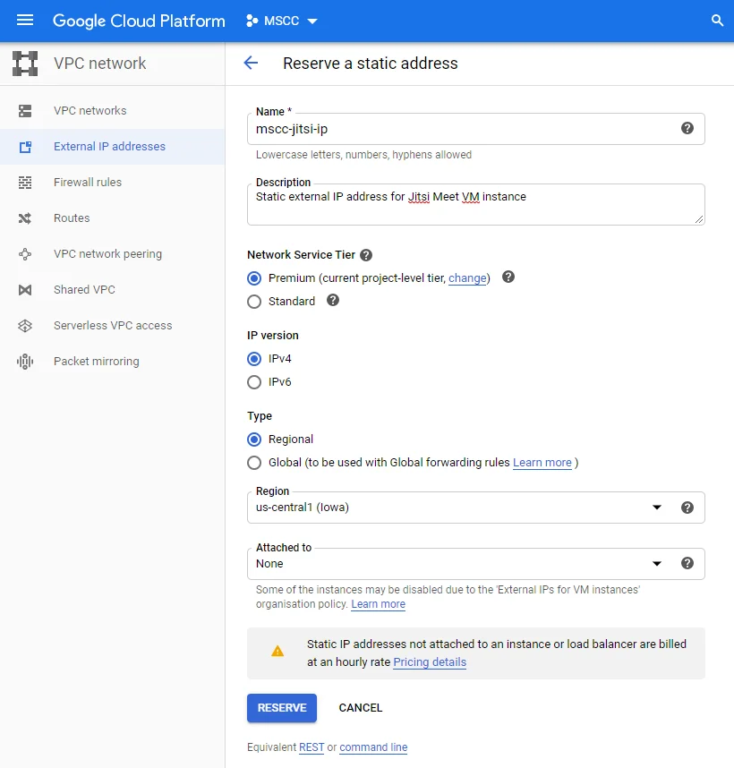

The result should look similar to this. Of course, your external IP address will be different.

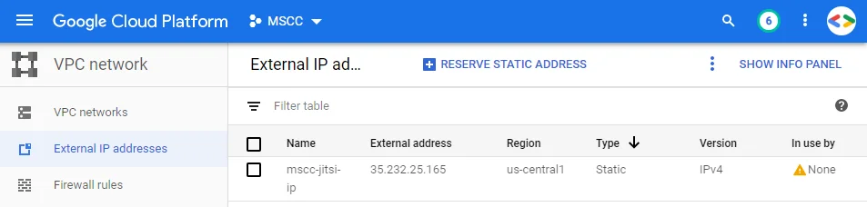

## Create a DNS entry

Now, packed with the newly created IP address it is time to create a DNS record for the domain name you would like to use for the Jitsi Meet server. This step depends on your DNS nameserver provider.

I'm going to describe how it is done using [Cloudflare](https://dash.cloudflare.com/). Under DNS management create a new A record with the subdomain `meet` and the external IP address provided by Google Cloud Platform.

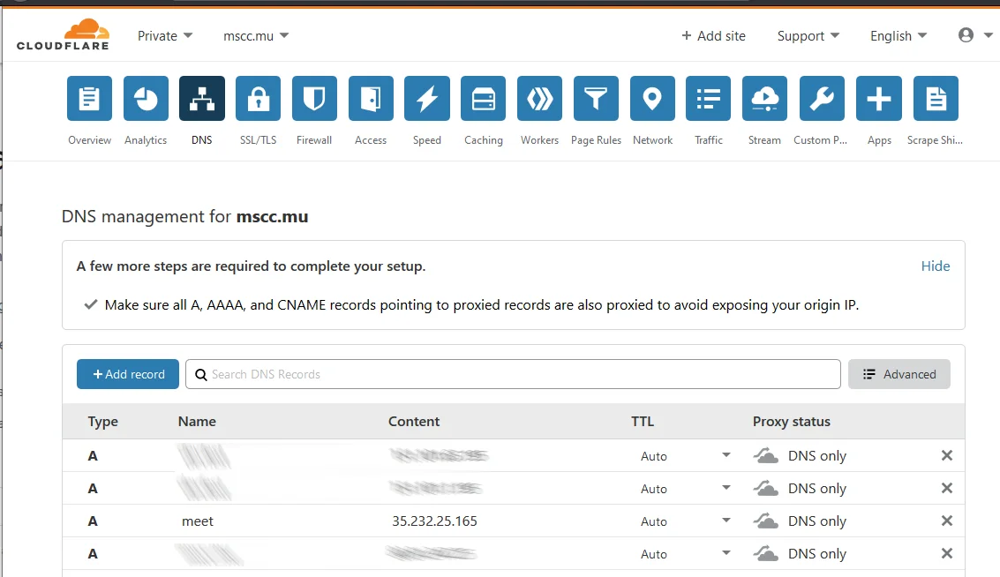

The resulting DNS configuration should look similar to above. Global DNS propagation can take up to 24 hours and it is important to wait that your DNS record has been deployed successfully.

### Verify DNS configuration

You can use any DNS query tool to verify this step. Depending on your OS either use `dig` or `nslookup` to check whether the DNS record has been distributed to the Cloudflare public DNS server.

```
$ dig meet.mscc.mu @1.1.1.1

; <<>> DiG 9.11.3-1ubuntu1.11-Ubuntu <<>> meet.mscc.mu @1.1.1.1
;; global options: +cmd
;; Got answer:
;; ->>HEADER<<- opcode: QUERY, status: NOERROR, id: 43365
;; flags: qr rd ra; QUERY: 1, ANSWER: 1, AUTHORITY: 0, ADDITIONAL: 1

;; OPT PSEUDOSECTION:
; EDNS: version: 0, flags:; udp: 1452
;; QUESTION SECTION:
;meet.mscc.mu.                  IN      A

;; ANSWER SECTION:
meet.mscc.mu.           300     IN      A       35.232.25.165
```

```
> nslookup meet.mscc.mu 1.1.1.1
Server:  one.one.one.one
Address:  1.1.1.1

Non-authoritative answer:
Name:    meet.mscc.mu
Address:  35.232.25.165
```

With proper DNS settings in place you are ready to continue with the installation of Jitsi Meet.

## Create a VM instance

Log into Cloud Console and navigate to [Compute Engine > VM instances](https://console.cloud.google.com/compute/instances). There click on `Create instance` and enter relevant information for your new VM instance.

The default values provided by GCP shall work just fine. However you might like to adjust region, zone and machine configuration according to your liking.

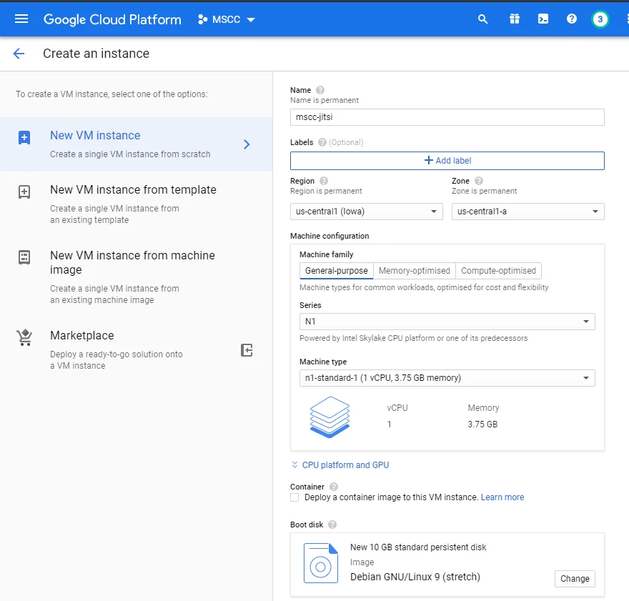

### Specify the hostname

**Important:** The initial configuration allows you to set a custom hostname for your instance and you should specify the prepared DNS name as such. This choice is permanent and cannot be changed later.

Click on `Management, security, disks, networking, sole tenancy` and enter your FQDN under `Hostname`.

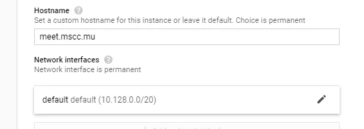

### Choose the External IP address

While you are at the details of Networking click on the pen symbol of the Network interface and select the external IP address that we created earlier. The entry shall look like so.

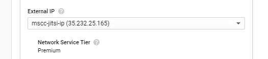

Click `Done` when your networking options are complete.

If ever you missed the initial creation of an external IP address you can open the dropdown selection under External IP and choose to `Create IP address`. Give the new static IP address a name and click on Reserve.

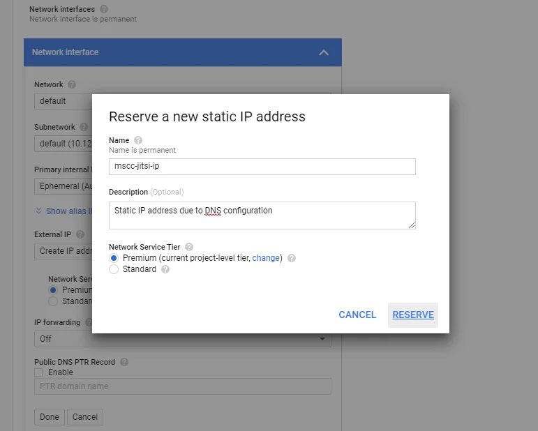

However this still requires proper DNS configuration as described earlier.

### Configure firewall rules

According to the quick install guide Jitsi Meet requires the following ports and protocols to allow traffic from the internet.

- 80 TCP - aka HTTP traffic
- 443 TCP - aka HTTPS traffic
- 10000 UDP

The first two ports can be configured during the creation of the VM instance. Tick the checkboxes in the Firewall section and the necessary rules will be applied during the creation of the virtual machine.

For the UDP port you are going to enter a Network tag for the moment. That tag is used to connect the VM instance to a (new) firewall rule.

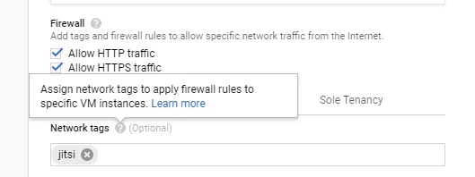

Finally, click on `Create` to complete your VM instance. This is going to take a few seconds and you will be notified as soon as the VM instance is ready.

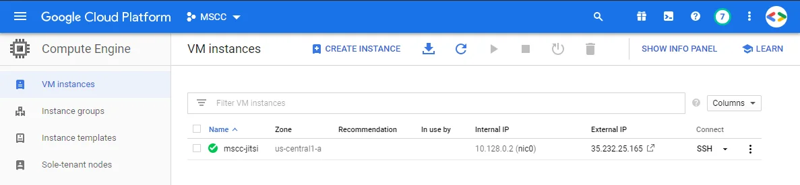

## Create and verify firewall rules

In order to create the third, remaining firewall rule you navigate to [VPC network > Firewall rules](https://console.cloud.google.com/networking/firewalls/list) and there you click on `Create Firewall Rule` to configure the missing information.

Under `Target tags` you enter the same value you used as `Network tags` during the configuration of the VM instance. This closes the link between the instance and this firewall rule.

The value for the `Source IP ranges` is 0.0.0.0/0 which represents any IP address from the internet.

Under `Protocols and ports` you tick UDP protocol and you enter the port number 10000.

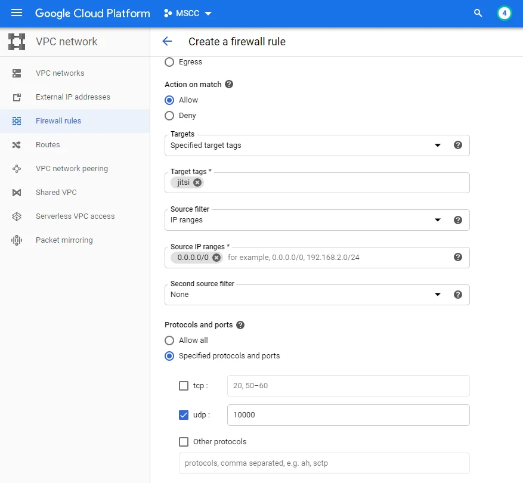

Finally, click on `Create` to enable the firewall rule.

The result should look similar to the list of rules below.

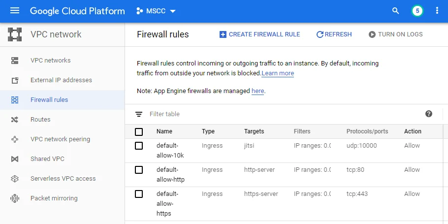

## Access the VM instance

Navigate back to [Compute Engine > VM instances](https://console.cloud.google.com/compute/instances) and click on the SSH button of your instance. This should open a new browser window.

**Note:** Eventually you have to allow Cloud Console to open popups first.

After a short initialisation the connection should be established and you are greeted by a bash prompt on Linux.

## Install Jitsi Meet software

The following steps are based on the official [Jitsi Meet quick install](https://github.com/jitsi/jitsi-meet/blob/master/doc/quick-install.md) guide on GitHub - with a few additional notes and modifications on my side.

### Check hostname

First, verify the assignment of the Fully Qualified Domain Name (FQDN) with the following command:

```
$ hostname -f
meet.mscc.mu
```

At the same time check that the name resolution has been added to the `hosts` file.

```
$ cat /etc/hosts
127.0.0.1       localhost
::1             localhost ip6-localhost ip6-loopback
ff02::1         ip6-allnodes
ff02::2         ip6-allrouters

10.128.0.2 meet.mscc.mu meet  # Added by Google
169.254.169.254 metadata.google.internal  # Added by Google
```

### Run commands as user `root`

**Note:** Many of the installation steps require elevated privileges. If you are logged in using a regular user account, you may need to increase your permissions.

Either use `sudo` for individual commands or temporarily change user context and operate as user root.

```
$ sudo -i
```

Although not recommended it's faster to complete the installation as root.

### Add the Jitsi package repository

```
echo 'deb https://download.jitsi.org stable/' >> /etc/apt/sources.list.d/jitsi-stable.list 
wget -qO -  https://download.jitsi.org/jitsi-key.gpg.key | sudo apt-key add -
```

The Jitsi repository uses a secured URL which requires that you add the HTTPS transport option to apt, then you update the local repository cache, and finally you install the package of Jitsi Meet and all dependencies.

```
# Ensure support is available for apt repositories served via HTTPS
apt-get install -y apt-transport-https

# Retrieve the latest package versions across all repositories
apt-get update

# Perform jitsi-meet installation
apt-get install -y jitsi-meet
```

During the process you will be asked to enter the FQDN or hostname of your instance of Jitsi Meet. Enter the hostname that we verified already and hit `OK` to continue the installation.

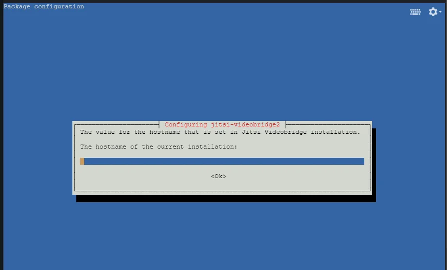

Next, you will be ask to configure SSL certificate of your Jitsi Meet domain. Here keep the default selection to generate a self-signed certificate and hit `OK`.

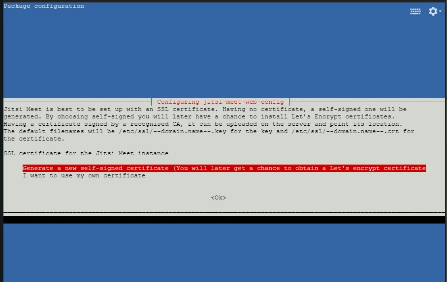

We are going to generate an SSL certificate provided by [Let's Encrypt](https://letsencrypt.org/) in the next step.

## Install Let's Encrypt certificate

**Note:** Verify that the DNS record has been assigned to your static external IP address and it has been distributed globally before you try to apply the Let's Encrypt SSL certificate. See `Verify DNS configuration` above on how to do that.

At the time of writing there was a small issue running the script as described on GitHub: [Lets Encrypt setup error about missing file #5929](https://github.com/jitsi/jitsi-meet/issues/5929). The workaround is to create the expected deployment hook manually yourself **before** running the certificate installation script.

```
# Workaround for missing deployment script
mkdir -p /etc/letsencrypt/renewal-hooks/deploy/ 
touch /etc/letsencrypt/renewal-hooks/deploy/0000-coturn-certbot-deploy.sh
chmod +x /etc/letsencrypt/renewal-hooks/deploy/0000-coturn-certbot-deploy.sh
```

Now, run the following shell script as mentioned in the quick install guide.

```
/usr/share/jitsi-meet/scripts/install-letsencrypt-cert.sh
```

The script is going to ask you for an email address to send notifications from Let's Encrypt to. Then your terminal is going to provide you with tons of information and the outcome should look similar to below. Look for `Congratulations!` to be sure that the SSL certificate has been successfully requested from [Let's Encrypt](https://letsencrypt.org/) and applied to your system.

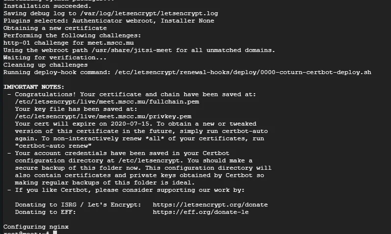

Basically your installation is complete now.  
You shall be able to load your FQDN in your browser. In case you run into any trouble kindly repeat the steps above or refer to the official [Jitsi Meet quick install](https://github.com/jitsi/jitsi-meet/blob/master/doc/quick-install.md) or the [Jitsi Community Forum](https://community.jitsi.org/).

However there are probably some additional considerations prior to operating your instance of Jitsi Meet server on the internet.

## Adjust nginx configuration file

The default configuration of [nginx](https://www.nginx.com/) created by the Jitsi Meet package is not optimal and you should make a few changes to it. Open the file with your preferred text editor

```
nano /etc/nginx/sites-enabled/meet.mscc.mu.conf 
```

### Change the default protocol to HTTP/2

Look for the `listen` directives and add the value `http2` at the end of both. It shall look like so.

```
server {
    listen 443 ssl http2;
    listen [::]:443 ssl http2;
...
```

### Change SSL protocol versions and ciphers

By default nginx is enabled to support TLS 1.0, TLS 1.1 and TLS 1.2. However the two former protocols are legacy protocol that shouldn't be used. TLS v1.0 and TLS v1.1 have been deprecated in January 2020 by modern browsers. Hence you should change the ssl_protocols directive like so.

```
    # ssl_protocols TLSv1 TLSv1.1 TLSv1.2;
    ssl_protocols TLSv1.2;
```

Depending on the [nginx](https://www.nginx.com/) version TLS 1.3 might be an additional option. You might consider to replace the existing directive of SSL ciphers with the following value.

```
    ssl_ciphers 'ECDHE-ECDSA-AES256-GCM-SHA384:ECDHE-RSA-AES256-GCM-SHA384:ECDHE-ECDSA-CHACHA20-POLY1305:ECDHE-RSA-CHACHA20-POLY1305:ECDHE-ECDSA-AES128-GCM-SHA256:ECDHE-RSA-AES128-GCM-SHA256:ECDHE-ECDSA-AES256-SHA384:ECDHE-RSA-AES256-SHA384:ECDHE-ECDSA-AES128-SHA256:ECDHE-RSA-AES128-SHA256';
```

The [Mozilla SSL Configuration Generator](https://ssl-config.mozilla.org/) is definitely worth a look. The Intermediate configuration would be the recommended choice. Perhaps you might like to read [SSL and TLS Deployment Best Practices](https://github.com/ssllabs/research/wiki/SSL-and-TLS-Deployment-Best-Practices) for more background information.

### Add more HTTP headers

Next, you should define a few more HTTP header directives to improve your default configuration. Open the nginx config file again and add the following lines right after the existing `add_header` directive related to [HSTS](https://en.wikipedia.org/wiki/HTTP_Strict_Transport_Security).

```
    add_header X-Content-Type-Options nosniff;
    # Don't use with iFrames, e.g. Jitsi Meet Desktop (Electron) app
    add_header X-Frame-Options SAMEORIGIN;
    add_header X-XSS-Protection "1; mode=block";
    add_header Referrer-Policy no-referrer-when-downgrade;
```

**Note:** The Jitsi Meet Electron application for desktop systems cannot load your instance if the HTTP header `X-Frame-Options` has been set. Either comment or remove that directive if you are planning to use the application.

Save the configuration after each change and run a `configtest`.

```
service nginx configtest
[ ok ] Testing nginx configuration:.
```

If the result is OK restart nginx as usual. Otherwise, inspect the log file located at `/var/log/nginx/error.log` for any error entries.

```
service nginx restart
```

In case that you are interested to see the impact of your changes open the [Qualys SSL Server Test](https://www.ssllabs.com/ssltest/index.html) and validate your domain.

## Increase number of processes and open files

The quick install guide mentions that the default configuration of a system is good for less than 100 participants. To avoid running into any unexpected situations I suggest that you increase that value already now.

Open the file `/etc/systemd/system.conf` and add the following lines at the end.

```
DefaultLimitNOFILE=65000
DefaultLimitNPROC=65000
DefaultTasksMax=65000
```

Reload the systemd changes on a running system and restart your Jitsi instance with those two commands.

```
systemctl daemon-reload
service jitsi-videobridge2 restart
```

To verify that the settings have been applied run the following command and check the value of `Tasks: XX (limit: 65000)`.

```
service jitsi-videobridge2 status
● jitsi-videobridge2.service - Jitsi Videobridge
   Loaded: loaded (/lib/systemd/system/jitsi-videobridge2.service; enabled; vendor preset: enabled)
   Active: active (running) since Thu 2020-04-16 11:23:08 UTC; 14s ago
  Process: 7896 ExecStartPost=/bin/bash -c echo $MAINPID > /var/run/jitsi-videobridge/jitsi-videobridge.pid (code=e
xited, status=0/SUCCESS)
 Main PID: 7895 (java)
    Tasks: 38 (limit: 65000)
...
```

## Confirm your installation is working

Open a new browser tab or better an incognito window and navigate to the FQDN you specified during the installation. You shall be greeted by the Jitsi Meet default page.

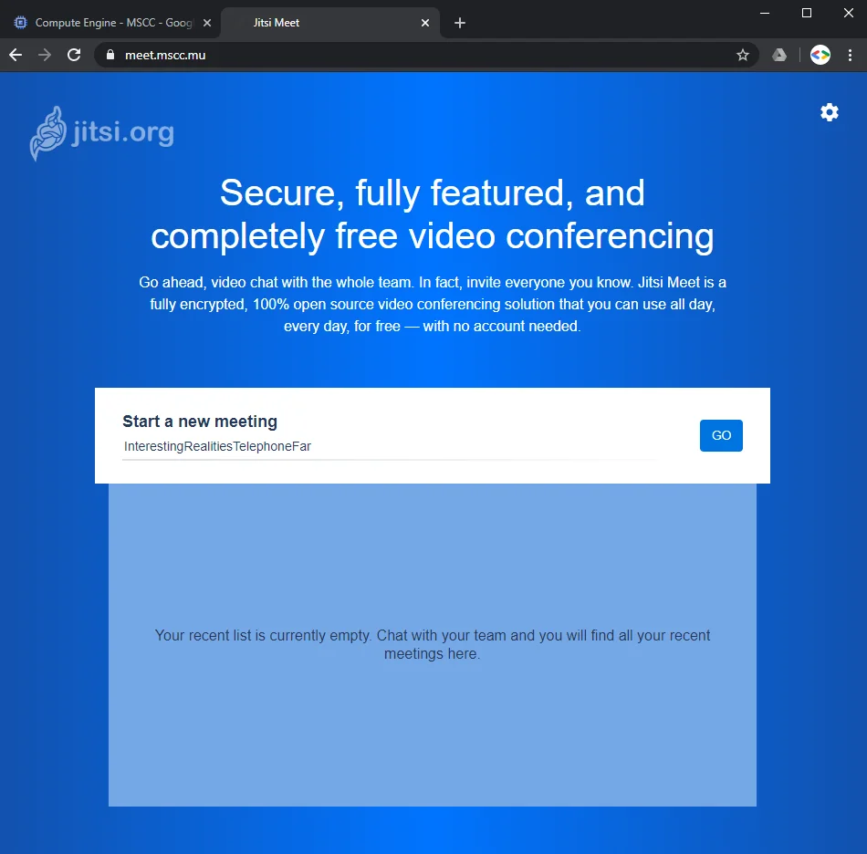

## Congratulations!

When you click on the gear symbol in the top right corner your browser should ask for permissions to access microphone and camera.

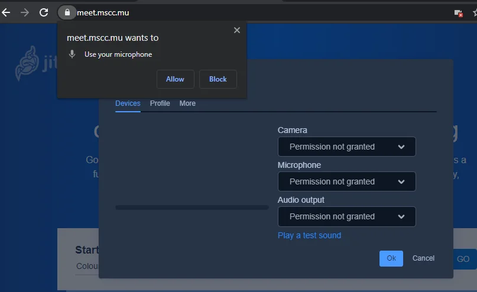

Click `Allow` in both cases and continue to configure your devices you would like to use in Jitsi Meet.

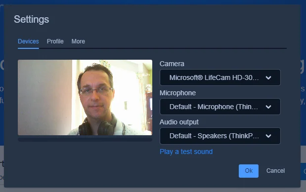

Change to the tab `Profile` to provide more information like your displayed name in the meeting rooms. On the tab `More` you are able to configure your preferred language.

Finally, enter any value to start a new meeting and click on GO.


The use of camel-case writing forms the URL to access the meeting and is automatically converted into blanks after you entered the meeting room.

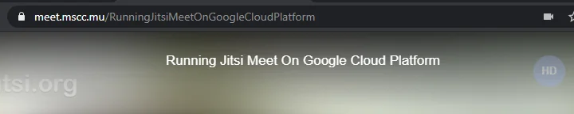

Enjoy your very own Jitsi Meet video conferencing system.

## Automate it with gcloud

All steps above can be executed by using `gcloud` commands. Best might be to use your instance of Cloud Shell to create a VM instance and to install Jitsi Meet.

Make sure that you have a domain name prepared.

### Create the infrastructure

You would probably adjust the environmental variables at the top to change region, zone, instance name and your DNS hostname.

```
# Define your preferences and values - to CHANGE!
export REGION=us-central1
export ZONE=us-central1-a
export VM_INSTANCE=mscc-jitsi-dummy
export FQDN=meet.mscc.mu

# Enable Compute Engine
gcloud services enable compute.googleapis.com

# Reserve and retrieve static IP address
gcloud compute addresses create $VM_INSTANCE-ip --project=$DEVSHELL_PROJECT_ID --description="Static external IP address for Jitsi Meet VM instance" --region=$REGION
export IP=$(gcloud compute addresses describe $VM_INSTANCE-ip --region=$REGION --format='get(address)')

# Create VM instance with hostname and attach IP address
gcloud beta compute --project=$DEVSHELL_PROJECT_ID instances create $VM_INSTANCE --hostname=$FQDN --zone=$ZONE --machine-type=n1-standard-1 --subnet=default --address=$IP --network-tier=PREMIUM --tags=jitsi,http-server,https-server --image=debian-9-stretch-v20200309 --image-project=debian-cloud --boot-disk-size=10GB --boot-disk-type=pd-standard --boot-disk-device-name=$VM_INSTANCE --reservation-affinity=any

# Attach firewall rules (might be already present, no big deal)
gcloud compute --project=$DEVSHELL_PROJECT_ID firewall-rules create default-allow-http --direction=INGRESS --priority=1000 --network=default --action=ALLOW --rules=tcp:80 --source-ranges=0.0.0.0/0 --target-tags=http-server
gcloud compute --project=$DEVSHELL_PROJECT_ID firewall-rules create default-allow-https --direction=INGRESS --priority=1000 --network=default --action=ALLOW --rules=tcp:443 --source-ranges=0.0.0.0/0 --target-tags=https-server
gcloud compute --project=$DEVSHELL_PROJECT_ID firewall-rules create default-allow-10k --description="Allow UDP packets for VM instance running Jitsi Meet server" --direction=INGRESS --priority=1000 --network=default --action=ALLOW --rules=udp:10000 --source-ranges=0.0.0.0/0 --target-tags=jitsi

# Display external IP address and connect to instance using SSH
echo $IP
gcloud compute ssh $VM_INSTANCE --zone=$ZONE
```

After execution you are going to see the external IP address in the Shell, and you should be connected to the new VM instance.

In case that the remote VM instance does not respond to the SSH connection or times out, wait a short while and repeat the last command to SSH into the instance.

Now is the right time to verify that your DNS record is up-to-date and matches the external IP address of your VM instance **before** you continue to install Jitsi Meet.

### Install Jitsi Meet server

This paragraph summarizes the commands used above to install Jitsi Meet server. They should be run as user root. Change into an interactive session of user `root` first.

```
sudo -i
```

Then run the following to complete the basic installation of Jitsi Meet server on the VM instance.

```
# Increase number of processes and open files
cat >> /etc/systemd/system.conf <<EOF
DefaultLimitNOFILE=65000
DefaultLimitNPROC=65000
DefaultTasksMax=65000
EOF
systemctl daemon-reload

# Add the package repository
echo 'deb https://download.jitsi.org stable/' >> /etc/apt/sources.list.d/jitsi-stable.list 
wget -qO -  https://download.jitsi.org/jitsi-key.gpg.key | sudo apt-key add -

# Ensure support is available for apt repositories served via HTTPS
apt-get install -y apt-transport-https  
# Retrieve the latest package versions across all repositories
apt-get update  
# Perform jitsi-meet installation
apt-get install -y jitsi-meet
```

Last, prepare the system for an SSL certificate provided by Let's Encrypt by running the following commands.

**Note:** Without properly configured DNS this is going to fail.

```
# Workaround for missing deployment script
mkdir -p /etc/letsencrypt/renewal-hooks/deploy/ 
touch /etc/letsencrypt/renewal-hooks/deploy/0000-coturn-certbot-deploy.sh
chmod +x /etc/letsencrypt/renewal-hooks/deploy/0000-coturn-certbot-deploy.sh

# Get SSL certificate from Let's Encrypt
/usr/share/jitsi-meet/scripts/install-letsencrypt-cert.sh
```

You have to specify an email address to receive notifications regarding your certificates from Let's Encrypt.

Congrats, your Jitsi Meet server is now operational. Maybe you like to review the nginx changes described above to improve your setup a little bit.

## Securing your Jitsi Meet server

The default installation in this article is kind of basic and provides you a jumpstart to run your own video conferencing system. In the next article of this series I'm going to describe how you [enable authentication and secure your Jitsi Meet instance](xref:authentication-jitsi-meet).