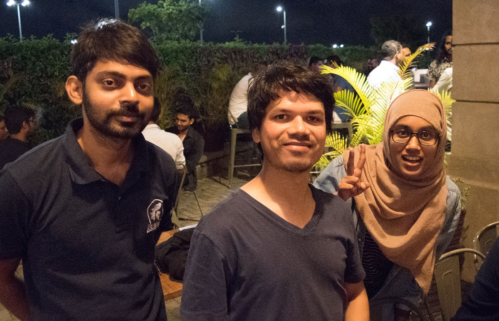
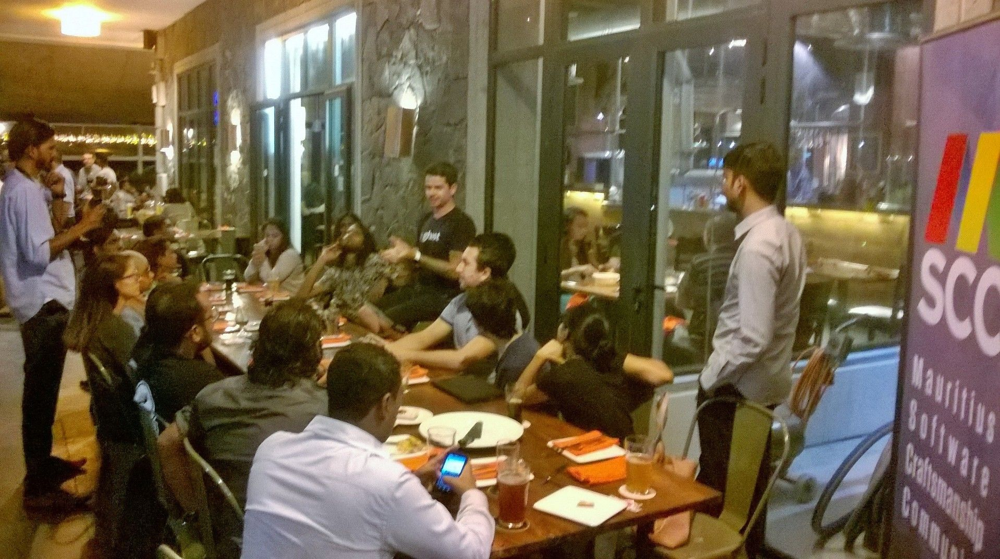
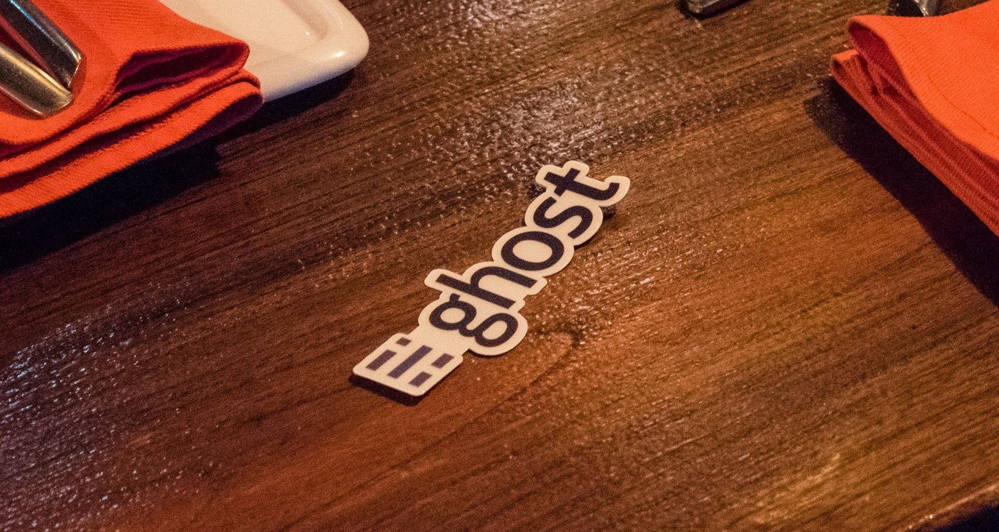
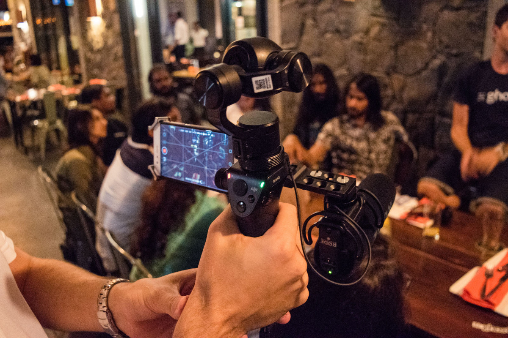
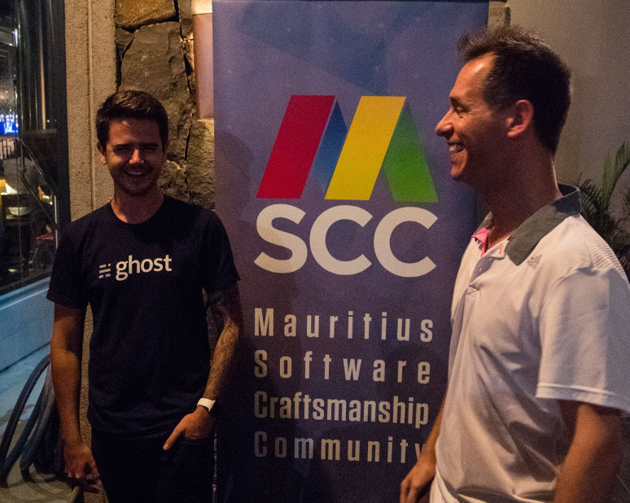

Good things take time. After more than a year I finally managed to sit down and write about the experience of welcoming [John O'Nolan](https://twitter.com/JohnONolan), founder of [Ghost](https://twitter.com/TryGhost/) blogging platform, to one of our [MSCC](https://www.mscc.mu/) meetings.

## How did you manage that?

Honestly, it wasn't me but one of our female craftsman, [Humeira](https://twitter.com/echdee). She is a subscriber to [John's YouTube channel](https://www.youtube.com/channel/UCfgQ94JiO45CeFkQHUR1f3Q) and given his vlogging activity he mentioned that he would be [En route to Mauritius](https://john.onolan.org/en-route-to-mauritius/) soon.



So, Humeira poked me over Twitter asking whether it could be interesting to meet with John or not. Given such a great opportunity you don't have to ask me: Yes, of course!  
Living on a remote, tropical island like Mauritius doesn't offer you too many options to meet with *famous* people from the rest of the world. Hence, we seize every chance to meet and to get to know someone's story. Dear reader, in case that you decide to come and visit our lovely island, get in touch with either me or any other MSCC craftsmen. Everybody is eager to meet and hear your story.

Well, effectively I encouraged Humeira to check out whether John would be okay to join us for an evening, and assisted a little bit to arrange a get together at Flying Dodo. He agreed and the rest... please read on.

## Ghost - Happy Hour Q&A

The event [Ghost - Happy Hour Q&A with John O'Nolan](https://www.meetup.com/MauritiusSoftwareCraftsmanshipCommunity/events/237470307/) was organised and announced on quite a short notice. And despite a low number of RSVPs more craftsmen than expected came that evening. If I counted properly we had **27** attendees in total.



### A little history

With a slight delay John then started to introduce himself and his previous activities working on WordPress. His [passion about blogging](https://web.archive.org/web/20131215144152/http://john.onolan.org/project-ghost) then led to the very successful crowdfunding campaign on [Kickstarter - Ghost: Just a Blogging Platform](https://www.kickstarter.com/projects/johnonolan/ghost-just-a-blogging-platform).

There is an informative interview about [How John O'Nolan Grew His Publishing Platform to $750,000/year](https://www.indiehackers.com/interview/ghost-14e5bac2fa) available on Indie Hackers.

### Ghost - a minimalist blog platform

John explained the origin of the name `Ghost`: It is based on the known concept of [ghostwriting](https://en.wikipedia.org/wiki/Ghostwriter). Having a versatile assistant to compose interesting articles. Okay, while you're still the author the idea is that the blogging platform turns into an enjoyable environment to work with.

> Ghost is a fully open source, hackable platform for building and running a modern online publication.

Since the original Kickstarter campaign the product has evolved nicely. Apart from the initial web interface to administer the blog, Ghost provides a fully-featured desktop experience built on top of the Electron environment for Windows, macOS and Linux, and recently an Android app has been added. The iOS counter-part app seems to be in the making (as of writing).

Have a look at the [Ghost Native Apps](https://ghost.org/downloads/) available for free. Personally, I'm usually writing my content in Ghost Desktop only.

### Bringing journalism to the next level

John was very interested in the local media scene and spoke about the [Ghost for Journalism](https://ghost.org/journalism/) initiative. A journalism development program to help build new, exciting, and sustainable publications. During 2017 the not-for-profit organisation behind Ghost ran this grant program to encourage independent news coverage on the net; unfortunately I haven't seen anything similar for 2018 yet.

> Our mission is to create the best open source tools for independent journalists and writers across the world, and have a real impact on the future of online media.

You'll find more insights about that development program in John's [Announcing Ghost for Journalism](https://blog.ghost.org/journalism/) article on his blog. Perhaps you send him a tweet in case you have some serious contender; even nowadays, you never know.

### Open Source

Did you know that the whole Ghost blog universe is open source and available on [GitHub: TryGhost](https://github.com/TryGhost/)? Yup, that's pretty awesome. And the developer community around Ghost is busy. There are frequent updates with great improvements and stabilisations.

Getting into development of Ghost themes for example is very easy and straight forward. Themes are based on Handlebars and the documentation provides all information needed to create appealing and modern UIs for a blog running on Ghost. The environment to develop Ghost itself is a bit trickier but doable as soon as you are more familiar with the architecture and the various components.



## Get Blogged: Long overdue upgrade

The months prior to this event I was procrastinating myself. On one hand I really wanted to write more content again like in previous years but on the other hand I have to admit that I grew tired of the cumbersome editor in Joomla. I don't know but it felt like torture even trying to write something.

Although I already heard a little bit about Ghost from other [craftsmen in MSCC](https://www.mscc.mu) I never had the urge to actually give it a shot. Now, knowing the story behind Ghost from John himself puts a complete different light on that whole blog thing.

Perhaps I just needed that last drop of water to get going again. And John convinced me to try Ghost. But even then it took almost another half year to get going finally. With the official [Announcing Ghost 1.0](https://blog.ghost.org/1-0/) I started to explore Ghost 1.0.2. And it was a breeze.

Having several root servers myself I wanted to explore the possibilities of self-hosting the Ghost platform. Using their `ghost-cli` application gets your started instantly on a Linux machine. Open a terminal, create a new empty folder and run the install command of Ghost, like so:

```
$ mkdir ghost
$ cd !$
$ ghost install local
```

The `ghost-cli` runs a couple of checks to see whether your system is compatible and warns you in case that you're not using the recommended platform. Feel free to continue; we want to experiment with and discover Ghost.

Don't skip the [Getting Started](https://docs.ghost.org/v1.0.0/docs/getting-started-guide) guide in the official documentation of Ghost. It is very detailed and resourceful.

Oh, and feel free to read another article here on the blog in case that you are doing a [Migration to Ghost](xref:migration-joomla-ghost) from Joomla.

## Try it yourself

Self-hosting as described in the previous paragraph is just one option. And not everyone has neither a Linux machine nor a root server to operate Ghost after all. Perhaps you might like to head over to [Ghost](https://ghost.org) and test their platform yourself. Try [Ghost(Pro)](https://ghost.org/pricing/) free for 14 days, no obligation.

## John in Mauritius

In case that you are interested to know more about Ghost and John, I recommend you to head over to [John O'Nolan's website](https://john.onolan.org/). There are a good number of gems available. Although it seems that John evolved into Vlogs compared to Blogs.

Over there you will also find an article inclusive video link about John's experience in [#TropicalValley](https://twitter.com/hashtag/TropicalValley) - [Mauritius: One of the most beautiful places in the world](https://john.onolan.org/mauritius/). It is quite hilarious actually. Enjoy!

Talking about Vlogs...



The whole conversation has been recorded. Kudos to the folks of [LSL Digital](https://www.lsl.digital/). If you are interested to watch it, check out the [MSCC channel on YouTube](https://www.youtube.com/channel/UCeLiAZ5TlJla_uDj8_KndyA).

## Good night, John!

Thank You!  
It was an amazing evening and I'm sure that our craftsmen appreciated your talk. I learned a lot from that *camp-site fire talk* with John and the elegance of Ghost motivated me to launch this website with a new look and fresh content.



Meeting John O'Nolan was really fun! Thanks!

<small>Image credit: Nirvan Pagooah</small>
