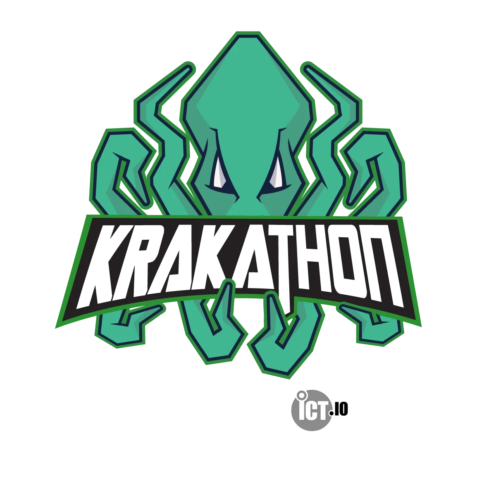
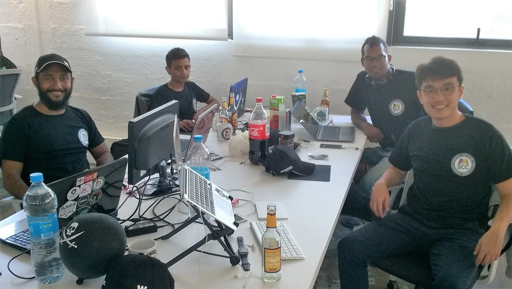

Pirates! Pirates everywhere! This year my children urged me to bring them again to the coolest hackathon in Mauritius. They absolutely loved the experience from last year and so the anticipation grew over the last couple of weeks.

The [Krakathon](http://krakathon.com/2017-2/) is in their own words *"Le Krakathon, c’est comme un hackaton mais avec un Kraken et un trésor!"*. This translates freely to:

> The Krakathon is like a hackathon but with a Kraken and a treasure!

## Code to chase the Kraken!

The whole event is build around a pirate and swashbuckler stylish atmosphere where participants form a crew (team of up to 4 members) to solve algorithms and programming challenges. Compared to other events the Krakathon doesn't have a single overall aim asking teams to compete against each other to achieve the best outcome on the same request. There is no jury to vet it.

No, the Krakathon uses a [catalog of coding exercises](http://krakathon.com/exercises/). Given the level of difficulty they are assigned various amounts of points. The challenge is to implement and demonstrate working solutions and to accumulate as many points as possible during 24 hours.

The progress of a team and the position among each other is updated and published regularly on the [Krakathon Scoreboard](http://krakathon.com/scoreboard/) online. Transparency is key! And it is great for others to follow their team remotely, and to cheer them up on social media, too.

## The Flying Craftsman

Thanks to the generousity of [ict.io](http://ict.io/) it was possible to form a ship crew to represent the [Mauritius Software Craftsmanship Community](https://www.mscc.mu/) again. Like last year, The Flying Craftsman was manned at an early stage and was ready to sail off the shores. The crew under Captain Saif was freshly put together, and unfortunately had to be shuffled a few days ahead of the event.

  
*Left to right: Saif, Wasim, Arvind and Alvin*

Luckily, we talked about the Krakathon during the [weekly Code & Coffee breakfast meetings](https://www.meetup.com/MauritiusSoftwareCraftsmanshipCommunity/) of the MSCC and Alvin, a digital nomad from Malaysia actually, expressed high interest. Instead of just visiting the Krakathon he boarded The Flying Craftsman and was right in the middle of the chase for the Kraken.

I'm loving this community!

## Spirit of the Sea

24 hours doesn't sound much for sailing on the ocean but coding straight all the time is cumbersome and tiring. A real physical and mental challenge - hats off to all pirates!

The final standing of this year's search for the Kraken is as following:

1. ForceCoders
2. Pickle Rick
3. Xtensio

The Flying Craftsman came out 6th.

All teams found their treasure and rewards after this coding marathon. Personally, I'm glad to see that more and more opportunities like this are available in Mauritius. And thanks to the numerous partners and sponsors Krakathon turns out to be one of the coolest. Surely an event not to miss in the future!

## Check the captains' log books

Although I'm not an active participant in the Krakathon I like going there to cheer up all those brave mates. And as mentioned initially, my children are super excited and eager to be there, too.

Don't miss the reports on the Krakathon by others with lots of pictures and videos:

- [Krakathon 2017 - un Hackathon mais avec un Kraken et un trésor - jour 1](https://zcoldplayer.blogspot.com/2017/10/krakathon-2017-un-hackathon-mais-avec.html) by Pritvi
- [Krakathon 2017 - Day 1](https://bilaal.abdelhassan.name/krakathon-2017-day-1/) by Bilaal
- [Krakathon 2017 - Day 2](https://bilaal.abdelhassan.name/krakathon-2017-day-2/) by Bilaal
- [Krakathon 2017](https://akashaonearth.wordpress.com/2017/10/23/krakathon-2017/) by Akasha
- [Krakathon 2017: Les ForceCoders remportent la deuxième édition du code challenge!](http://ict.io/krakathon-2017-force-coders-remportent-deuxieme-edition-code-challenge/) by ict.io
- [Krakathon: les «Force Coders» remportent la 2e édition](https://www.lexpress.mu/photos/319077/krakathon-force-coders-remportent-2e-edition) by lexpress.mu

Last but not least, [Krakathon 2018](http://krakathon.com/) has its countdown already. Aye aye, pirates!
