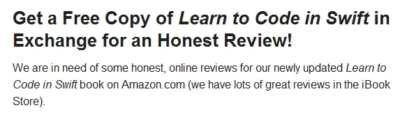

As a subscriber of a mailing list curated by Kevin McNeish I received his call to action around begin of December last year,

  
*Call for action: Review Kevin's book "Learn to Code in Swift"*

and following his request I sent him an email that I'd be interested to read and review his title. Luckily, I was among the first 20 to respond and after some quick exchange of emails I had his book title ["Learn to Code in Swift: The new language of iOS Apps"](https://amzn.to/1Qlmnee "Learn to Code in Swift: The new language of iOS Apps by Kevin McNeish") on my Kindle device.

Today, I left the following review on Amazon:

> **Solid content delivery of the concepts of Swift - Easy to understand**
>
> Frankly, I know Kevin since more than a decade, attended one of his five-days workshop, and he simply keeps on delivering solid, high quality content that is logically structured, easy to read and to understand. Despite being a seasoned software developer in other programming languages I was very pleased when Apple introduced their completely renewed and well-designed programming language Swift. And although I'm more focused on using C# on Xamarin to develop smartphone and mobile application I always like to keep an eye on other technologies. As Swift is surely one of them I thought to give Kevin's book a shot... And he has delivered as expected.
>
> Only by looking at the table of content I knew that this is going to be a fun read. The book is actually structured like a set of full-day classes or better said a training workshop for beginners in Swift. It starts with the basic elements of Swift, then covers code workflow and finishes of with more advanced topics like closures and error handling. Throughout the chapters there are some samples which have some hidden gems (for those knowing Kevin, his family and friends more closely). Those samples put a smile on my face and gave me a couple of chuckles, like in chapter 10 when Kevin explains the handling of arrays in Swift using "well-known" names as array elements.
>
> Unfortunately, I'm giving a 4 stars rating only for two reasons:
>
> - The amount of either typographic, grammar or contextual errors. The book version I had at the time reading had at least an error in every chapter. Some of them are quite obvious just by reading through the chapters, others are a bit trickier, ie. explanations in text don't match the illustrations or diagrams. Surely, the quality in this area could be better with a little bit of editorial activities.
> - Formatting issues and display of images or videos. Actually, I read the book using three different devices - a classic Kindle, an iPad mini using the Kindle app, and the web edition of the Kindle app. First, on the classic e-ink-based Kindle some of the images either didn't load at all or the display was too blurry or too dark to enjoy the visual appearance. Same applies to videos which wouldn't even play (but this could be due to my low-bandwidth internet connection). Second, after finishing 'Chapter 22: Generics in the Real World' you'll get the Amazon book rating screen despite two more chapters and appendices to read.
>
> Luckily, these issues are easy to fix, and I hope that Kevin is going to provide an update soon.
>
> I'd like to close my book review with a paragraph from the 'About the author' chapter which sums it up beautifully: "I learned that writing software is a very creative process. In just a matter of hours, I could conceive an idea, create a software design and have it up and running on a computer."
>
> This book on learning how to write software in Swift is highly recommended.

Eventually, you might be interested to give it a shot right here and check out the free book preview of Learn to Code in Swift by Kevin McNeish.

<iframe type="text/html" width="336" height="550" frameborder="0" allowfullscreen="true" style="max-width: 100%; display: block; margin-left: auto; margin-right: auto;" src="https://read.amazon.com/kp/card?asin=B00QDQZA78&amp;preview=inline&amp;linkCode=kpe&amp;ref_=cm_sw_r_kb_dp_VIU0wb09TQ3SH&amp;tag=geblbyjo-20"></iframe>

Even though I develop mainly in C# and using Xamarin to develop iOS apps I have to admit that reading Kevin's book was very informative and helped me to get a better insight intormation to iOS application development in general.

<iframe src="https://rcm-na.amazon-adsystem.com/e/cm?t=geblbyjo-20&amp;o=1&amp;p=12&amp;l=ur1&amp;category=kuft&amp;banner=07V9YHKS4HY556H67002&amp;f=ifr&amp;lc=pf4&amp;linkID=DZKOBIBQZYLZDRKD" width="300" height="250" scrolling="no" border="0" marginwidth="0" style="border: 0; max-width: 900px; max-height: 600px;" frameborder="0"></iframe> <iframe src="https://rcm-na.amazon-adsystem.com/e/cm?t=geblbyjo-20&amp;o=1&amp;p=12&amp;l=ur1&amp;category=kindlereadingapps&amp;banner=1P3YWVYE8G217EXN4182&amp;f=ifr&amp;lc=pf4&amp;linkID=XIIZHBZDBLROFKCN" width="300" height="250" scrolling="no" border="0" marginwidth="0" style="border: 0; max-width: 900px; max-height: 600px;" frameborder="0"></iframe>