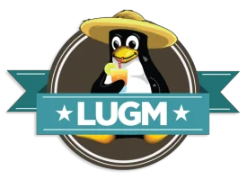
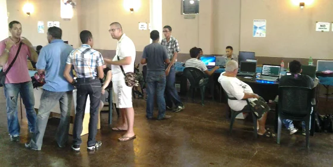
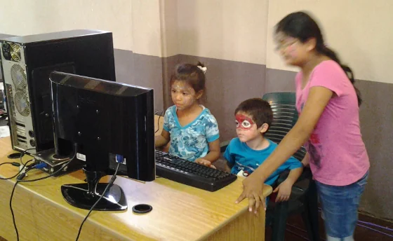
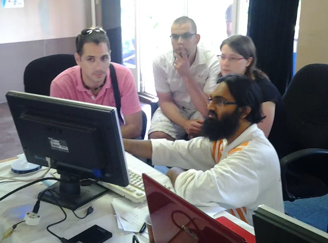
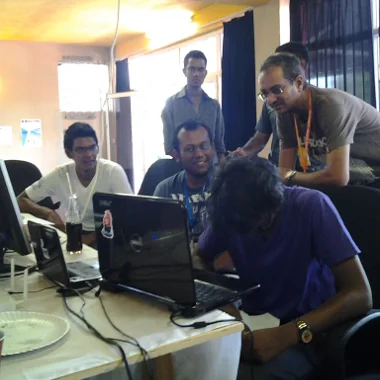
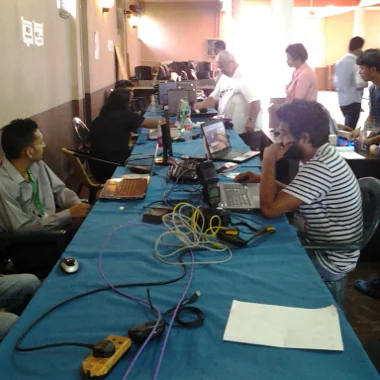

It wasn't easy for me to attend but it was absolutely worth to go. The [Linux User Group of Mauritius (LUGM)](https://lugm.org "Linux User Group of Mauritius (LUGM)") organised another get-together for any open source enthusiast here on the island. Strangely named "[Corsair Hackers Reboot](https://lugm.org/corsair/ "Corsair Hackers Reboot")" but it stands for a positive cause:

> *"**Corsair Hackers Reboot Event***
>
> *A collaborative activity involving LUGM, UoM Computer Club, Fortune Way Shopping Mall and several geeks from around the island, striving to put FOSS into homes & offices. The public is invited to discover and explore Free Software & Open Source."*

And it was a good opportunity for me and the kids to visit the east coast of Mauritius, too.

## Perfect timing

It couldn't have been better... Why? Well, for two important reasons (in terms of IT):

- End of support for Microsoft Windows XP - 08.04.2014
- Release of Ubuntu 14.04 Long Term Support - 17.04.2014

Quite funnily, those two IT dates weren't the initial reasons and only during the weeks of preparations we put those together. And therefore it was even more positive to promote the use of Linux and open source software in general to a broader audience.

## Getting there ...

Thanks to the new motor way M3 and all the additional road work which has been completed recently it was very simple to get across the island in a very quick and relaxed manner. Compared to my trips in the early days of living in Mauritius (and riding on a scooter) it was very smooth and within less than an hour we hit Centrale de Flacq. Well, being in the city doesn't necessarily mean that one has arrived at the destination. But thanks to modern technology I had a quick look on Google Maps, and we finally managed to get a parking behind the huge bus terminal in Flacq. From there it was just a short walk to Fortune Way. The children were trying to count the number of buses... Well, lots and lots of buses - really impressive actually.

## What was presented?

There were different areas set up. Right at the entrance one's attention was directly drawn towards the elevated hacker's stage. Similar to rock stars performing their gig there was bunch of computers, laptops and networking equipment in order to cater the right working conditions for coding/programming challenge(s) on the one hand and for [the pen-testing or system hacking competition](https://www.darkxploit.us/?p=394 "the pen-testing or system hacking competition") on the other hand. Personally, I was very impresses that actually [Nitin](https://www.darkxploit.us/) took care of the pen-testing competition. He hardly started one year back with Linux in general, and Kali Linux specifically. Seeing his personal development from absolute newbie to a decent Linux system administrator within such a short period of time, is really impressive. His passion to open source software made him a living.

Next, clock-wise seen, was the Kid's Corner with face-painting as the main attraction. Additionally, there were numerous paper print outs to colour. Plus a decent workstation with the educational suite GCompris. Of course, my little ones were into that. They already know GCompris since a while as they are allowed to use it on an IGEL thin client terminal here at home. To simplify my life, I set up GCompris as full-screen guest session on the server, and they can pass the login screen without any further obstacles. And because it's a thin client hooked up to a XDMCP remote session I don't have to worry about the hardware on their desk, too.

The next section was the main attraction of the event: **BYOD - Bring Your Own Device**

Well, compared to the usual context of BYOD the corsairs had a completely different intention. Here, you could bring your own laptop and a team of knowledgeable experts - read: geeks and so on - offered to fully convert your system on any Linux distribution of your choice. And even though I came later, I was told that the USB pen drives had been in permanent use. From being prepared via *dd* command over launching LiveCD session to finally installing a fresh Linux system on bare metal. Most interestingly, I did a similar job already a couple of months ago, while upgrading an existing Windows XP system to Xubuntu 13.10. So far, the female owner is very happy and enjoys her system almost every evening to go shopping online, checking mails, and reading latest news from the Anime world.

Back to the Hackers event, Ish told me that they managed approximately 20 conversion during the day. Furthermore, Ajay and others gladly assisted some visitors with some tricky issues and by the end of the day you can call is a success. While I was around, there was a elderly male visitor that got a full-fledged system conversion to a Linux system running completely in French language.

A little bit more to the centre it was Yasir's turn to demonstrate his Arduino hardware that he hooked up with an experimental electrical circuit board connected to an LCD matrix display. That's the real spirit of hacking, and he showed some minor adjustments on the fly while demo'ing the system. Also, very interesting there was a thermal sensor around. Personally, I think that platforms like the Arduino as well as the Raspberry Pi have a great potential at a very affordable price in order to bring a better understanding of electronics as well as computer programming to a broader audience. It would be great to see more of those experiments during future activities.

And last but not least there were a small number of vendors. Amongst them was Emtel - once again as sponsor of the general internet connectivity - and another hardware supplier from Riche Terre shopping mall. They had a good collection of Android related gimmicks, like a autonomous web cam that can convert any TV with HDMI connector into an online video chat system given WiFi. It's actually kind of awesome to have a Skype or Google hangout video session on the big screen rather than on the laptop.

## Some pictures of the event

  
*LUGM: Great conversations on Linux, open source and free software during the Corsair Hackers Reboot*

  
*LUGM: Educational workstation running GCompris suite attracted the youngest attendees of the day. Of course, face painting had to be done prior to hacking...*

  
*LUGM: Nadim demoing some Linux specifics to interested visitors. Everyone was pretty busy during the whole day*

*LUGM: The hacking competition, here pen-testing a wireless connection and access point between multiple machines*

  
*LUGM: Well prepared workstations to be able to 'upgrade' visitors' machines to any Linux operating system*

## Final thoughts

Gratefully, during the preparations of the event I was invited to leave some comments or suggestions, and the team of the LUGM did a great job. The outdoor banner was a eye-catcher, the various flyers and posters for the event were clearly written and as far as I understood from the quick chats I had with Ish, Nadim, Nitin, Ajay, and of course others all were very happy about the event execution.

> **Great job, LUGM! And I'm already looking forward to the next Corsair Hackers Reboot event ...**

Crossing fingers: Very soon and hopefully this year again :)

## Update: In the media

The event had been announced in local media, too.

- L'Express: [Salon informatique: Hacking Challenge à Flacq](https://www.lexpress.mu/article/244896/salon-informatique-hacking-challenge-flacq)