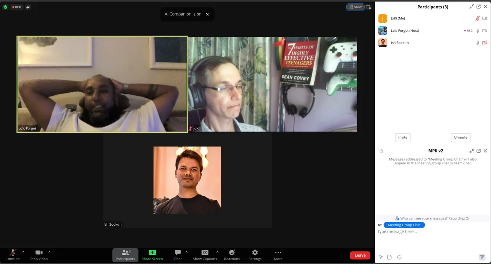

I don't understand!? - In our latest episode we - Loic, Ish and I - sat together and talked about the situation, possible reasons, and considerations regarding the emigration of Mauritians towards other countries and the potential impact on the society here on the island.

The so-called "brain drain" is happening since years and it kind of amazes me to see that people are looking for their chances and luck abroad when there are opportunities available in the country.

> "The Grass is always greener on the other side."

This proverb has the general understanding that life at other places is better than the current situation you are in. However this might be a superficial observation and there are other constraints playing into that, too.

Personally, I did the reverse. Meaning, I immigrated to Mauritius almost 17 years ago; initially as an expat on an Occupation Permit. And I have to admit that reaching certain goals and achievements would **not** have been possible back in Germany. Maybe possible but might have required much more effort, more time and more personal involvement. Who knows...

<iframe style="border-radius: 12px" width="100%" height="152" title="Spotify Embed: Le gazon n'est pas toujours plus vert ailleurs" frameborder="0" allowfullscreen="" allow="autoplay; clipboard-write; encrypted-media; fullscreen; picture-in-picture" loading="lazy" src="https://open.spotify.com/embed/episode/4reGdqWDI4FqbaCbJmBvKV?si=68e65a4ebee34677&amp;utm_source=oembed"></iframe>

Mauritius and its brain drain - why is talent moving away?

Please, check out episode #2 of the Mau Pas Konpran podcast and let us know your thoughts on this particular topic. Maybe share your own experience in case you have moved away from your home country, and how you see it nowadays.

Thanks for reading and hopefully listening.

Joyeuses fêtes et BananE!

PS: We are considering to publish the podcast on Apple platform.