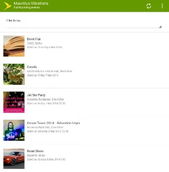

Finally, someone was able to realize one of 'my' ideas for an app. Since I'm here on the island I was always kind of annoyed by the simple fact that you could only read the articles about events that had happened already. Any kind of advertisement or pre-event information was and still is hardly available for quite a number of good events here in Mauritius.

## Event calendar and details in Mauritius

Luckily, the development team at [Knowledge Seven](https://www.knowledge7.com/ "Knowledge Seven") in Quatre Bornes took care of this issue and they recently published their Android app "Mauritius Vibrations" on the Play Store.

  
*Mauritius Vibrations: Overview of events*

  
*Mauritius Vibrations: Event details*

The app is available in two editions:

- [Mauritius Vibrations Lite](https://play.google.com/store/apps/details?id=com.knowledge7.android.mauritiusvibrationslite "Mauritius Vibrations Lite") (free but ad-supported)
- [Mauritius Vibrations](https://play.google.com/store/apps/details?id=com.knowledge7.android.mauritiusvibrations "Mauritius Vibrations") ($ 3.01 price tag)

As soon as I saw the public posting over on Google+ I went to their [official announcement on the Knowledge Seven blog](https://www.knowledge7.com/2014/03/04/mauritius-vibrations-a-mobile-app-to-stop-you-getting-bored/ "official announcement on the Knowlegde Seven blog") to get some more background details. So, shut up and take my money ;-)

Here's my current app review I posted on the Play Store:

> ### Good start, needs some polishing
>
> Well done, and highly appreciated events information. After a quick look I would like to see more views, like 'This week' or 'This month'. Some entries, like movies at the cinema seem to be in the wrong category, ie. child-friendly. Furthermore, I wonder whether events can be classified by multiple categories? It's a solid start but the app needs more polishing and a couple of improvements on the UI.

Of course, it will take a couple of iterations to get the app running smoothly and to the likes of the users, but it's already a great start and I like the UI and handling. I'll be glad to update my app review soon... And looking forward to see an iOS, a Windows Phone 8, as well as a Windows 8 app.

Keep the good work up and deploy fast and often!