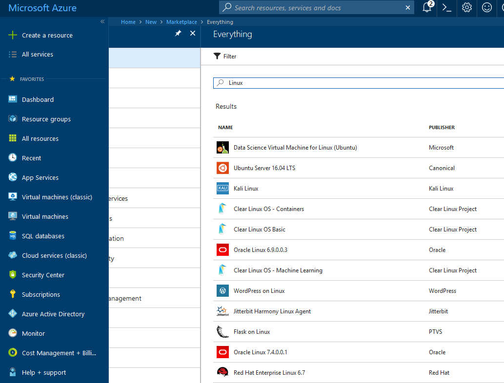

Recently I decided to coordinate my work and learning activities a little bit. Turns out that while working with .NET Core, in particular developing an API project, I do quite some coding under Linux using Visual Studio Code.

During office hours I'm fully emerged into Visual Studio 2017 running on my Windows 10 machine but often I'm reviewing and tweaking some of my code during the evening hours on my secondary [Xubuntu](https://xubuntu.org/) system.

## Linux and me

The story about me using Linux goes back two decades. Actually, if I remember correctly it happened some time in summer of 1996 when I officially purchased a copy of [S.u.S.E. Linux 4.2](https://en.wikipedia.org/wiki/SUSE_Linux). At that time I was still studying Applied Chemistry at the [University of Kaiserslautern](http://www.uni-kl.de/en/home/) and the [Unix AG](https://www.unix-ag.uni-kl.de/) on the campus offered copies of Slackware among others for free; you only had to bring the empty CDs to get the software burned on.

**Note:** The Unix AG was founded and still is run by a group of students and assistants in the field of computer science. And at that time there was a nice fellow named [Klaus Knopper](http://knopper.net/knopper/index-en.html), famously known for his Linux distribution [Knoppix](http://knoppix.net/).

Apart from attending lectures and running experiments in the chemistry laboratory I spent a good amount of time in the university's computer labs, too. Over there you had access to graphical XTerminals running on AIX Unix compared to the regular ASCII terminals anywhere else on campus.

The two reasons I bought a copy of S.u.S.E were because I wanted to set up an internet gateway at home which I was not able to do so with Windows NT 4.0, and because the distribution was bundled with several books on installation, network configuration and Linux in general in German language. So, I started the initial installation on a Friday afternoon, worked through the whole night reading and configuring the system several times, and slept only a few hours over the whole weekend. Finally, on Monday morning after several attempts and lots of swearing/ranting over my own incapabilities I managed to run a working internet gateway. Dialup happened over ISDN on my freshly installed Linux computer while my parent's system running Windows 95 was attached to the 10base2 thin Ethernet network.

The rest is history...

## Azure is running (on) Linux

Eventually you might be aware of the situation that Microsoft is actually using Linux technology to run its cloud solution named [Azure](https://en.wikipedia.org/wiki/Microsoft_Azure).

Yes, they do... According to an article [Whoa. Microsoft is using Linux to run its cloud](https://www.wired.com/2015/09/microsoft-using-linux-run-cloud/) published on Wired back in September 2015 it is referring to an official blog article by Microsoft. Get more details about the Azure Cloud Switch in [Microsoft showcases the Azure Cloud Switch (ACS)](https://azure.microsoft.com/en-us/blog/microsoft-showcases-the-azure-cloud-switch-acs/) by Kamala Subramaniam Principal Architect, Azure Networking.

> It [note: The Azure Cloud Switch (ACS)] is a cross-platform modular operating system for data center networking built on Linux.

Nonetheless, I would assume that the main interest would be to run and operate Linux machines in Azure. According to [Microsoft says 40 percent of all VMs in Azure now are running Linux](http://www.zdnet.com/article/microsoft-says-40-percent-of-all-vms-in-azure-now-are-running-linux/) we are in good company with like-minded system operators.

What better than combining two technology stacks? Although, I work on Windows systems during my day job, Linux plays a vital role. Our internet gateways are based on a designated Linux system which handles all internal traffic and provides access to the internet by providing essential services like DHCP, DNS, proxy and so forth. Services the standard router provided by a local ISP might not be capable of or [with serious security concerns](https://jochen.kirstaetter.name/router-in-mauritius/).

Using Azure to provision a Linux-based virtual machine takes less than 5 minutes and there are various options available.

I'm a big fan of Xubuntu but to prepare myself for MCSA: Linux on Azure I'm going to need a CentOS based system. So, instead of taking resources on my local machine using a virtualisation software like VirtualBox or VMware I'm going to entertain a Linux VM on Azure. It's more convenient after all.

## MCSA: Linux on Azure

Combining both technology stacks into one sounds almost like a dream coming true for me. Using Linux has always been a passion and fun factor for me and being able to add it more and more to my professional services brought me to the decision to look into the benefits and requirements of Microsoft's [MCSA: Linux on Azure](https://www.microsoft.com/en-us/learning/mcsa-linux-azure-certification.aspx) certification.

Effectively, the exam requirements stipulate that one has to pass two independent certifications to achieve MCSA: Linux on Azure:

- [Linux Foundation Certified System Administrator (LFCS)](https://training.linuxfoundation.org/certification/lfcs)
- [70-533 Implementing Microsoft Azure Infrastructure Solutions](https://www.microsoft.com/en-us/learning/exam-70-533.aspx)

You might have noticed that it is not purely a Microsoft certification but integrates the work of the [Linux Foundation](https://www.linuxfoundation.org/). Interestingly [Microsoft officially announced](https://open.microsoft.com/2016/11/17/microsoft-joins-linux-foundation/) during the Connect(); 2016 that they joined the Linux Foundation as a [Platinum Member](https://www.linuxfoundation.org/press-release/microsoft-fortifies-commitment-to-open-source-becomes-linux-foundation-platinum-member/). Which literally made the Linux on Azure certification possible.

> Our membership to the Linux Foundation builds on our work with the foundation, including the creation of a Linux on Azure certification.

Exciting times, don't you think?

## Exam formats

Both, Microsoft and the Linux Foundation, offer details about the skill sets being measured during the exams. The Microsoft exam 70-533 is based on the usual multiple choice format. Compared to that the LFCS is performance-based.

> Candidates will need to perform tasks or solve problems using the command line interface in their chosen Linux distribution.

Meaning, you connect to an actual Linux system - running either CentOS 7 or Ubuntu 16 (as of writing) - and you have to get your "hands dirty" in order to qualify.

## Learning resources

Check out the section [Optional training and resources](https://training.linuxfoundation.org/certification/lfcs) on the official LFCS website. The Linux Foundation provide free material like their Certification Candidate Handbook, their Certification Preparation Guide, and their LFSx01 courses online.

In similar fashion Microsoft lists multiple resources in the [Preparation options](https://www.microsoft.com/en-us/learning/exam-70-533.aspx) of the exam 70-533. The online training is accessible for free through the edX platform and are part of the [Microsoft Professional Program in Cloud Admin](https://www.edx.org/microsoft-professional-program-cloud), too.  
Using the same preparation material gives you the ability to achieve a second accreditation. Perhaps you are interested to read more about the [Cloud Administration](https://academy.microsoft.com/en-us/professional-program/tracks/cloud-administration/) professional program.

Having an active, annual subscription with Pluralsight I browsed through their learning paths and discovered [Pluralsight Path](https://www.pluralsight.com/paths/mcsa-linux-on-azure) to MSCA: Linux on Azure. It's a combination of several courses provided by experts [John Savill](https://twitter.com/NTFAQGuy) and [Andrew Mallett](https://twitter.com/theurbanpenguin).

More resources will be added regularly to my [100-days-of-exam repository](https://github.com/jochenkirstaetter/100-days-of-exam/blob/master/resources/Microsoft/mcsa-linux-on-azure.md) on GitHub. You are hereby invited to fork it, to add more resources including other exam preparations, and to send me your pull requests (PRs).

## Commitment to #100DaysOfExam

To keep myself accountable I am committed to the [#100DaysOfExam](https://www.100daysofexam.com/) challenge.

> I will learn and prepare for an exam for at least an hour every day for the next 100 days.

Following the `Rules` section of [#100DaysOfExam](https://github.com/jochenkirstaetter/100-days-of-exam) I will tweet about my progress using hashtag [#100DaysOfExam](https://twitter.com/hashtag/100daysofexam) and I will update my `Log` with the day's progress and provide a link every day, too.

Let's do it!
