Being part of the first [Global Startup Lab by the Massachusetts Institute of Technology (MIT) in Mauritius](http://www.telecomcampus.mu/mit-gsl-program) as a technological mentor for the participating project teams didn't come overnight.

## Let's start from the beginning...

I'm not sure about the exact date but if I remember correctly it was back in July 2013 when [Dhaval Adjodah](http://www.telecomcampus.mu/resources) got in touch with me talking about a technology business incubator program in Mauritius. Then mid of August Dhaval came to one of the [weekly Code & Coffee sessions](https://www.meetup.com/MauritiusSoftwareCraftsmanshipCommunity/) by the [Mauritius Software Craftsmanship Community (MSCC)](https://www.mscc.mu/). He was genuinely interested to know more about the local IT scene, and the activities of our community.

At the time, I explained to him that the MSCC somehow represents my passion to share information with other IT people, and that I'm looking forward to develop a vital and thriving community with other enthusiastic geeks like me. We talked about the knowledge gap of fresh graduates between academia and the real demands at work. He asked me about my opinion on the state of entrepreneurship in Mauritius in general. He on the other hand shared his plans about running this kind of technology-oriented workshop in Mauritius. As the conversation went on, we covered one or two other topics (which I can't remember anymore)...

Anyway, the perspective of having an incubator program run by the MIT in Mauritius would be outstanding.

## Four years later...

Yes, **four years**!  
Back in January 2017 I contacted Dhaval to inform him about the [annual Developers Conference](https://conference.mscc.mu/), and I was interested to know whether his idea around the incubator program started to take form. He informed me that they are planning to run it by early June until mid of August. It was just about forming a team of instructors that would be willing to come to Mauritius for that period.

Next time, we exchanged updates back in March, just a couple of days before the conference, and Dhaval informed me that everything has been settled. A team of MIT instructors would be ready to come over. The only thing missing are applicants and their technology ideas for the incubator program.

Finally, in April the official announcement came that the MIT Global Startup Lab in corporation with Mauritius Telecom is looking for applicants to join the program. The information was shared to all MSCC members immediately.

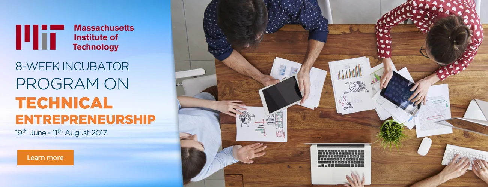

## Kick-off...

Meanwhile, Dhaval sent me an official invitation to the inauguration ceremony and gave me details about the final project demonstration day. Of course, I accepted the call. During the opening of the incubator program I was pleasantly surprised (and felt kind of proud) to see a solid number of software craftsmen among the participants. Really good to see that the MSCC is part of such an interesting and important activity here on the island.

It was great to exchange with those soon-to-be entrepreneurs and to listen to their business ideas and technology solutions to solve real problems. The diversity of concepts was immensive and very broad. Some ideas seemed to be specialised, others too obvious. And last but not least, Dhaval introduced me to the team of MIT instructors who would get all the project teams with their idea into shape, and to guide and train them to pitch their [minimum viable product (MVP)](https://en.wikipedia.org/wiki/Minimum_Viable_Product) by the end of the incubator program. Great folks!

## Dragon's Den

Some weeks in, I received an email by Zehreen to come and see the teams' concepts. Eventually, this should be understood as some kind of test-run as to convince some potential investors. Boy, this reminded me of that infamous TV show and yeah, that would be fun to listen to the various pitches, and then dissect their concepts, and roast their business plans. I'm in...

Even though the incubator program was only half-way through I have to admit that the quality of presentations, the team spirit and the actual business ideas were good. There was a bit of criticism in regards to sustainable business plan, and the projected return of investments (ROI). Which seems to be okay given that all participants are not business school graduates.

## The actual mentorship

Following the audit of projects I was kindly requested whether I would be available as a technological advisor for one or more teams.

> Mentorship is a relationship in which a more experienced or more knowledgeable person helps to guide a less experienced or less knowledgeable person.

Given the years of experience, and having set up several companies during that period I agreed and was assigned to a team which is going to disrupt the education market in Mauritius, more precisely their idea is focused on students' management at primary and secondary schools.

The team Schoolify (formerly known as eduCare) already had their technology and development stack defined, and I confirmed their decisions as reliable and scalable for upcoming demands. Furthermore, I gave the team a list of online resources to review and to learn from in order to increase the quality of their software development. We agreed to meet at least once per week until demo day in some weeks time.

## Project Demo Day

The climax of the MIT Global Startup Lab is the presentation of each teams' final project, well at that stage it might be better to talk about an actual product. Of course, over the course of the program the number of participants decreased but there were still 10 teams left for Demo Day.

Outstanding perseverance... And **"Thumbs Up!"** already to all teams.

Following are snapshots of each team (in no particular order)

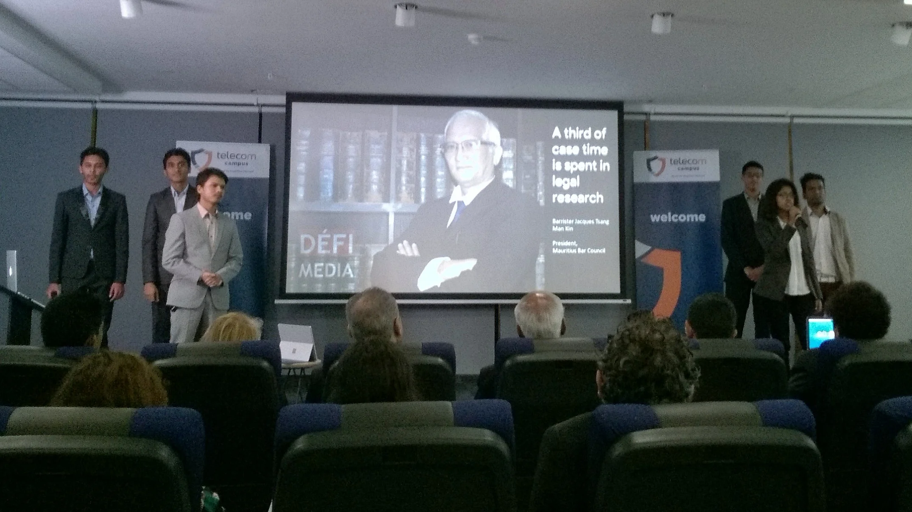  
*Exponent AI - Search engine for lawyers*

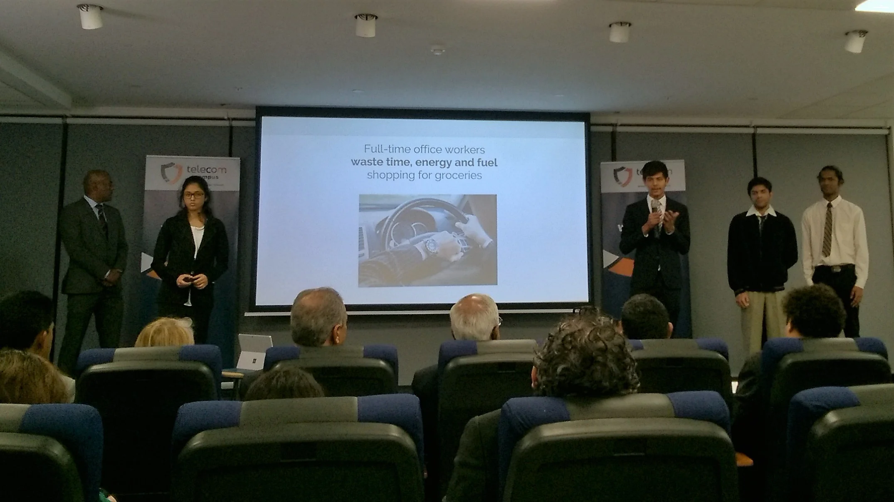  
*AVR-Tech - AR Study-aid for medical students*

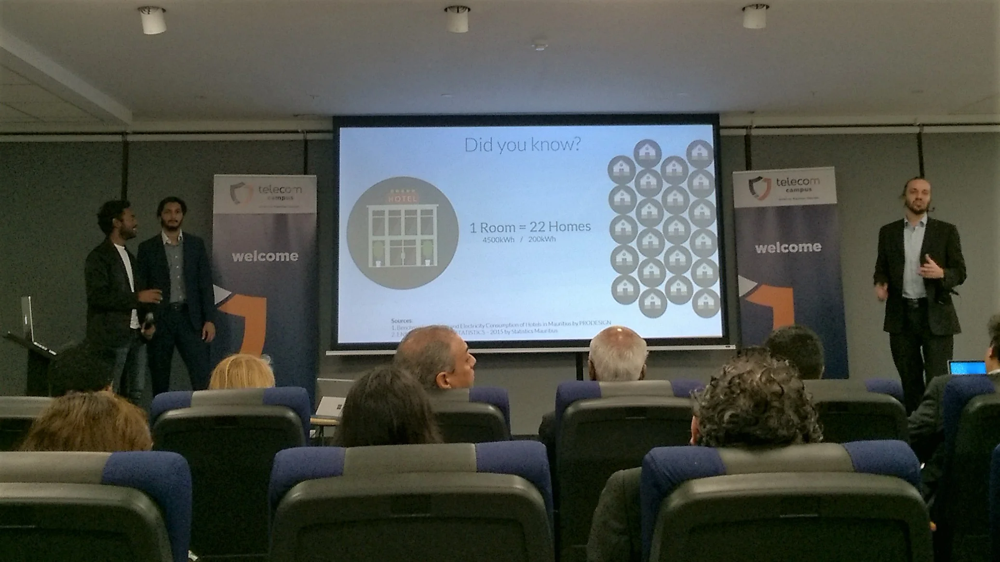  
*BioSphere - Intelligent Energy Management System*

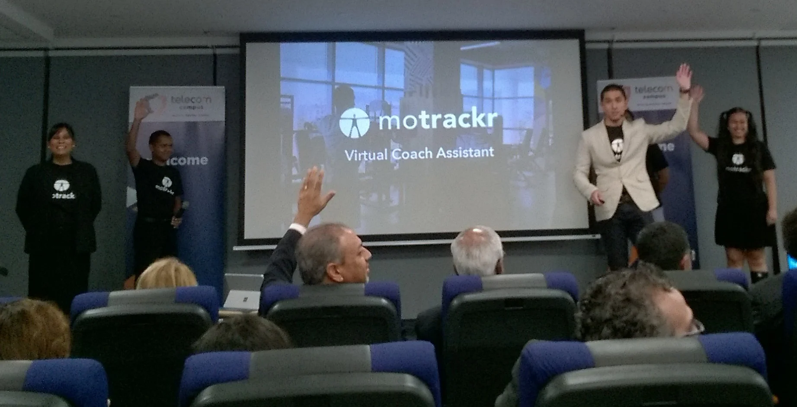  
*motrackr - Virtual coach assistant*

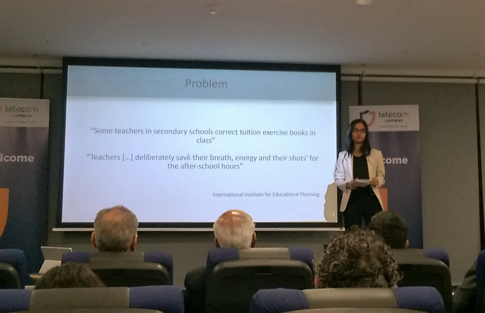  
*mo Aprann - Peer to Peer tutoring service*

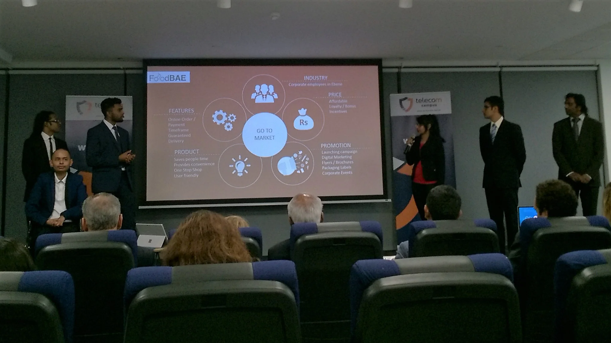  
*FoodBAE - Online Food Ordering*

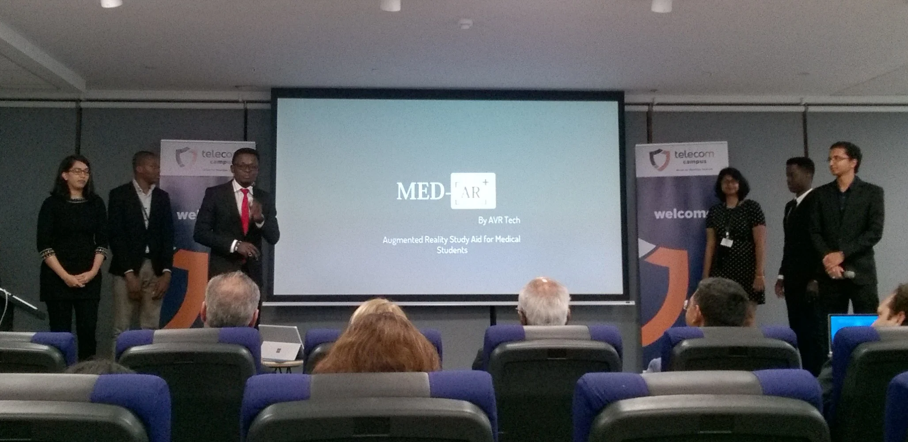  
*AVR-Tech - Med-AR, AR Study-aid for medical students*

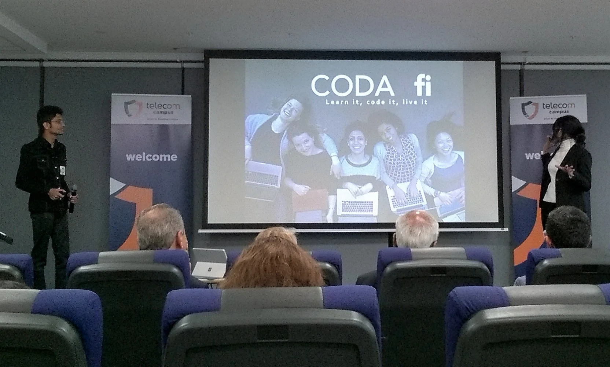  
*CodaxFi - Learn it, code it, live it: Connecting platform empowering women and girls in coding*

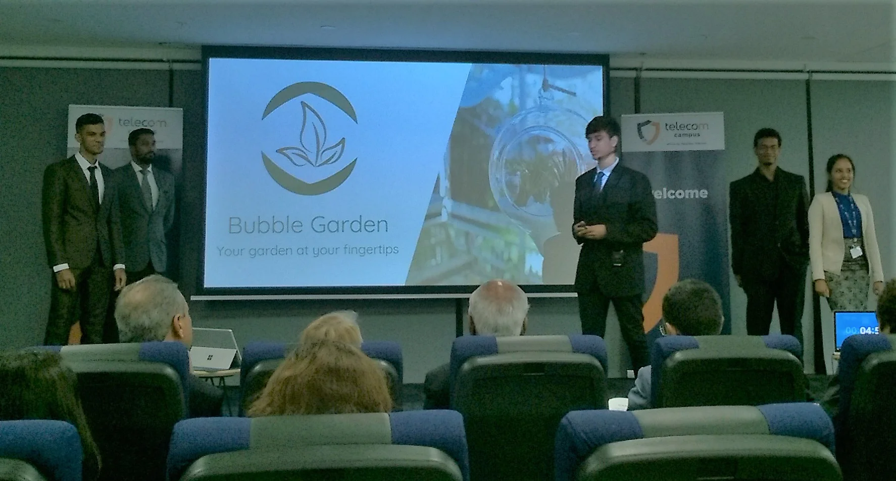  
*TechGardeners Bubble Garden - Your garden at your fingertips*

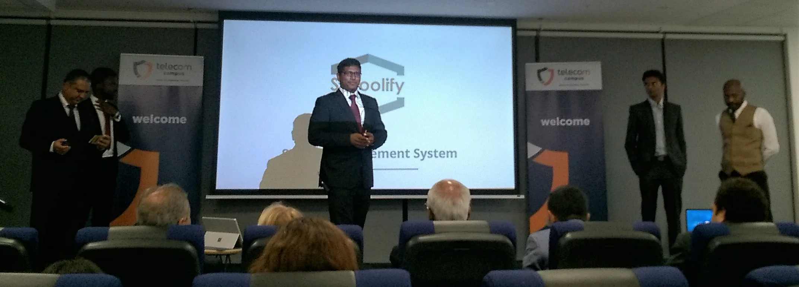  
*Schoolify - School Management System*

Demo Day was done in a similar way as the "Dragon's Den" test-run earlier. Major difference was the official aspect, the presence of the press, media and a broader audience from the public, and last but not least potential investors to pick up and support one or two teams.

Mauritius Telecom generously donated prize money for four different categories.

- Social Impact Award
- Innovative Technology Award
- Sustainable Business Model Award
- Grand Prize

Proudly I can say, that three of the winning teams have MSCC craftsmen among their team members. How cool is that?

## MIT Global Startup Lab in Mauritius: A Success

All finalists had their MVPs set up and ready for demonstration. Even though it was a long day already many people from the audience went to see their products in use.

::: gallery
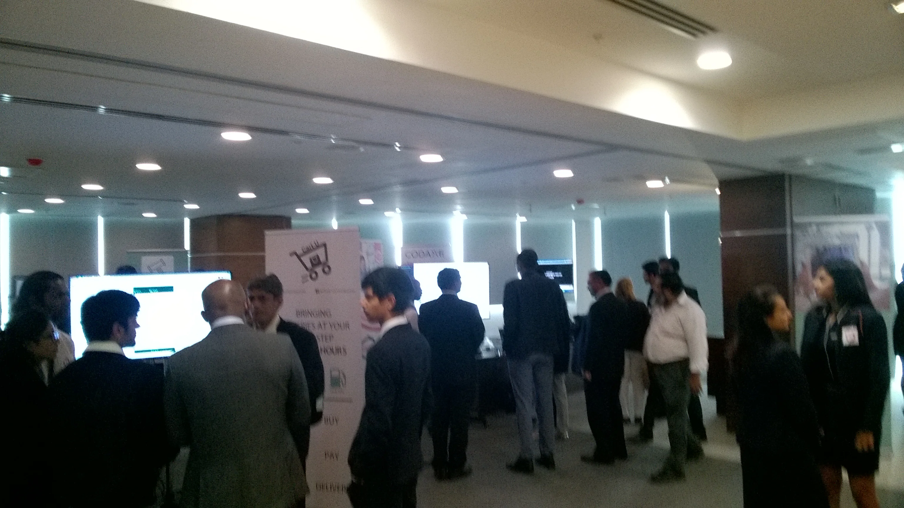
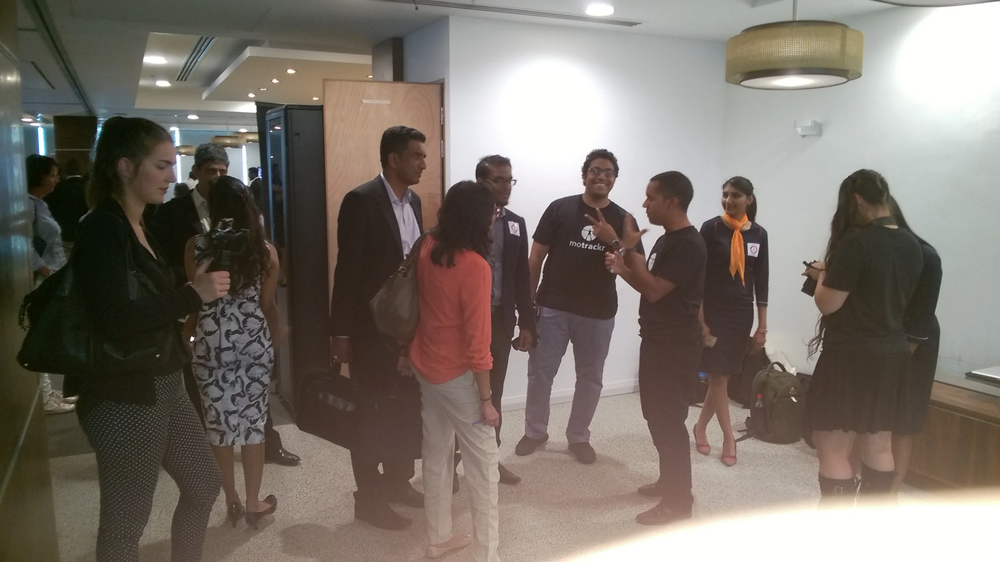
:::
See also related articles in the media:

- [Formater le futur avec le Mauritius Telecom Campus](http://ict.io/formater-le-futur-avec-la-mauritius-telcom-campus/) - ict.io
- [MIT Global Start-Up Labs: l’équipe d’Ish Sookun l’emporte haut la main](https://www.lexpress.mu/article/313841/mit-global-start-labs-lequipe-dish-sookun-lemporte-haut-main) - [L'Express.mu](https://www.lexpress.mu/)
- [Le MIT GSL accompagne les jeunes entrepreneurs à Maurice](http://ict.io/mit-gsl-accompagne-jeunes-entrepreneurs-a-maurice/) - ict.io
- [MIT GSL Demo day : découvrez les quatre lauréats](http://ict.io/mit-gsl-demo-day-decouvrez-quatre-laureats/) - ict.io

## Final thoughts

Thanks to all the participants. You did an amazing job and I hope that you all understand this incubator program as a serious start to a new career. You all had great ideas, transformed them into actual concepts, and created an MVP in 8 weeks only. That is quite an achievement already. Now, continue your journey and show every Mauritian that disruptive ideas grow among us. All the best and a prosperous business in the future.

Special thanks go out to the team of responsible people from the MIT. Namely, Dhaval, Bayo, Zhizhuo, Dishita, Awa, and Zehreen - thanks for bringing the Global Startup Labs to Mauritius, and thanks for your engagement to bring those ideas to life. Thank you for letting me be part of it.

According to the general feedback I received, probably this might not be the last MIT Global Startup Lab in Mauritius but just the beginning. I'm looking forward to the next edition.

Cheers, JoKi

PS: Bayo, thanks for your contribution to the Windows Phone, mainly dual SIM feature and others. ;-)
