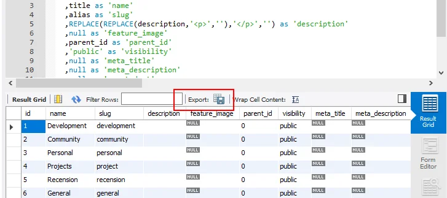
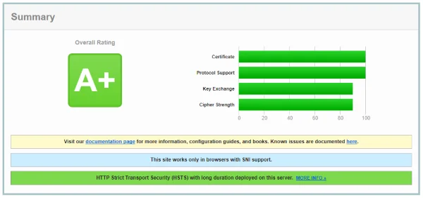

With the [announcement of Ghost 1.0](https://blog.ghost.org/1-0/) I gained some motivation to take care of my blog. It's been untouched since a very long time and honestly I didn't feel like writing my articles in plain HTML anymore. Instead, using Markdown feels more "natural" than HTML.

Surprisingly, I also discovered that Ghost 1.0 is now using MySQL or MariaDB as data store. During the [camp-site fire conversation with John O'Nolan](https://www.meetup.com/MauritiusSoftwareCraftsmanshipCommunity/events/237470307/) back in February 2017 the emphasis was clearly on SQLite as the fastest option. Seems that enterprise requirements in regards to backup and load balancing might have given the decision a different turn. Which to my opinion is positive. No worries, SQLite is still around for local development.

## Old blog: Joomla 1.x

Yes, yes... I know. It's 2017 and how can someone still operate a website running on Joomla 1.x. As mentioned earlier, lack of motivation to maintain the blog after all. Also, I modified the code base in my blog beyond the template, and there had been some additional gems, like ID-free URLs and others which newer versions of Joomla wouldn't provide (at least at times I checked).

## Modernisation

With more and more constraints being introduced by Google in regards to more performance, mobile-first approach and increased demand on security of websites, I like the features of Ghost that already take care of this. Namely, fully responsive template, Google AMP, new importer since version 1.0, new editor, and so forth. Read their announcement for further details.

Even though I was using a desktop & mobile client application to manage content in my Joomla-based blog, I really appreciate the Ghost Desktop client which itself is an Electron-based version of the Ghost Admin website.

It was high-time for an overhauling of my personal blog. Since the conversation with John back in February I already made up my mind to use Ghost as the new platform, and with the availibility of Ghost 1.0 it was a done deal.

## Migration path

Following is a brief overview of my migration steps from Joomla 1.x to Ghost 1.x:

- Backup existing Joomla database and blog content, like images, etc.
- Restore Joomla database into latest version of MariaDB on a local development machine.
- Write SQL query to map Joomla content and category columns to Ghost JSON properties using [MySQL Workbench](https://www.mysql.com/products/workbench/).
- Export query results using Workbench's "Export to File" feature.
- Clean up exported JSON files with various RegEx-based search and replace expressions.
- Export sample JSON from local development instance of Ghost.
- Replace exported Ghost content with cleaned up Joomla content.
- Import merged JSON back into local development instance of Ghost.
- Verify migrated content and run some final adjustments in Ghost database directly.
- Apply necessary changes to Ghost template.
- Export local Ghost content and template and import it into production instance on web server.
- Handle URL rewrites in web server.

Eventually, over time and monitoring there might be additional adjustments necessary on the production instance of Ghost but I'm not too concerned about that after all.

### Backup of existing Joomla blog

First, create a backup of the MySQL database like so:

```
$ mysqldump -u root -p --databases joomla > mysql_joomla.sql
```

Next, securily transfer the SQL backup and all assets form your Joomla installation to your local machine. You can either use your favourite FTP client software, ie. FileZilla, or simply scp the data like so:

```
$ scp -r user@server:/var/www/joomla/* ./
```

Of course, you have to use your path information.

### Restore Joomla 1.x database in latest MariaDB

If you need more information about how to restore a MySQL/MariaDB database please refer to the official documentation. I ran the following statement:

```
mysql -u root -p < mysql_joomla.sql
```

### SQL query to map Joomla columns to Ghost properties

Partly thanks to my natural laziness I gave Google a shot and among the search results I landed on [Migrating from Joomla to Ghost](http://mike.seddon.ca/migrating-from-joomla-to-ghost/) by Mike Seddon which gave me a headstart into my adventure. Mike wrote his tutorial almost 2 years ago, and obviously it was for an earlier data model of a Ghost post. So, with minor changes I managed to produce the following SQL queries to extract my blog posts, categories and the relationships between them:

```sql
-- MigrateJoomlaGhost_Posts.sql
SELECT 
   id as 'id'
  ,null as 'uuid'
  ,`title` as 'title'
  ,`alias` as 'slug'
  ,null as mobiledoc
  ,Coalesce(`introtext`,`fulltext`, '') as 'html'
  ,null as 'amp'
  ,REPLACE(
    REPLACE(
      REPLACE(
        REPLACE(
          REPLACE(
            REPLACE(
              REPLACE(
                REPLACE(
                  REGEXP_REPLACE(
                    REGEXP_REPLACE(Coalesce(`introtext`,`fulltext`, '')
                    ,'()'
                    ,CONCAT(','\\2)'))
                    ,'(<p>(.*)<\/p>)'
                  ,CONCAT('\\2','\r\n'))
                ,'&nbsp;',' ')
              ,'JPG','jpg')
            ,'<strong>','**')
          ,'</strong>','**')
        ,'<h4>','####')
      ,'</h4>','')
    ,'<em>','*')
  ,'</em>','*')      
  as 'plaintext'
  ,null as 'feature_image'
  ,0 as 'featured'
  ,0 as 'page'
  ,'published' as 'status'
  ,'en' as 'locale'
  ,'public' as 'visibility'
  ,null as 'meta_title'
  ,metadesc as 'meta_description'
  ,1 as 'author_id'
  ,UNIX_TIMESTAMP(`created`)*1000 as 'created_at'
  ,1 as 'created_by'
  ,Coalesce(UNIX_TIMESTAMP(`modified`), UNIX_TIMESTAMP(`created`)) * 1000 as 'updated_at'
  ,1 as 'updated_by'
  ,Coalesce(UNIX_TIMESTAMP(`publish_up`), UNIX_TIMESTAMP(`created`)) * 1000 as 'published_at'
  ,1 as 'published_by'
FROM joomla_content  
WHERE state=1
```

I'm only interested in published articles as indicated by the WHERE clause of the query. Provided to have the full backup of my old blog I'd be able to transfer more content at a later stage. Just in case...

Any Joomla categories could be mapped to Ghost tags using the following SQL query:

```sql
-- MigrateJoomlaGhost_Categories.sql
SELECT 
   id as 'id'
  ,title as 'name'
  ,alias as 'slug'
  ,REPLACE(REPLACE(description,'<p>',''),'</p>','') as 'description'
  ,null as 'feature_image'
  ,parent_id as 'parent_id'
  ,'public' as 'visibility'
  ,null as 'meta_title'
  ,null as 'meta_description'
  ,null as 'created_at'
  ,1 as 'created_by'
  ,null as 'updated_at'
  ,1 as 'updated_by'
FROM joomla_categories  
WHERE published = 1
  And alias NOT IN ('topbanner');  
```

In my case I'm excluding one category explicitly as it contains just one article which I used for some magic tricks in Joomla before. Nothing to be concerned about. Eventually, you might either adjust the alias selection or remove it completely from the WHERE clause.

And last, I took care of the assignments between posts and tags, too.

```sql
-- MigrateJoomlaGhost_PostsCategories.sql
SELECT 
     null as 'id'
    ,post.id as 'post_id'
    ,cat.id as 'tag_id'
    ,0 as 'sort_order'
FROM joomla_content post 
INNER JOIN joomla_categories cat On cat.id = post.catid
Where post.state = 1
```

Please, don't just copy and paste those queries. You have to check the tables names in the FROM and JOIN clause first.

### Exporting the SQL data to JSON

MySQL Workbench has a built-in feature to *Export recordset to an external file* with multiple format choices. Set the export format to JSON and give your query results a proper file name.



After this, I had three JSON files to play with.

### Using RegEx to search and replace content

Even though newer versions of MariaDB have the `REGEXP_REPLACE` function I went forward to clean up my JSON content in my favourite text editor: [Visual Studio Code](https://aka.ms/vscode).

Thanks to the legacy of over 10 years I wanted to clean up all content. So, for this task I needed some RegEx magic to convert old fragments of BBcode to Markdown and therefore took some inspiration from the following [answer to 'Converting phpBB BBCode posts to Markdown' on Stack Overflow](https://stackoverflow.com/a/8819240/4067646).

Out with old, in with the new... ;-)

Additionally, I changed the URL pattern of Joomla internal links to Ghost post slugs and upgraded all hyperlinks to HTTPS protocol.

### Export Ghost default content as template, replace and import blog content

To keep things easy I exported the existing default content from my local Ghost development instance, opened the resulting JSON file in Visual Studio Code and replaced the following arrays with the freshly cleaned up content from my Joomla blog:

- posts
- tags
- posts\_tags

And as a final touch, I adjusted the `users.id` to match the publisher ID.

**Note:** Depending on the number of blog articles the import can take quite some time. Invalid JSON won't be imported by Ghost.

### First verification of migrated data

After successful import of all blog articles and tags I skimmed the content in the Ghost Admin and it looked pretty already. Unfortunately, there were still some minor tasks to do to polish the results but this is mainly content specific to my environment, ie. I use a separate sub-domain for static content like images, etc.

But overall that was the major part of the migration from Joomla 1.x to Ghost 1.x.

### Apply changes to Ghost template

As a start I was searching the internet for some ready-to-use Ghost template but I have to admit that I wasn't really impressed by the results found. Yes, there are some really talented designers and developers out there on the interweb but taste varies. Finally, I copied the default Ghost template Casper and started with my modifications.

Following are the Handlebar files I changed or added to my personalised Ghost template. The snippets are incomplete but provide enough information to find the anchors in the original file.

```html
-- default.hbs
    {{!-- Base Meta --}}
    <title>{{meta_title}} - {{@blog.title}}</title>
    <meta name="HandheldFriendly" content="True" />
    <meta name="viewport" content="width=device-width, initial-scale=1.0" />

    {{!-- Styles'n'Scripts --}}
    <link href="{{asset "built/screen.css"}}" rel="stylesheet" type="text/css" />
    <link href="//cdnjs.cloudflare.com/ajax/libs/font-awesome/4.7.0/css/font-awesome.min.css" rel="stylesheet" integrity="sha384-wvfXpqpZZVQGK6TAh5PVlGOfQNHSoD2xbE+QkPxCAFlNEevoEH3Sl0sibVcOQVnN" crossorigin="anonymous" />
```

This adds the blog title as a suffix to every page and I like the use of Font Awesome on my site, too.

```html
-- partials/post-card.hbs
        <a class="post-card-content-link" href="{{url}}" aria-label="{{#if meta_title}}{{meta_title}}{{else}}{{title}}{{/if}}">
            <header class="post-card-header">
                {{#if tags}}
                    <span class="post-card-tags">{{tags.[0].name}}</span>
                {{/if}}
                <h2 class="post-card-title">{{#if meta_title}}{{meta_title}}{{else}}{{title}}{{/if}}</h2>
            </header>
            <section class="post-card-excerpt">
                <p>{{#if meta_description}}{{meta_description}}{{else}}{{excerpt words="33"}}{{/if}}</p>
            </section>
        </a>
```

The adjustment above is based on my current confusion (or lack of knowledge) between `Excerpt` and `Meta Description` of a Ghost post. For reasons of search engine optimisation (SEO) all my Joomla content already had excessive details in meta title and meta description. The default implementation in the Casper template uses the `Excerpt` field as article abstract only. The code change above gives priority to an eventually existing meta information and uses excerpt as fall-back.

```html
-- tag.hbs
        {{> "site-nav"}}
        <div class="site-header-content">
            <h1 class="site-title">
                {{name}} <a class="rss-button" href="{{@blog.url}}{{url}}rss/" target="_blank" rel="noopener">{{> "icons/rss"}}</a>
            </h1>
            <h2 class="site-description">
                {{#if description}}
                    {{description}}
                {{else}}
                    A collection of {{plural ../pagination.total empty='posts' singular='% post' plural='% posts'}}
                {{/if}}
            </h2>
        </div>
```

Surprisingly, the tag pages in Ghost do not provide easy access to the corresponding RSS feed of a tag. The code change above adds the known RSS feed symbol at the end of tag title.

### Disqus and the Quest for the lost comments

The development team at Ghost added the [Disqus integration](https://disqus.com/admin/install/platforms/ghost/) as a comment into the `post.hbs` file. Meaning, that one has to [uncomment the section](https://help.ghost.org/hc/en-us/articles/115000440851-Disqus) and you're ready to go. Well, that's true for a new website but not for a migrated one.

In my previous Joomla installation I used a plugin to incorporate Disqus into my blog and it generated a random page identifier some years back. All I had to do was to check the existing request from my old blog to Disqus and adjust the JavaScript page identifier accordingly.

```html
            {{!--
            If you use Disqus comments, just uncomment this block.
            The only thing you need to change is "test-apkdzgmqhj" - which
            should be replaced with your own Disqus site-id.
            --}}

            <section class="post-full-comments">
                <div id="disqus_thread"></div>
                <script>
                    var disqus_config = function () {
                        this.page.url = '{{url absolute="true"}}';
                        this.page.identifier = '9632ed2b84_id{{comment_id}}';
                    };
                    (function() {
                        var d = document, s = d.createElement('script');
                        s.src = 'https://getbloggedbyjoki.disqus.com/embed.js';
                        s.setAttribute('data-timestamp', +new Date());
                        (d.head || d.body).appendChild(s);
                    })();
                </script>
            </section>
```

So, instead of the default value of `ghost-{{comment_id}}` I had to use my existing page identifier. If you are using Disqus already you have to make this change, and all your comments are successfully linked to your fresh Ghost content.

Using Ghost's `Code Injection` feature I added the following JavaScript fragment to the `Blog Footer`:

```
<script id="dsq-count-scr" src="//getbloggedbyjoki.disqus.com/count.js" async></script>
```

This enables me to place information about the number of comments of a post anywhere in this blog. Which is eventually interesting on the frontpage as well as the tag overview pages.

### Recommended attribute in \_blank anchors

I was kind of surprised to see that the default Casper template doesn't pay attention to proper attribution of hyperlinks that either open a new tab or browser window. Well, actually the attribute `rel="noopener"` applies to any external link.

> Open new tabs using `rel="noopener"` to improve performance and prevent security vulnerabilities.

Google's documentation in the Lighthouse developer corner has more information on [  
Opens External Anchors Using rel="noopener"](https://developers.google.com/web/tools/lighthouse/audits/noopener). Eventually, I'm going to check the [issue tracker of Ghost on GitHub](https://github.com/TryGhost/Ghost/issues) to see whether this has been discussed already.

### Transferring content to the production system

Thanks to the export and import feature in Ghost Admin application this is literally a no brainer. I simply run the export of the content, downloaded my modified Ghost template, and did the upload into the productive instance of Ghost on my external web server.

No surprises and everything went as smooth as expected.

### Existing URLs and rewrites

Although Ghost 1.x offers to configure URL redirects in the `config.json` file I recommend to consult the documentation of your web server, and to add the rules in the server rather than in the software. This improves performance and reduces the load on your Ghost installation.

This web site is currently running on nginx, and therefore I added the following rewrite expressions to my server configuration:

```
        rewrite ^/blog(/.*)\.feed(\?.*)?$ tag/$1/rss/ permanent;
        rewrite ^/blog(/.*)(/.*)\.html(\?.*)?$ $2/$3 permanent;
        rewrite ^(/.*)\.html(\?.*)?$ $1/$2 permanent;
        rewrite ^/post/index/\d+(/.*)/?$ $1/ permanent;
        if ( $args ~ (.*)&id=\d+:([A-Za-z0-9\-]+)&.* ) {
          set $args "";
          set $arg $2;
          rewrite (.*) /$arg/ permanent;
        }

        try_files $uri.html $uri/ $uri =404;

        error_page 404 /404/;
        error_page 500 502 503 504 /500/;
```

The first rule takes care of the previous RSS feeds and maps to the corresponding Ghost tag. The second expression redirects any previous blog articles irrespective their category to an extension-less version of same post in Ghost. And the last RegEx converts any incoming request to an HTML to its extension-less counter-part in Ghost.

During the next couple of days I'm going to monitor the error log on the web server to see whether there are more URL redirects needed or not. Also, Google Webmaster Tools is going to help me in that case. An increased number of HTTP 404 entries will surely give me a hint.

The other directives provide some fall-back in nginx which allows the server to check for multiple URLs until it finally answers the call with an HTTP 404 in case the content couldn't be matched. Got some ideas from [“Hide” .html file extensions using nginx rewrites](https://serverfault.com/a/346999) on server**fault** and by an article [Remove HTML Extension And Trailing Slash In Nginx Config](http://cobwwweb.com/remove-html-extension-and-trailing-slash-in-nginx-config) written by Sean C Davis.

### SSL upgrade thanks to Let's Encrypt

With recent development and increased constraints in regards to safety and search engine ranking I directly seized the opportunity to add SSL certificate to the domain. Nowadays, the easiest and cheapest way is to use Let's Encrypt. The following command does all the hard work

```
$ certbot certonly -d jochen.kirstaetter.name --email user@example.com --agree-tos --standalone
```

The generated certificate needs to be configured in your web server configuration, too. In my case I added the following into the `server` section:

```
        ssl on;
        ssl_certificate         /etc/letsencrypt/live/jochen.kirstaetter.name/fullchain.pem;
        ssl_certificate_key     /etc/letsencrypt/live/jochen.kirstaetter.name/privkey.pem;

        # modern configuration. tweak to your needs.
        ssl_protocols TLSv1 TLSv1.1 TLSv1.2;
        ssl_ciphers 'ECDHE-ECDSA-AES256-GCM-SHA384:ECDHE-RSA-AES256-GCM-SHA384:ECDHE-ECDSA-CHACHA20-POLY1305:ECDHE-RSA-CHACHA20-POLY1305:ECDHE-ECDSA-AES128-GCM-SHA256:ECDHE-RSA-AES128-GCM-SHA256:ECDHE-ECDSA-AES256-SHA384:ECDHE-RSA-AES256-SHA384:ECDHE-ECDSA-AES128-SHA256:ECDHE-RSA-AES128-SHA256';
        ssl_prefer_server_ciphers on;

        # HSTS (ngx_http_headers_module is required) (15768000 seconds = 6 months)
        add_header Strict-Transport-Security max-age=63072000;

        # OCSP Stapling ---
        # fetch OCSP records from URL in ssl_certificate and cache them
        ssl_stapling on;
        ssl_stapling_verify on;
```

Eventually the ciphers might be too harsh as some older browsers are falling off the cliff. Well, time to upgrade then.

[Qualys SSL Labs](https://www.ssllabs.com/ssltest/index.html) gives the current version of this site an A+ rating. Right now, there is only the configuration of CSP and HPKP missing. Something to address within the next couple of days/weeks.



Hopefully, my journey to migrate from Joomla 1.x to Ghost 1.x gave you some interesting information and please leave your feedback in the Disqus comments below. I'm relatively new to Ghost and would like to know whether there are more knobs and switches to tweak the experience.

Cheers, JoKi