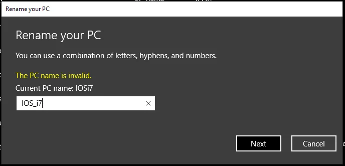

Please review the current host name pattern given to your internet-facing mail server(s). At least one of them doesn't comply with RFC2821 - section 4.1.2. This results in delivery issues of your emails.

The [Mauritius Revenue Authority](http://www.mra.mu/) (MRA) is a body corporate, set up to manage an effective and efficient revenue-raising system. It administers and collects taxes due in Mauritius within an integrated organisational structure.  
The MRA is an agent of State and, as such, the Ministry of Finance and Economic Development continues to have overall responsibility for the organisation and monitors its performance.  
The MRA is responsible for **collecting approximately 90% of all tax revenues** and for enforcing tax laws in Mauritius (Taken from their [About MRA](http://www.mra.mu/index.php/about-mra) page).

## Annual filing of individual tax return

Filing your annual returns and paying taxes is as certain as death, and absolutely welcoming to contribute to the economics of a country. It's a citizen's duty to handle this with care and in due time. The MRA is doing a great job by offering their e-Services like the [E-Filing of Individual Tax Return Year of Assessment 2017-2018](https://eservices.mra.mu/). Submitting your tax return happens online, and given their confirmation email one would pay (if applicable).

And this is where my or better said our current problem starts. Entering all related information and submitting the data to the MRA wasn't a problem after all but it's the situation that you are supposed to receive an email with details about processing identification and the amount to pay.

We never received such an email.

## Where's the email from MRA?

Although our tax filing happened prior to due date we noticed that neither my wife nor I actually received an email with that processing ID number or details about necessary payments. First reaction in such cases would be to check whether the mail client had a good day and accidentally classified such an email as SPAM and therefore might have moved it into other folder. But no traces were found in our mail software.

Okay, accepting the circumstances that the email might have not been delivered to the client I went to check our mail server infrastructure. Searching through the log files on our internal groupware with mail sub-system didn't give any clues in regards to MRA as sender.

Next, I went further and started to look into the recent and rotated log files on our external mail relay server. Using a command line expression like this:

```
$ zgrep mra /var/log/exim4/*
```

I finally got some hints what might have happened:

```
/var/log/exim4/rejectlog.5.gz:2017-09-27 15:14:44 rejected EHLO from mail.mra.mu [196.27.73.162]: syntactically invalid argument(s): mra_esa1.mra.mu
/var/log/exim4/rejectlog.5.gz:2017-09-27 15:16:12 rejected HELO from mail.mra.mu [196.27.73.162]: syntactically invalid argument(s): mra_esa1.mra.mu
...
/var/log/exim4/rejectlog.2.gz:2017-09-30 16:15:03 rejected EHLO from mail.mra.mu [196.27.73.162]: syntactically invalid argument(s): mra_esa1.mra.mu
/var/log/exim4/rejectlog.2.gz:2017-09-30 16:16:31 rejected HELO from mail.mra.mu [196.27.73.162]: syntactically invalid argument(s): mra_esa1.mra.mu
```

Obviously, our mail transfer agent (MTA) didn't like some information during the initial communication establishment with the mail server of the MRA.

Positive note: The mail server of the MRA seems to have an email delivery policy of approximately four attempts per hour over a maximum period of 72 hours.

## What is causing the reject?

Firing up my favourite search engine lead me to a mailing list thread [Re: \[exim\] syntactically invalid argument(s)](https://lists.exim.org/lurker/message/20041124.113314.c44c83b2.en.html) from November 2004. At first reading I got the impression that I had a mishap in my configuration but then it turns out that an **underscore character** in the host name seems to be the culprit of this (scroll the log entries to the right if needed).

Not surprising I found a "solution" on [stack overflow](https://stackoverflow.com/questions/86907/how-do-i-fix-501-syntactically-invalid-helo-arguments#comment11890_86953) which suggests to ease exim's strict syntax checking a little bit and to allow broken systems to send email:

```
echo 'helo_allow_chars = _' > /etc/exim4/conf.d/main/04_exim4-helo_hack
```

And [documentation of exim](http://www.exim.org/exim-html-4.40/doc/html/spec_14.html#IX1163) on `helo_allow_chars` gives the following information:  
*"This option can be set to a string of rogue characters that are permitted in all EHLO and HELO names in addition to the standard letters, digits, hyphens, and dots. If you really must allow underscores, ..."*

## Violation of RFC2821, section 4.1.2

Given the nature of *rogue characters* I went further to see what the [Request for Comments: 2821 - Simple Mail Transfer Protocol](https://tools.ietf.org/html/rfc2821) has to offer. Searching the document for *underscore* lands you in section [4.1.2 Command Argument Syntax](https://tools.ietf.org/html/rfc2821#section-4.1.2) where it says the following:

```
To promote interoperability and consistent with long-standing
guidance about conservative use of the DNS in naming and applications
(e.g., see section 2.3.1 of the base DNS document, RFC1035 [22]),
characters outside the set of alphas, digits, and hyphen MUST NOT
appear in domain name labels for SMTP clients or servers.  In
particular, the underscore character is not permitted.  SMTP servers
that receive a command in which invalid character codes have been
employed, and for which there are no other reasons for rejection,
MUST reject that command with a 501 response.
```

That's highly interesting - **In particular, the underscore character is not permitted.** -, as the RFC explicitly classifies the underscore as an invalid character. And having a look at the referred section [2.3.1. Preferred name syntax of RFC1035](https://tools.ietf.org/html/rfc1035#section-2.3.1) provides more details on the naming pattern of host names:

```
The labels must follow the rules for ARPANET host names.  They must
start with a letter, end with a letter or digit, and have as interior
characters only letters, digits, and hyphen.  There are also some
restrictions on the length.  Labels must be 63 characters or less.
```

Again, no mentioning of the underscore character.

## Public rant and comments

Not happy about not receiving such an important email as the confirmation of your annual tax return and payment instructions based on a mistake that could be avoided easily, I posted on Twitter about it.

> Oh fantastic! The mail server configuration of [@MRA_services](https://x.com/MRA_services?ref_src=twsrc%5Etfw) violates hostname convention in RFC 2821 - 4.1.2 - Underscore is NOT permitted!
>
> — Jochen Kirstätter (@JKirstaetter) [October 2, 2017](https://x.com/JKirstaetter/status/914707662956146688?ref_src=twsrc%5Etfw)

Later on, this was picked up by other internauts. Mr Moonesamy asked for permission to quote me in a note to the Mauritius Revenue Authority.

> Can I reference your tweet in a message to the MRA? [#mauritius](https://x.com/hashtag/mauritius?src=hash&ref_src=twsrc%5Etfw)
>
> — S Moonesamy (@sminmu) [October 2, 2017](https://x.com/sminmu/status/914791176854585344?ref_src=twsrc%5Etfw)

And Pirabarlen noted that other mail providers are violating RFCs, too.

> I think you guys are forgetting/ignoring that Microsoft and google doesn't even respect rfc 5321 correctly.
>
> — Pirabarlen (@eldergodselven) [October 2, 2017](https://x.com/eldergodselven/status/914899286017675264?ref_src=twsrc%5Etfw)

First of all, I have to clarify that I'm not forgetting/ignoring that other companies or mail service providers might not respect RFCs at all.  
Second, I'm also aware that RFC clearly stands for **Request for Comments** and therefore is rather a recommendation than a regulation. Especially big internet companies have this tendency to run for their own ideas regularly. Much to the disadvantage of others in most cases.  
And third, I can't accept a statement like *"How about others doing..."* as a justification or reasoning to do wrong.

As regular submitter to the Mauritius Internet User (MIU) mailing list, Ish Sookun started a thread on [Mauritius Revenue Authority violates hostname convention](http://lists.elandnews.com/archive/mauritius/internet-users/2017/10/6529.html), and provides more information on the SMTP mail header as he actually received the confirmation email. Gratefully, as mentioned by Pirabarlen, Ish also refers to [RFC5321 - Section 4.1.2](https://tools.ietf.org/html/rfc5321#section-4.1.2) which stipulates that *"characters outside the set of alphabetic characters, digits, and hyphen MUST NOT appear in domain name labels for SMTP clients or servers."* The underscore character is not part of that definition.

Eventually, it might be that I'm an isolated case in regards to having issues with the confirmation email of the Mauritius Revenue Authority but there might be other tax payers affected by this.

Seeing something as simple as a host name which doesn't comply with RFCs leaves a bad taste there might be other services configured wrongly.

## What else to notice...

Eventually, you might have noticed the difference of host name in the log entries above - *mail.mra.mu* vs. *mra_esa1.mra.mu*. Let's do a couple of DNS lookups to see what's going on here actually. I use the `dig` command line tool on a Linux system to query DNS information. Eventually, you might consider to use an online service like [MX Toolbox](https://mxtoolbox.com/). On Windows you can execute the `nslookup` command in either a Command Prompt or PowerShell. See [Nslookup reference on TechNet](https://technet.microsoft.com/en-us/library/cc725991%28v=ws.11%29.aspx) for syntax.

Talking about mail server I'm having a look at the MX record of the `mra.mu` domain first.

```
$ dig -t mx mra.mu
```

Which gives me the expected information about mail.mra.mu as the properly configured mail exchange point of the domain. Next, let's get some details about that particular system.

```
$ dig mail.mra.mu
```

Again, as expected the A record provides the IP address logged above. So, what's the fuzz about the host name with the underscore?

```
$ dig mra_esa1.mra.mu
```

Turns out that the name is not configured publicly after all. Meaning that the connecting mail server actually uses a host name not matching its IP address and public DNS record to establish communication.

Just in case you ask yourself what the suffix "esa" might stand for. A wild guess could be that the MRA is using an appliance like the [Cisco C370 Email Security Appliance](https://www.cisco.com/c/en/us/support/security/email-security-appliance-c370/model.html).

What about the PTR record of the IP address? A Pointer (PTR) record resolves an IP address to a fully-qualified domain name (FQDN) as an opposite to what A record does. PTR records are also called Reverse DNS records.

> PTR records are mainly used to check if the server name is actually associated with the IP address from where the connection was initiated.

```
$ dig -t ptr 196.27.73.162
```

Unfortunately, it seems that Reverse DNS and Pointer record has not been set up. It's not compulsory to have a PTR record but it would increase the level of authenticity of the origin of the sender. And speaking of sender information...

## Lack of Sender Policy Framework (SPF) and DKIM

The domain `mra.mu` does not provide any commonly used safety features on the origin and therefore authenticity of the sender of an email. Querying DNS to get configuration on [Sender Policy Framework (SPF)](http://www.openspf.org/) or [DomainKeys Identified Mail (DKIM)](http://www.dkim.org/) doesn't show any data.

```
$ dig -t txt mra.mu
$ dig -t spf mra.mu
```

Given the current state of analysis I honestly doubt that [DNS Security Extensions (DNSSEC)](http://www.dnssec.net/) is in place.

## Deep concerns about this

I don't know about you but seeing this lack of consciousness on security related aspects, it might be trivial for an expert in the field to forge and exploit this. Especially for such an important institution as the Mauritius Revenue Authority which is responsible for collecting approximately 90% of all tax revenues, I'm deeply concerned.

What started as a "Quest to find a lost email" escalated quickly into a major security concern. Maybe "Dear IT department of Mauritius Revenue Authority" might have been a better title for this article.

Please leave your thoughts and experience on this case, and hopefully similar ones in the comments section below.

## Computer name on Windows (10)

Challenged by Pirabarlen's statement regarding other companies like Microsoft or Google disrespecting RFC 5321, I tried to run a little experiment on my local Windows 10 machine. Rename your PC using an underscore character.  
  
It didn't go well... Seems that Microsoft learned their lesson and improved their product(s). At least in compliance to host name.

Why isn't there a similar input validation for host name configuration in the software or appliance used by the MRA? Would be interesting to find out...