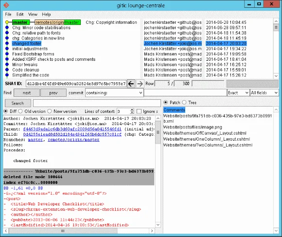
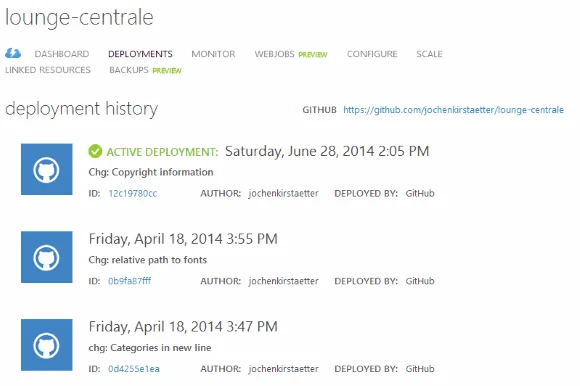

Unfortunately, there was no monthly meetup during May. Which means that it was even more important and interesting to go forward with a great topic for this month. Earlier this year I already spoke to Nayar Joolfoo about doing a presentation on version control systems (VCS), and he gladly agreed since then. It was just about finding the right date for the action. Furthermore, it was also a great coincidence that Avinash Meetoo announced on social media networks that[Knowledge 7](https://www.knowledge7.com/) is about to have a new training on "Effective git" - which correlates to a book title Avinash is currently working on - all the best with your approach on this and reach out to our MSCC craftsmen for recessions.

Once again a big Thank you to Orange Ebene Accelerator on providing the venue for us, and the MSCC members involved on securing the time slot for our event. Unfortunately, it's kind of tough to get an early confirmation for our meetups these days. I'll keep you posted on that one as there are some interesting and exciting options coming up soon.

Okay, let's talk about the meeting and version control systems again. As usual, I'm going to put my first impression of the meetup:

> *"Absolutely great topic, questions and discussions on version control systems, like git or VSO. I was also highly pleased by the number of first timers and female IT geeks. Hopefully, we will be able to keep this trend for future get-togethers."*

And I really have to emphasise the amount of fresh blood coming to our gathering. Also, during the initial phase it was surprising to see that exactly those first-timers, most of them students at various campuses here on the island, had absolutely no idea about version control systems. More about further down...

## Reactions of other attendees

If I counted correctly, we had a total of 17 attendees this month, and I'd like to give you feedback from some of them:

> *"Inspiring. Helped me understand more about GIT."* -- Sean on event comments
>
> *"Joined the meetup today with literally no idea what is a version control system. I have several reasons why I should be starting to use VCS as from NOW in my projects. Thanks Nayar, Jochen and other participants :)"* -- Yudish on event comments
>
> *"Was present today and I'm very satisfied.I was not aware if there was a such tool like git available. Thanks to those who contributed for this meetup.*  
*It was great. Learned a lot from this meetup!!"* -- Leonardo on event comments
>
> *"Seriously, I can see how it’s going to ease my task and help me save time. Gone are the issues with files backups. And since I’ll be doing my dissertation this year, using Git would help me a lot for my backups and I’m grateful to Nayar for the great explanation."* -- Swan-Iyah on [MSCC meetup : Version Controls](https://swaniyah14.wordpress.com/2014/06/28/mscc-meetup-version-controls/)

Hopefully, I'll be able to get some other sources - personal blogs preferred - on our meeting.

Geeks, thank you so much for those encouraging comments. It's really great to experience that we, all members of the MSCC, are doing the right thing to get more IT information out, and to help each other to improve and evolve in our professional careers.

## Our agenda of the day

Honestly, we had a bumpy start...

First, I was battling a little bit with the movable room divider in order to maximize the space. I mean, we had 24 RSVPs and usually there might additional people coming along. Then, for what ever reason, we were facing power outages - actually twice in short periods. Not too good for the projector after all, but hey it went smooth for the rest of the time being. And last but not least... our first speaker Nayar got stuck somewhere on the road. ;-)

Anyway, not a real show-stopper and we used the time until Nayar's arrival to introduce ourselves a little bit. It is always important for me to get to know the "newbies" a little bit, and as a result we had lots of students of university - first year, second year and recent graduates - among them. Surprisingly, none of them was ever in contact with version control systems at all. I mean, this is a shocking discovery!

Similar to the ability of touch-typing I'd say that being able to use (and master) any kind of version control system is compulsory in any job in the IT industry. Seriously, I'm wondering what is being taught during the classes on the campus. All of them have to work on semester assessments or final projects, even in small teams of 2-4 people. That's the perfect occasion to get started with VCS.

Already in this phase, we had great input from more experienced VCS users, like Sean, Avinash and myself.

### git - a modern approach to VCS - Nayar

What a tour!

Nayar gave us the full round of git from start to finish, even touching some more advanced techniques. First, he started to explain about the importance of version control systems as an essential tool for software developers, even working alone on a project, and the ability to have a kind of "time machine" that allows you to inspect and revert to a previous version of source code at any time. Then he showed how easy it is to install git on an Ubuntu based system but also mentioned that git is literally available for any operating system, like Windows, Mac OS X and of course other Linux distributions.

Next, he showed us how to set the initial configuration values of user name and email address which simplifies the daily usage of the git client while working with your repositories. Then he initialised and added a new repository for some local development of a blogging software. All commands were done using the command line interface (CLI) so that they can be repeated on any system as reference. The syntax and the procedure is always the same, and Nayar clearly mentioned this to the attendees.

Now, having a git repository in place it was about time to work on some "important" changes on the blogging software - just for the sake of demonstrating the ease of use and power of git. One interesting question came very early: "How many commands do we have to learn? It looks quite difficult at the moment" - Well, rest assured that during daily development circles you will need less than 10 git commands on a regular base: git add, commit, push, pull, checkout, and merge

And Nayar demo'd all of them. Much to the delight of everyone he also showed [gitk](https://git-scm.com/docs/gitk "gitk - The git repository browser") which is the git repository browser. It's an UI tool to display changes in a repository or a selected set of commits. This includes visualizing the commit graph, showing information related to each commit, and the files in the trees of each revision.

  
*Using gitk to display and browse information of a local git repository*

And last but not least, we took advantage of the internet connectivity and reached out to various online portals offering git hosting for free. Nayar showed us how to push the local repository into a remote system on [github](https://github.com/). Showing the web-based git browser and history handling, and then also explained and demo'd on how to connect to existing online repositories in order to get access to either your own source code or other people's open source projects.

Next to github, we also spoke about [bitbucket](https://bitbucket.org/)and [gitlab](https://about.gitlab.com/)as potential online platforms for your projects. Have a look at the conditions and details about their free service packages and what you can get additionally as a paying customer. Usually, you already get a lot of services for up to five users for free but there might be other important aspects that might have an impact on your decision. Anyways, moving git-based repositories between systems is a piece of cake, and changing online platforms is possible at any stage of your development.

### Visual Studio Online (VSO) - Jochen

Well, Nayar literally covered all elements of working with git during his session, including the use of external online platforms. So, what would be the advantage of talking about[Visual Studio Online (VSO)](https://www.visualstudio.com/)? First of all, VSO is "just another" online platform for hosting and managing git repositories on remote systems, equivalent to github, bitbucket, or any other web site. At the moment (of writing), Microsoft also provides a free package of up to five users / developers on a git repository but there is more in that package. Of course, it is related to software development on the Windows systems and the bonds are tightened towards the use of Visual Studio but out of experience you are absolutely not restricted to that. Connecting a Linux or Mac OS X machine with a git client or an integrated development environment (IDE) like Eclipse or Xcode works as smooth as expected.

So, why should one opt in for VSO? Well, one of the main aspects that I would like to mention here is that[VSO integrates the Application Life Cycle Methodology (ALM)](https://www.visualstudio.com/en-us/products/what-is-visual-studio-online-vs) of Microsoft in their platform. Meaning that you get agile project management with Backlogs, Sprints, Burn-down charts as well as the ability to track tasks, bug reports and work items next to collaborative team chats. It's the whole package of agile development you'll get.

And, something I mentioned briefly during the begin of our meeting, VSO gives you the possibility of an automated continuous integrated (CI) process which builds and can run tests of your source code after each commit of changes. Having a proper CI strategy is also part of the[Clean Code Developer practices](https://clean-code-developer.com/) - on Level Green actually -, and not only simplifies your life as a software developer but also reduces the sources of potential errors.

  
*Seamless integration and automated deployment between Microsoft Azure Web Sites and git repository*

But my favourite feature is the seamless continuous deployment to [Microsoft Azure](https://azure.microsoft.com/). Especially, while working on web projects it's absolutely astounishing that as soon as you commit your chances it just takes a couple of seconds until your modifications are deployed and available on your Azure-hosted web sites.

## Upcoming Events and networking

Due to the adjusted times, everybody was kind of hungry and we didn't follow up on networking or upcoming events - very unfortunate to my opinion and this will have an impact on future planning of our meetups. Because I rather would like to see more conversations during and at the end of our meetings than everyone just packing their laptops, bags and accessories and rush off to grab some food.

I was hoping to get some information regarding this year's Code Challenge - supposedly to be organised during July? Maybe someone could leave a comment on that - but I couldn't get any updates. Well, I'll keep digging...

In case that you would like to get more into git and how to use it effectively, please check out Knowledge 7's upcoming[course on "Effective git"](https://www.knowledge7.com/git). Thanks Avinash for your vital input into today's conversation and I'm looking forward to get a grip on your book title very soon.

## My resume of the day

> **Do not work in IT without any kind of version control system!**

Seriously, without a VCS in place you're doing it wrong. It's like driving a car without seat belts attached or riding your bike without safety helmet. You don't do that! End of discussion. ;-)

Nowadays, having access to free (as in cost) tools to install on your machine and numerous online platforms to host your source code for free for up to five users it's a no-brainer to get yourself familiar with VCS. Today's sessions gave a good overview on how to start using git and how to connect to various remote services like github or VSO.
