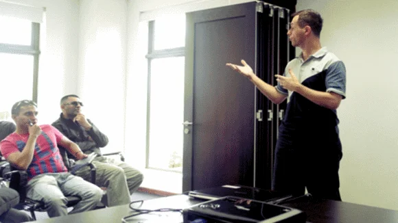
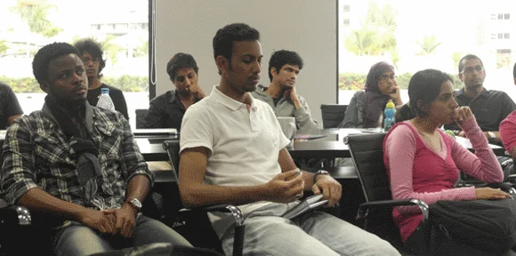

After skipping a monthly meetup back in July it was highly anticipated that [we are going to get together again during August](https://www.meetup.com/MauritiusSoftwareCraftsmanshipCommunity/events/201179772/). And wow, what an experience it has been... Not only the event itself but also the week before, and topics and conversations during the meeting, and the first responses and comments these days. But let's start from the beginning and let me directly announce this: **New Record!**

Yes, we did it once more again, and topped the previous number of attendees. Prior to the meetup we already had 29 member and 3 guest registration, and yesterday we had about **35 IT-loving craftsmen** literally cramped into both meeting rooms at the Ebene Accelerator - Thanks again!

Quite frankly, it was packed early, and new arrivals were still coming. Awesome!

## Meetup announcement: Entrepreneurship and start-up culture (in Mauritius)

Having the idea of starting your business is always a great opportunity. And with the right concepts, perseverance and consistency of doing things, you will likely be successful. But the path to success is full of obstacles and problems to be solved. Just too often it happens that young people fail in their persuade to glory due to small issues not thought about or misleading information.

This month's meetup is about the experience of existing start-ups and recent entrepreneurs here on the island. We are going to have a group of people to report about their journey, to share their knowledge, and to exchange about some nasty issues that might arise on your way to run your own business.

Everyone is largely invited to join our community meetup, and get some inspiration, some answers, and maybe also great ideas for new business opportunities on the way.

Our guest speakers in order of appearance:

- [Paperboat](https://www.paperboat.io/): Rikesh
- [IOS Indian Ocean Software](https://www.ios.mu/): Jochen
- [Shortcut Media](https://www.shortcutmedia.com/): Franco
- [Shoponline.mu](https://www.shoponline.mu): Dhiruj
- [Medine Education Village](https://www.medine.com/education/): Christophe
- [Acharis](https://www.acharis.com): Santosh
- [Pongo Soft](https://pongosoft.com/): Vincent & Louis
- [e.venture](https://www.eventure-international.com/): Ish

As you can see, the meeting was put up with a high emphasis on real world experience and sharing of knowledge. Something surely to talk about and discuss in a room.

## My first thoughts...

Alright, let me quickly note down my first impression of our get-together and then guide you through some of the details:

> *"It was a very interesting monthly meetup and lots of information, different opinions and serious business advice. It was great to see the variety of obstacles faced and managed...*
>
> *And thanks to our mixture of speakers from Mauritius, Switzerland, India, and indirectly from France and Germany at least I had a good insight on various topics, attitudes and recommendations.*
>
> *Looking forward to a follow up on this topic in the near future... Maybe as an Happy Hour at another premise. ;-)"*

Truly, it was a great experience to have this kind of variety in terms of business experience and opinions. I got a lot of new input for my own business at IOS Indian Ocean Software Ltd. and some great advice to follow up during the next couple of weeks.

## Reactions of other attendees

As usual, I'd like to give you feedback from other craftsmen first:

> *"Oh it was very inspiring, learned new Awesome stuffs and enjoy a lot to discover new opportunities, tips and tricks and most of all I got to increase my networking with new guys with crazy horizon :)"* -- Shamsher on event comments
>
> *"Great session - I loved the different perspectives presented today."* -- Dan on event comments
>
> *"This community is doing some Great stuffs and I recommend to any developer to check them out. You have everything to gain from it, nothing to lose I was so focused on the presentations that I just couldn't take more pics"* -- Kevin on Facebook
>
> *"They [Vincent and Louis] stressed on the facilities provided by Ebène Accelerator and how it was relatively easy to set up a business in Mauritius. As at date they have a lot of Mauritian customers and shared tips that should be useful to those wishing to have their startup at the incubator."* -- Ish on [Talks on Entrepreneurship](https://hacklog.in/talks-on-entrepreneurship/)
>
> *"Absolutely awesome guys, very interesting to hear all those opportunities & challenges facing startups in Mauritius."* -- Parvez on event comments
>
> *Overall, I’m glad I attended the session. Clearly, the MSCC is gaining traction! I’ve never seen that conference room so full. Soon, we’ll need a new venue. I’ll be inviting some of my colleagues to more of these sessions later on. I highly recommend them.* -- Sean on [MSCC: Talks on Entrepreneurship](https://seanmangar.com/mscc-talks-on-entrepreneurship/)

Getting such an early (and spontaneous) feedback from our members is just great, and tells me that we really hit a nerve here on the island. The Mauritius Software Craftsmanship Community is steadily growing and until today we have more than 180 registered people. Hopefully, we will be able to cross the 200 before the end of the year.

## Aspects of entrepreneurship (by experience)

Dear reader, the following bullet points are related to the conversations and exchange we had during our meeting and are purely based on subjective experience of each and everyone. I'm trying to sum up some of the more relevant aspects of our various conversations and Q&A sessions. So, please don't take all of this for granted and evaluate some statements clearly as opinions, eventually as some guidance. Now, let the fun begin...

### Gain some experience as an employee first

Through out the bench of guest speakers all of them started as an employee. Except myself, I had to learn it the hard way and went into employment after one year of miserable results in my first company. In general, it is clearly advised by each and every one sharing their experience as a business owner that should get into business as an employee first. See how the real world of labour is ticking, take notes and learn from others experience. Yes, you might argue that it's faster to jump into the pond to learn how to swim but you know there have been cases where people simply drowned.

Of course, you should be selective regarding your first job(s) and take care that you're not working for some miserable low salary but your focus should be learning about customer facing situation, how to deal with contracts and learn about negotiations with your superiors or during meetings with clients.

If you have a look at the big shots of our time, a huge number of founders, CEOs, and managing positions were employees for a couple of years in the first place. In most cases their own business spun off with an idea left unsatisfied by their employer. And that's something you should take into consideration.

### A problem to be solved...

As just mentioned, a lot of company founders develop a business idea based on an existing, real-world problem which hasn't been addressed by anyone else before (or in a very poor, unsatisfying way). This is even more important to recognise when you're about to develop your business around a product or services compared to freelancing. More about that below.

As you might start to work as an employee always keep your eyes open for existing problems. Take customer complains or requests as a source of opportunity. Always remember the following proverb:

> **One man's trash is another man's treasure**

Discovering, exploiting and solving a problem is much likely a permission to print money. Pay attention to what people are saying regarding their problems and surely you'll find a bunch of ideas and business opportunities.

### Communication, communication, and... communication

As a business owner you have to be customer facing and somehow outgoing. If you're an introvert person, please think twice if that's what you're after.

Communication I - You should have the ability to converse with your clients and leads regarding the services and products you're offering in your company. As for speaking to leads you have to be focus on the pitch and be spot-on right about the terms you use. This also depends on the type of audience you're addressing but usually it involves to leave the tech-talk in the lowest drawer at home. Know and learn how to speak business and seize all kind of opportunities to get in touch with people. Keep your perseverance and don't get discouraged on denials. Always keep the conversation on a professional level.

Communication II - Have regular meetings with your partners and team members. It's not about checking on them but to get yourself into the right spot to understand their ideas, perspective and concerns regarding the business in general or specific products. Remember, your own ideas always appear brilliant to yourself but get them validated by others and listen to their feedback. Develop the ability to handle criticism in a positive way because if something has been voiced out there's always a reason to do so, and your own experience is obviously limited to yourself, so take advantage from other people's input and use it as an opportunity to learn, to improve, and to provide a better solution than what you're offering right now.

Communication III - Proper choice of media. Although, it wasn't explicitly mentioned I'd like to add this based on my own way of communicating with my peers, and on recent conversations I had with a good number of contacts in my professional network. Give yourself a guideline regarding your choice and preferred type of communication. Most of the time it should be in a written manner like email or instant messaging, especially when dealing with clients. But sometimes, there are occasions when it is more appropriate to actually pick up the phone (or any voice-based solution) and have a decent one-to-one conversation.

And last but not least keep in touch with your clients irregularly. It's always great to show your appreciation for their business and that you're actually caring about them. And you never know, knocking at someone's door just to say "Hello" might give you opportunities and generate new business, too.

### Lone warrior or team player?

Well, on this aspect we had clearly two parties and opinions...

Personally, I'd recommend to team up with someone you trust and can rely one, but the arguments regarding souvereignty and decision making processes puts some weight on the other side of the equation. Frankly, I'd say this is a very personal decision as it is hard to find the right people to go into business with, especially while founding a start-up and you need to know whether the relationship will make it or break it during tough times, too.

As an entrepreneur you'll have to go extra-miles without any doubts, and you ask yourself whether you have the perseverance to push through it on your own or whether you prefer to have a professional business partner at your side who might be able to literally kick your ass to keep things moving forward. Of course, it's not an easy decision but having a look at some of the most successful companies nowadays might give you a hint (or not) ;-) - Talking about Apple, Google, Facebook, Tesla Motors, LinkedIn, Amazon, Microsoft, etc.

### Get experts on board (from the very beginning)

Despite your initial decision whether you're going to start your business on your own or to team up with another co-founder you should always take care to get a professional from the accounting department and another expert in the legal department into your company. There are a variety of ways on how to achieve that. And quite frankly it doesn't matter how to get them on board but don't proceed without those two essential knowledge assets.

In terms of priority you should get an accountant first, legal support might come into business on its own. But more on that below.

### Freelancing / services or product oriented business?

Whether you are about to start freelancing and offering your resource and knowledge to other people or you're going to develop a set of professional services or products doesn't really matter in terms of starting your own business as long as you're about to solve an existing problem of others. During the various stints of our speakers it was mentioned multiple times that a business is more likely to be focused on a specific field of operations.

Some were addressed by friend or another business owner whether it would be possible to help to improve their workflows with some software to be written, or to spice up someone's online marketing with a newly designed and developed web site, or by providing a shopping experience here on the island. Clearly, there was always a very specific problem that ignited a business idea and then developed into a solution to that.

But you should also take into consideration that your choice of business model has different aspects of revenue. If you're more likely to operate on a freelancing mode you have to take care of acquisition of new clients on a regular base. Meaning you going to spend to good number of hours per day, per week, per month to look out for potential projects and business opportunities. Not only does this reduce your productive time (meaning chargeable to the client) but it might be cumbersome doing it all over again and over a long period of time. Yes, you might start your business based on an initial project or assignment but bear in mind that this assignment is going to be completed and done one day. It's in your responsibility to monitor the market for new projects and keep up a continuous flow of income. If you're more likely to provide a product-oriented solution you might have to face a initiation phase without being able to generate any kind of revenues. Since a couple months (or even years) there is a growing movement towards crowd-founding such product-based solutions.

### Getting more money into the business - Do's and Don'ts

Be truthful, financial aid for your business is always welcoming and it will give you peace of mind. Knowing that there are enough funds on the bank account allows you to focus on your work or product(s), and nurtures your curiousity to delve deeper in some fields of business or technology. Without any source of regular income or proper funding it won't be "fun" to start your business but let's not forget that some great businesses where literally build on nothing.

Okay, let's see what should take into consideration for your business. During the meeting we came across a variety of potential solutions - partly contradictory to each other and served with different levels of experience - positive as well as negative ones.

One argument somehow stood out clearly compared to others: Don't ask your (or any) bank for money.

Although the procedures of writing your business plan, summing up the figures, your estimations on expenses and your predictive forecast on the revenues during the first, second and follow-ups isn't a bad exercise after it remains most commonly an exercise while dealing with the board committees at the bank. Don't get me wrong on this here, yes write a business plan but don't take it to a bank. They literally won't be able to grasp your business idea(s): "They simply don't get it."

Dealing with your bank is inevitable and you clearly should stay in good terms with your account executive but don't put yourself into the hassle and headache of providing them with the details of your business. Competition is everywhere and unfortunately there have been cases of "flattery" here on the island.

What else has been mentioned? Well, some reported of good experience with the local [Mauritius Business Growth Scheme](https://mbgs.gov.mu/English/Pages/default.aspx) (MBGS), about the positive effects of inviting Angel Investors into your business concepts and last but least the collaboration with Venture Capital providers. As for Mauritius, the last two options might be a little bit tricky at the moment but I'm aware that there is a growing interest of foreign investors, especially coming from the U.S.A., in jump-starting or assisting young entrepreneurs.

And the other side there are also options to improve your management of expenses as the Mauritian government has public bodies and institutions in place which can clearly be useful in order to grow your business. One opportunity is related to the [Youth Employment Programme](https://www.yep.mu/) (YEP) which has a database of potential employees for your business. Another way is to get in touch with the Ministry of Finance and Economic Development in Port Louis.

So, despite common understanding that there is hardly any support by the local government our meetup was an eye-opener for a good number of attendees, including myself. For sure, I'll register my business with YEP, and I'm going to propose one or two open positions before the end of the year.

### The importance of a proper cash flow

ALWAYS take care of your income, payment, royalties or whatever source of money for your business first. Your company doesn't operate on love and good promises from your clients but hard cash only. Send out a signal to your clients that you're serious about business and you're a professional company owner. Don't get into any compromises regarding payment from your clients. If it's about new work ask for a certain percentage of down-payment upfront (50% of the total seems to be a common and agreeable condition). Be clear about the payment conditions on your invoices and chase your client immediately when you have suspicions regarding their liquidity.

Remember, you have monthly obligations to fulfill and your business relies on a proper cash-flow and in-time payments from your clients. Some of the speakers could report that businesses went into bankruptcy only due to outstanding payments by their clients. Don't let this happen to you, and get your accounting and legal department cracking on the nuts and bolts of your contracts as well as the proper handling of your reminder system.

Also, if possible (depending on the country) see whether you can run a background on your leads prior to get into business with them. Here in Mauritius companies have to file their annual business reports publicly to the registrar of companies. Once again, leave this kind of work to your professionals in the accounting department.

### Hire slow and the right people

As mentioned above regarding communication it is very essential and vital for your young business to work with the right people on the team. Whether it is with contracted experts like an accountant or a lawyer it is also important to put a high emphasis on your hiring process of UI designers, software developers, or product workers. Having people on the team which are not in the spirit of working in an agile environment of a start-up, or entertaining a so-called "social welfare case" doesn't help to prosper your business. Aux contraire, it's going to slow you down immensely.

Pay attention and put some energy into your hiring process, it won't hurt you at all but provide you the right talent for your company. There are great examples available on the world-wide web for free but I'd like you to read the following blog article ["How to hire a lot of talented people, very quickly"](https://ryancarson.com/post/23990414000/how-to-hire-a-lot-of-talented-people-very-quickly) of Ryan Carson, CEO of Treehouse, explicitly. It was inspiring for me and I set up a similar process using Trello, too.

Yes, you should hire more people but in a steady way, always in regard to your business revenues, and only stock up your staff with people you're sure they can live up to aims of your business.

### Networking - the offline way

Honestly, I can't remember how often we talk about the importance of growing and entertaining a professional network - both online using platforms like [LinkedIn](https://mu.linkedin.com/in/jochenkirstaetter/)or [Xing](https://www.xing.com/profile/Jochen_Kirstaetter)as well as offline by attending any kind of organised events related to business owners. While running a business you have to get the word out that you are actually operational, and of course you have to let people know about the kind of professional services or products you are offering. This is related to self-marketing and you should practice so-called "elevator pitches" prior to going out.

Ask yourself:

- Would you be able to describe and summarize your business in less than 5 seconds?
- Are you able to your profile into one paragraph of 2 to 3 sentences?
- What are the outstanding benefits your business could offer compared to your competition?

If you cannot answer those questions, you should reflect on them and get in better shape for your next get-together with other business people.

## Some visual impressions

Pictures are courtesy of Pritiv and Kevin.

  
*MSCC: Sharing my experience on founding and running a start-up. There have been ups and downs throughout the years.*

  
*MSCC: Crowded audience - we had 35 attendees during our sessions on Entrepreneurship and start-up culture in Mauritius.*

  
*MSCC: Paying close attention to other speakers' experience as entrepreneurs - at least I got quite some new ideas during those couple of hours.*

## Upcoming Events and networking

With such high quality of information and lots of bombshell to talk about and exchange we clearly exceeded our time frame but I'd say it was absolutely worth it. Furthermore, I had the impression that we should have a similar get-together in the near future to continue our intensive conversations.

What are the upcoming events here in Mauritius? So far, we have the following ones (incomplete list as usual) in chronological order:

- [Ubuntu Global Jam - Mauritius](https://loco.ubuntu.com/events/ubuntu-mu/2874-ubuntu-global-jam-mauritius/) (12th of September 2014)
- [36th International Conference of Data Protection and Privacy Commissioners](https://www.privacyconference2014.org/en/) (13 - 16th of October 2014)
- Developers Conference (TBA ~ January 2015)

Hopefully, there will be more announcements during the next couple of weeks and months. If you know about any other event, like a bootcamp, a code challenge or hackathon here in Mauritius, please drop me a note in the comment section below this article. Thanks!

## My resume of the day

> **Get some real world experience first, build a network of professional contacts, and then think about doing your own business!**

Seriously, even though the idea of starting a business right after graduation might be tempting, take into consideration that there's a lot to learn and it's definitely not the "big bucks" you should be after. Building your own company takes a lot of energy and investment in terms of time and money. Better to be prepared (at least a bit) than to run into some dumb mistakes thousands of others have already been through. Be smart, learn from others' experience, team up in start-up if you prefer a more flexible life-style.

Despite the level of self-marketing of some of our speakers there was huge amount of information regarding tips and advice for future business owners. And there were a good number of hiring opportunities, too. Almost everyone was mentioning that they are having open positions. I guess that's one of the cool aspects during our meetups, isn't it?

And.... special thanks to Santosh Achari to provide his laptop for the various presentations.

Reminder to myself: Bring the DisplayPort-VGA and HDMI-VGA adapters next time...
