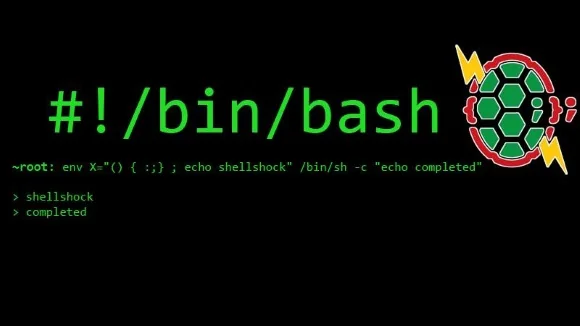

The media coverage related to vulnerabilities in Linux has been quite immense lately.

After Heartbleed during the early months of 2014, we had a second major wave of problems based on a very old "feature" in the commonly used bash - Bourne Again Shell - on Linux- and BSD-based systems including Mac OS X. Well, there has been quite some activities and controversial discussion around this feature but it was obvious that it could be exploited and therefore a fix had to be done. Taking into consideration that there are literally millions of systems connected on the internet which are based on a Linux or BSD system, this obviously isn't a quick and easy task to improve.

This month's meetup was organised in a joint-venture between the [MSCC](https://www.meetup.com/MauritiusSoftwareCraftsmanshipCommunity/events/213985442/), the [LUGM](https://lugm.org), the UoM CC and we settled down at the University of Mauritius. Thanks to the organisers and it was again a great experience to be on the campus of Mauritius.

## Shellshock: Survival Guide

The[event was originally created on Facebook](https://www.facebook.com/events/339374606233469/), and at the MSCC we simply picked it in order to attract more people for the meeting. Well, despite the hundreds of "Event Go'ers" on Facebook we were roughly **24 people** that came together. The provided room 1.14 was big enough for everyone, and eventually we might be able to use this space on a regular base.. to be confirmed. ;-)

## My point of view

Well... it's best to simply voice it out:

> *"Despite the technical background of Shellshock there was simply too much distraction and too many discussions going on during the meeting. I found it kind of chaotic and non-informative...*
>
> *Somehow I expected a bit more regarding immediate corrections, advice on how to write better scripts and eventually something related to hardening an OS regarding bash, scripting languages and user-space applications on various Linux distributions, and Mac OS X."*

Quite frankly, I was kind of disappointed by the lack of practical guidance. I mean... "survival guide" would implicate that you'll learn something to take home or back to the office, and to apply to your web server or office systems, or that you could integrate in your coding efforts in order to improve your skills and to reduce the risk of a system exploitation, don't you agree?

Actually, I thought about my statement for some time, but it didn't come out better than this. Yes, I learned about the implications why shellshock is dangerous and that there are patched versions of all major distributions available but apart from that.... I didn't learn anything new in order to be better aware of such situation or to avoid it completely.

  
*MSCC meetup: Discussion about the bash shellshock vulnerability and practical advice to secure your systems.*

## Reactions of other attendees

Some other bloggers already put their thoughts online...

- [Nitin - ShellShock - Le guide de survivre](https://www.darkxploit.us/shellshock-le-guide-pour-survivre/)
- [Ish - Shellshock: A survival guide](https://hacklog.in/shellshock-a-survival-guide/)

Both very informative regarding the events as they happened but same like own observation there's clearly a lack of guidance after all.

## Upcoming Events and networking

We are closing in on year's end and the advertisement for End of Year party venues is increasing. Well' at the MSCC we are already planning our second Christmas activities, too. What are the upcoming events here in Mauritius? So far, we have the following ones (incomplete list as usual) in chronological order:

- [The Hour of Code](https://code.org/ "The Hour Of Code") (8th - 14th December - Global event)

Hopefully, there will be more announcements during the next couple of weeks and months. If you know about any other event, like a bootcamp, a code challenge or hackathon here in Mauritius, please drop me a note in the comment section below this article. Thanks!

## My resume of the day

> **Discussed, dusted and off to new discoveries!**

This month's event was interesting and although there was no actual "survival guide" it is good to see that the awareness in Mauritian IT is growing, especially among students. Nowadays, you can't effort to put on blinders and pretend that your operating system is all safe and secure. It's your continuous responsibility to follow security advisory bulletins and to improve your skills in IT - and it doesn't matter whether you're a system administrator, a software developer, or a passionate web developer. With the increasing amount of Internet of Things (IoT) security, safety and privacy is an ongoing process. Don't just kick back and relax, the next big bang is lurking around the corner - for sure... ;-)