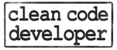
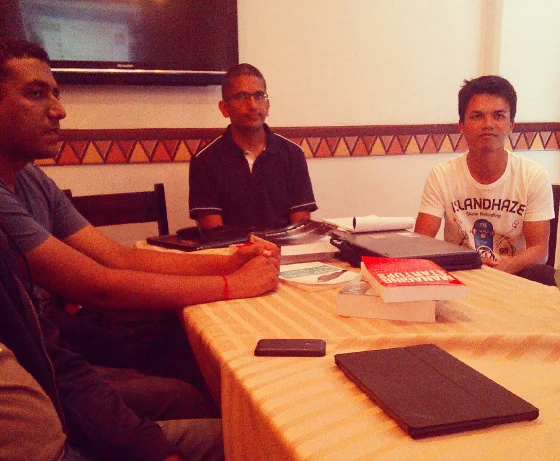
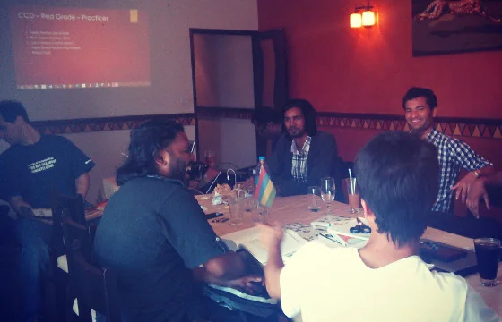
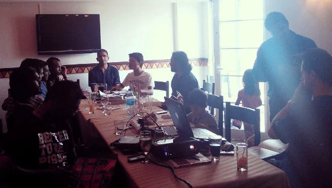

It was a very busy weekend this time, and quite some hectic to organise the second meetup on a Saturday for the Mauritius Software Craftsmanship Community (MSCC) but it was absolutely fun. Following, I'm writing a brief summary about the topics we spoke about and the new impulses I got.

> *"What a meetup... I was positively impressed. At the beginning I thought that noone would actually show up but then by the time the room got filled. Lots of conversation, great dialogues and fantastic networking between fresh students, experienced students, experienced employees, and self-employed attendees. That's what community is all about!"*

Above quote was my first reaction shortly after the gathering. And despite being busy during the weekend and yesterday, I took my time to reflect a little bit on things happened and statements made before writing it here on my blog. Additionally, I was also very curious about possible reactions and blogs from other attendees.

## Reactions from other craftsmen

Let me quickly give you some links and quotes from others first...

> *"Like Jochen posted on facebook, that was indeed a 5+ hours marathon (maybe 4 hours for me but still) … Wohoo! We’re indeed a bunch of crazy geeks who did not realise how time flew as we dived into the myriad discussions that sprouted. Yet in the end everyone was happy (:"* -- Ish on [MSCC meetup - The marathon (:](https://hacklog.in/mscc-meetup-the-marathon/ "MSCC meetup - The marathon (:")
>
> *"And the 4hours spent @ Talking drums bore its fruit..I was doing something I never did before....reading the borrowed book while walking....and though I was not that familiar with things mentionned in the book...I was skimming,scanning & flipping...reading titles...short paragraphs...and I skipped pages till I reached home."* -- Yannick on [Mauritius Software Craftsmanship 1st Meet-up](https://yanoush.livejournal.com/656.html "Mauritius Software Craftsmanship 1st Meet-up")
>
> *"Hi Developers, Just wanted to share with you the meetups i attended last Saturday - [...] - The second meetup is the one hosted by Jochen Kirstätter, the MSCC, where the attendees were Craftsman, no woman, this time - all sharing the same passion of being a developer - even though it is on different platforms(Windows - Windows Phone - Linux - Adobe(yes a designer) - .Net) - but we manage to sit at the same table - sharing developer views and experience in the corporate world - also talking about good practice when coding( where Jochen initiated a discussion on Clean Coding ) i could not stay till the end - but from what i have heard - the longer you stay the more fun you have till 1600. Developers in the Facebook grouping i invite you to stay tuned about the various developer communities popping up - where you can come to share and learn good practices, develop the entrepreneurial spirit, and learn and share your passion about technologies"* -- Arnaud on Facebook

More feedback has been posted [on the event directly](https://www.meetup.com/MauritiusSoftwareCraftsmanshipCommunity/events/138294392/ "Feedback on meeting of the MSCC - 21.09.2013"). So, should I really write more? Wouldn't that spoil the impressions?

## Starting the day with a surprise

Indeed, I was very pleased to stumble over the existence of [Mobile Monday Mauritius](https://www.mobilemonday.mu/ "Mobile Monday Mauritius") on LinkedIn, an association about any kind of mobile app development, mobile gadgets and latest smartphones on the market. Despite the Monday in their name they had scheduled their recent meeting on Saturday between 10:00 and 12:00hrs. Wow, what a coincidence! Let's grap the bull by its horns and pay them an introductory visit. As they chose the Ebene Accelerator at the Orange Tower in Ebene it was a no-brainer to leave home a bit earlier and stop by. It was quite an experience and fun to talk to the geeks over there. Really looking forward to organise something together....

## Arriving at the venue

As the children got a bit uneasy at the MoMo gathering and I didn't want to disturb them too much, we arrived early at Bagatelle. Well, no problems as we went for a decent breakfast at Food Lover's Market. Shortly afterwards we went to our venue location, Talking Drums, and prepared the room for the meeting. We only had to take off a repro-painting of the wall in order to have a decent area for the projector. All went very smooth and my two little ones were of great help. Just in time, our first craftsman Avinash arrived on the spot. And then the waiting started...

Luckily, not too long. Bit by bit more and more IT people came to join our meeting. Meanwhile, I used the time to give a brief introduction about the MSCC in general, what we are (hm, maybe I am) trying to achieve and that the recent phase is completely focused on creating more awareness that a community like the MSCC is active here in Mauritius. As soon as we reached some 'critical mass' of about ten people I asked everyone for a short introduction and bio, just in case... Conversation between participants started to kick in and we were actually more networking than having a focus on our topics of the day.

 *  
Quick updates on latest news and development around the MSCC*

## Finally, Clean Code Developer

No matter how the position is actually called, whether it is Software Engineer, Software Developer, Programmer, Architect, or Craftsman, anyone working in IT is facing almost the same obstacles. As for the process of writing software applications there are re-occurring patterns and principles combined with some common exercise and best practices on how to resolve them. Initiated by the must-read book 'Clean Code' by Robert C. Martin (aka Uncle Bob) the concept of the [Clean Code Developer (CCD)](https://www.clean-code-developer.com/ "Clean Code Developer (CCD)") was born already some years ago. CCD is much likely to traditional martial arts where you create awareness of certain principles and learn how to apply practices to improve your style.

The CCD initiative recommends to indicate your level of knowledge and experience with coloured wrist bands - equivalent to the belt colours - for various reasons. Frankly speaking, I think that the biggest advantage here is provided by the obvious recognition of conceptual understanding. For example, take the situation of a team meeting... A member with a higher grade in CCD, say Green grade, sees that there are mainly Red grades to talk to, and adjusts her way of communication to their level of understanding. The choice of words might change as certain elements of CCD are not yet familiar to all team members. So instead of talking in an abstract way which only Green grades could follow the whole scenario comes down to Red grade level. Different story, better results...

Similar to learning martial arts, we only covered two grades during this occasion - black and red. Most interestingly, there was quite some positive feedback and lots of questions about the principles and practices of the red grade. And we gathered real-world examples from various craftsman and discussed them. Following the Clean Code Developer Red Grade and some annotations from our meetup:

### CCD Red Grade - Principles

- Don't Repeat Yourself - DRY
- Keep It Simple, Stupid (and Short) - KISS
- Beware of Optimisations!
- Favour Composition over Inheritance - FCoI

Interestingly most of the attendees already heard about those key words but couldn't really classify or categorize them. It's very similar to a situation in which you do not the particular for a thing and have to describe it to others... until someone tells you the actual name and suddenly all is very simple.

### CCD Red Grade - Practices

- Follow the Boy Scouts Rule
- Root Cause Analysis - RCA
- Use a Version Control System
- Apply Simple Refactoring Pattern
- Reflect Daily

 *  
Introduction to the principles and practices of Clean Code Developer - here: Red Grade*

As for the various ToDo's we commonly agreed that the Boy Scout Rule clearly is not limited to software development or IT administration but applies to daily life in general. Same for the root cause analysis, btw. We really had good stories with surprisingly endings and conclusions. A quick check about who is using a version control system brought more drive into the conversation. Not only that we had people that aren't using any VCS at all, we also had the 'classic' approach of backup folders and naming conventions as well as the VCS 'junkie' that has to use multiple systems at a time. Just for the records: Git and GitHub seem to be in favour of some of the attendees. Regarding the daily reflection at the end of the day we came up with an easy solution: Wrap it up as a blog entry!

## Certifications in IT

This is kind of a controversy in IT in general. Is it interesting to go for certifications or are they completely obsolete? What are the possibilities to get certified? What are the options we have in Mauritius? How would certificates stand compared to other educational tracks like Computer Science or Web Design.  
The ratio between craftsmen with certifications like MCP, MSTS, CCNA or LPI versus the ones without wasn't in favour for the first group but there was a high interest in the topic itself and some were really surprised to hear that exam preparations are completely free available online including temporarily voucher codes for either discounts or completely free exams. Furthermore, we discussed possible options on forming so-called study groups on a specific certificates and organising more frequent meetups in order to learn together. Taking into consideration that we have sponsored access to the video course material of Pluralsight (and now PeepCode as well as TrainSignal), we might give it a try by the end of the year. Current favourites are LPIC Level 1 and one of the Microsoft exams 40-78x.  
## Feedback and ideas for the MSCC

The closing conversations and discussions about how the MSCC is recently doing, what are the possibilities and what's (hopefully) going to happen in the future were really fertile and I made a couple of mental bullet points which I'm looking forward to tackle down together with orher craftsmen. Eventually, it might be a good option to elaborate on some issues during our weekly Code & Coffee sessions one Wednesday morning.

 *  
Active discussion on various IT topics like certifications (LPI, MCP, CCNA, etc) and sharing experience  
*

Finally, we made it till the end of the planned time. Well, actually the talk was still on and we continued even after 16:00hrs. Unfortunately, we (the children and I) had to leave for evening activities.

## My resume of the day...

It was great to have 15 craftsmen in one room. There are hundreds of IT geeks out there in Mauritius, and as Mauritius Software Craftsmanship Community we still have a lot of work to do to pass on the message to some more key players and companies. Currently, it seems that we are able to attract a good number of students in Computer Science... but we have a lot more to offer, even or especially for IT people on the job.

I'm already looking forward to our next Saturday meetup in the near future.

PS: Meetup pictures are courtesy of [Nirvan Pagooah](https://www.nirvan.pagooah.com/ "Nirvan Pagooah"). Thanks for sharing...