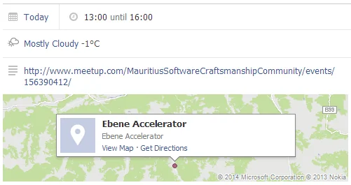
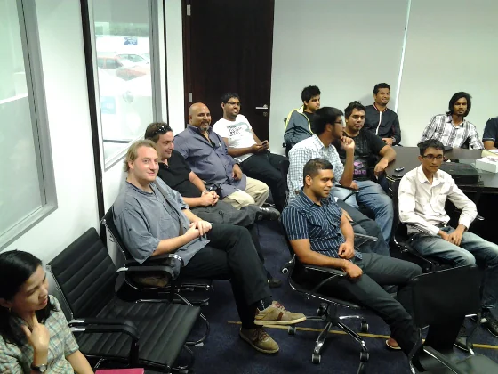
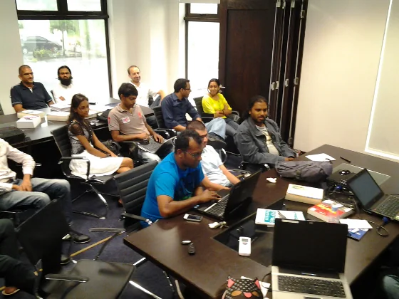
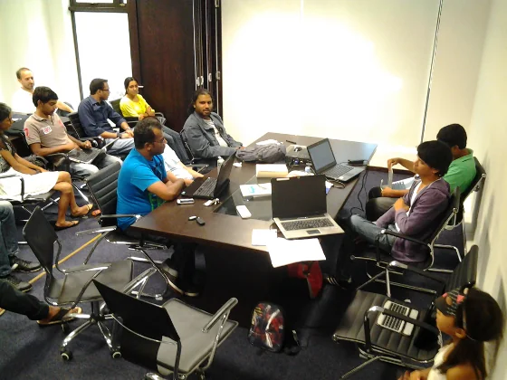
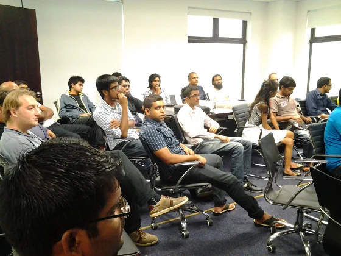

Today's [meetup](https://www.meetup.com/MauritiusSoftwareCraftsmanshipCommunity/events/156390412/) has been an interesting experience for me... for two reasons actually. First, I have to be more active with our craftsmen, especially with our speakers of the day. And second, we definitely need more space. Even both conference rooms together at the Ebene Accelerator are not enough anymore for our monthly meetings. We set a new record: 27 attendees!

Following my impression on today's event:

> *"Good to see new craftsmen and regular attendees during our meetups. Especially on Saturdays, we are getting more people together and it is improving from month to month. Despite having some initial start problems today, it was a good get-together and with our three speakers we had quite a good opportunity to learn things. Surely, there is still room for improvement. We are working hard on that...*
>
> *I was very pleased to have our guest speaker today! Even though I was a bit occupied with other networking related topics for our future meetings."*

I'm really really glad and grateful about the growing interest in our community. Thanks guys, you rock!

## Prediction of harsh weather conditions

  
*Harsh weather conditions have been predicted by Facebook for our monthly meetup... even probability of snow!*

## Reactions from other craftsmen

None yet... to be updated soon ;) Finally, a little slot of spare time to gather some impressions from other attendees...

> *"I'd rather prefer having two versions of a website, one adapted for desktop screen and the other for mobile. When creating responsive pages, I believe quite some space is lost."* -- Ish on [MSCC, a growing army](https://hacklog.in/mauritius-software-craftsmanship-community-meetup-25-01-2014-presentations-on-web-development-tools-and-responsive-web-design/)
>
> *"Ensuite, Andrew a fait une brève introduction sur lui-même et les perspectives sur le marché mauricien, les perspectives au niveau international et le niveau des salaires."* -- Nitin on [L'équipe #MSCC #LUGM s'unissent à Ebene Accelerator](https://www.darkxploit.us/?p=253)

In general, I have the impression that we are on the right way. Our future looks bright!

## ICT scene from the view of an HR person

Thankfully, [Andrew Ragaven](https://mu.linkedin.com/pub/andrew-ragaven/1b/691/b54 "Andrew Ragaven's profile on LinkedIn") gave me a helping hand and not only introduced himself as a Human Resources (HR) and Administration Manager or Talent Acquisition Specialist - depending on how you'd like to see it. Anyway, he had some great pieces of information about the local ICT scene in comparison to the rest of world. According to his estimation there are currently 15,000 people in ICT in Mauritius, and there is still more demand for resources in general but also - IMHO more alarming - a demand for better qualified people.

During and after his brief introduction a couple of questions directly came up and it was really nice to see that he might have hit something here. Dhiruj gave great advise to candidates based on his work experience back in the UK, and I could also add my experience with candidates to this.

But... the essential information hereby remains that it seems that the local work force is provided under value compared to other nations. Very interesting indeed, given the aspect that we already spoke about freelancing and hourly rates in past meetups.

## Preprocessors and some nifty tools for writing HTML

Although, this topic was planned as a follow-up to the introduction to HTML5, our both guest speakers swapped their slots and Sun started today's technical part of day.

As already stated, I wasn't around during the session - active networking with someone at the Ebene Accelerator which is responsible for regional events and activity organisation in the Indian Ocean. I'll catch up on that after the scheduled meeting with her.

Anyway, I'm looking forward to get the presentation from Sun, and I'm going to publish it here, too.

And here we go... The slides are hosted on [Prezi: Tools for better web development](https://prezi.com/01lxkj07dbnz/tools-for-better-web-development/ "Tools for better web development"):

<iframe src="https://prezi.com/embed/01lxkj07dbnz/?bgcolor=ffffff&amp;lock_to_path=0&amp;autoplay=0&amp;autohide_ctrls=0&amp;features=undefined&amp;disabled_features=undefined" width="550" height="400" frameborder="0" webkitallowfullscreen="" mozallowfullscreen="" allowfullscreen="true"></iframe>

## Responsive Web Development (RWD)

Did I mention that the begin of this meeting was kind of tough for me? Oh yes ;-)  
Well, Mozammil came a bit later than expected but I grateful that he didn't cancel in the last minute.

I'm going to provide the presentation ASAP. Meanwhile, please check out [Mozammil's blog](https://moz.im "Mozammil's blog"). It has some great information on performance improvements of web sites.

Interesting side note from Nadim:

> *"And dear students (and perhaps professionals). Remember [www.w3fools.com](https://www.w3fools.com "www.w3fools.com") and forget w3schools.com"*

## Events

What are the upcoming events here in Mauritius? So far, we have the following ones (incomplete list as usual) in chronological order:

- [Corsair Hackers Reboot](https://www.facebook.com/events/576483672434412/ "Corsair Hackers Reboot") (8.2.2014)
- Code Challenge (TBA ~ Feb 2014)
- Innovation Day(s) (4.4.2014)
- WebCup (TBA ~ June 2014)
- Developers Conference (TBA ~ July 2014)
- Linuxfest 2014 (TBA ~ November 2014)

Hopefully, there will be more announcements during the next couple of weeks and months. One of the hottest candidates that I would like to have here in Mauritius would be Microsoft BootCamp and Windows 8.1 and/or Windows Phone 8 development. Let's what Microsoft is going to pull off this year. Hm, which reminds me that there will be the launch event of SQL Server 2014...

## Networking and job/project opportunities

Due to our first timers there was again some good possibilities to exchange a couple of contact information and once again we came across the important aspect to promote yourself online. Setup a personal website, use it as your online CV / resume, and write a technical article about your work or private IT activities from time to time. It was really pleasant to have Louis around today. Some month back I got a request from his friend Vincent that he is actually looking for a job as Web Developer in Mauritius. Having no open position at IOS Indian Ocean Software Ltd. I passed his contacts via the #MSCC social media channels.

Also, please don't forget to get in touch with the Ebene Accelerator for their demand on web development.

Following some pictures from today's event:

  
*MSCC meetup of 25.01.2014: Craftsmen listing to the presentation on Responsive Web Development (RWD)*

  
*MSCC meetup of 25.01.2014: More craftsmen occupying the conference rooms of Ebene Accelerator*

  
*MSCC meetup of 25.01.2014: Our usual outfit during our gatherings... laptops, smartphones and books everywhere*

  
*MSCC meetup of 25.01.2014: We need more space! Today, there were 27 (+2) attendees...*

## My resume of the day

> **We need more space!**

Frankly speaking, it is now more than obvious that we are exceeding the capacity of the Ebene Accelerator. Which is very good on the one hand and hopefully will give us more room in future meetings but also a bit sad as we received great support from the beginning. Some of our craftsmen even applied at the accelerator with newly created startup companies.