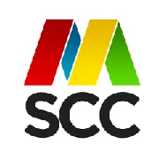
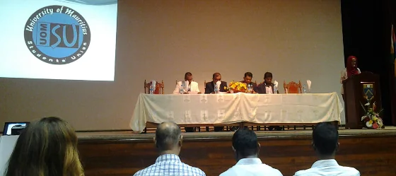
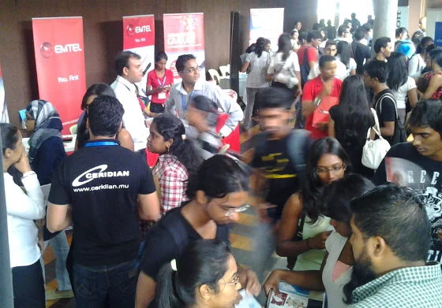

Already a couple of weeks ago, I've been addressed by Ibraahim and Yunus to see whether it would be interesting to participate in the 1st [Career & IT Fair organised by the UoM Computer Club](https://www.facebook.com/events/294960053999856/). Well, luckily we met at the [Global Windows Azure Bootcamp](xref:mscc-global-windows-azure-bootcamp "Global Windows Azure Bootcamp") and I wasn't too sure whether it would be possible for me to attend after all. The main reason is given because of work demand and furthermore due to the fact that the [Mauritius Software Craftsmanship Community](https://www.meetup.com/MauritiusSoftwareCraftsmanshipCommunity/ "Mauritius Software Craftsmanship Community") currently has no advertising material at all.

Here's the brief statement of the event:

> *"The UOM Students' Computer Club in collaboration with the UOM Students' Union and UOM CSE Department is organising a 'Career & IT Fair' on the 23rd and 24th April 2014. This event has for objective to provide a platform to tertiary students, secondary students as well as vocational students, the opportunity to meet job recruiters."*

Luckily, I was reminded that the 23rd is a Wednesday, and therefore I decided that it might be interesting to move our weekly Code & Coffee session to the university and hence be able to attend the career fair. As it turned out it was a great choice and thankfully Pritvi, Nadim as well as Ishwon volunteered to be around at the "community booth". Thankfully, the computer club gave us - the MSCC and the [LUGM](https://lugm.org) - one of their spaces in the lobby area of the Paul Octave Wiéhé Auditorium.

## My impression about the event

**Very well and professionally organised.**

Seriously, the lads over at the UoM Computer Club did a great job in organising their 2 days event, and felt very comfortable at any time. Actually, it was kind of amusing to some of the members constantly running around and checking everything. Even though that the whole process went smooth and easy off the hand.

There were a couple of interesting pieces of information and announcements during the opening ceremony. For example, the Computer Science faculty is a very young one and has been initiated back in 1988 only - just by 4 staff members at that time. Now, after 25 years they have achieved quite a lot and there are currently 1.000+ active students attending the numerous lectures and courses. But there is no room to rest on previous achievements, and I was kind of surprised to hear that there are plans to extend the campus, and offer new lectures in the fields of nanotechnology, big data handling, and - crossing fingers - the introduction and establishment of a space control centre. Mauritius is already part of the [Square Kilometre Array (SKA)](https://en.wikipedia.org/wiki/Square_Kilometre_Array "The Square Kilometre Array (SKA) is a radio telescope in development") and hopefully there will be more activities into that direction in the near future.

## Community - Awareness and collaboration

As stated earlier, I could only spent one morning but luckily other members of the MSCC and the LUGM stayed during the whole two days and provided answers to any interested person. As for me, I took the opportunity to get in touch with the other companies in the lobby. Mainly, to create some awareness about our IT communities but also to see whether there might be options for future engagement in common activities, too. So far, I was able to speak to representatives of the following companies:

- ACCA Mauritius
- Business at Work
- Infomil
- LinkByNet
- Microsoft Indian Ocean Islands & French Pacific
- Spherinity Training Institute
- Spoon Consulting Ltd.
- State Informatics Ltd.

Unfortunately, I only had a quick chat with an HR representative of LinkByNet but I fully count on our MSCC members like Nitin or LUGM member Ronny to spread our intentions over there.

So far, all of the representatives were really interested in our concepts and activities and I'm currently catching up with an introduction flyer for the MSCC that I'm going to send out to all those contacts via mail. It would be great to have more craftsmen as well as professional support on board.

## Some pictures from the event

  
*MSCC: Fantastic outlook for the near future. Announcements were made on Big data, nanotechnology, and space control centre in Mauritius. Interesting!*

  
*MSCC: The lobby area was cramped with students. Great way to exchange and network. Good luck to all candidates!*

## Passing the relay staff to...

I recommend you to continue to read about the [first Career & IT Fair on Ish's blog](https://hacklog.in/uom-computer-club-career-it-fair-2014/ "first Career & IT Fair on Ish's blog"). He has a great summary and more details on those two days of IT activities than I have. Thanks and feel free to leave a comment (or two)...