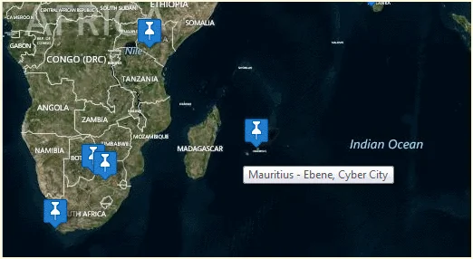

The Mauritius Software Craftsmanship Community proudly presents you the Global Windows Azure Bootcamp 2014 in Mauritius.

  
*Global Windows Azure Bootcamp 2014 in Mauritius - MSCC together with Microsoft, Ceridian and Emtel*

We are very happy and excited about our participation in this global event and would like to draw your attention to the official invitation letter below. Please sign up and RSVP on the official website of the MSCC. Participation is for free!

## Call for action

Please create more awareness of this event in Mauritius and use the hash tag [#gwabmru](https://x.com/search?q=%23gwabmru "Use our event hash tag #gwabmru on social media networks.") as well as the shortened link: [https://aka.ms/gwabmru](https://aka.ms/gwabmru)

And remember: **Sharing is Caring!**

## Official invitation letter to the GWAB 2014 in Mauritius

**With over 130 confirmed locations around the globe, the Global Windows Azure Bootcamp is going to be a truly memorable event - and now here's your chance to take part!**

In April of 2013 we held the [first Global Windows Azure Bootcamp](https://global.windowsazurebootcamp.com/wp-content/uploads/2013/12/Global-Windows-Azure-Bootcamp-2013.pdf) at [more than 90 locations](https://global.windowsazurebootcamp.com/?page_id=3522) around the globe! This year we want to again offer up a **one day deep dive class to help thousands of people get up to speed on discovering Cloud Computing Applications for Windows Azure**. In addition to this great learning opportunity the **hands on labs** will feature pooling a **huge global compute farm** [**to perform diabetes research**](https://global.windowsazurebootcamp.com/charity)!

In Mauritius, the event will be organised by [Microsoft Indian Ocean Islands & French Pacific](https://www.microsoft.com/worldwide/phone/contact.aspx?country=Indian%20Ocean%20Islands) in partnership with The [Mauritius Software Craftsmanship Community](https://www.meetup.com/MauritiusSoftwareCraftsmanshipCommunity/) (MSCC) and sponsored by Microsoft, [Ceridian](https://www.ceridian.mu/) and [Emtel](https://www.emtel.com).

## What do I need to bring?

You will need to bring your own computer which can run Visual Studio 2012 or 2013 (i.e. Windows, OSX, Ubuntu with virtualization, etc.) and have it **preloaded** with the following:

- **Visual Studio 2012 or 2013**
- **The Windows Azure SDK** - [https://www.windowsazure.com/en-us/develop/net/](https://www.windowsazure.com/en-us/develop/net/)

Optionally (or if you will not be doing just .NET labs), the following can also be installed:

- **Node.js SDK** - [https://www.windowsazure.com/en-us/develop/nodejs/](https://www.windowsazure.com/en-us/develop/nodejs/)
- **JAVA SDK** - [https://www.windowsazure.com/en-us/develop/java/](https://www.windowsazure.com/en-us/develop/java/)
- **Doing mobile?** Android? iOS? Windows Phone or Windows 8? - [https://www.windowsazure.com/en-us/develop/mobile/](https://www.windowsazure.com/en-us/develop/mobile/)
- **PHP** - [https://www.windowsazure.com/en-us/develop/php/](https://www.windowsazure.com/en-us/develop/php/)

More info here: [https://www.windowsazure.com/en-us/documentation](https://www.windowsazure.com/en-us/documentation)

**Important:** Please do the installation upfront as there will be very little time to troubleshoot installations during the day.
