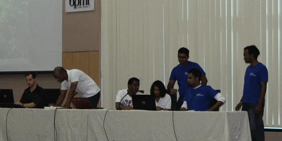
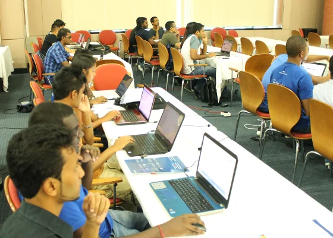
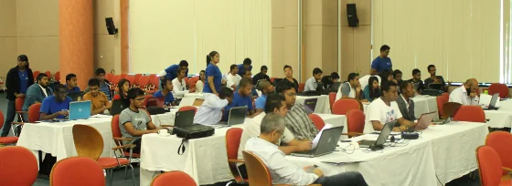
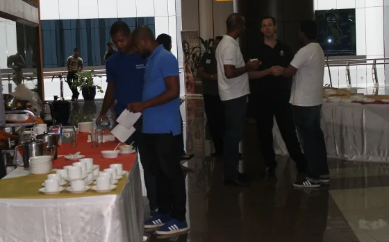
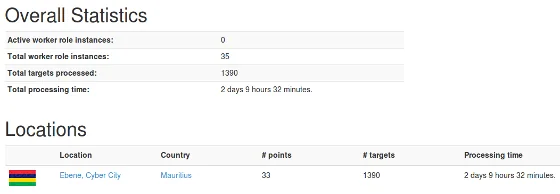

Mauritius participated and contributed to the [Global Windows Azure Bootcamp 2014 (GWAB)](https://www.meetup.com/MauritiusSoftwareCraftsmanshipCommunity/events/160871862/ "Global Windows Azure Bootcamp 2014 (GWAB)"). Again! And this time stronger than ever, and together with 137 other locations in 56 countries world-wide.

We had 62 named registrations, 7 guest additions and approximately 10 offline participants prior to the event day. Most interestingly the organisation of the GWAB through the [MSCC](https://www.meetup.com/MauritiusSoftwareCraftsmanshipCommunity/ "MSCC") helped to increased the number of craftsmen.

> **The Mauritius Software Craftsmanship Community has currently 138 registered members - in less than one year!**

Only with those numbers we can proudly say that all the preparations and hard work towards this event already paid off. Personally, I'm really grateful that we had this kind of response and the feedback from some attendees confirmed that the MSCC is on the right track here on Cyber Island Mauritius.

Inspired and motivated by the success of this event, rest assured that there will be more public events like the [GWAB](https://global.windowsazurebootcamp.com/ "Global Windows Azure Bootcamp").

This time it took some time to reflect on our meetup, following my first impression right on spot:

> *"Wow, what an experience to organise and participate in this global event. Overall, I've been very pleased with the preparations and the event itself. Surely, there have been some nicks that we have to address and to improve for future activities like this. Quite frankly, we are not professional event organisers (not yet) but we learned a lot over the past couple of days.*
>
> *A big Thank You to our event sponsors, namely [Microsoft Indian Ocean Islands & French Pacific](https://www.microsoft.com/worldwide/phone/contact.aspx?country=Indian%20Ocean%20Islands "Microsoft Indian Ocean Islands & French Pacific"), [Ceridian Mauritius](https://www.ceridian.mu/ "Ceridian Mauritius") and [Emtel](https://www.emtel.com/ "Emtel"). Without them this event wouldn't have happened - Thank You!*
>
> *And to the cool team members of Microsoft Student Partners (MSPs). You geeks did a great job! Thanks!"*

So, how many attendees did we actually have? **61! - Awesome** - 61 cloud computing instances to help on the [research of diabetes](https://global.windowsazurebootcamp.com/charity/ "research of diabetes").

During Saturday afternoon there was even an online publication on L'Express: [Les développeurs mauriciens se joignent au combat contre le diabète](https://www.lexpress.mu/article/les-developpeurs-mauriciens-se-joignent-au-combat-contre-le-diabete "Les développeurs mauriciens se joignent au combat contre le diabète")

## Reactions of other attendees

Don't take my word for granted... Here are some impressions and feedback from our participants:

> *"Awesome event, really appreciated the presentations :-)"* -- Kevin on event comments
>
> *"very interesting and enriching."* -- Diana on event comments
>
> *"#gwab #gwabmru 2014 great success. Looking forward for gwab 2015"* -- Wasiim on Twitter
>
> *"Was there till the end. Awesome Event. I'll surely join upcoming meetup sessions :)"* -- Luchmun on event comments
>
> *"#gwabmru was not that cool. left early"* -- Mohammad on Twitter

The overall feedback is positive but we are absolutely aware that there quite a number of problems we had to face. We are already looking into that and ideas / action plans on how we will be able to improve it for future events.

## The sessions

We started the day with welcoming speeches by Thierry Coret, Sr. Marketing Manager of Microsoft Indian Ocean Islands & French Pacific and Vidia Mooneegan, Managing Director and Sr. Vice President of Ceridian Mauritius. The clear emphasis was on the endless possibilities of cloud computing and how it can enable any kind of sectors here in the country.

Then it was about time to set up the cloud computing services in order to contribute each attendees cloud computing resources to the global research of diabetes, a step by step guide presented by Arnaud Meslier, Technical Evangelist at Microsoft. Given a rendering package and a configuration file it was very interesting to follow the single steps in Windows Azure. Also, during the day we were not sure whether the set up had been correctly, as Mauritius didn't show up on the results board - which should have been the case after approximately 20 to 30 minutes. Anyways, let the minions work...

Next, Arnaud gave a brief overview of the variety of services Windows Azure has to offer. Whether you need a development environment for your websites or mobiles app, running a virtual machine with your existing applications or simply putting a SQL database online. No worries, Windows Azure has the right packages available and the online management portal is really easy t handle.

After this, we got a little bit more business oriented while Wasiim Hosenbocus, employee at Ceridian, took the attendees through the inerts of a real-life application, and demoed a couple of the existing features. He did a great job by showing how the different services of Windows Azure can be created and pulled together.

After the lunch break it is always tough to keep the audience awake... And it was my turn. I gave a brief overview on operating and managing a SQL database on Windows Azure. Well, there are actually two options available and depending on your individual requirements you should be aware of both. The simpler version is called SQL Database and while provisioning only takes a couple of seconds, you should take into consideration that SQL Database has a number of constraints, like limitations on the actual database size - up to 5 GB as web edition and up to 150 GB maximum as business edition -, among others.

Next, it was Chervine Bhiwoo's session on Windows Azure Mobile Services. It was absolutely amazing to see that the mobiles services directly offers you various project templates, like Windows 8 Store App, Android app, iOS app, and even Xamarin cross-platform app development. So, within a couple of minutes you can have your first mobile app active and running on Windows Azure. Furthermore, Chervine showed the attendees that adding another user interface, like Web Sites running on ASP.NET MVC 4 only takes a couple of minutes, too.

And last but not least, we rounded up the day with Windows Azure Websites and hosting of Virtual Machines presented by some members of the local Microsoft Students Partners programme. Surely, one of the big advantages using Windows Azure is the availability of pre-defined installation packages of known web applications, like WordPress, Joomla!, or Ghost. Compared to running your own web site with a traditional web hoster it is surely en par, and depending on your personal level of expertise, Windows Azure provides you more liberty in terms of configuration than maybe a shared hosting environment. Running a pre-defined web application is one thing but in case that you would like to have more control over your hosting environment it is highly advised to opt for a virtual machine. Provisioning of an Ubuntu 12.04 LTS system was very simple to do but it takes some more minutes than you might expect. So, please be patient and take your time while Windows Azure gets everything in place for you. Afterwards, you can use a SecureShell (ssh) client like Putty in case of a Linux-based machine, or Remote Desktop Services when operating a Windows Server system to log in into your virtual machine.

At the end of the day we had a great Q&A session and we finalised the event with our raffle of goodies. Participation in the raffle was bound to submission of the session survey and most gratefully we had a give-away for everyone. What a nice coincidence to finish of the day.

**Note:** All session slides (and demo codes) will be made available on the MSCC event page. Please, check the Files section over there.

## (Some) Visual impressions from the event

Just to give you an idea about what has happened during the GWAB 2014 at Ebene...

  
*Speakers and Microsoft Student Partners are getting ready for the Global Windows Azure Bootcamp 2014*

  
*GWAB 2014 attendees are fully integrated into the hands-on-labs and setting up their individuals cloud computing services*

  
*60 attendees at the GWAB 2014. Despite some technical difficulties we had a great time running the event*

  
*GWAB 2014: Using the lunch break for networking and exchange of ideas - Great conversations and topics amongst attendees*

There are more pictures on the original event page:

## Questions & Answers

Following are a couple of questions which have been asked and didn't get an answer during the event:

- Q: Is it possible to upload static pages via FTP?
  - A: Yes, you can. Have a look at the right side column on the dashboard of your website. There you'll find information about the FTP and SFTP host names. You can use any FTP client, like ie. FileZilla to log in. FTP also gives you access to your log files.
- Q: What are the size limitations on SQL Database?
  - A: 5 GB on the Web Edition, and 150 GB on the business edition. A maximum 150 databases (inclusing 'master') per SQL Database server. More details here: [General Guidelines and Limitations (Azure SQL Database)](https://msdn.microsoft.com/en-us/library/azure/ee336245.aspx "General Guidelines and Limitations (Azure SQL Database)")
- Q: What's the maximum size of a SQL Server running in a Virtual Machine?
  - A: The maximum Windows Azure VM has currently 8 CPU cores, 14 or 56 GB of RAM and 16x 1 TB hard drives. More details here: [Virtual Machine and Cloud Service Sizes for Azure](https://msdn.microsoft.com/library/azure/dn197896.aspx "Virtual Machine and Cloud Service Sizes for Azure")
- Q: How can we register for Windows Azure?
  - A: Mauritius is currently not listed for phone verification. Please get in touch with Arnaud Meslier at Microsoft IOI & FP
- Q: Can I use my own domain name for Windows Azure websites?
  - A: Yes, you can. But this might require to upscale your account to Standard.

In case that I missed a question and answer, please use the comment section at the end of the article. Thanks!

## Final results

Every participant was instructed during the hands-on-lab session on how to set up a cloud computing service in their account. Of course, I won't keep the results from you... [Global Azure Lab](https://globalazurelab.azurewebsites.net/ "Global Azure Lab")

*GWAB 2014: Our cloud computing contribution to the research of diabetes*

And I would say Mauritius did a good job!

## Upcoming Events

What are the upcoming events here in Mauritius? So far, we have the following ones (incomplete list as usual) in chronological order:

- [Launch of Microsoft SQL Server 2014](https://www.microsoft.com/en-us/server-cloud/new.aspx?WT.mc_id=social_all_aprildata_paid "Launch of Microsoft SQL Server 2014") (15.4.2014)
- [Corsair Hackers Reboot](https://lugm.org/corsair/ "Corsair Hackers Reboot") (19.4.2014)
- WebCup (TBA ~ June 2014)
- Developers Conference (TBA ~ July 2014)
- Linuxfest 2014 (TBA ~ November 2014)

Hopefully, there will be more announcements during the next couple of weeks and months. If you know about any other event, like a bootcamp, a code challenge or hackathon here in Mauritius, please drop me a note in the comment section below this article. Thanks!

## Networking and job/project opportunities

Despite having technical presentations on Windows Azure an event like this always offers a great bunch of possibilities and opportunities to get in touch with new people in IT, have an exchange of experience with other like-minded people. As I already wrote about [Communities - The importance of exchange and discussion](xref:community-exchange-and-discussion "Communities - The importance of exchange and discussion") - I had a great conversation with representatives of the University des Mascareignes which are currently embracing cloud infrastructure and cloud computing for their various campuses in the Indian Ocean. As for the MSCC it would be a great experience to stay in touch with them, and to work on upcoming, common activities.

Furthermore, I had a very good conversation with Thierry and Ludovic of Microsoft IOI & FP on the necessity of user groups and IT communities here on the island. It's great to see that the MSCC is currently on a run and that local companies are sharing our thoughts on promoting IT careers and exchange of IT knowledge in such an open way. I'm also looking forward to be able to participate and to contribute on more events in the near future.

## My resume of the day

> **We learned a lot today and there is always room for improvement!**

It was an awesome event and quite frankly it was a pleasure to spend the day with so many enthuastic IT people in the same room.

It was a great experience to organise such event locally and participate on a global scale to support the GlyQ-IQ Technology in their research on diabetes. I was so pleased to see the involvement of new MSCC members in taking the opportunity to share and learn about the power of cloud computing. The Mauritius Software Craftsmanship Community is on the right way and this year's bootcamp on Windows Azure only marked the beginning of our journey.

Thank you to our sponsors and my kudos to the MSPs!

## Update: Media coverage

The event has been reported in local media, too. Following are some resources:

- Orange - Local - Business: [Le cloud, pour des recherches approfondies sur le diabète](https://www.orange.mu/kinews/dossiers/business/366934/le-cloud-pour-des-recherches-approfondies-sur-le-diabete.html)
- Maurice Info.mu: [Le cloud, pour des recherches approfondies sur le diabète](https://www.maurice-info.mu/le-cloud-pour-des-recherches-approfondies-sur-le-diabete.html)
- Le Quotidien Pg 2: [Global Windows Azure Bootcamp 2014 - Le cloud pour des recherches approfondies sur le diabète](https://www.meetup.com/MauritiusSoftwareCraftsmanshipCommunity/photos/#357307902)
- The Observer Pg 12: [Le cloud, pour des recherches approfondies sur le diabète](https://www.meetup.com/MauritiusSoftwareCraftsmanshipCommunity/photos/#357308082)