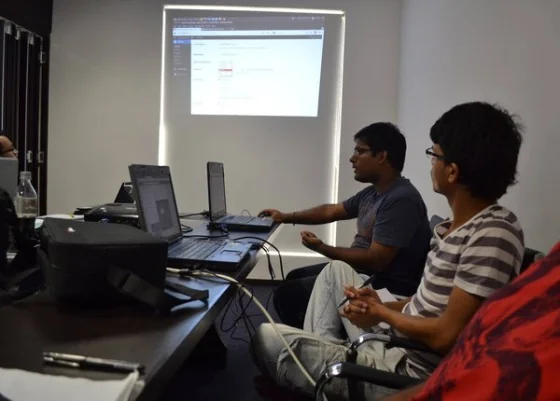
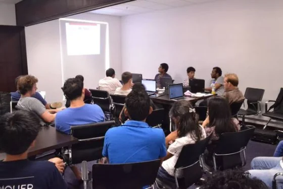
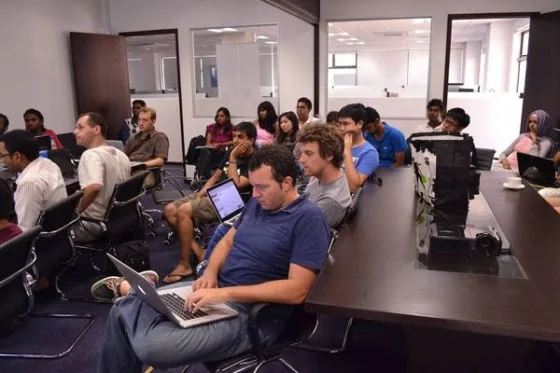
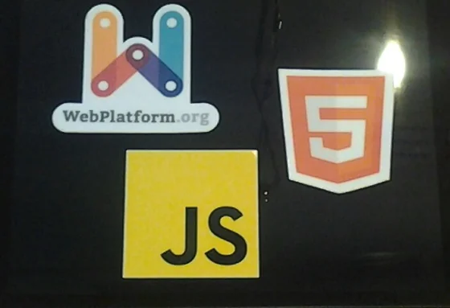

Having more sessions from our very own community members seems to be the right way to go.

After last month's session on HTML5, CSS3 and a bit of JavaScript, our craftman Rikesh voluntarily gave his presentation on [WordPress - An Introduction](https://www.meetup.com/MauritiusSoftwareCraftsmanshipCommunity/events/161733962/ "WordPress - An Introduction").

Hell yeah! Depending on what you might consider as an introduction but this was a full-featured introduction for developers into the WordPress CMS platform. We were not simply talking about how to sign up on wordpress.com and start blogging about trivial things. No way... Rikesh went from best practices during installation, to some good advice for the initial configuration and then over to the inerts and depths of plugin development.

And more inportant...  
We were able to match and even exceed the number of attendees this month: **30 people were present!**

As usual, here's my first impression about the MSCC meetup:

> *"Kudos to Rikesh for this great introduction into WordPress - actually, it was more a developer's jumpstart than a brief overview. Highly appreciated and looking for more stuff like this!"*

As mentioned initially, I think that we are absolutely on the right track to organise our meetups with sessions of our craftsmen. There are so many good ideas and topics available; almost an endless pool of possibilities.

## Reactions of other attendees

As usual, I'm always interested in the opinions from other craftsmen. Following some statements found online:

> *"Thanks @MSCraftsman @rrikesh for today's meetup. Well done."* -- Paul on Twitter
>
> *"Thanks for the talk--great introduction for developers indeed!"* -- Sebastian on [Meetup](https://www.meetup.com/MauritiusSoftwareCraftsmanshipCommunity/events/161733962/)
>
> *"Au fait, la présentation était une connaissance fondée très riche et purement pour les codeurs et les débutants d'avoir un aperçu sur la réalité de WordPress."* -- Nitin on [L’éblouissante WordPress en démo au #MSCC](https://www.darkxploit.us/?p=304 "L’éblouissante WordPress en démo au #MSCC")
>
> *"The part when Rikesh explained about Hooks, namely filter and action caught my attention. WordPress Codex is a great resource but might appear bulky to a non-developer who only is looking for a couple of tweaks. So, this explanation comes handy next time I'm on a WordPress hack."* -- Ish on [geeks@mscc:~$ Hello, WordPress](https://hacklog.in/mauritius-software-craftsmanship-community-wordpress-presentation/ "geeks@mscc:~$ Hello, WordPress")

Also check out the comments and feedback on our

## Talking about WordPress and development

According to the [usual statistics online](https://w3techs.com/ "usual statistics online") (Source: W^3^Techs) WordPress is the most used blogging platform or content management system (CMS) world-wide. Although, it all started as a blogging platform the system is absolutely not limited to this functionality, and you can easily use it for corporate websites, online forums, ecommerce platforms, and even for the development of Web Apps.

Due to this broad usage of WordPress as a web platform in all kind of fields, it is also obvious that the job market has a higher demand for WordPress developers than for any other CMS platform. You can easily verify this on various freelancer portals. The number of job and project listings for WordPress is easily 10 to 20 times higher than for Drupal, Joomla, or Magento.

As an absolute novice to WordPress you can sign up for free on [WordPress.com](https://www.wordpress.com) and you get your web site up and running in less than 10 minutes. In my opinion that's the easiest and fastest way to start your experience in the blogosphere, and to boost your career in IT. Later on, you might consider to extend and customise your site. Then navigate over to [WordPress.org](https://www.wordpress.org) and the Codex repository of extensions, get a fresh copy and install it on either your own root server or on a hosted solution. Even running it on Windows Azure Web Services is quite convienent since WordPress version 3.8. Just one good advice, only take the available packages from the official website... Otherwise, you might be doomed with exploits :)

As I tweeted several times during the presentation it was very interesting to see the differences in concept and development between WordPress and Joomla!. Some aspects are simplified compared to Joomla, like shorter query parameters for search, posts and other elements. Others, like the customisation or extension of core features are following a completely different approach. Similar to [Joomla!'s Output Overrides](https://docs.joomla.org/Understanding_Output_Overrides) in order to change behaviour of controller or how HTML output is generated WordPress relies on functional polymorphism to achieve similar results. Most important, the proper and consequent use of 'function\_exists()' calls in your own development. Rikesh also explained that you shouldn't touch any of the core components as they might be overwritten with the next update and your modifications will be deleted. Using the concept of 'child templates' helps to separate your code from other developers functionality. This simply works because WordPress executes and evaluates the PHP files from inside out, read: from child templates to parent templates to the core systems. The earlier a function is written and all subsequent location properly use function\_exists() calls it will guarantee that your inner code is executed rather than something later in the execution stack.

Rikesh also described and demo'd very clearly that the extensibility of WordPress is commonly based on hooks. There are actually two main types: actions and filters. Which have different behaviours in terms of content handling.

I won't go too much into the details for now but rather advice you to have a look at the material provided by Rikesh. The complete presentation is available on SlideShare, or you might go through the slides here:

<iframe src="https://www.slideshare.net/slideshow/embed_code/31514082" width="427" height="356" frameborder="0" marginwidth="0" marginheight="0" scrolling="no" style="border: 1px solid #CCC; border-width: 1px 1px 0; margin-bottom: 5px; max-width: 100%;" allowfullscreen="true"> </iframe>  
*[Hello WordPress](https://www.slideshare.net/rrikesh/hello-wordpress "Hello WordPress") from [Rikesh Ramlochund](https://www.slideshare.net/rrikesh)*

And Rikesh also made all the code samples available on Github: [https://github.com/rrikesh/hello-wordpress-mscc](https://github.com/rrikesh/hello-wordpress-mscc)

The Q&A session after the presentation was great, too. Very good questions, all knowingly answered by Rikesh. And of course, you get in touch with him through various channels in case that you either have some more questions regarding WordPress usage and development, or maybe you'd like to hire him for some jobs. Feel free in any case...

Following some more impressions of the day:

  
*Rikesh demonstrates the possibilities of WordPress configuration in the dashboard*

  
*Captivated audience following the demos and code samples*

  
*Conference room full of MSCC craftsmen - again a good number of first time attendees*

Thanks to our uploaders! Courtesy of pictures is theirs of course!

## Events

What are the upcoming events here in Mauritius? So far, we have the following ones (incomplete list as usual) in chronological order:

- Corsair Hackers Reboot (15.3.2014)
- [Global Windows Azure Bootcamp](https://www.meetup.com/MauritiusSoftwareCraftsmanshipCommunity/events/160871862/ "Global Windows Azure Bootcamp") (29.3.2014)
- Innovation Day(s) (4.4.2014)
- WebCup (TBA ~ June 2014)
- Developers Conference (TBA ~ July 2014)
- Linuxfest 2014 (TBA ~ November 2014)

Hopefully, there will be more announcements during the next couple of weeks and months. If you know about any other event, like a bootcamp, a code challenge or hackathon here in Mauritius, please drop me a note in the comment section below this article. Thanks!

## Networking and job/project opportunities

At the begin of February it was officially announced that the Mauritian government offers a customised service to empower local small and medium enterprises with an online presence. Following the essential statement of the Web Builder:

> *"Web Builder is a project initiated by the Ministry of Finance & Economic Development to empower small & medium enterprises (SMEs) by providing a service for the creation of their websites. The service will be offered through the Ebène Accelerator and Port-Louis Accelerator (opening soon) in collaboration with Mauritius Telecom."* -- Source: [Ebene Accelerator](https://ebeneaccelerator.intnet.mu/webbuilder.php "Ebene Accelerator")

We had a little chat about that and quite frankly the opinions on this initiative are wide-spread and controversial.

As usual, our craftsmen use any free minute to have vivid conversations on recent activities in ICT and in-between I could overhear a couple of indirect job and project discussions. Which makes me very happy actually. Having this kind of exchange is exactly what I wanted to achieve, and it's great to see it happen on every occasion. Once again, we had a couple of first-time attendees and with the young entrepreneurs Johann and Paul of [SleepOut.com](https://sleepout.com/ "SleepOut.com") there were good conversations on.

Also, I would like to thank [Sebastian Kippe](https://sebastian.kip.pe/ "Sebastian Kippe") of [5apps.com](https://5apps.com/deploy/home "5apps.com") for his generous giveaways in form of geeky stickers on JavaScript, HTML5 and very own App deployment service.

  
*Got some nice swag at the recent meeting of the Mauritius Software Craftsmanship Community. Thanks to Sebastian Kippe.*

## My resume of the day

> **More than expected!**

As stated initially, I'm very pleased by the presentation on WordPress done by Rikesh. He did a great job with his story line, and kept the audience live and alive with the general aspects of using WordPress, some essential details on installation and configuration and last but not least about further customisation with plugin development. I'm looking forward to get more information about WordPress in a future event. Maybe some more details on how to create themes...