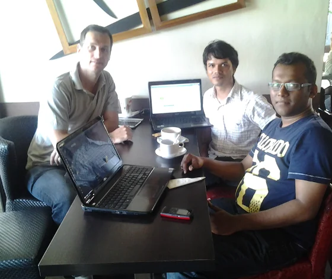

## There we go!

I finally managed to push myself forward and pick up an old, actually too old, idea since I ever arrived here in Mauritius more than six years ago. I'm talking about a community for all kind of ICT connected people. In the past (back in Germany), I used to be involved in various community activities. For example, I was part of the Microsoft Community Leader/Influencer Program (CLIP) due to an [FAQ website on Visual FoxPro](https://www.afpfaq.de "AFP FAQ"), actually Active FoxPro Pages (AFP) to be more precise. Then in 2003/2004 I addressed the responsible person of the dFPUG user group in Speyer in order to assist him in organising monthly user group meetings. Well, he handed over management completely, and attended our meetings regularly.

## Why did it take you so long?

Well, I don't want to bother you with the details but short version is that I was too busy on either job (building up new companies) or private life (got married and we have two lovely children, eh 'monsters') or even both. But now is the time where I was starting to look for new fields of activity; given the fact that I gained some spare time. My businesses are up and running, the kids are in school, and I am finally in a position where I can commit myself to community again. And I love to do that!

## Why a new user group?

Good question... And 'easy' to answer.  
Since back in 2007 I did my [usual research, eh Google searches](https://www.google.com/search?q='user+groups'+Mauritius "usual research, eh Google searches"), to see whether there are existing user groups in Mauritius and in which field of interest. And yes, there are! If I recall this correctly, then there are communities for Adobe, PHP, Drupal, Python (just recently), Oracle, Java, .NET, and Linux (which used to be even two). But... either they do not exist anymore, they are dormant, or there is only a low heart-beat, frankly speaking. And yes, I went to meetings of the [Linux User Group Meta (Mauritius)](https://ww.lugm.org "Linux User Group Meta (Mauritius)") back in 2010/2011 and [just recently](xref:feedback-on-lugm-meeting-15-06-2013 "Feedback on meeting of the Linux User Group of Mauritius"). I really like the setup and the way the LUGM is organised. It's just that I have a slightly different point of view on how a user group or community should organise itself and how to approach future members. Don't get me wrong, I'm not criticizing others doing a very good job, I'm only saying that I'd like to do it differently. The last meeting of the LUGM was awesome; read my feedback about it.

## Ok, so what's up with '[Mauritius Software Craftsmanship Community](https://www.meetup.com/MauritiusSoftwareCraftsmanshipCommunity/ "Mauritius Software Craftmanship Community")' or short: MSCC?

As I've already written in my article on '[Communities - The importance of exchange and discussion](xref:community-exchange-and-discussion "Communities - The importance of exchange and discussion")' I think it is essential in a world of IT to stay 'connected' with a good number of other people in the same field. There is so much dynamic and every day's news that it is almost impossible to keep on track with all of them. The MSCC is going to provide a common platform to exchange experience and share knowledge between each other. You might be a newbie and want to know what to expect working as a software developer, or as a database administrator, or maybe as an IT systems administrator, or you're an experienced geek that loves to share your ideas or solutions that you implemented to solve a specific problem, or you're the business (or HR) guy that is looking for 'fresh' blood to enforce your existing team. Or... you're just interested and you'd like to communicate with like-minded people.

  
*Meetup of 26.06.2013 @ L'arabica: Of course there are laptops around. Free WiFi, power outlet, coffee, code and Linux in one go.*

The [MSCC](https://www.meetup.com/MauritiusSoftwareCraftsmanshipCommunity/ "MSCC") is technology-agnostic and spans an umbrella over any kind of technology. Simply because you can't ignore other technologies anymore in a connected IT world as we have. A front-end developer for iOS applications should have the chance to connect with a Python back-end coder and eventually with a DBA for MySQL or PostgreSQL and exchange their experience. Furthermore, I'm a huge fan of cross-platform development, and it is very pleasant to have pure Web developers - with all that HTML5, CSS3, JavaScript and JS libraries stuff - and passionate C# or Java coders at the same table. This diversity of knowledge can assist and boost your personal situation. And last but not least, there are projects and open positions 'flying' around... People might like to hear others opinion about an employer or get new impulses on how to tackle down an issue at their workspace, etc. This is about community. And that's how I see the [MSCC](https://www.meetup.com/MauritiusSoftwareCraftsmanshipCommunity/ "MSCC") in general - free of any limitations be it by programming language or technology.

Having the chance to exchange experience and to discuss certain aspects of technology saves you time and money, and it's a pleasure to enjoy. Compared to dusty books and remote online resources. It's human!

## Organising meetups (meetings, get-together, gatherings - you name it!)

As of writing this article, the MSCC is currently meeting **every Wednesday** for the weekly 'Code & Coffee' session at various locations (suggestions are welcome!) in Mauritius. This might change in the future eventually but especially at the beginning I think it is very important to create awareness in the Mauritian IT world. Yes, we are here! Come and join us! ;-)

The MSCC's main online presence is located at Meetup.com because it allows me to handle the organisation of events and meeting appointments very easily, and any member can have a look who else is involved so that an exchange of contacts is given at any time. In combination with the other entities (G+ Communities, FB Pages or in Groups) I advertise and manage all future activities here:

> [Mauritius Software Craftsmanship Community](https://www.meetup.com/MauritiusSoftwareCraftsmanshipCommunity/ "Mauritius Software Craftsmanship Community on Meetup.com")
>
> *This is a community for those who care and are proud of what they do.  
For those developers, regardless how experienced they are, who want to improve and master their craft.*
>
> *This is a community for those who believe that being average is just not good enough.*

I know, there are not many 'craftsmen' yet but it's a start... Let's see how it looks like by the end of the year.

There are free smartphone apps for Android and iOS from Meetup.com that allow you to keep track of meetings and to stay informed on latest updates. And last but not least, there is a Trello workspace to collect and share ideas and provide downloads of slides, etc. Trello is also available as free smartphone app.

## Sharing is caring!

As mentioned, the #MSCC is present in various social media networks in order to cover as many people as possible here in Mauritius. Following is an overview of the current networks:

- [Twitter - Latest updates and quickies](https://x.com/MSCraftsman "Latest Tweets")
- [Google+ - Community channel](https://plus.google.com/communities/100173553632342721205)
- [Facebook - Community Page](https://www.facebook.com/MauritiusSoftwareCraftsmanshipCommunity)
- [LinkedIn - Community Group](https://www.linkedin.com/groups/Mauritius-Software-Craftsmanship-Community-5033639)
- [Trello - Collaboration workspace to share and develop ideas](https://trello.com/mauritiussoftwarecraftsmanshipcommunity "Trello")

Hopefully, this covers the majority of computer-related people in Mauritius. Please spread the word about the #MSCC between your colleagues, your friends and other interested 'geeks'.

## Your future looks bright

Running and participating in a user group or any kind of community usually provides quite a number of advantages for anyone. On the one side it is very joyful for me to organise appointments and get in touch with people that might be interested to present a little demo of their projects or their recent problems they had to tackle down, and on the other side there are lots of companies that have various support programs or sponsorships especially tailored for user groups. At the moment, I already have a couple of gimmicks that I would like to hand out in small contests or raffles during one of the upcoming meetings, and as said, companies provide all kind of goodies, books free of charge, or sometimes even licenses for communities.

Meeting other software developers or IT guys also opens up your point of view on the local market and there might be interesting projects or job offers available, too. [A community like the Mauritius Software Craftsmanship Community](https://www.meetup.com/MauritiusSoftwareCraftsmanshipCommunity/ "A community like the Mauritius Software Craftsmanship Community") is great for freelancers, self-employed, students and of course employees. Meetings will be organised on a regular basis, and I'm open to all kind of suggestions from you. Please leave a comment here in blog or join the conversations in the above mentioned social networks.

Let's get this community up and running, my fellow Mauritians!

## [Recent updates]()

The MSCC is now officially participating in the O'Reilly UK User Group programm and we are allowed to request review or recension copies of recent titles. Additionally, we have a discount code for any books or ebooks that you might like to order on [shop.oreilly.com](https://shop.oreilly.com "O'Reilly online shop of books and ebooks").

More applications for user group sponsorship programms are pending and I'm looking forward to a couple of announcement very soon.

And... we need some kind of 'corporate identity' - Over at the MSCC website there is a [call for action (or better said a contest with prizes)](https://www.meetup.com/MauritiusSoftwareCraftsmanshipCommunity/messages/boards/thread/35814832 "call for action (or better said a contest with prizes)") to create a unique design for the MSCC. This would include a decent colour palette, a logo, graphical banners for Meetup, Google+, Facebook, LinkedIn, etc. and of course badges for our craftsmen to add to their personal blogs and websites. Please spread the word and contribute. Thanks!