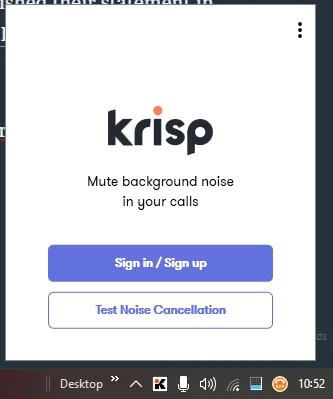
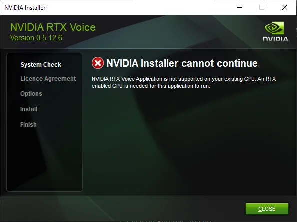
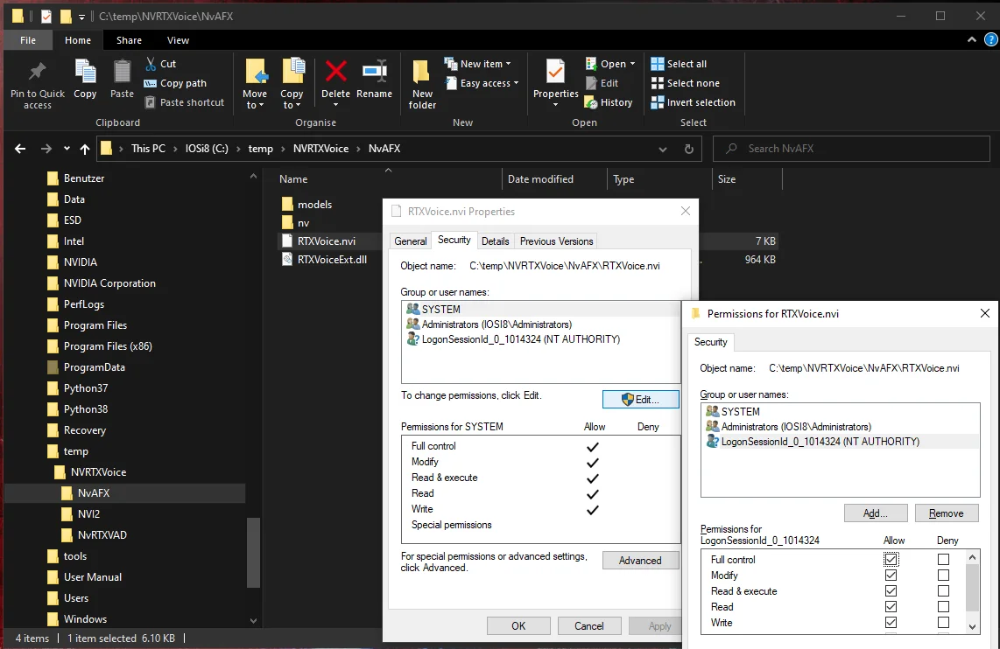
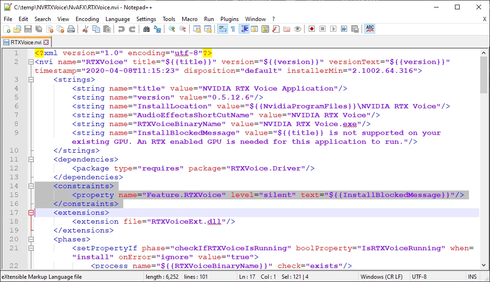
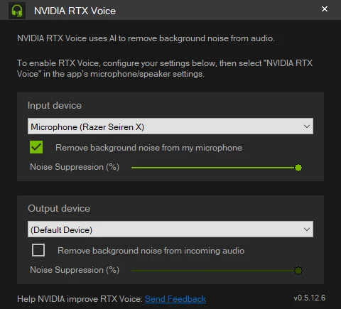
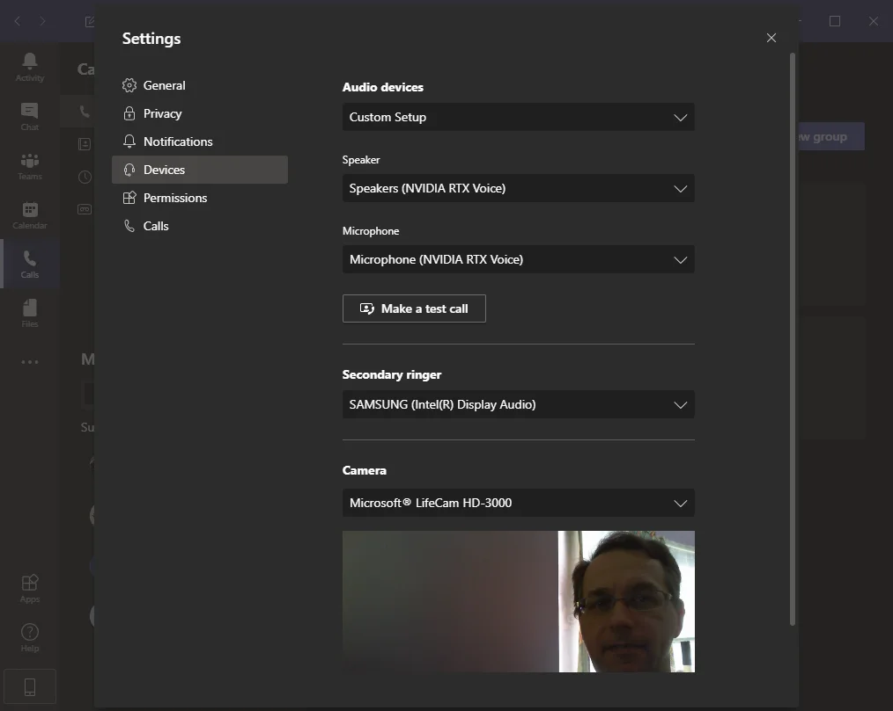

After finishing a full day of work and multiple meeting arrangements I accidentally broke one side of my headset. With the current confinement in Mauritius and scarcity of computer hardware I was looking into options to improve the use of my external [Razer Seiren X](https://amzn.to/3EA818N) microphone.

Working from home (WFH) with the children most of the time around me it would be a challenge to use an "open" mic during conference calls on Microsoft Teams or Google Meet. Hence my search for a noise reduction solution that would allow me to work comfortable.

## Krisp

I can't remember exactly but someone recommended [Krisp - Noise Cancelling App](https://krisp.ai/) some months back. And although I had a look at their website back then I didn't even download their application due to the pricing structure. That was definitely before they published their statement in regards to the COVID-19 situation: [COVID-19 Response: New free plan and dropped prices](https://krisp.ai/blog/covid19-response/)

Meanwhile I downloaded and even installed Krisp on one of my machines and it now snuggles nicely in the Systray area.

The results are really good and its use is dead simple. I'm probably going to use Krisp on my Lenovo Yoga Book which doesn't have a secondary GPU. For Chromebooks Krisp offers an extension for the Chrome browser.

*Note*: Krisp has more articles on noise cancelling on their blog: [Best Noise Cancelling Apps for Windows](https://krisp.ai/blog/noise-cancelling-apps-windows/) and [Best Noise Cancelling Apps for Mac](https://krisp.ai/blog/noise-cancelling-apps-mac/).

## NVIDIA RTX Voice

Next, I came across a notion of [NVIDIA RTX Voice Setup Guide](https://www.nvidia.com/en-us/geforce/guides/nvidia-rtx-voice-setup-guide/) and I thought to give a try even though my main machine has a GeForce GTX 1060 only.

> NVIDIA RTX Voice is a new plugin that leverages NVIDIA RTX GPUs and their AI capabilities to remove distracting background noise from your broadcasts, voice chats, and remote video conferencing meetings.

Other search results indicated that it would be possible, and so why not.

After launching the 327 MB RTX Voice installer it performs a system check and told me to go away...

Bummer! Following the instructions of other articles online and YouTube videos it is possible to by-pass this system check and get the installer to complete the job.

Open Windows Explorer and navigate to the newly created folder `C:\temp\NVRTXVoice\NvAFX`. There right-click on the file `RTXVoice.nvi` and choose Properties. Next, change to the tab Security and hit the Edit... button. After passing UAC select the LogonSessionId\* user and give it Full Control in the permission matrix.

Confirm all dialogs and then open the file `RTXVoice.nvi` with your favourite text editor.

Between lines 14 and 16 is a `<constraints>` element that contains the blocking message from the failed system check. Delete those lines as highlighted in the image above and save the file.

Finally, change to the parent folder `C:\temp\NVRTXVoice` and execute the file `setup.exe` to launch the RTX Voice installer again.

<iframe width="480" height="270" src="https://www.youtube.com/embed/FUGwHa3y0JU?feature=oembed" frameborder="0" allow="accelerometer; autoplay; encrypted-media; gyroscope; picture-in-picture" allowfullscreen=""></iframe>

Install NVIDIA RTX Voice after removing the constraints section

The system check is now successful and the installation can be completed.

*Note*: The temp folder can be removed now.

After a compulsory reboot of Windows the NVIDIA RTX Voice app can be launched and configured.

NVIDIA RTX Voice operates as a virtual sound routing device on your system. It's like a wrapper around your actual physical sound device. In NVIDIA RTX Voice you choose the input device and optionally the output device, and in your app(s) you select "NVIDIA RTX Voice" in the microphone/speaker settings.

Refer to the [NVIDIA RTX Voice: Setup Guide](https://www.nvidia.com/en-us/geforce/guides/nvidia-rtx-voice-setup-guide/#App-Configuration) to configure other applications correctly.

### The results are impressive!

The test calls in Teams and Skype were very positive and the feedback from conference calls was pleasing as well. Looks like I found myself a new audio setup. Until I am going to be able to purchase a new headset.

Given feedback on social media I made another video to show the effect of noise cancelling provided by NVIDIA RTX Voice.

<iframe width="480" height="270" src="https://www.youtube.com/embed/rRFoeFcUNtY?feature=oembed" frameborder="0" allow="accelerometer; autoplay; encrypted-media; gyroscope; picture-in-picture" allowfullscreen=""></iframe>

Using various microphones and enabling NVIDIA RTX Voice

The level of background noise during the recording was constantly the same. I hope that the impact of NVIDIA RTX Voice is audible.

<small>Image credit: Tai's Captures</small>