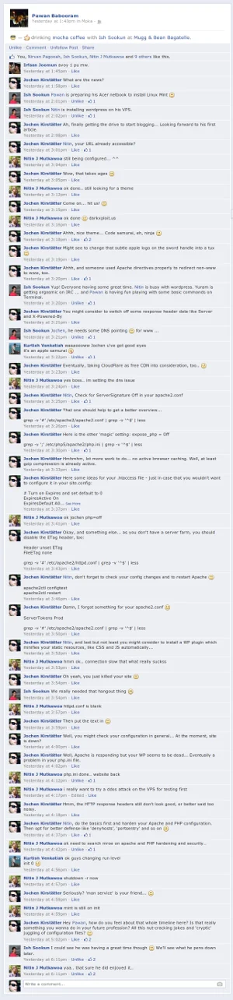

[](https://s.kirstaetter.name/images/fb_lugm_20131005.png "Click to enlarge")Not attending a meeting of the LUGM can be fun, too. It's getting a bit of a habit that Ish is organising small gatherings, aka mini-meetups, of the [Linux User Group Mauritius/Meta (LUGM)](https://lugm.org/) almost every Saturday. There they mainly discuss and talk about various elements of using Linux as ones main operating systems and the possibilities you are going to have. On top of course, some tips & tricks about mastering the command line and initial steps in scripting or even writing HTML. In general, sounds like a good portion of fun and great spirit of community. Unfortunately, I'm usually quite busy with private and family matters during the weekend and so I already signalised that I wouldn't be around. Well, at least not physically...

But this Saturday a couple of things worked out faster than expected and so I was [hanging out on my machine](xref:microsoft-and-innovation-iif-method "Microsoft and innovation: IIF() method"). I made virtual contact with one of Pawan's messages over on Facebook... And somehow that kicked off some kind of an online game fun on basic configuration of Apache HTTPd 2.2.x, PHP 5.x and how to improve the overall performance of a newly installed blog based on WordPress.

## []()Default configuration files

[Nitin's website](https://www.darkxploit.us/) finally came alive and despite the dark theme and the hidden Apple 'fanboy' advertisement I was more interested in the technical situation. As with any new installation there is usually quite some adjustment to be done. And Nitin's page was no exception. Unfortunately, out of the box installations of Apache httpd and PHP are too verbose and expose too much information under the hood. You might think that this isn't really a problem at all, well, think about it again after completely reading this article.

First, I checked the HTTP response headers - using either Chrome Developer Tools or Firefox Web Developer extension - of Nitin's page and based on that I advised him to lower the noise levels a little bit. It's not really necessary that detailed information about web server software and scripting language has to be published in every response made. Quite a number of script kiddies and exploits actually check for version specifics prior to an attack. So, removing at least version details hardens the system a little bit. In particular, I'm talking about these response values:

- Server
- X-Powered-By

How to achieve that? By tweaking the configuration files... Namely, we are going to look into the following ones:

- apache2.conf
- httpd.conf
- .htaccess
- php.ini

The above list contains some additional files, I'm talking about in the next paragraphs. Anyway, those are the ones involved.

## []()Tweaking Apache

Open your favourite text editor and start to modify the apache2.conf. Eventually, you might like to have a quick peak at the file to see whether it is necessary to adjust it or not. Following is a handy combination of commands to get an overview of your active directives:

`# sudo grep -v '#' /etc/apache2/apache2.conf | grep -v '^$' | less`

There you keep an eye on those two Apache directives:

- ServerSignature **Off**
- ServerTokens **Prod**

If that's not the case, change them as highlighted above.

In order to activate your modifications you have to restart Apache httpd server. On Debian and Ubuntu you might use apache2ctl for that, on other distributions you might have to use service or run the init-scripts again:

`# sudo apache2ctl configtest  
Syntax OK  
# sudo apache2ctl restart`

Refresh your website and check the HTTP response header.

## []()Tweaking PHP5 (a little bit)

Next, check your php.ini file with the following statement:

`# sudo grep -v ';' /etc/php5/apache2/php.ini | grep -v '^$' | less`

And check the value of

- expose\_php = **Off**

Again, if it's not as highlighted, change it...

## []()Some more Apache love

Okay, back to Apache it might also be interesting to improve the situation about browser caching and removing more obsolete information. When you run your website against [the usual performance checks](https://gtmetrix.com/ "GTmetrix") like Google Page Speed and Yahoo YSlow you might see those check points with bad grades on a standard, default configuration. Well, this can be done easily.

### Configure entity tags (ETags)

ETags are only interesting when you run your websites on a farm of multiple web servers. Removing this data for your static resources is very simple in Apache. As we are going to deal with the HTTP response header information you have to ensure that Apache is capable to manipulate them. First, check your enabled modules:

`# sudo ls -al /etc/apache2/mods-enabled/ | grep headers`

And in case that the 'headers' module is not listed, you have to enable it from the available ones:

`# sudo a2enmod headers`

Second, check your httpd.conf file (in case it exists):

`# sudo grep -v '#' /etc/apache2/httpd.conf | grep -v '^$' | less`

In newer (better said fresh) installations you might have to create a new configuration file below your conf.d folder with your favourite text editor like so:

`# sudo nano /etc/apache2/conf.d/headers.conf`

Then, in order to tweak your HTTP responses either check for those lines or add them:

`Header unset ETag  
FileETag None`

In case that your file doesn't exist or those lines are missing, feel free to create/add them. Afterwards, check your Apache configuration syntax and restart your running instances as already shown above:

`# sudo apache2ctl configtest  
Syntax OK  
# sudo apache2ctl restart`

### Add Expires headers

To improve the loading performance of your website, you should take some care into the proper configuration of how to leverage the browser's ability to cache certain resources and files. This is done by adding an Expires: value to the HTTP response header. Generally speaking it is advised that you specify a near-future, read: 1 week or a little bit more, for your static content like JavaScript files or Cascading Style Sheets. One solution to adjust this is to put some instructions into the .htaccess file in the root folder of your web site. Of course, this could also be placed into a more generic location of your Apache installation but honestly, I'd like to keep this at the web site level. Following some adjustments I'm currently using on this blog site:

`# Turn on Expires and set default to 0`  
`ExpiresActive On`  
`ExpiresDefault A0`  
` `  
`# Set up caching on media files for 1 year (forever?)`  
`<FilesMatch "\.(flv|ico|pdf|avi|mov|ppt|doc|mp3|wmv|wav)$">`  
`ExpiresDefault A29030400`  
`Header append Cache-Control "public"`  
`</FilesMatch>`  
` `  
`# Set up caching on media files for 1 week`  
`<FilesMatch "\.(js|css)$">`  
`ExpiresDefault A604800`  
`Header append Cache-Control "public"`  
`</FilesMatch>`

`# Set up caching on media files for 31 days`  
`<FilesMatch "\.(gif|jpg|jpeg|png|swf)$">`  
`ExpiresDefault A2678400`  
`Header append Cache-Control "public"`  
`</FilesMatch>```

As we are editing the .htaccess files, it is not necessary to restart Apache.

In case that your web site doesn't load anymore or you're experiencing an error while trying to restart your httpd, check that the 'expires' module is actually an enabled module:

` # ls -al /etc/apache2/mods-enabled/ | grep expires  
# sudo a2enmod expires  
`

Of course, the instructions above a re not feature complete but I hope that they might provide a better default configuration for your LAMP stack.

## []()Resume of the day

Within a couple of hours, and while being occupied with an eLearning course on SQL Server 2012, I had some good fun in helping and assisting other LUGM members while they were some kilometers away at Bagatelle. According to other blog articles it seems that Nitin had quite some moments of desperation. Just for the records: At no time it was my intention to either kick his butt or pull a leg on him. Simply, providing some input based on the lessons I've learned over the last couple of years configuring Apache HTTPd and PHP.

Check out the other blogs, too:

- [LUGM mini-meetup... Epic!](https://hacklog.in/lugm-mini-meetup-epic/)
- [Superb Saturday](https://yuram07blog.wordpress.com/2013/10/05/superb-saturday/)
- [Linux Meetup](https://yodhunjay.wordpress.com/2013/10/05/linux-meetup/)
- And last but not least, the man himself: [The end of a new beginning](https://www.darkxploit.us/?p=1)

Cheers, and happy community'ing!

## []()Updates

Due to our weekly [Code & Coffee sessions in the MSCC community](https://www.meetup.com/MauritiusSoftwareCraftsmanshipCommunity/ "Code &amp; Coffee sessions in the MSCC community"), I had a chance to [talk to Nitin](https://www.darkxploit.us/?p=24 "talk to Nitin about enabling Apache modules") directly and he showed me the problems directly on his machine. This led to update this article hence the paragraphs on enabling the modules 'headers' and 'expires'.