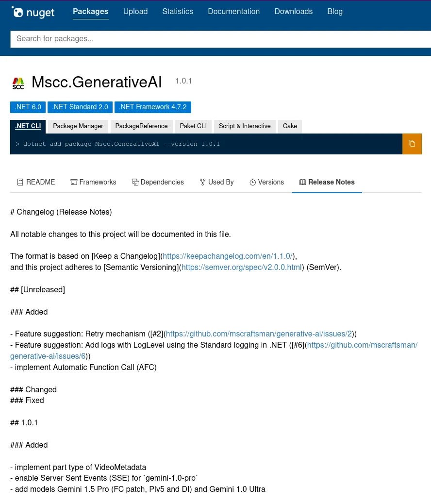
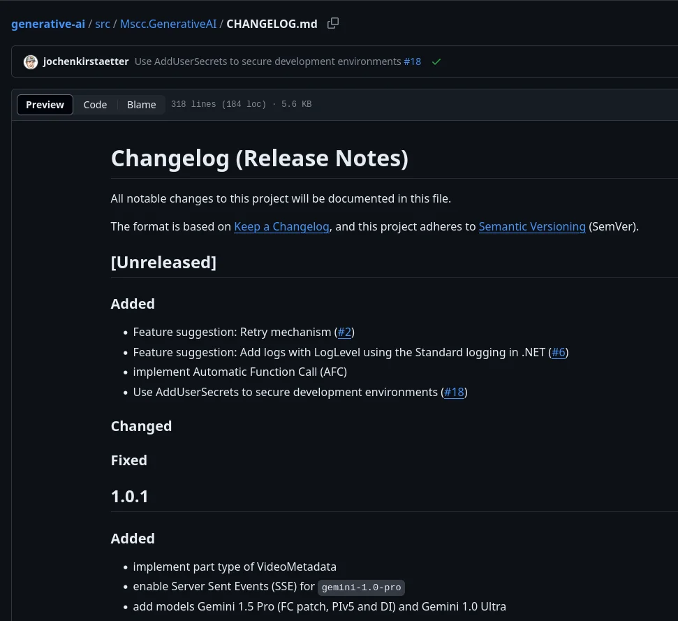
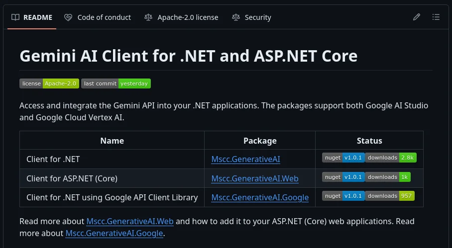

Providing release notes for a NuGet package is an essential part of the development and distribution of the package itself. Commonly it shall be the first source of information to describe latest updates regarding the improvements and changes.

However, the current way of authoring release notes in a .NET project is sub-optimal. The following approach might offer a simpler way to achieve this including formatting and additional purpose on GitHub.

## The situation (you might be facing)

On the one side, the Release notes element or `PackageReleaseNotes` of the MSBuild property in the `.csproj` project file is quite limited regarding formatting options. And it is cumbersome to update it with release information continuously. Especially while using the single line text entry in the properties page of Visual Studio.

Other the other hand, the `PackageReadmeFile` element provides a bit more freedom to describe a package, however, it is linked only. And on top of that, it is not even exposed in the user interface of the project properties.

So, having an *external* resource like a Markdown file that is not only linked could be an interesting alternative. The information is stored outside the project file, is easier to edit, and provides rich formatting options including images, bullet lists and hyperlinks.

## A solution

Luckily, similar to pushing a package to a network share or to a NuGet source feed we can leverage another MSBuild task to take the content of that Markdown file and inject it into the package description.

**Note:** *For a code base that is hosted in a (public) repository on GitHub (or BitBucket, Azure DevOps, Google Cloud Source Repositories, etc) using `CHANGELOG.md` instead of release notes might be a better choice of file name.*

Let's start with a fresh `CHANGELOG.md` that we place in the root of the project folder.

```
# Changelog (Release Notes)

All notable changes to this project will be documented in this file.

The format is based on [Keep a Changelog](https://keepachangelog.com/en/1.1.0/),
and this project adheres to [Semantic Versioning](https://semver.org/spec/v2.0.0.html) (SemVer).

## [Unreleased]

### Added
### Changed
### Fixed
```

As you might see in the file content already we are following a suggested format to maintain the change log and we are establishing [Semantic Versioning](https://semver.org/spec/v2.0.0.html) right from the beginning. The content is written in Markdown and apart from using your favourite IDE which might have an integrated viewer for Markdown it is a commonly used and understood formatting syntax among developers. Markdown can also be transformed to other output formats like HTML or PDF. Think of `pandoc` as a utility tool to generate a different output, or maybe any kind of static web page generator like Hugo, et al.

Now, with the `CHANGELOG.md` file in place (and under version control) it is time to use an MSBuild task to read the content of the file and inject it into the project properties. Add a new `Target` element in your `.csproj` file with the following content, probably near the bottom area.

```
	<Target Name="InjectPackageReleaseNotesFromFile" BeforeTargets="GenerateNuspec" Condition="Exists('CHANGELOG.md')">
		<PropertyGroup>
			<PackageReleaseNotes>$([System.IO.File]::ReadAllText("$(MSBuildProjectDirectory)/CHANGELOG.md"))</PackageReleaseNotes>
		</PropertyGroup>
	</Target>
```

According to the `BeforeTarget` attribute this task is executed before generating the NuGet specification file `.nuspec`. A process that happens after successful compilation of the project or solution and as the name suggests before the actual NuGet package is created. Sounds perfect.

The task itself creates or updates the XML element `PackageReleaseNotes` in the project file and replaces the value with the complete content of the `CHANGELOG.md` file. To avoid any compilation issues the `Condition` attributes checks for the existence of the referenced file prior to executing the task.

To keep yourself and maybe other team members informed, place the following remark in the original Release notes of the project properties.

```
<PackageReleaseNotes>(Package release notes are in CHANGELOG.md)</PackageReleaseNotes>
```

Alternatively, leave it blank.

## The result

Using Markdown to create richly formatted release notes compared to plain text might be a welcoming piece of documentation.

Here's how it looks in the NuGet Gallery.



In comparison the same release notes on GitHub.



With a small amount of extra work same `CHANGELOG.md` could be used as a source of [GitHub Pages](https://pages.github.com/) and be part of a generated, static website of your project.

## What's got that to do with versioning?

The change log is already using semantic versioning to document changes. So, while already using this approach to inject the release notes into the NuGet package... Why not doing the same for the version of the package.

Instead of fiddling around in the project properties or updating the `.csproj` file directly, wouldn't be better to have a `VERSION` file in the root folder and its content is replacing the `Version` element during the compilation process.

Put the following lines once in your project file, and it's done.

```
<Version>$([System.IO.File]::ReadAllText("$(MSBuildProjectDirectory)/../../VERSION"))</Version>	
```

The path might be different for you and depending on how you structured your project. I put that `VERSION` file into the root folder of the repository because I'm using it for multiple projects simultaneously. A lazy way to keep the version information of related projects / packages in the same solution synchronized.

Both approaches - `CHANGELOG.md` and `VERSION` - are used in the NuGet packages `Mscc.GenerativeAI*`. It's an open-source library to integrate Google Gemini into .NET applications.



The repository of [Gemini AI Client for .NET and ASP.NET Core](https://github.com/mscraftsman/generative-ai) is hosted on GitHub.

## Final thought

Apart from maintaining those two files in the repository manually, they could have been generated or updated automatically by a continuous integration (CI) pipeline.

However, I leave that to you.

Perhaps a future blog article, who knows...

<small>Image credit: Image Creator from Microsoft Designer using prompt: <i>Create an image depicting versioning of packages</i></small>