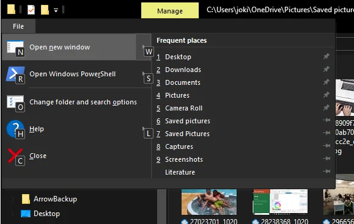
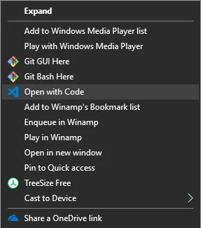
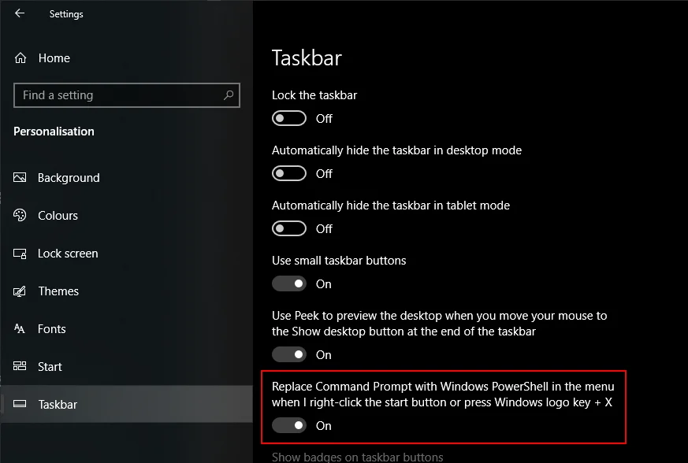
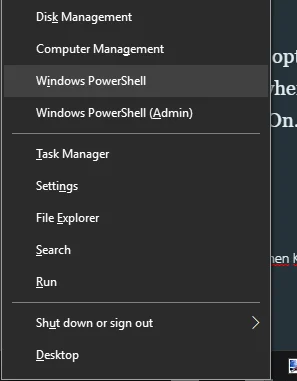

As a power user I'm more used to hotkeys and application shortcuts than moving the mouse pointer on the screen.

Actually, I'm too lazy to lift my hand from the keyboard to either move my trackball or fiddle around on the trackpad. It is also a matter of performance and health. Constant change of position of your hand between keyboard and a mouse pointing device, like ie. a mouse, a trackpad, a mouse knob, or a trackball, takes time and is tiring for shoulder and neck.

Following are a few options of how to open an instance of Windows PowerShell in the current folder. Most probably they are ordered by personal preference.

## Hotkey: Alt + F, then R

This seems to be the fastest option available. It's more like an unconscious reflex than real decision making process to open a new PowerShell window wherever I'm currently residing in Windows Explorer.

## Hotkey: F4, then type 'powershell'

I used to start with a modified version of this hotkey. Previously, I clicked into the address bar to focus it instead of using the F4 key.

Both options work as expected. Give it a try.

*Note:* Typing `cmd` will launch a Command Prompt. Entering `bash` gives access to GNU bash on Windows 10.

## Hotkey: Shift + F10, then S

That one can be a bit tricky because the hotkey Shift + F10 opens the extended context menu. The available entries in the context menu are obviously specific to the context or state in which the mouse is currently placed. And that's where is approach falls short.

Given the right context of a folder the menu entry is available. Pressing the letter `S` selects the menu entry 'Open Power<u>S</u>hell window here' and then hit `Enter` to confirm the choice.

While moving around in the Navigation pane it always works for the currently selected folder.

However, in the Content pane this hotkey is not practical. Once a file has been selected you won't get access to the folder context menu anymore.

Shifting focus will give you all kind of different context menus. I wouldn't recommend this hotkey. See for yourself.

## Shift + Right-click

Similar to the Shift + F10 hotkey previously mentioned the context menu can be opened with right-click on a mouse pointing device.

Unfortunately, the option to launch Windows PowerShell is only available in the extended context menu; hence holding down `Shift` before right-click is compulsory.

## Bonus: Shift + Menu key, then S

A regular keyboard most probably might provide a designated `Menu` key which allows the user to launch the context menu without having to right-click. Same constraints as already mentioned above apply to this approach.

## Extended entries in regular context menu

While searching for additional options to launch Windows PowerShell from the current folder I read that an entry could be 'transferred' permanently into the regular context menu.

Open the Registry Editor - Win + R &gt; regedit &gt; Enter - and navigate to the following keys under HKCR:

- `HKEY_CLASSES_ROOT\Directory\shell\Powershell`
- `HKEY_CLASSES_ROOT\Drive\shell\Powershell`

Either remove or rename the key `Extended` to enable the entry in the regular context menu.

Windows 10 did not allow me to change the `Extended` key. Perhaps this might be limited to previous builds or versions of Windows 10. If you were able to complete the transfer, let me know in the Comment section below.

## Start PowerShell: Win + X, then either I or A

Before we start to talk about the option to generally launch an instance of Windows PowerShell with either regular or administrative permissions, it is necessary to check the Taskbar settings on your computer.

Open the Start menu and click on Settings &gt; Personalisation &gt; Taskbar.

Ensure the option 'Replace Command Prompt with Windows PowerShell in the menu when I right-click the start button or press Windows logo key + X' is set to On.

<small>Image credit: Jochen Kirstätter</small>
