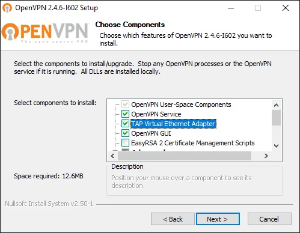
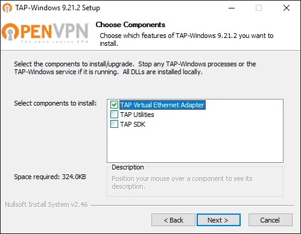
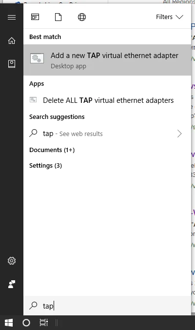
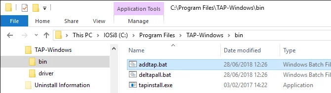
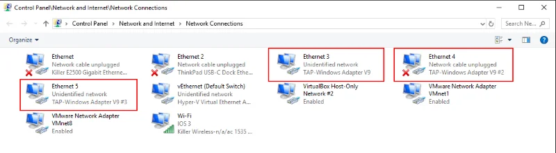

Working with several clients or partners might be an interesting challenge sometimes. While adding a new connection to an [existing OpenVPN infrastructure](xref:openvpn-revisited) I came across the following error message in the client log file: All TAP-Windows adapters on this system are currently in use.

Depending on how you actually installed your VPN client software you might be facing this issue while adding an additional client configuration for another connection. Especially when you are using a client software by a third-party provider, ie. [WatchGuard Mobile VPN](xref:connecting-linux-to-watchguard-firebox-ssl) or Sophos. Perhaps you might be struggling to resolve it.

## Get the TAP-Windows driver

Check whether you have the full installation of OpenVPN software. If yes, you might like to skip this the following steps and directly move on to add another TAP adapter to your Windows system.

Otherwise, please navigate to the [Community Downloads](https://openvpn.net/index.php/download/community-downloads.html) of OpenVPN and either get the latest OpenVPN package, or if you think that this might be an issue, scroll down a little bit on same page and get Tap-windows package for your system. After the download is complete, run the installation routine and make sure to select *TAP Virtual Ethernet Adapter* like so:

::: grid


:::
You might have to reboot Windows to complete the network driver installation.

## Add a new TAP virtual ethernet adapter

Now, you should be able to add an additional TAP interface to your system, and make it available for your new OpenVPN connection. Hit the Start button or press the Win key, then type `tap` and wait for Windows to give you its matches found on the system. Here is how it looks like on my Windows 10:



Click on the entry *Add a new TAP virtual ethernet adapter* and confirm the User Account Control (UAC) dialog with *Yes*. You then see an administrative command prompt that adds another network interface to your Windows.

```
C:\WINDOWS\system32>rem Add a new TAP virtual ethernet adapter

C:\WINDOWS\system32>"C:\Program Files\TAP-Windows\bin\tapinstall.exe" install "C:\Program Files\TAP-Windows\driver\OemVista.inf" tap0901
Device node created. Install is complete when drivers are installed...
Updating drivers for tap0901 from C:\Program Files\TAP-Windows\driver\OemVista.inf.
Drivers installed successfully.

C:\WINDOWS\system32>pause
Press any key to continue . . .
```

And your OpenVPN client is ready to roll.

The shortcut below the Windows Start menu is linked to a batch file which you can also access and launch directly from **%ProgramFiles%\TAP-Windows\bin**



**Note:** Ensure to run the batch file with administrative permissions. Otherwise, the driver installation will fail.

## Review your existing Network Connections

Perhaps you would like to inspect the existing TAP-Windows Adapters? You find them in the Control Panel under Network Connections.



The adapters are classified as *TAP-Windows Adapter V9*. Here you can enable, disable or even delete an existing network interface.

Some readers might prefer interaction with a command line interface (CLI). Well, even on Windows there is nothing to worry about this. The [Network Shell (Netsh)](https://docs.microsoft.com/en-us/windows-server/networking/technologies/netsh/netsh) of Windows has you covered, although it is recommended to use [PowerShell to manage networking technologies](https://docs.microsoft.com/en-us/powershell/module/netadapter/):

```
PS C:\> Get-NetAdapter

Name                      InterfaceDescription                    ifIndex Status       
----                      --------------------                    ------- ------       
vEthernet (Default Swi... Hyper-V Virtual Ethernet Adapter             30 Up           
Wi-Fi                     Killer Wireless-n/a/ac 1535 Wireless...      28 Up           
Ethernet                  Killer E2500 Gigabit Ethernet Contro...      19 Disconnected 
Ethernet 4                TAP-Windows Adapter V9 #2                    15 Disconnected 
VMware Network Adapte...8 VMware Virtual Ethernet Adapter for ...      14 Up           
VMware Network Adapte...1 VMware Virtual Ethernet Adapter for ...      13 Up           
Ethernet 2                ThinkPad USB-C Dock Ethernet                  8 Disconnected 
Ethernet 5                TAP-Windows Adapter V9 #3                    52 Up           
VirtualBox Host-Only ...2 VirtualBox Host-Only Ethernet Adap...#2       6 Up           
Ethernet 3                TAP-Windows Adapter V9                        5 Up           
```

The information provided is identical to the visual representation in Windows Explorer.
