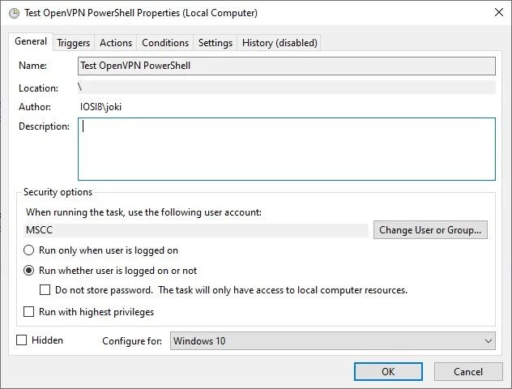
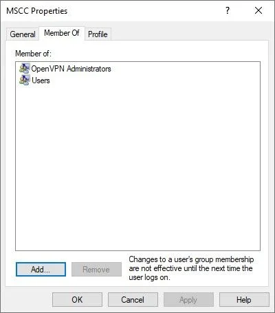
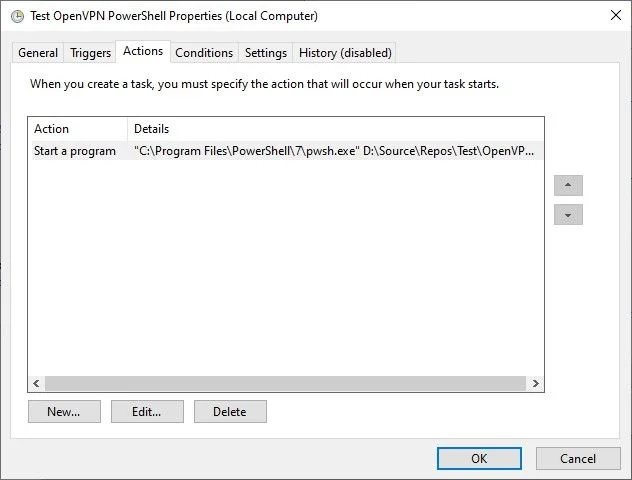
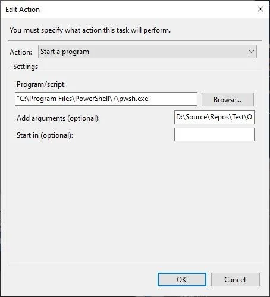

There might be scenarios where you need a VPN connection on demand and for a limited time only.

What else than using an OpenVPN connection which is triggered by a scheduled task in the Windows Task Scheduler? It seems to be the most obvious approach to handle this. No? Well, let me give you a little bit context on the actual requirement and what kind of unexpected obstacles came around the corner.

## The Use case aka Requirement

In one of my project assignments the customer came up with a request similar to this one: "We would like to backup the content from our Windows web server to NAS systems located in our various clients' intranets. This task shall be running on a daily schedule and the connection should only be established for the purpose of backup. For security reasons it shall run as a non-privileged user only."

Sounds not much of a challenge and feasible, right?

In principle, yes. The problem lies, as usual, in the details.

## The Approach

During an initial brain-storming session with my customer we threw a few ideas around and finally decided that creating a temporary VPN connection between the web server and the intranet of each client might be a robust and secure approach. This combined with the use of `rsync` to synchronise the actual data over the wire.

Hang on, you might argue now. Rsync could be used directly. And `rsync` has support for Secure Shell (SSH) which could provide the connection. Well, in general, I'd agree with you. However there had been a few additional constraints by the NAS system which unfortunately, although offering `rsync` and SSH capabilities, doesn't allow to use them together. Meaning the rsync transfer to the NAS would have to use the native protocol; which is non-encrypted and therefore insecure across public internet. Enabling SSH would allow us to connect to the NAS in an encrypted fashion however due to the lack of SSH forwarding capabilities in the NAS configuration the data transfer went nowhere.

To solve this riddle we decided to stick with plain `rsync` but operating through a secure VPN tunnel instead of an SSH tunnel. The NAS system provides both features as built-in applications and we were ready to go.

### Defining the scheduled task in Windows

Given previous experience creating a task in the Windows Task Scheduler here is a quick run-down of how I defined it. We are using PowerShell for the actual handling of the OpenVPN connection and the rsync data transfer.



The general attributes of the scheduled are task are mainly default. Except that the user account used to run the task has been adjusted to a non-privileged user account and is different to the currently logged in user account.



Quick check to show that the selected user account, here "MSCC", is a non-privileged one but assigned to administrative OpenVPN features.

Next, the Action(s) for that scheduled task is to launch an instance of PowerShell (Core) and execute a PowerShell script to open and establish an OpenVPN connection, run the `rsync` command to synchronise data between source and target systems, and then terminate the connection at the end.



Literally nothing fancy or extra-ordinary about the actual task scheduling. Kind of business as usual on a Windows operating system.

### Running the PowerShell script

The following PowerShell script is the result of a few iterations. It was initially created by me and then extended successively based on the feedback and inputs by [Markus Winhard](https://github.com/MWinhard) and [Silva Nair](https://github.com/selvanair).

```powershell
# Name of your *.ovpn file. Please change.
$OVPN_CNN = "MyConnection"
# IP address of the device you want to acceess thru the VPN connection. Please change.
$TARGET_IP = "192.168.1.195"

$EXIT_EVENT_NAME = "OVPN_" + $PID
$OVPN_CONFIG_DIR = $env:USERPROFILE + "\OpenVPN\config"
$OVPN_CONFIG_FILE = $OVPN_CONFIG_DIR + "\" + $OVPN_CNN + ".ovpn"
$OVPN_LOG_FILE = $env:USERPROFILE + "\OpenVPN\log\" + $OVPN_CNN + ".log"

function Send-NamedPipeMessage($Message)
{
    #$PipeName_OpenVPN3 = "ovpnagent"
    $PipeName = "openvpn\service"
    $ComputerName = "."
    [System.Text.Encoding]$Encoding = [System.Text.Encoding]::Unicode
    [int]$ConnectTimeout = 5000

    $stream = New-Object -TypeName System.IO.Pipes.NamedPipeClientStream -ArgumentList `
		$ComputerName, `
		$PipeName, `
		([System.IO.Pipes.PipeDirection]::Out), `
		([System.IO.Pipes.PipeOptions]::None), `
		([System.Security.Principal.TokenImpersonationLevel]::Impersonation)
    $stream.Connect($ConnectTimeout)
    $bRequest = $Encoding.GetBytes($Message)
    $stream.Write($bRequest, 0, $bRequest.Length)
    $stream.Dispose()
}

function Fire-ExitEvent($EventName)
{
	$ev = [System.Threading.EventWaitHandle]::OpenExisting($EventName)
	# Next line always returning True.
	# Even when the connection was not closed.
	$ev.set()   | Out-Null
	$ev.reset() | Out-Null
	$ev.close() | Out-Null
}

$Message = $OVPN_CONFIG_DIR + "`0"
$Message = $Message + `
	"--log " + $OVPN_LOG_FILE + `
	" --config " + $OVPN_CONFIG_FILE + `
	" --service " + $EXIT_EVENT_NAME + " 0" + `
	" --pull-filter ignore route-method" + "`0"
$Message = $Message + "`0"

# Start VPN connection.
Send-NamedPipeMessage $Message
Start-Sleep 10

# VPN connection established. Do something.
ping -n 1 $TARGET_IP | Select -Skip 1 -First 2
"Do something here..."

# Close VPN connection.
Fire-ExitEvent $EXIT_EVENT_NAME
Start-Sleep 2

# Run ping command again to proof that the connection is closed.
ping -n 1 $TARGET_IP | Select -Skip 1 -First 2
```

PowerShell script to establish and terminate an OpenVPN connection on demand

*Note: The name of the pipe is specific to OpenVPN version 2.x. It is different for OpenVPN version 3.x as described in the sources.*

The "Do something" section above would be the actual `rsync` command(s) to initiate the data synchronisation between the two source and target systems. For simplicity it pings the target only. Details on that one coming in a separate article. You can use the PowerShell script as a template for any kind of activities though.

## The Problem

As mentioned earlier, we were armed and ready to do some backup magic, however OpenVPN for Windows had different ideas. Well, to be fair not completely different but at least covering the essential part that we needed: running as a scheduled task.

In general, it would be an "easy" finger exercise on a Linux-based system using `crond` and an appropriate cron job to launch a bash script with the required user permissions. Nothing special on that part, unfortunately not so trying to do same on a Windows system. That wouldn't work yet.

While inspecting the Windows Eventlog I came across two relevant entries.

```
openvpnserv.exe 
   2.6.4.0 
   645cb955 
   ucrtbase.dll 
   10.0.19041.789 
   2bd748bf 
   c0000409 
   0000000000071208 
   5b80 
   01d9889f8691751c 
   C:\Program Files\OpenVPN\bin\openvpnserv.exe 
   C:\WINDOWS\System32\ucrtbase.dll 
   59fd8457-582d-48dd-87fe-568a9135a1cb 
```

The OpenVPN Interactive Service (openvpnserv.exe) logs an error for non-privileged user account

And the memory dump produced by `ucrtbase.dll`.

```
 1312317955627784568 
   5 
   BEX64 
   Not available 
   0 
   openvpnserv.exe 
   2.6.4.0 
   645cb955 
   ucrtbase.dll 
   10.0.19041.789 
   2bd748bf 
   0000000000071208 
   c0000409 
   0000000000000005 
    
   \\?\C:\ProgramData\Microsoft\Windows\WER\Temp\WERD208.tmp.dmp \\?\C:\ProgramData\Microsoft\Windows\WER\Temp\WERD266.tmp.WERInternalMetadata.xml \\?\C:\ProgramData\Microsoft\Windows\WER\Temp\WERD277.tmp.xml \\?\C:\ProgramData\Microsoft\Windows\WER\Temp\WERD285.tmp.csv \\?\C:\ProgramData\Microsoft\Windows\WER\Temp\WERD2B4.tmp.txt 
   \\?\C:\ProgramData\Microsoft\Windows\WER\ReportArchive\AppCrash_openvpnserv.exe_6dc84221ee8158a35483d694e071e4a6628f97_5a017d55_9aff1096-886b-4e64-8093-ca3f3491e932 
    
   0 
   59fd8457-582d-48dd-87fe-568a9135a1cb 
   268435456 
   2553f2508d0a614952364a3a498f9978 
   0 
```

Reference to a Windows Error Report (WER) / memory dump created by ucrtbase.dll

Both errors are not logged while running the task with privileged credentials. So, the root cause has to be somewhere within the `openvpnserv.exe` after all.

## The Research

An obvious approach was to practice a little Google-Fu (or Bing-Fu) and go through the various search results. Most of the time the results linked to either Stack Overflow, to its sister site Super User (StackExchange), or to a few private blog articles. Even the official OpenVPN site seems to have some content on that topic. However...

Either the discussions are all about starting an OpenVPN connection automatically on logging into the Windows system (most results), running permanent automatically started connections (the remaining majority), or it simply states it cannot be done (a few ones). Everything was pointing to the requirement of an interactive user session, meaning a logged in user, in order to be able to establish the OpenVPN connection per task scheduler.

Unfortunately using a permanent VPN tunnel automatically created by the OpenVPN service was not an option either. It had to be on demand. Because the Windows web server is running some multi-tenant applications and over time more clients would like to have their data backed up to their own NAS systems or any other private storage resources. For security and isolation reasons we cannot run multiple OpenVPN connections at the same time. Imagine the CIDR related troubles we might be facing.

Clearly that is not covering our initial requirement. The Windows web server can be rebooted any time as needed and there is surely no user constantly logged into the system after all. Plus, keeping RDP constantly open is a security-related concern.

So, what to do?

## The Solution

I started from the OpenVPN wiki page [OpenVPN Interactive Service Notes](https://community.openvpn.net/openvpn/wiki/OpenVPNInteractiveService) and tried to communicate with the named pipe provided by the service directly instead of relying on the use of either `openvpn.exe` or `openvpn-gui.exe`. It took me a bit to translate the message preparation as well as the exit event handling from the C source code samples to PowerShell using .NET syntax. Nonetheless, I was able to create a new PowerShell based client for the OpenVPN Interactive Service and I managed to establish a connection this way. However there were two main issues with it. a) I couldn't terminate the connection after the `rsync` data transfer had completed, hence I had to work with the rather harsh `taskkill.exe` command to kill the process. And b) it still wouldn't run in a logged-out user session using a non-privileged user account.

Luckily, OpenVPN is open source and publicly [hosted on GitHub](https://github.com/OpenVPN/). And for that same reason we opened an issue in the GitHub repository, providing as much details and logged information plus all the cases unsuccessfully tested as possible.

[OpenVPN GUI not connecting when started by Windows Task Scheduler #626](https://github.com/OpenVPN/openvpn-gui/issues/626)

As you might see in the thread of comments and details exchanged it turned out the `openvpn.exe` application being the root cause of the problem. The application is used by the `OpenVPN Interactive Service` on a Windows system which provides a non-privileged user access to privileged resources like setting the routes and others.

Looking at the actual resulting change of source code is even more fascinating. You should have a look at the commit 57aceb7 signed of by Silva Nair: [Interactive service: do not set target desktop for openvpn.exe process](https://github.com/selvanair/openvpn/commit/57aceb71af253d6a90d193e89a24353986eca62b) yourself. Fascinating,or?

And the rest is history, so to speak.

As of **OpenVPN version 2.6.5** - see [ChangeLog](https://github.com/OpenVPN/openvpn/commit/cbc9e0ce412e7b4276dd7063db905d83b1b32870) - it is now possible to run scripted and therefore scheduled tasks on Windows using a non-privileged user account to establish an OpenVPN connection.

```
- interactive service (windows): do not force target desktop for
  openvpn.exe - this has no impact for normal use, but enables running
  of OpenVPN in a scripted way when no user is logged on (for example,
  via task scheduler) (Github OpenVPN/openvpn-gui#626)
```

## Kudos to the OpenVPN people

A big Thank You to the developers of OpenVPN, in particular to [Silva Nair](https://github.com/selvanair) and [Gert Doering](https://github.com/cron2), for the patience with our concerns and provided logs, the understanding of the underlying problem, and the requirements to get this resolved, and of course the timely provided solution to finally enable scheduled, on-demand OpenVPN connections on Windows using a non-privileged user account.

Thanks to my long-time friend [Markus Winhard](https://github.com/MWinhard) for the initial task assignment, his patience and perseverance to figure out the root cause together with me.

FYI, the results of the scheduled data syncs / backups on the production system are beyond expectations. Approximately 240 GB are fully `rsync`'d in less than 15 minutes. Totally worth the extra time and effort.

<small>Image has been generated by Bing using the following prompt: "Create an image depicting OpenVPN on a Windows Server 2022 system and an encrypted tunnel for data transfer."</small>