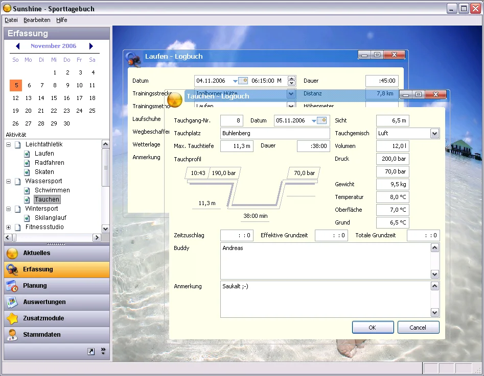

Als Software-Entwickler gehen mir ständig irgendwelche Ideen für Konzepte und Programmierung durch den Kopf... ich nehme an, dass das zum Berufsrisiko gehört. So auch in den letzten Tagen. Es lässt sich einfach nicht vermeiden.

Okay, da wir mit der aktuellen Projektentwicklung so ziemlich vor dem Abschluß stehen, und ich ab und zu mal ein wenig Abwechslung und Entspannung benötige, fröhne ich in meiner geringen Freizeit ein wenig dem Sport. Nicht sonderlich viel aber immerhin...

Und so ergab es sich die Tage, dass ich einfach mal ein neues Projekt begonnen habe, um Daten meiner sportlichen Aktivitäten zu erfassen und später irgendwann einmal auch statistisch auswerten zu können. Wow, noch eine Software im Sinne eines 'Personaltrainers'. Hast du nicht gesehen... Well, ja, irgendwie in der Art soll es etwas werden, aber vielleicht auch mehr. Der Ausgang dieses Projektes ist offen...

Das Interessante an diesem Projekt wird jedoch die Herangehensweise der Entwicklung sein. Denn obwohl oder gerade weil es in Visual FoxPro realisiert wird, möchte ich mit diesem Projekt ein persönliches Experiment angehen. Und zwar werde ich entgegen meiner üblichen Vorgehensweise diese Anwendung mal rein aus der Sicht des Anwenders aufbauen. Also, was sehe ich? Wie funktioniert es und wie fühlt es sich an. Ich meine, dass man solch eine Vorgehensweise 'Top-Down-Design' nennt, lasse mich aber gerne eines Besseren belehren.

Okay, also ausgehend vom Grundsatz **Hauptsache, es sieht gut aus!** schreibe ich aktuell an der Gesamtoberfläche und an den visuellen Komponenten. Und in der Tat sieht die Software bereits schon ein wenig stylisch aus. Anbei mal ein Screenshot:

Und damit sind wir sicherlich auch beim ersten Problem des Abends... Entwickler sind keine Designer, und wirklich gut aussehende Grafiken, Icons und Pictures sind auch in den Weiten des Internets schwer zu bekommen, zumindest wenn man sehr genaue Vorstellungen für das Gesamtbild der Anwendung hat. Falls sich also jemand oder auch mehrere Grafiker/Designer bereit erklären möchten, dem Projekt ein wenig was beizusteuern. Gerne, schreibt mir eine Mail, skypt mich an, etc...

Bei der Betrachtung der technischen Details möchte ich für die Entwicklung des Projekts folgende Rahmenpunkte abstecken:

- [Visual FoxPro 9.0 Service Pack 1](https://msdn.com/vfoxpro/)  
- [Acodey Komponentenbibliothek](https://www.acodey.de) - die eigentliche Power im Projekt  
- [GDIPlusX](https://www.codeplex.com/) aus dem VFPX Community Projekt  
- freie Grafiken und Icons  
- [unzählige Blogartikel](https://weblogs.foxite.com) mit Ideen, Anregungen und Lösungen

Das Datenbankdesign werde ich erst zu einem späteren Zeitpunkt angehen, denn aktuell schwirren meine Gedanken noch viel zu sehr durch den Kopf. Das wird sich mit der Zeit legen und dann folgt das ERM. Die Entscheidung für eine bestimmte Datenbank obliegt mir Dank Komponenten aus Acodey nicht. Dennoch wird der VFP DBC als erster Storage zum Einsatz kommen. Für die Ausgabe von Auswertungen werde ich in diesem Projekt auf die Fähigkeiten der VFP 9.0 Reportengine zurückgreifen. Aber später mehr dazu.  
Bis denne, JoKi