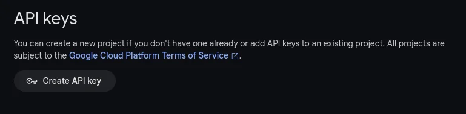
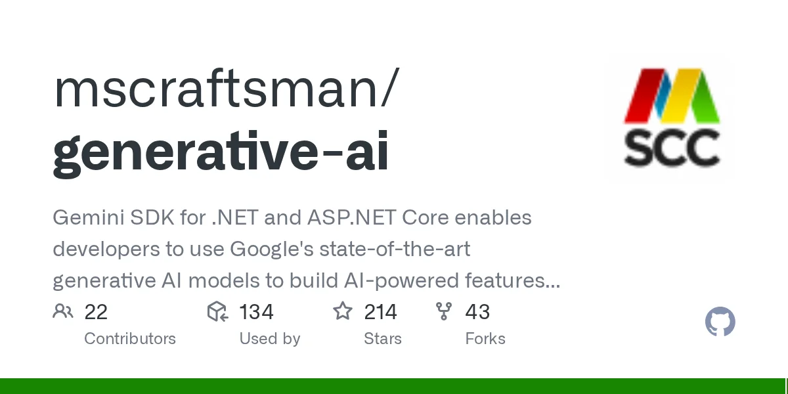

This quickstart shows you how to get started with the Gemini API using an SDK for .NET called [Mscc.GenerativeAI](https://www.nuget.org/packages/Mscc.GenerativeAI/).

## Prerequisites

To complete this quickstart locally, ensure that your .NET development meets the following requirements:

- .NET 6+ or
- .NET Framework 4.7.2+

The NuGet package also supports .NET Standard 2.0.

## Set up your API key

To use the Gemini API, you'll need an API key. If you don't already have one, create a key in [Google AI Studio](https://aistudio.google.com/app/apikey).

[Get an API key](https://aistudio.google.com/app/apikey) 

In order to keep private, sensitive information and secrets out of your source code repositories, it is recommended to use either Environment Variables, User Secrets, or a Key/Secrets Manager to retrieve data like an API key. Here, I'm going to create an `.env` file and place it into the project folder with the following content.

```
GOOGLE_API_KEY=<The generated Gemini API key>
```

To access the value of a variable that is defined in a `.env` file, use `$dotenv`. More details are described under [Environment Variables](https://learn.microsoft.com/en-us/aspnet/core/test/http-files?view=aspnetcore-8.0#environment-variables) in the official documentation.

Set the file properties with a Build action of `None` and copy instructions of `Copy, if newer`.

```
<None Update=".env" Condition="Exists('.env')">
    <CopyToOutputDirectory>PreserveNewest</CopyToOutputDirectory>
</None>
```

## Install the SDK / NuGet package

The SDK for .NET for the Gemini API is contained in the `Mscc.GenerativeAI` package. Install the dependency using dotnet CLI:

```
dotnet add package Mscc.GenerativeAI
```

See [README](https://www.nuget.org/packages/Mscc.GenerativeAI/) for alternative options, like the NuGet Package Manager.

## Initialize the Generative Model

Before you can make any API calls, you need to add a reference to the namespace `Mscc.GenerativeAI` and initialize the Generative Model.

```
using Mscc.GenerativeAI;

var googleAI = new GoogleAI(apiKey: Environment.GetEnvironmentVariable("GOOGLE_API_KEY");
var model = googleAI.GenerativeModel(model: Model.GeminiPro);
```

## Generate Text

```
var response = await model.GenerateContent("Write a story about a magic backpack.");
Console.WriteLine(response.Text);
```

## What's next

Explore the [README](https://www.nuget.org/packages/Mscc.GenerativeAI/) of the NuGet package which has more samples documented. All unit tests are accessible in the [GitHub repository](https://github.com/mscraftsman/generative-ai):

[GitHub - mscraftsman/generative-ai: Gemini AI Client for .NETGemini AI Client for .NET. Contribute to mscraftsman/generative-ai development by creating an account on GitHub.GitHubmscraftsman](../content/images/2024/04/generative-ai.webp)

If you're new to generative AI models, you might want to look at the [concepts guide](https://ai.google.dev/docs/concepts) and the [Gemini API overview](https://ai.google.dev/docs/gemini_api_overview) before trying a quickstart.

<small>Image credit: Gemini using prompt <i>Create an image showing the fast start of a race in motor sport.</i></small>