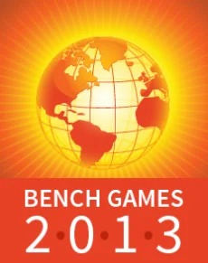
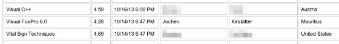

Only by chance I came across an interesting option for professionals and enthusiasts in IT, and quite honestly I can't even remember where I caught attention of [Brainbench and their 2013 Bench Games event](https://www.brainbench.com/xml/bb/landing/offer/home/promotion.xml?contentId=3049 "Brainbench and their 2013 Bench Games event"). But having access to 600+ free exams in a friendly international intellectual competition doesn't happen to be available every day. So, it was actually a no-brainer to sign up and browse through the various categories.  
Most interestingly, Brainbench is not only IT-related. They offer a vast variety of fields in their Test Center, like Languages and Communication, Office Skills, Management, Aptitude, etc., and it can be a little bit messy about how things are organised. Anyway, while browsing through their test offers I added a couple of exams to 'My Plan' which I would give a shot afterwards.

## Self-assessments

Actually, I took the tests based on two major aspects: '**Fun Factor**' and '**How good would I be in general**'...

Usually, you have to pay for any kind of exams and given this unique chance by Brainbench to simply train this kind of tests was already worth the time. Frankly speaking, the tests are very close to the ones you would be asked to do at [Prometric](https://www.prometric.com/ "Prometric") or [Pearson Vue](https://www.pearsonvue.com/ "Pearson Vue"), ie. Microsoft exams, etc. Go through a set of multiple choice questions in a given time frame. Most of the tests I did during the Bench Games were based on 40 questions, each with a maximum of 3 minutes to answer. Ergo, one test in maximum 2 hours - that sounds feasible, doesn't it?

## The Measure of Achievement

While the 2013 Bench Games are considered a worldwide friendly competition of knowledge I was really eager to get other Mauritians attracted. Using various social media networks and community activities it all looked quite well at the beginning. Mauritius was listed on rank #19 of Most Certified Citizens and rank #10 of Most Master Level Certified Nation - not bad, not bad...

Until... the next update of the [Bench Games Leaderboard](https://www.brainbench.com/xml/bb/landing/offer/promotion.xml?contentId=3050 "Bench Games Leaderboard"). The downwards trend seemed to be unstoppable and I couldn't understand why my results didn't show up on the Individual Leader Board. First of all, I passed exams that were not even listed and second, I had better results on some exams listed. After some further information from the organiser it turned out that my test transcript wasn't available to the public. Only then results are considered and counted in the competition. During that time, I actually managed to hold 3 test results on the Individuals...

Other participants were merciless, eh, more successful than me, produced better test results than I did. But still I managed to stay on the final score board:

  
*An 'exotic' combination of exam, test result, country and person itself*  
Representing Mauritius and the Visual FoxPro community in that fun event.

And although I mainly develop in Visual FoxPro 9.0 SP2 and C# using .NET Framework from 2.0 to 4.5 since a couple of years I still managed to pass on Master Level. Hm, actually my Microsoft Certified Programmer (MCP) exams are dated back in June 2004 - more than 9 years ago...

## Look who got lucky...

As described above I did a couple of exams as time allowed and without any preparations, but still I received the following mail notification:  
> *"**Thank you for recently participating in our Bench Games event. We wanted to inform you that you obtained a top score on our test(s) during this event, and as a result, will receive a free annual Brainbench subscription. Your annual subscription will give you access to all our tests just like Bench Games, but for an entire year plus additional benefits!"* -- Leader Board Notification from Brainbench

Even fun activities get rewarded sometimes. Thanks to [@Brainbench_com](https://x.com/Brainbench_com) for the free annual subscription based on my passed 2013 Bench Games Master Level exam.

It would be interesting to know about the total figures, especially to see how many citizens of Mauritius took part in this year's Bench Games. Anyway, I'm looking forward to be able to participate in other challenges like this in the future.