Although every year has 365.24 days each has its own, subjective performance. 2018 largely felt like it had been a fantastic ride for me right from the beginning. I'm going to break down my experience by month, and I hope it offers one or two interesting topics for you, too.

## January - Cyclones & Super Blue Blood Moon

Mauritius is prone to annual cyclone activities. This comes naturally for a tropical island and the year started directly with Berguitta. What a beauty she was:

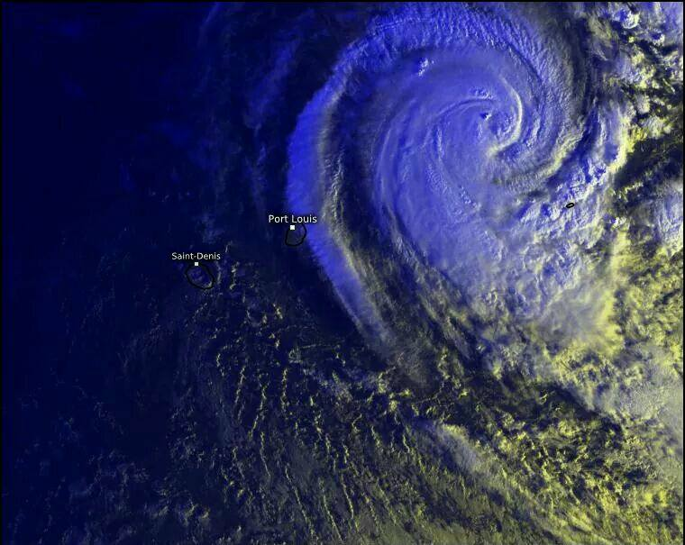

For reference, the distance between Port Louis and Saint-Denis is approximately 230 km (or 143 ml). Our local meteo service does not classify cyclones based on strength or intensity, we have warning classes only. Luckily, she passed by nicely and provided lots of rain only.

Later this month, we could experience a Super Blue Blood Moon, an event of a lifetime. We watched several locations live on TV.

The following article tubbed [Super Blue Blood Moon 2018: Here Are The Best Photos and Videos](https://www.space.com/39208-super-blue-blood-moon-guide.html) has lots of explanation and linked material on the event.

## February - Study Jam & Azure VM for the kids

In February I went forward to organise a Study Jam regarding Google's [Mobile Sites Certification](https://academy.exceedlms.com/student/path/2967). Although I was hoping to reach out to more community members it actually turned out to be the right number of attendees that came to the Study Jam.

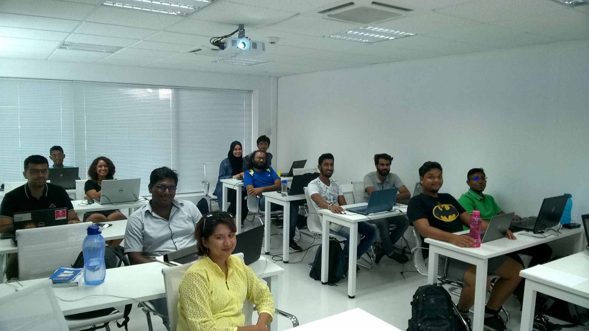

All learning material is provided by the Google [Academy for Ads](https://academy.exceedlms.com/) for free and passing the assessment can be done at the convenience of your own computer at any time. This certification is valid for one year as there is a constant flow of changes happening. I passed that certification already twice.

At home I was surprised by a little challenge coming from our children. They both have computer courses - [ICT skills at primary school](xref:azure-for-school) - at their school which covers basic use of applications from the Microsoft Office suite.

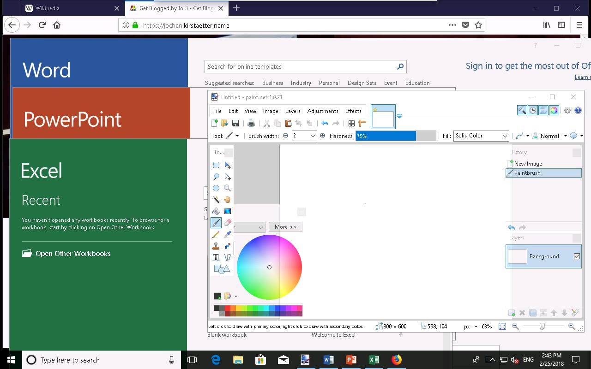

As their laptop is running on [Xubuntu](https://xubuntu.org/) Linux with [LibreOffice](https://www.libreoffice.org/) I set up a clean Windows 10 VM on Azure, and gave them a desktop icon to remote connect into that machine. Problem solved...

## March - 100 Days of Exam & SQL Server on Linux

After quite some time of active procrastination I thought that it was finally the right moment to get my stuff together and opt-in for industry exams. The main impulse came from my intention to go for the [MCSA: Linux on Azure](xref:mcsa-linux-on-azure) certification - which would allow me to literally combine both of my favourite activities in IT: Cloud computing (using Microsoft Azure) and Linux.

To keep myself accountable and focused on the challenge to learn and sit for the upcoming exams I drew inspiration from Alexander Kallaway's [100 Days of Code](http://100daysofcode.com/) to create a side-project on my own: [#100DaysOfExam](https://www.100daysofexam.com/)

: Log your learning effort and stay accountable](../content/images/2019/01/100DaysOfExam.png)

The project is [hosted on GitHub](https://github.com/jochenkirstaetter/100-days-of-exam/) and the hashtag [#100DaysOfExam](https://twitter.com/hashtag/100daysofexam) is used on Twitter to report daily progress. Would be great to see more aspirants using this approach to prepare for an exam. How about you?

At the end of March we had a fantastic meeting with great sessions on Linux (especially on SSHd), [SQL Server on Linux](http://sqlserveronlinux.com) and SQL Client tools on Linux.

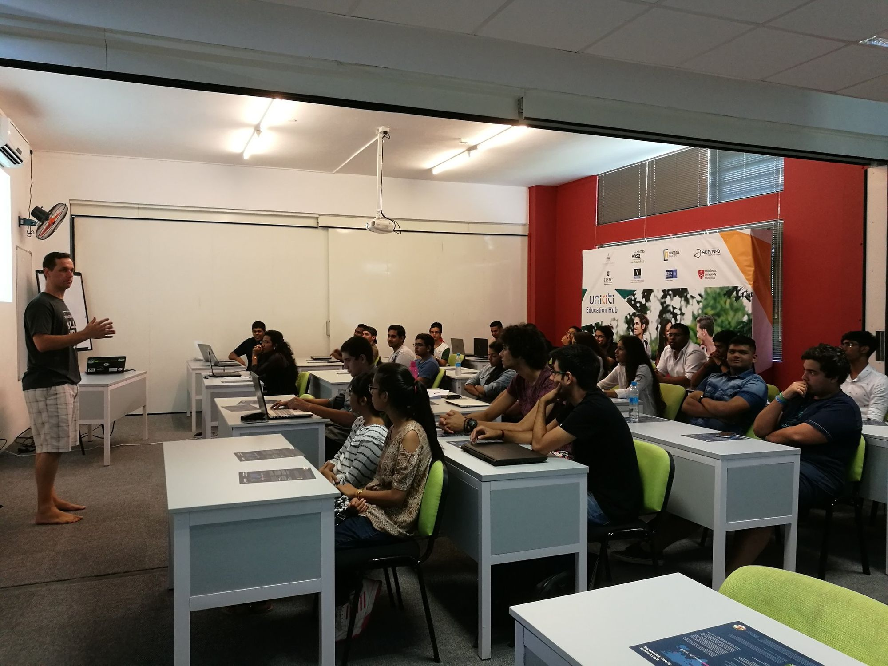

This joint meeting was organised by delegates of the [Linux User Group of Meta (LUGM)](https://lugm.org/), [Professional Association for SQL Server (PASS) Mauritius](https://www.mscc.mu/pass/) and [MSCC](https://www.mscc.mu/) and had over 60 attendees, mainly students of [SUPINFO](https://www.facebook.com/unicitieducationhub/).

## April - Out with the old, in with the new

My then current daily working machine was about to fade away. You know this kind of little issues that happen after a few years to laptops, i.e. battery broken, glitches on the keyboard, etc. When the hinges of the top lid started to cause trouble on the display it was overdue to purchase a new machine. Luckily, a friend had already planned their vacation on Mauritius and they offered some space and weight allowance in their luggage.

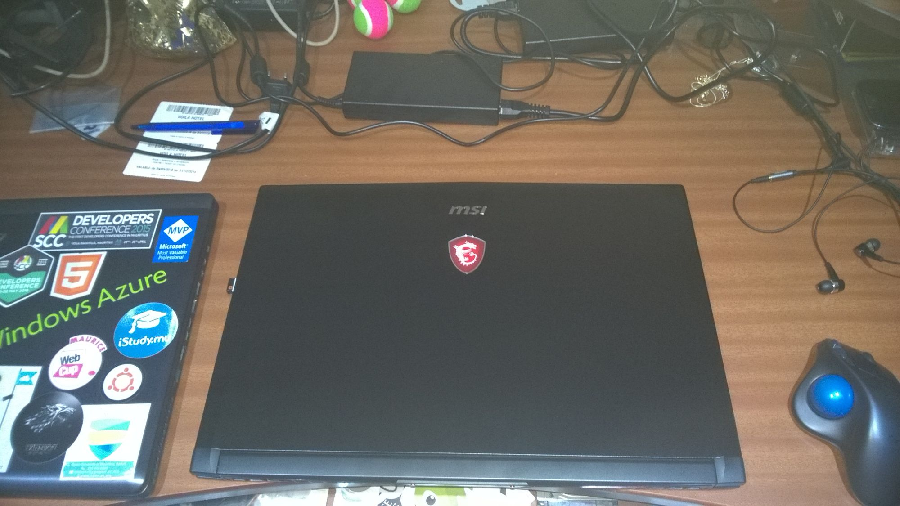

Like the previous laptop I purchased a recent MSI laptop with decent RAM, disk storage and NVidia GeForce GTX 1060 graphics that would allow me to hook up a VR headset at a later stage.

Also in April we, read: [MSCC](https://www.mscc.mu/), participated in Global Azure Bootcamp (GAB) to spread the message about Azure being "a cloud for everyone on every device".

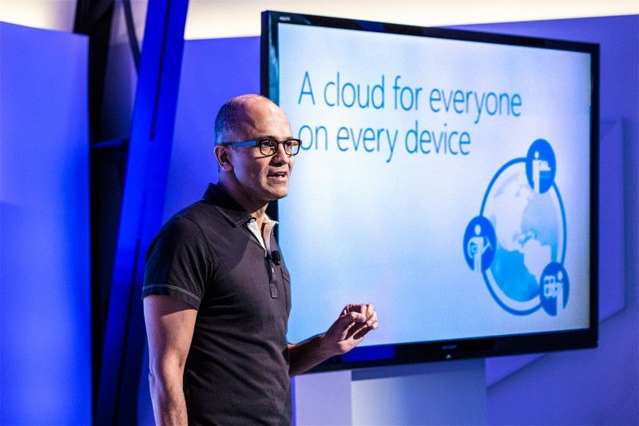

It was good fun and we were able to hand out Azure passes with some credits to all attendees.

Last year, I met [Magnus Mårtensson](https://twitter.com/noopman) - one of the organisers of GAB - at the annual C# Corner Conference and we had quite an exhaustive exchange about technology, politics, cultural differences & diversity, communities, and conference activities. Back then, we started to talk about an epic idea... Stay tuned for 2019.

## May - Developers Conference

May was fully focused on the IT event of the year here in Mauritius, at least for me and a lot of other software craftsmen: [Developers Conference](https://2018.mscc.mu/)

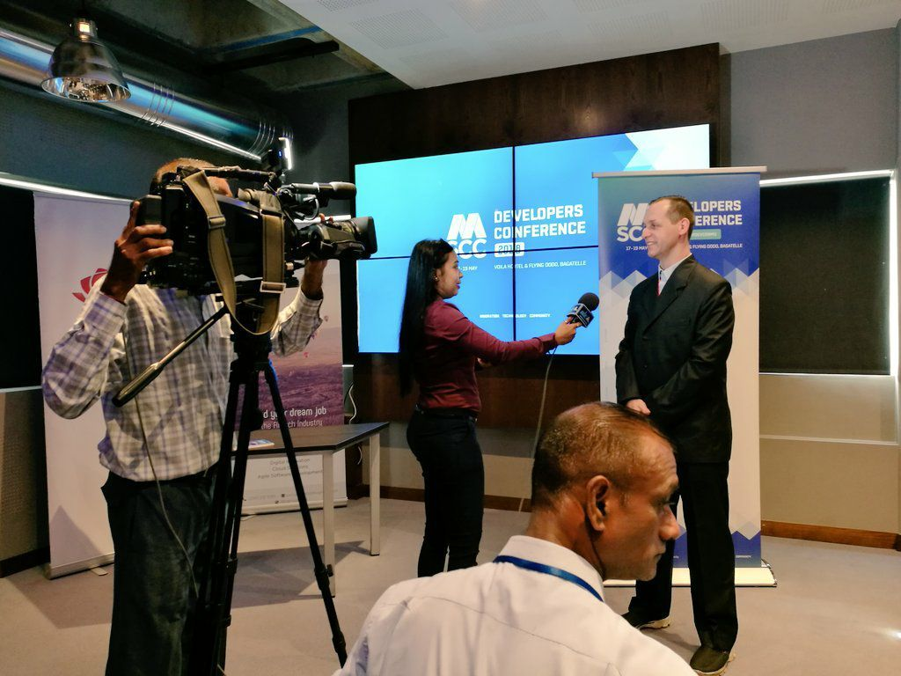

The event had been covered in the local newspaper [DevCon 2018: aux développeurs de jouer ce jeudi](https://www.lexpress.mu/article/331668/devcon-2018-aux-developpeurs-jouer-ce-jeudi) and this year we had Manishka as a dedicated social media promoter who did an outstanding job taking pictures and shooting live streams for Facebook from almost all sessions.

More details, photos and everything else are covered by a dedicated article on [Developers Conference 2018](https://www.mscc.mu/developers-conference-2018/). It was awesome!

## June - FIFA World Cup

Yup, we did it. Actually, we did extreme FIFA World Cup as I managed to watch *every* soccer match live this year.

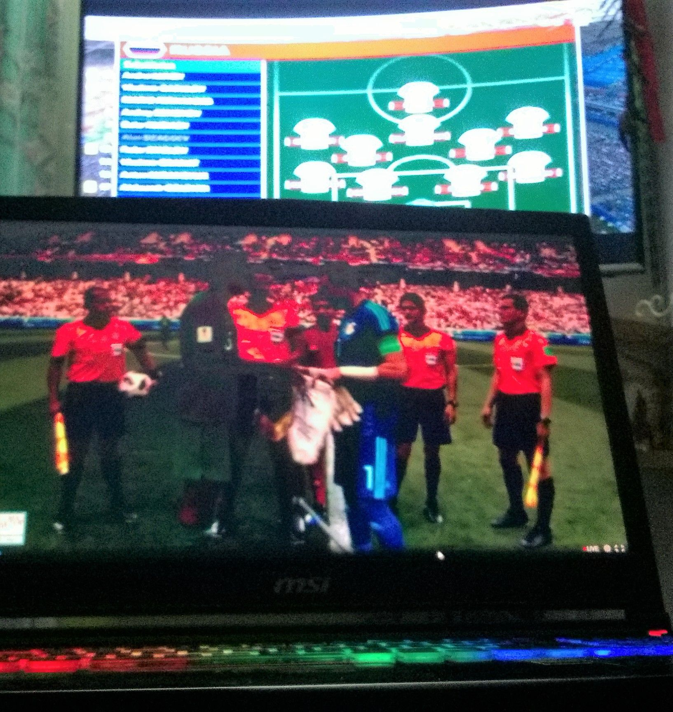

Additionally, the children were busy to collect stickers for their Panini album. We also went to a few sticker exchange gatherings. Where the kids even got interviewed and broadcasted on [l'express - Mondial 2018: au cœur de la panini mania](https://www.youtube.com/watch?v=WHZ-xn7zkgI).

<iframe width="480" height="270" src="https://www.youtube.com/embed/WHZ-xn7zkgI?feature=oembed" frameborder="0" allow="accelerometer; autoplay; encrypted-media; gyroscope; picture-in-picture" allowfullscreen=""></iframe>

Les Kirstätter talking about their interest in the World Cup 2018

Their "performance" starts at the 1:42 minute marker.

## July - Microsoft MVP Award

Woohoo, the most anticipated email showed up in my inbox - I have been re-awarded with the [Microsoft Most Valuable Professional (MVP) award](https://mvp.microsoft.com/). This year marked [my five years of being an MVP awardee](https://mvp.microsoft.com/en-US/MVP/profile/53d40e60-fe70-490e-8e73-2185b648f26f) - 2006, 2007, 2016, 2017 and now 2018. I'm really humbled by this recognition, and it motivates me to put more effort into my IT passion.

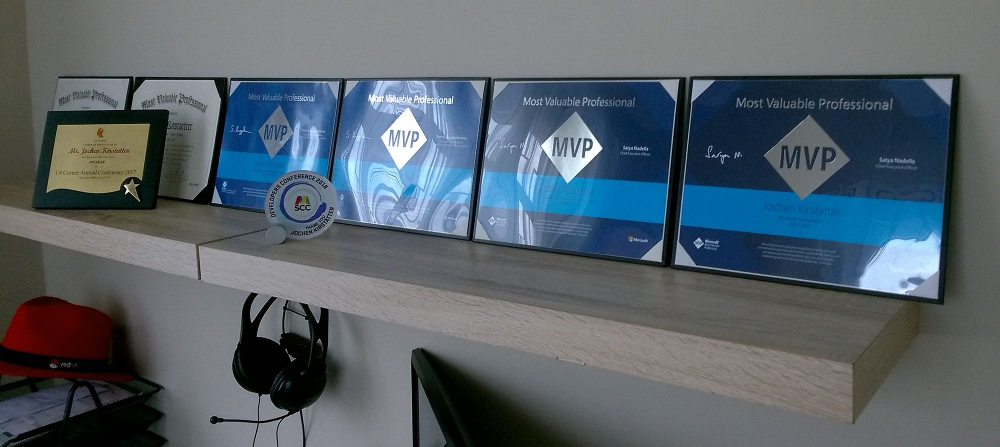

While I replaced my daily development machine I also used the opportunity to sent my previous laptop to refurbishment - general cleaning, replacement of broken parts, etc. -, and then I picked up the latest Windows 10 Insider version and [built the system from scratch](xref:windows10-quick-installation).

The hardware specs of that laptop are still top-notch and the built-in NVidia GTX 870M has enough juice to run a [DIY Windows Game Box (Steam, Itch, Xbox, Store, Scumm, etc.)](xref:diy-windows-game-box).

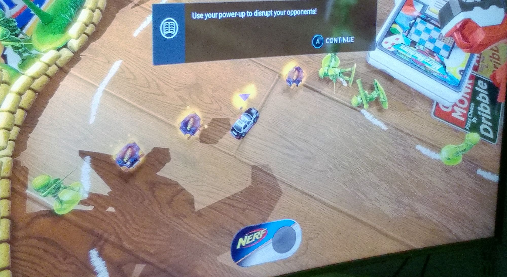

*Note:* Give it shot: "[Return of the Tentacle - Prologue](https://catmic.itch.io/return-of-the-tentacle)" is a fan project and the unofficial sequel to the iconic adventure game "Day of the Tentacle". Purple Tentacle is back and tries to conquer the world and enslave humanity once more. The three friends Bernard, Laverne and Hoagie make their way back to the mansion of the mad scientist Dr. Fred – time travel should help saving the world.

## August - To make or not to make?

Another strong month of community activities and collaboration between user groups. We teamed up some speakers form the Front-End Coders and MSCC to speak about various topics.

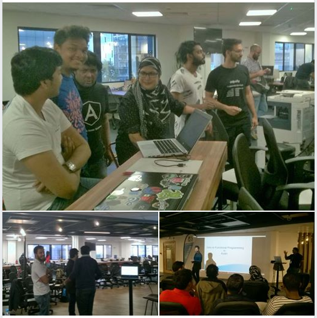

First time that we visited the Digital Factory by MCB in Port Louis. You can read the [full article about our Code Saturday](https://www.mscc.mu/code-saturday/) for more details and photos.

A new era has been launched by the [Mauritius Maker Community](https://www.facebook.com/groups/mauritiusmakers/?fref=mentions) (MMC). With the opening of their [MakerSpace](https://www.mscc.mu/makerspace/) there are now opportunities for makers of any age to meet, to exchange about their projects and to learn about electronic circuits. Especially the young makers...

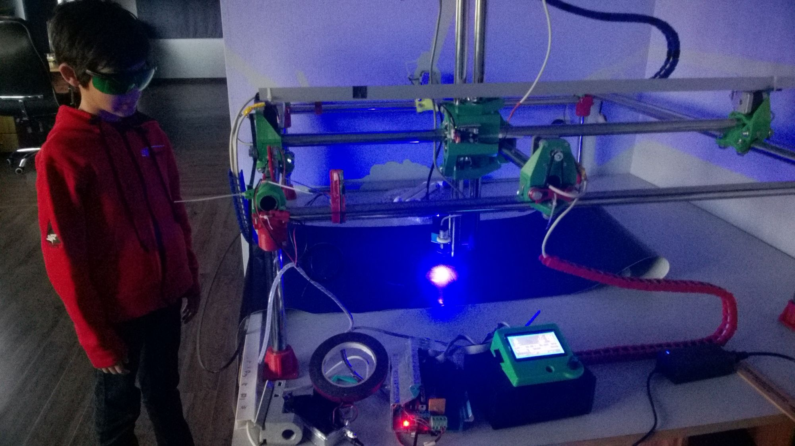

Talking about "making"... We got confirmation that our initiated "Project Jamba" is up well and scheduled for first half of 2019. I'm absolutely thrilled about our upcoming family member.

## September - Google Developer Groups

Surely, the highlight of the month, probably the year 2018, was the trip to Nairobi, Kenya to attend the annual, regional [SSA Community Summit 2018](xref:ssa-community-summit-2018) and [DevFest Nairobi](https://www.meetup.com/GDG-Nairobi/events/252860861/) with over 1,200 attendees.

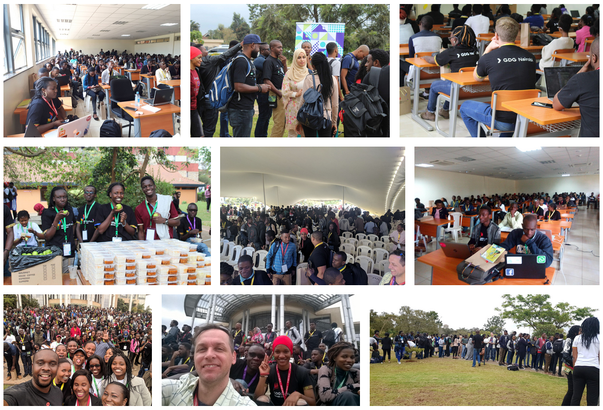

Having had this opportunity to meet and exchange with other GDG leads from the Sub-Saharan Africa (SSA) region was very enriching experience and it helped me to shift my view on a few things. There are too many names to list here, and it wouldn't give each single one enough credit either. It also encouraged me to foster my community activities more towards Google technology, and to look out for sustainable ideas that could be realised with modern technology.

But... (isn't there always some kind of "but"?) September also brought us our monthly MSCC meeting where I spoke briefly about the state of .NET Core 2.1 (with its long-term support), the roadmap to .NET Core 2.2 and 3, as well as the concepts behind [Blazor](https://blazor.net/).

Speaking of .NET Conf, one of my tweets asking about how to join the [.NET Foundation](https://dotnetfoundation.org/) had been picked up and answered live by [Scott Hanselman](https://twitter.com/shanselman), Community Director for the .NET Team and [Jon Galloway](https://twitter.com/jongalloway), Executive Director of the .NET Foundation during their session.

<iframe width="480" height="270" src="https://www.youtube.com/embed/MpWhVWkZzw4?feature=oembed" frameborder="0" allow="accelerometer; autoplay; encrypted-media; gyroscope; picture-in-picture" allowfullscreen=""></iframe>

Local chapter of .NET Conf in Mauritius - Check the world map...

Eventually it might look weird to someone else combining both Google and Microsoft technology stacks. For me it's absolutely the opposite and knowing about both worlds and the Linux universe provides me with a richer experience than a single entity could possibly offer.

## October - Family affairs & Hacktoberfest

As every year around this time we have family members on vacation here. Given our daughter's interest in the Catholic faith it happened that we all came together to celebrate her "trinity of events" in one day.

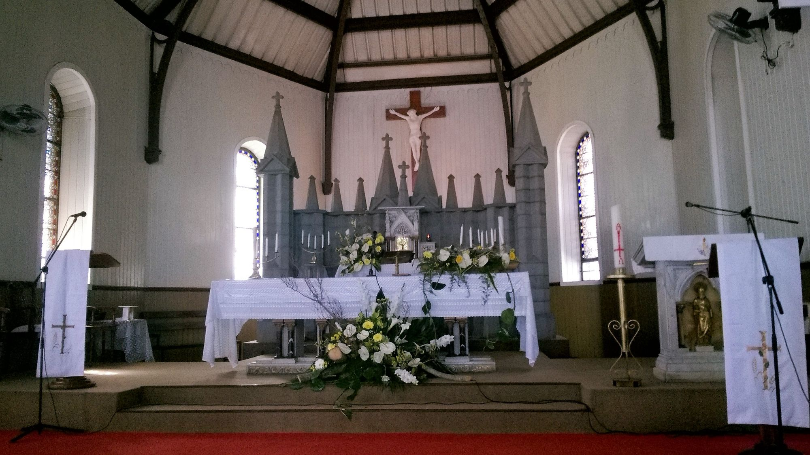

The sermon was beautifully arranged and I had to do my part, too. I was cited to the podium (NR: bema or ambol) to read a passage in German language. Standing up there in front of the community reciting was quite some fun actually.

In regards to software community all flags were up for [Hacktoberfest](https://hacktoberfest.digitalocean.com/). And our MSCC members Humeira and Pritvi stepped up to get everything organised for the monthly meeting.

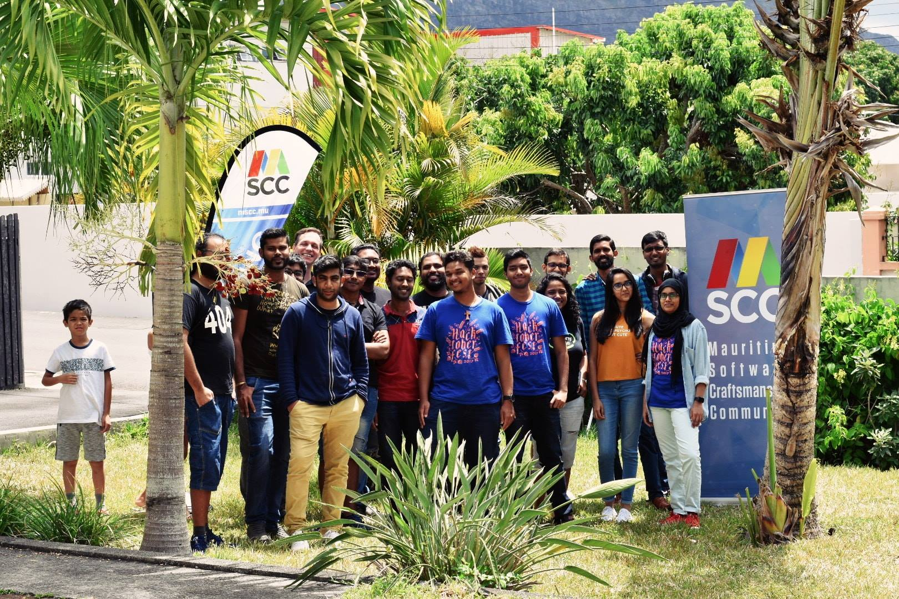

Did anyone actually receive their T-shirt already?

Oh, not to forget. The fruits of [#100DaysOfExam](xref:100-days-of-exam) started to bring in the harvest. Back in August, I sat for three Microsoft beta exams and I passed them all. Meaning, I'm now a [Microsoft Certified: Azure Administrator Associate](https://www.microsoft.com/en-us/learning/azure-administrator.aspx). Stupid me, actually twice... ;-)

## November - Relaxing & more beta exams

As part of my family stayed for almost four weeks with us, we decided to use the time and go on a *small* road trip down South of Mauritius.

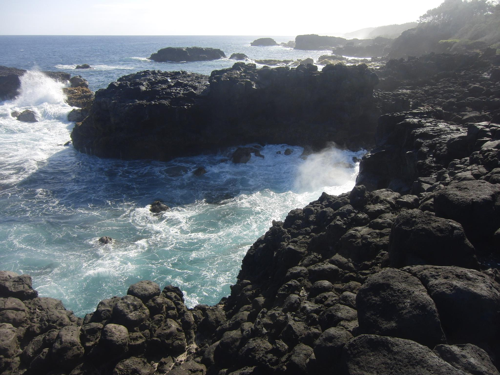

On the southern shores of Mauritius are no protective reefs and the sea shows its majesty on the volcanic rock formations. Connecting with nature is pure and highly recommended to relax.

Later on, I sat for two more Microsoft beta exams. Usually I would go onto the website of [Pearson VUE](https://home.pearsonvue.com/) to choose a test centre and fix an appointment for the exam. Unexpectedly, for those two exams everything turned out to be new. Why? Because none of the local registered test centres would offer those exams, and therefore I had to choose the only available option, the [Online Proctored Exam](https://www.microsoft.com/en-us/learning/online-proctored-exams.aspx).

 / [Unsplash](https://unsplash.com/?utm_source=ghost&utm_medium=referral&utm_campaign=api-credit)](https://images.unsplash.com/photo-1454165804606-c3d57bc86b40?ixlib=rb-1.2.1&q=80&fm=jpg&crop=entropy&cs=tinysrgb&w=1080&fit=max&ixid=eyJhcHBfaWQiOjExNzczfQ)

The procedure is well-documented online, so I thought, but there are some nifty details to pay attention to. I am going to spare you with all details here but will write an article about my experience doing those two online proctored exams. Pinky promise!

*Note:* I'm still waiting for the results of both beta exams. There had been some re-designing at Microsoft Learning regarding the exam content. Crossing fingers!

## December - DevFest Mauritius & Happy Holidays

The month of December started with a Bang! What an amazing event [DevFest Mauritius 2018](https://www.mscc.mu/devfest-mauritius-2018/) was. As part of the GDG Mauritius we managed to bring over 100 attendees and 15 speakers together and to have conversations about the latest technology stacks and trends offered through Google.

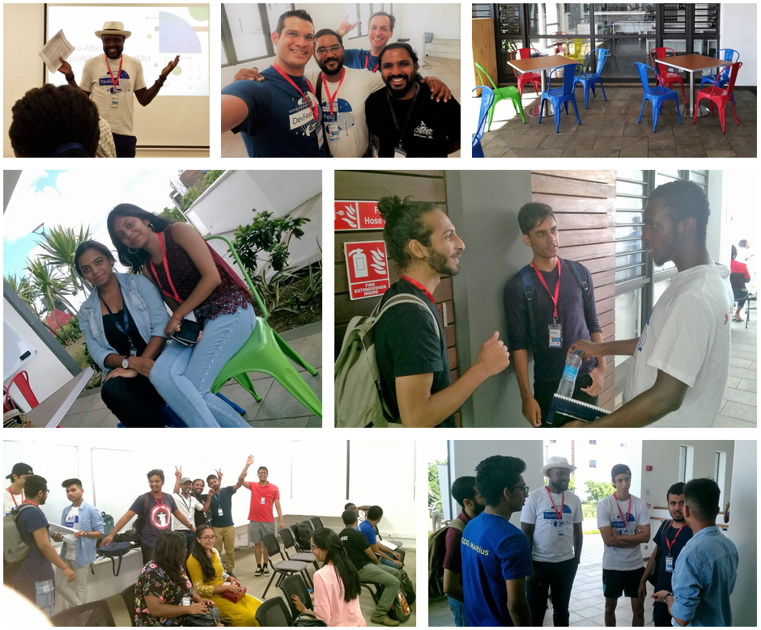

DevFest was well planned and executed thanks to lots of helpers involved in the process.

Although I was content with the number of Microsoft exams already taken, I couldn't ignore an unexpected announcement of another beta exam by Microsoft. Hence I seized the opportunity and scheduled my 6th appointment of 2018 at a local test centre. More about that adventure in a future article.

## Final thoughts and outlook on 2019

Each time I am doing something that I love to do or that I'm passionate about I get the subjective impression that the spacetime continuum has a different beat and the days pass by faster than usual. Reflecting on some of the activities done throughout the year I have to admit that 2018 was an amazing one.

With the next junior hacker joining us soon I am going to shift my focus on my family. All those previous months I received strong support from my lovely wife, which during 2019 will be my turn to return the favour.

This being said, I am also looking forward to pass on a number of administrative tasks to other members of the MSCC. I have no doubt that this will help to grow the user group, and I'm sure that a few craftsmen are ready and up for the challenge.

Happy New Year 2019!

PS: New exam appointments are already in the making.

<small>Image credit: Sebastien Pointu</small>
