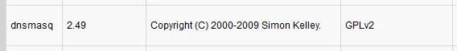
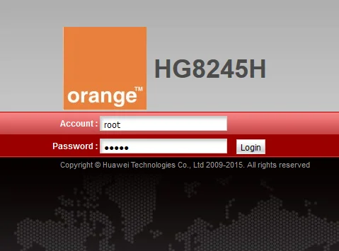
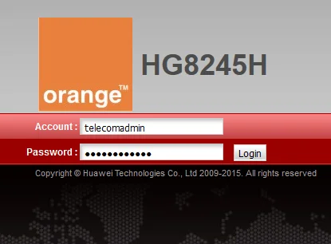
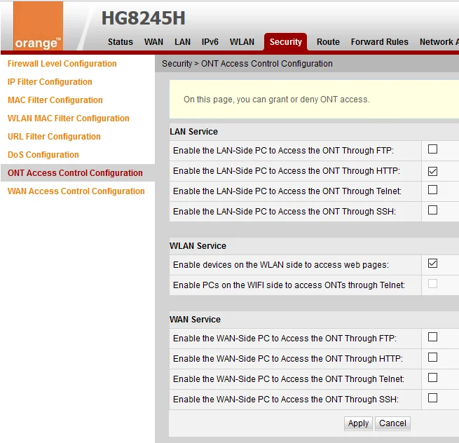
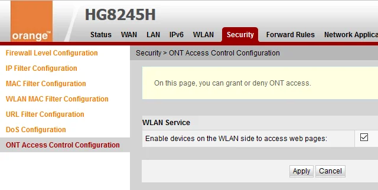
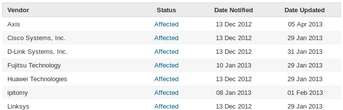
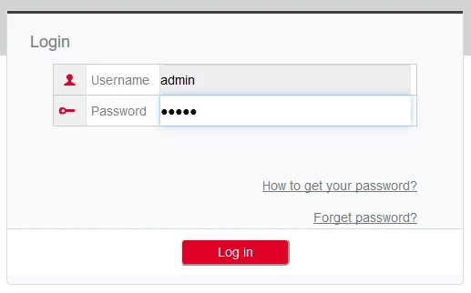
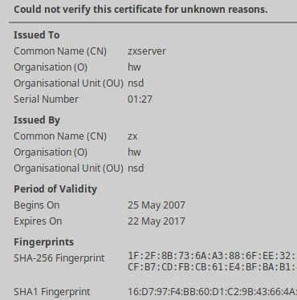
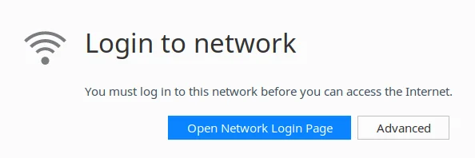
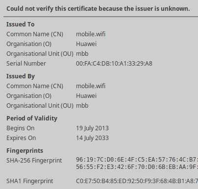

Inspired by a [posting on Facebook](https://www.facebook.com/abdoolirshaad/posts/10212819924564944) and a developing late night conversation with [Irshaad Abdool](https://www.facebook.com/abdoolirshaad) on Monday I got some motivation to have a closer look myself.

Irshaad mentioned in his article on [Vulnerabilities on MT FTTH Routers](http://irshaad.me/wp/vulnerabilities-on-mt-ftth-routers) that the local IT community [hackers.mu](https://hackers.mu) organised their first vidcast, or better said Hangouts On Air, talking about same issue actually. Please find the recording on [YouTube](https://www.youtube.com/watch?v=eqTjPkCK5mU):

<iframe width="560" height="315" src="https://www.youtube.com/embed/eqTjPkCK5mU?rel=0" frameborder="0" allowfullscreen=""></iframe>

The hangout session explains and shows several security concerns related to the FTTH modem/router/gateway provided by Mauritius Telecom. This is related to an article [Behind the Masq: Yet more DNS, and DHCP, vulnerabilities](https://security.googleblog.com/2017/10/behind-masq-yet-more-dns-and-dhcp.html) on the Google Security Blog. The main issue is due to a popular software used in such devices: [Dnsmasq](http://www.thekelleys.org.uk/dnsmasq/doc.html).



Although, I find this report already serious I was a bit more concerned about the default settings, enabled features, and login credentials of same router. So, let's get a bit more into the details.

## Huawei HG8245H provided by Mauritius Telecom

After successful installation of a fiber line at your premises you'd be given access to the new modem. The default password to access the WiFi network might be written on the box already, and you might be told that the login credentials for you are default.



Just in case, it's *root : admin* - and as tech-savvy person you feel like master of the fiber connection at your place. In my case, I started to explore the web interface to immediately change the account password, then to review all the current settings, and to make minor adjustments like SSID and password of the wireless network, etc.

The first speed bump occurred when I wouldn't be able to change the DNS server information in the DHCP configuration for all the attached client devices on the network. That's kind of weird. Since early days of internet usage I prefer to rely on public DNS infrastructure like either Google DNS or OpenDNS rather than being stuck with the assigned DNS servers of the internet service provider (ISP).

Having had bad experience already back in Germany, and after several interesting DNS mismatches produced by local ISPs, I prefer to use reliable and trusted resources. Additionally, given that I have young internauts in our household I appreciate the extra layer of security and safety that services like [OpenDNS FamilyShield](https://www.opendns.com/home-internet-security/) offer. You might like to read more about [Introducing FamilyShield Parental Controls](https://umbrella.cisco.com/blog/2010/06/23/introducing-familyshield-parental-controls/) on the Cisco Umbrella Blog.

This already happened some weeks back and other modem owner reported that they would be able to change the DNS setting without any obstacles. Well, something is different here, maybe I'm doing it wrong...

### Surprise... Second account: Super Administrator

During the conversation with Irshaad and based on other indications where people mentioned certain settings that are **not available** in my web interface of the modem, it became obvious that I'm definitely doing something wrong.

The router actually has a second, more powerful user account enabled by default. Yup, that one isn't communicated to mere mortals like the regular consumer. That additional account gives you an extended web interface to manage your device. Depending on the preferences of your ISP this might vary but here in Mauritius the credentials are *telecomadmin : admintelecom*



Eventually, you have to search the default credentials on the web in case those ones don't work for you.

Now, it would be possible to change DNS settings and much much more. The missing settings magically appeared on the web interface, and so forth. It's like an advanced mode of modem configuration.

> The administrator uses the initial password. If you want to change this password, please contact the telecom carrier. For details about how to change the password, see the Security Maintenance from [http://support.huawei.com](http://support.huawei.com).

Well, there is just one major problem here: That password **cannot** be changed! Meaning, every customer of Mauritius Telecom that has this modem is exposed. Good bye, internet access for friends and family. Anyone connected to your network would be able to log into your device.

### The web is not enough: Telnet

Referring back to the Hangout by hackers.mu there are other default settings and features sleeping in your modem. For example, apart from the familiar web interface to manage your router there is another access via Telnet enabled by default. Telnet itself is an unencrypted protocol to connect to remote systems and manage them. Telnet is from the early days of internet usage when security concerns were not that obvious or present.



Log in with the **super user account** and navigate to `Security > ONT Access Control Configuration` to review and uncheck any Telnet access options, as shown in the screenshot above. If you logged in using the regular *root* account you might see the following instead.



Afterwards, you should verify that Telnet service has been disabled using a Command Prompt, PowerShell or Terminal, like so:

```
$ telnet 192.168.100.1
Trying 192.168.100.1...
telnet: Unable to connect to remote host: Resource temporarily unavailable
```

### Are there more services running?

Despite disabling Telnet on the modem it might also be interesting to check whether there are other ports accessible on the device. Well, turns out there are...

```
PORT      STATE    SERVICE   VERSION
21/tcp    filtered ftp
22/tcp    filtered ssh
23/tcp    filtered telnet
53/tcp    open     domain    dnsmasq 2.49
80/tcp    open     ssl/http?
49152/tcp open     upnp      Portable SDK for UPnP 1.6.18 (Linux 2.6.34.10_sd5115v100_wr4.3; UPnP 1.0)
49153/tcp open     upnp      Portable SDK for UPnP 1.6.18 (Linux 2.6.34.10_sd5115v100_wr4.3; UPnP 1.0)
```

Those filtered entries are the UI-disabled settings, as you might have seen on the screenshot above, but state *filtered* means that the service itself is actually running and only access to the port is controlled.

So, what about those two other open ports listening on TCP 49152 and 49153? Searching the net gives me mainly clues about Windows Vista/7 changed settings of user-assigned ports and there's another observation related to this device from someone in Mexico. My best guess is that it might be related to remote management service used by Mauritius Telecom to configure the modem. This is based on my observation that they were able to re-configure my VoIP settings remotely after I called the service centre.

The [Portable SDK for UPnP](http://pupnp.sourceforge.net/) "provides developers with an API and open source code for building control points, devices, and bridges..." - yup, that confirms my idea.

Reading [Vulnerability Note VU#922681 - Portable SDK for UPnP Devices (libupnp) contains multiple buffer overflows in SSDP](https://www.kb.cert.org/vuls/id/922681) and linked papers gives me the chills!

> Devices that use libupnp may also accept UPnP queries over the WAN interface, therefore exposing the vulnerabilities to the internet.

The vulnerability note reports that several manufacturers have been notified about this issue, Huawei is among them.



Literally, any HG8245H modem by Mauritius Telecom can be accessed and exploited remotely without you knowing it. Thanks for that...

### Additional resources

The video discusses more details on dnsmasq which I do not want to elaborate here. Feel free to watch the recording completely. And other bloggers wrote on the same topic. Check out the following articles online:

- [Vulnerabilities on MT FTTH Routers](http://irshaad.me/wp/vulnerabilities-on-mt-ftth-routers/)
- [Modem Insecurity - Hackers.mu](https://bilaal.abdelhassan.name/modem-insecurity-hackers-mu/)
- [Hackers.mu VideoStream #1 : Modem Insecurity in Mauritius](https://tunnelix.com/hackers-mu-videostream-1-modem-insecurity-in-mauritius/)

Nitin mentions in his article that the configuration file can be downloaded and decrypted. Very interesting indeed.

Fellow craftsman and hacker Bilaal went into a full analysis of every open source software used, and wrote a [Vulnerability Compilation on Huawei HG8245H Routers](https://bilaal.abdelhassan.name/vulnerability-compilation-on-huawei-hg8245h-routers/) with more details. Scary stuff!

Feeling safe not using Mauritius Telecom but Emtel?  
Fear not, let's have a closer look...

## Huawei B68A provided by Emtel

Some years back Emtel introduced a GSM gateway device to offer their customers more comfort and options than the USB dongles available at that time. Branded as *Home & Office* internet connectivity you received a device with 4 LAN ports, POTS outlet for a regular telephone and some wires. Emtel operates on the mobile network solely, and that device is a 2G/3G router for their network. The SIM card in the device is locked and therefore cannot be used in a regular mobile phone. The B68A device, also known as the *black modem*, is capable of transfer speeds of up to 21 Mbps.



Initially, you would log into the device using the default credentials *admin : admin*. Next, you are requested to change the password for security reasons. Maybe you might interested in other default [Router Username and Password for Huawei Routers](http://setuprouter.com/router/huawei/passwords.htm).

Although Huawei is the same manufacturer the user experience in the web interface is completely different compared to the modem used by Mautitius Telecom.

By default there is no Telnet service active:

```
$ telnet 192.168.1.1
Trying 192.168.1.1...
telnet: Unable to connect to remote host: Resource temporarily unavailable
```

And so far, I didn't see any options to enable Telnet. Also, there is no second account with higher permissions in that device. Next, I did a quick port scan and it also shows that only the necessary ports are open after all.

```
PORT    STATE SERVICE    VERSION
53/tcp  open  tcpwrapped
80/tcp  open  http?
443/tcp open  ssl/https?
```

Be aware that an open port 53 for domain name service (DNS) might lead to an outdated dnsmasq software. Great to see that Huawei or Emtel uses an SSL certificate but accessing the B68A via HTTPS gives you a warning, like this:

```
192.168.1.1 uses an invalid security certificate. 
The certificate is not trusted because it was issued by an invalid CA certificate. 
The certificate is not valid for the name 192.168.1.1. 
The certificate expired on 22 May 2017, 05:55. The current time is 19 October 2017, 08:45. 
Error code: SEC_ERROR_CA_CERT_INVALID 
```

Further inspection of the SSL certificate might give you the following details.



Clearly, this is a self-signed certificate. It's kind of surprising to see that it has been created back in 2007, long before this device even existed.

Anyway, providing fewer features makes the device a bit safer compared to the HG8245H.

## Huawei B310S-927 provided by Emtel

In recent times Emtel needed an alternative to their *Airbox* package, an attempt to provide Fiber-over-the-Air (FTTA) data connectivity. Well, a new product called *WiFi Plus* was created, and it is bundled with another GSM gateway which is capable to run on 4G mobile infrastructure.

Given some low network coverage, continuous issues in regards to stable connectivity, and flaky Skype conversations I went to one of the Emtel showrooms to upgrade the above mentioned B68A device to the newer B310s model, aka the *white modem*. If you're having similar issue I highly recommend you to *upgrade* your device. You won't regret it.  
**Note:** You can attach the external antenna of the B68A to the second connector of the B310s and run the device with two external antennas for better coverage.  
**Note:** By disabling all internet-related features the B68A can still be used as a network switch.

The default login experience using *admin : admin* is equivalent to the B68A and although there are more options Huawei packed less features into that modem. Meaning, there is no Telnet access active and there is definitely no second account with super administrative rights.

```
PORT     STATE SERVICE    VERSION
53/tcp   open  tcpwrapped
80/tcp   open  http       webserver
443/tcp  open  ssl/https  webserver
8080/tcp open  http-proxy webserver
```

DNS service is available on the device, as expected, and there are three ports for a web interface. Accessing the HTTP address would be the standard. Navigating to the HTTPS address in Firefox gives you a hint regarding a network login, like this:



Although interesting I didn't get anything useful out of this. And the proxy URL on port 8080 simply redirects you back to the regular HTTP address. Nothing to see here.

Compared to the B68A modem the self-signed SSL certificate in the B310S is still valid, and can be added to your local certificate store for future reference.



And at least the Common Name (CN) as well as the Organization (O) fields are better choices, too. Only drawback would be that the modem announces itself as *homerouter.cpe* in DNS instead of *mobile.wifi* which could lead to another SSL warning.

## Now what?

The choice of internet connection is yours obviously. I'm using services of both major ISPs in Mauritius. Since years I was using Emtel exclusively but in regards to their failure to deliver Airbox in Flic En Flac before general availability of Fiber by Mauritius Telecom we decided to give it a try.

With the incidents happened on the international routes, like defect switch in Monaco or damage of sea cable, I have to say that I welcome the possibility to choose between service providers. Emtel used to be my first choice but the stability and advantages of Fiber over the hassles observed on the mobile network changed my opinion.

Either way, there seems to be no best choice (yet?) in Mauritius. Either you get higher latency on a mobile network infrastructure with lack of resilience, or you have to deal with flawed router hardware that needs special treatment and hardening.

## Alternatives are available... but not easy!

Given the observations made above, I went down a different road. Actually, I purchased a [Raspberry Pi 3](http://amzn.to/2zy7pgP) with integrated WiFi, installed a Linux distribution on it and converted the device into a transparent network bridge with additional services and features.

Now, all other devices on the network connect to the Raspberry Pi first, which then routes internet traffic to the modem of the ISP. The configuration of the modem is down to the bare minimum, just enough to provide access to the interweb.

What is your experience? Do you have a different approach? Anything missing in the article? Please, leave a comment and talk about your ideas and recommendations.

Cover photo by [Rucksack Magazine on Unsplash](https://unsplash.com/@rucksackmag).