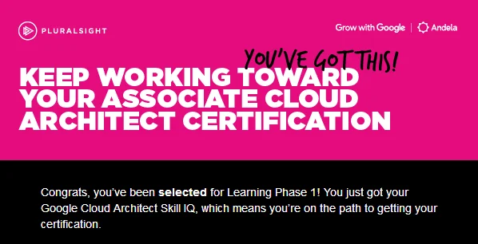
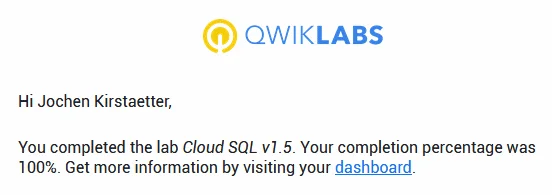
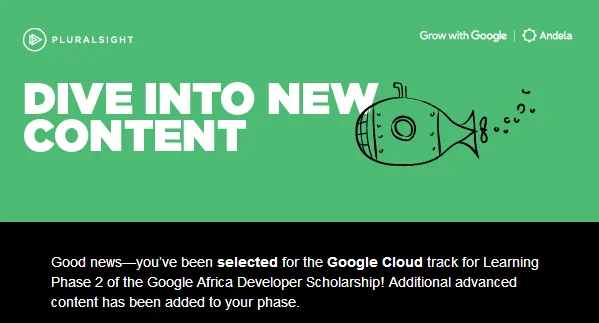
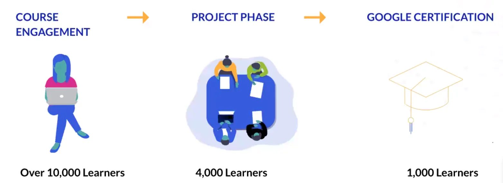
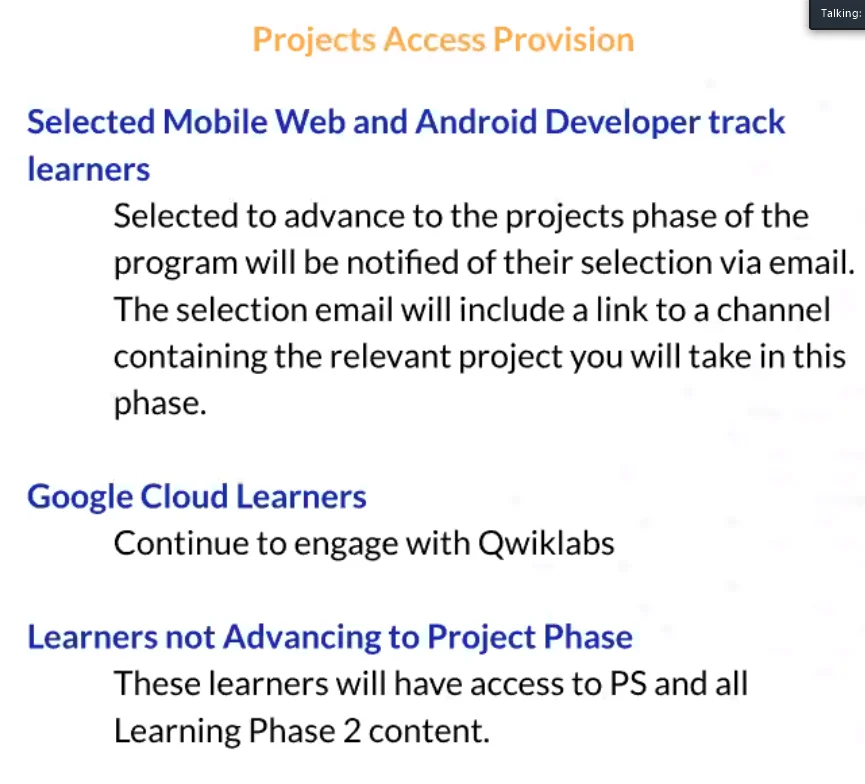
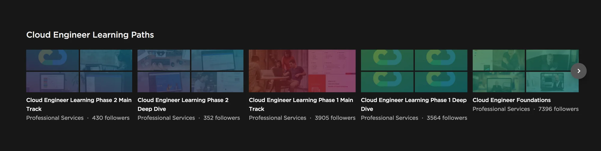
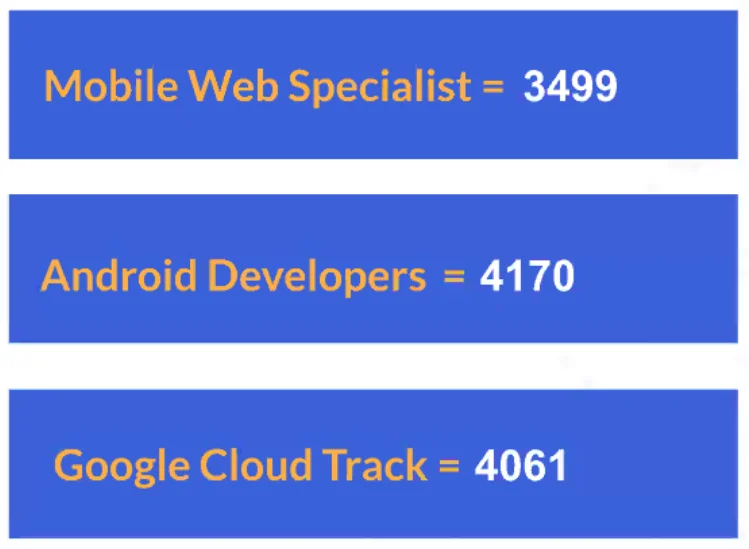

Following my participation as a mentor in the program 3.1 of the [Andela Learning Community (ALC)](https://andela.com/alc/) end of last year, I seized the opportunity again to be part of the ALC 4.0 program. As a mentor for the Mobile Web Specialist certification and additionally as a learner for the Google Cloud track.

## Why participate?

The challenge, or better said the chance, came at the right time for me. After I passed a few of the role-based certifications for Microsoft Azure, I had an increasing curiousity to check out other cloud options. Being an [organiser of GDG Mauritius](https://www.mscc.mu/gdg-mauritius/) I thought that having a look at the Google Cloud Platform (GCP) might be the best fit.

Plus, the ability to exchange and network with other like-minded and interested participants from all over Africa seemed to be too good to ignore. Those are the main reasons I signed up for the ALC 4.0 program. Access to a sub-set of the Pluralsight course library or the chance to be selected for an exam voucher for the Google certification were never a criteria to take part in this challenge. Since years I'm [an active subscriber of Pluralsight](https://app.pluralsight.com/profile/joki), and the [investment in my personal growth](https://www.slideshare.net/jkirstaetter/confirm-your-knowledge-with-a-certification) regarding the Google exam(s) is it worth any way.

## Application phase

At the end of April, I received an email from Andela that they are launching the [\[ALC 4.0\] Google Africa Certification Scholarship Opportunity](https://andela.com/insights/andela-launches-alc-4-0-in-partnership-with-google-and-pluralsight/). The program will deliver training to 30,000 more learners across 15+ countries in Africa and will run for a period of 6 months starting from 15th May 2019.

Participants are given an offer to **Grow with Google** and to receive education from Pluralsight supported by the [Andela Learning Community](https://andela.com/alc/). And after a quick consultation with my calendar and work schedule I submitted my application to the [Google Africa Certification Scholarship program](https://www.pluralsight.com/partners/google/google-africa-developer-scholarship) a week or two later.

The program advertised the following for successful participants:

> Learners who make it through the four sessions may be eligible for an opportunity to **take the MWS, AAD, or ACE exam at no cost**, with the certification exam fee paid for by Google.

<small>For reference:<br>
MWS - Mobile Web Specialist<br>
AAD - Associate Android Developer<br>
ACE - Associate Cloud Engineer
</small>

Again, for me it was the perfect opportunity to explore and probably go deeper into the bells and whistles of GCP. Having some pressure to stay focused on the task helps. And why not? Probably get certified as [Associate Cloud Engineer](https://cloud.google.com/certification/cloud-engineer) and going further for more Google certifications.

So, let's do this... Additionally, I applied as a mentor to allow learners to effectively participate and apply their learning. Sharing some knowledge isn't a bad idea after all.

BTW, all information about this program, Grow with Google and Andela [ALC 4.0], can be found [here](https://andela.com/insights/andela-launches-alc-4-0-in-partnership-with-google-and-pluralsight/) and [here](https://help.pluralsight.com/help/grow-with-google-andela).

## Selection phase

Right from the start the pressure to continue in the program was present:

> [...] we have received a large number of applications whereas we will only be selecting 30,000 learners.

The onboarding is quite clear about what is expected from participants. Be active, be present and enjoy the journey as much as possible.

Fulfilling the criteria of the selection phase took merely a few days. The content provided by Pluralsight is highly interesting and actually not directly related to the track I applied for. There are really good video courses that I wasn't even aware of that they existed on the learning platform. Clearly, a huge win situation already then.

When I got the email, I thought that 30,000 seats would be too small for such a huge region. And during the [ALC 4.0 Scholars Onboarding Call](https://www.youtube.com/watch?v=Wm9NXmuXM-8) (see 6:32 min mark) it was said that a whooping 121,700 unique applications have been received. Whew!

## Learning Phase 1

The selection phase ran till end of May, and by mid of June I received the confirmation that I've been selected for Phase 1 of the ALC 4.0 program.



Selected participants got an invitation to a dedicated Slack workspace in order to keep informed about the latest news, updates, and activities in the program.

Overall a very good idea. Although at certain times the flood of posts, questions and comments felt a bit overwhelming. Certain information, links and common answers, had to be given over and over again despite the fact that it had been clearly communicated by the team of ALC - either per email or announcement in the #general channel(s) on Slack.

During the ALC 4.0 Global Meeting, fellow learner A-J Roos did a great job in regards to tips and tricks in the Mobile Web Specialist track. You might like to read more about it here: [Andela ALC 4.0 Global Meetup - My Thoughts](https://asjas.co.za/blog/andela-alc-4-0-global-meetup-my-thoughts/). Although I have been asked to do similar for the Cloud track, I couldn't seize this opportunity due to other priorities that had been planned since a while on that day.

Finally, phase 1 picked up some momentum. Apart from the broad advancement criteria of the program to pass into the next phase the team at ALC came up with two additional challenges: 5 Days of Code Challenge

The challenges were about practicing real-world tasks in the GCP using the Qwiklabs environment with sponsored student accounts. During the first iteration of the [#5DaysofCodeChallenge](https://x.com/search?q=%235DaysOfCodeChallenge) participants had to run 15 hands-on-lab courses, and another six labs during the second run. For each successfully completed lab we had to take screenshots of the confirmation emails and share them in a public folder on Drive or Dropbox. You can find mine here.

- [ALC 4 Cloud: Challenge 1.0](https://drive.google.com/drive/folders/1Ka_-oUMPd_TpgOm7I83paR8idQ7EO8do?usp=sharing)
- [ALC 4 Cloud: Challenge 2.0](https://drive.google.com/drive/folders/12jnCNI9hIT_5GaWJBCjZuwCVgJbg3YN-?usp=sharing)

That was good fun, at least for me.

Given that access to all Qwiklabs as part of the video modules that had been available since the very beginning of phase 1, I completed some of them already ahead of the challenge announcements. Oh, and surprisingly both challenges had been extended by a few days.



Having had those two challenges with their tight schedule seemed to have separated the amount of participants. Surely, there were the ones that completed all labs and submitted their screenshots within the given deadlines. Then, there were the ones struggling with technical issues on the Qwiklabs platform or with environmental constraints at their location, i.e. power outage, lack of access to stable internet connectivity, only temporary access to a computer, etc. And last but not least, the *passive* ones who might have lost interest to continue.

You can view a walkthrough of a Qwiklabs lab in the [ALC Global Meetup 2.0](https://www.youtube.com/watch?v=b3rukAj40QE). It's nicely explained and demoed by fellow learner Oyewole.

Either way, phase 1 ended on a positive note for me. I managed to watch all video courses in the Main Track and the Deep Dive. I worked through almost all of the 26 Qwiklabs, some of them even multiple times. And I was looking forward to the outcome of the election process.

## Learning Phase 2

Watching learning videos on Pluralsight became an almost daily morning routine, and completing the two challenges regarding GCP was good fun, too. I even managed to tweet (ir-)regularly about my progress during that time. The official end of phase 1 came... and by mid of August the following appeared in my inbox:



Wow! It feels great to stay in the program and to be able to continue this amazing journey with approximately 10,000 other learners from Africa. Earlier this week, I read that MWS learner A-J Roos also progressed to phase 2. Congrats on that. He penned down another great article on his blog: [Being selected for Google Africa Certification Scholarship Phase 2](https://asjas.co.za/blog/being-selected-for-google-africa-certification-scholarship-phase-2/).

The communicated time frame of phase 2 has a larger period than the previous one:

> Over the next 4 months we will support you on your journey to completing this program.

Actually, I'm a bit concerned with this. Four months is quite some time and keeping the motivation high for learners, including myself, might be a tough challenge for program managers and program assistants at ALC. Time will tell...

Pluralsight assimilated tons of video material for phase 2, and I really mean it. Again, there are two channels available - namely Main Track and Deep Dive - which provide us with approximately 10 hours and a whooping 105 hours of video modules. That should do for 4 months.

More interesting, what started with a possible certification as Associate Cloud Engineer as main target has now been extended with course material covering [Professional Cloud Architect](https://cloud.google.com/certification/cloud-architect) and [Professional Data Engineer](https://cloud.google.com/certification/data-engineer).



Given the additional content I'm really looking forward to get deeper into GCP. And how the numerous services and features directly compare to the ones in Microsoft Azure. Rest assured there are going to be more articles soon.

And last but not least, we have been presented with the phase 2 timeline of the ALC 4.0 program:

```
Phase 2 (11,000 learners) (18 Aug - 14 Oct)
Project (4,000 learners) (23 Oct - 9 Nov)
Certification (1,000 learners) (9 Nov - 31 Nov)
```

That looks pretty neat, and there are supposedly meetings planned every two weeks. A little less than two months to watch roughly 115 hours of videos and working through a number of Qwiklabs is reasonable in my opinion.

## Learning Phase 2 - Project

With close connections to software development and actually writing source code in both tracks, Mobile Web Specialist and Android, I understand that the pinnacle of the ALC 4.0 program might be an interesting capstone project. However I am really wondering how this is supposed to work in the Cloud track.

Perhaps doing the planning and architecture of an infrastructure deployment allowing a smooth, resilient and elastic operation of a specific requirement could be a possible scenario to realise. Probably with some implementation of Cloud Functions or microservices on [Google Kubernetes Engine](https://cloud.google.com/kubernetes-engine/) (GKE).

That's my speculation at the moment. I'd be glad to see a capstone project. Let's wait and see...

*Update:* It seems that the Cloud "project" is working with even more Qwiklabs. Okay, that should work well for me.



## The ALC 4.0 program on Youtube

The following is more of a reference section for myself. Nonetheless, the video recordings of the [Andela Learning Community](https://www.youtube.com/channel/UCJWcJtP2SErCRDw1xZnTISQ) on Youtube are informative about what we are actually doing.

- [ALC 4.0 : Ask Me Anything Session 1](https://www.youtube.com/watch?v=23xh-4Nxy9E)
- [ALC 4.0 Scholars Onboarding Call](https://www.youtube.com/watch?v=Wm9NXmuXM-8)
- [ALC 4.0 Global Meetup](https://www.youtube.com/watch?v=dOVycqW5A-c)
- [ALC Global Meetup 2.0](https://www.youtube.com/watch?v=b3rukAj40QE)
- [ALC 4.0 Expert Session](https://www.youtube.com/watch?v=4c7mRLi9FCs)
- [ALC 4.0 Phase I Grand Finale Event](https://www.youtube.com/watch?v=jNVcL9Y4H-s)
- Phase II: [Google Africa Developer Scholarship Learner Onboarding](https://www.youtube.com/watch?v=VKVx9xFnj_U)
- [Google Africa Developer Scholarship Learning Phase II Onboarding (V2)](https://www.youtube.com/watch?v=2O8q4EnK4Xc)

**Note:** More videos to be added as they happen...

## Some random thoughts...

If you made this far. Thanks for your interest and your time spent reading this article. Following are some aspects that caught my attention since joining the ALC 4.0 program.

If you would like to know more or in case you would like to share some of your experience in regards to GCP, ALC 4.0 or maybe Slack kindly write your feedback in the comment section below.

### Number of participants



With the announcement of phase 2 I had a look at the figures on Pluralsight as well as the #general channels on Slack, and came up with the following observation:

```
AFAIK, phase 1 had ~ 33,000 learners in total across all three tracks. Which would be roughly 10k +/- per track. If you check the #general channel you'd see there are hardly 6k learners that joined the Slack workspace, and then < 4k on Pluralsight.

With a rough goal of around 10-12k learners in phase 2, this would mean that as good as every active learner of Cloud phase 1 literally passed into the next stage...

At the end of phase 2 there's another selection process for approx. 4-5k in total (or ~1.3k per track) for the project phase. Seeing the current number of followers on the Phase 2 learning paths.. Well, this might have a similar outcome in a few months.

Just running the numbers, and having wild guesses... What's your opinion here?
```

At the time of writing there were less than 4,000 participants in the #general channel on the ALC 4 Phase 2 Slack workspace. This channel has been created for all 3 tracks. Now, after a few days in it's way below the projected 10,000 learners.

Additionally, see the number of followers in the Learning Phase 2 channels on Pluralsight per track:

- ~1,500 for Cloud Engineer
- ~1,300 for Associate Android Developer
- ~1,800 for Mobile Web Specialist

That's not even half the amount in total, and some participants are subscribed to more than one track.

*Update:* During the recent Google Africa Developer Scholarship Learner Onboarding call the actual numbers of phase 2 have been revealed. More than previously expected.



With that extensive amount of time plus the reduced number of participants in phase 2 I'm wondering whether there is going to be the initially mentioned capstone project at the end of phase 2.

### Video content and lab instructions

Cloud technology and services are in a constant movement. Whether it is AWS, Microsoft Azure, or Google Cloud Platform doesn't make any difference after all.

Since the recording of the video modules there had been updates and modifications in GCP's Cloud Console. Most remarkable is the absence of the `Cloud Launcher` in the sidebar navigation menu. It is called `Marketplace` nowadays.

I also noted that the course material by Google has been published on the Coursera platform previously. The recordings on Pluralsight however have been re-branded with an introduction at the beginning as well as a summary at the end of each module. And the shortcut URLs to the Qwiklabs have been added in-between.

Speaking of Qwiklabs, in general the instructions of each lab are precise and provide sufficient information and guidance to successfully complete the lab. However, there had been a few cases where the described steps are not matching the UI of the Google Console anymore. It's not as bad as the [feared magical tutorials](xref:curse-of-magical-tutorial) but certain features are at a different location or have been renamed. Once you figure that out it's possible to finish the lab. I left my feedback with Qwiklabs, and hopefully those glitches will be corrected in the coming reviews.

And there are the video recordings of the [Andela Learning Community](https://www.youtube.com/channel/UCJWcJtP2SErCRDw1xZnTISQ) on Youtube.

### Environmental obstacles

The number of posts where participants reported about issues in regards to their environment was unfortunately very impressive. The problems ranged from electricity outages (sometimes even over several days) and therefore no connection to the internet, over weak stability and high cost of data connectivity (which impacted/interrupted the execution of Qwiklabs), to all sorts of technical observations.

Touching wood, despite living on a remote island I didn't have to worry about such commodities after all. The power grid work absolutely fine, and it's been awhile since we had serious issues regarding electricity. Our ADSL fixed line works smoothly, and there had been no interruptions on the sea cables recently. And compared to other African nations it seems that the prices for data packages are more affordable, too.

### Quality of communication in the Slack channels

In general, it is a pleasure to follow the (endless) chats in the Slack workspace(s). They are both interesting and informative. I managed to provide assistance to a number of topics. Most certainly, there are topics which get a bit more interest, and that there are several people probably asking for same or similar content.

However, the inability (or perhaps laziness) to read a few lines up in the channel to check whether an issue has been discussed already is kind of mindboggling to me. There had been cases where exactly the same issue has been posted by different people in consecutive sequence in shortest period of time. Crossing fingers this is going to improve with fewer people in phase 2.

### Curiousity among peers

To close this article I would like to emphasise that there is genuine interest among peers to learn from each other. Recently, I was asked [four questions about my professional background](xref:alc4-slack-questions) and opinion about software engineering.

It's really good that this is happening, as we can learn from each other at any time.

### Amazing collection of resources

During phase 1 we had a Slack channel specifically for additional resources and further reading on GCP. This is an invaluable trove of treasures with literally hundreds of interesting links. Unfortunately, Andela runs Slack in the free tier which has a limit of 10,000 active posts. Meaning, a solid number of posts is now inaccessible.

Another scholar and Learning Community Ambassador (LCA), using the alias *Banky*, created an online repository on GitHub: [My ALC 4.0 Handbook](https://bankole2000.github.io/alc4.0strategy/) which covers all kind of links to the video channels on Pluralsight. Highly recommended!

**Note:** Pluralsight officially published the channels and courses of the ALC 4.0 program here: [What courses do I have access to with the ALC 4.0 program?](https://help.pluralsight.com/help/andela-4-0-courses)

Maybe it motivates you to follow this journey on your own merits.

<small>Image courtesy: Andela Learning Community</small>