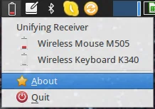
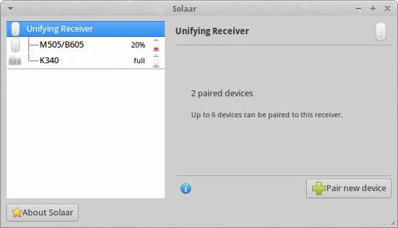
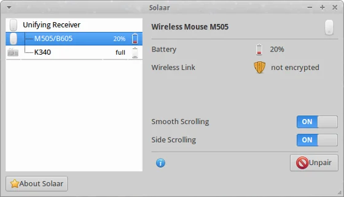

Despite the fact that I'm using Logitech products since ages it is only now that I accidentally came across a Linux application that allows me to configure their Unifying devices: [Solaar](https://pwr.github.io/Solaar/index.html "Solaar")

> *Solaar is a Linux device manager for Logitech's [Unifying Receiver](https://logitech.com/en-us/66/6079 "Unifying Receiver") peripherals. It is able to pair/unpair devices to the receiver, and for most devices read battery status.*
>
> *It comes in two flavors, command-line and GUI. Both are able to list the devices paired to a Unifying Receiver, show detailed info for each device, and also pair/unpair supported devices with the receiver.*

Sounds great, or? And finally, the tool gives you some comfort compared to the existing application available for Windows or Mac OS, like battery status indicator or the ability to pair devices to the receiver you would like to have them (in case that you use multiple receiver at the same time).

  
*Solaar system tray indicator shows battery status of connected devices*

  
*Solaar displays the connected Logitech Unifying Receiver*

  
*Some Logitech devices can be configured with Solaar*

## Supported devices

I got my Laptop peripherals as part of a laptop set, namely K340 keyboard and M505 mouse, which are listed as supported devices. In case that you are not sure, check whether your USB hardware is supported by Solaar. You can check that by running the following in a console or terminal application:

`$ lsusb -d 046d:`  
`Bus 001 Device 005: ID 046d:c52b Logitech, Inc. Unifying Receiver`

The output should be similar to mine.

There is an extensive [list of supported devices and supported additional features](https://pwr.github.io/Solaar/devices.html "list of supported devices and supported additional features") on the Solaar site. Don't miss that one.

## Installation of Solaar

There are either pre-built packages for some distributions available or you can get the sources to compile it on your system. Have a look at GitHub for more details. Running Ubuntu (or any Ubuntu-based flavour) the installation is fairly easy. Add the existing PPA to your list of software repositories, update and install:

`$ sudo add-apt-repository ppa:daniel.pavel/solaar`  
`$ sudo apt-get update && sudo apt-get install solaar`

After that you'll have a new shortcut in the Accessories menu. On the first launch, I got a message that Solaar doesn't have the userrights to access the USB devices. Simply pull out your receivers and plug them back in - that resolves the issue.

## Console application

Solaar is both - a graphical tool as well as a console application. This might come in quite handy even though I'm not sure how. Anyway, you can get information about your Logitech devices, pair/unpair and configure your peripherals via solaar-cli command. Following is the output of my system:

`$ solaar-cli show`  
`Unifying Receiver [/dev/hidraw2:13F19F3F] with 2 devices`  
` 1: Wireless Mouse M505 [M505/B605:0255918D]  `  
`2: Wireless Keyboard K340 [K340:001074B7]`

Surprisingly, nothing that we didn't know already. The help switch (-h) provides a brief overview of what can be done.

Please, feel free to leave a comment about how solaar-cli could be helpful compared to the UI version of the tool.

## But what happened to dasKeyboard?

Read more about that in separate article about [How to choose the right keyboard for coding](xref:the-right-keyboard-for-coding "How to choose the right keyboard for coding").

**Solaar** is a Linux device manager for Logitech’s [Unifying Receiver](https://logitech.com/en-us/66/6079) peripherals. It is able to pair/unpair devices to the receiver, and for most devices read battery status.

It comes in two flavors, command-line and GUI. Both are able to list the devices paired to a Unifying Receiver, show detailed info for each device, and also pair/unpair supported devices with the receiver.
