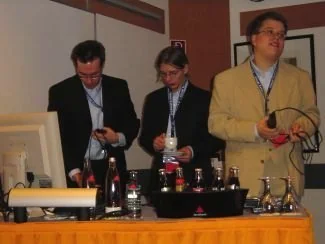
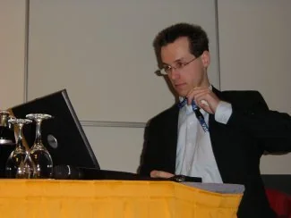
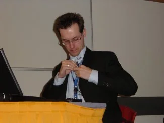

The following is an excerpt from the UniversalThread conference coverage of the [German Visual FoxPro Developer Conference 2004](https://www.universalthread.com/ViewPageConference.aspx?ID=19 "German Visual FoxPro Developer Conference 2004") written by Hans-Otto Lochmann, Armin Neudert and myself.

> ## TRACK Active FoxPro Pages
>
> Back in 1996 Peter Herzog invented a FoxPro based solution to provide intranet capabilities for one of his customers. Nearly at the same time Rick Strahl had the same task and created WestWind Web Connection (WWWC). The aspect that developers have to have a full Visual FoxPro development environment to create WWWC solutions was the starting point of a "personal sportive competition" of Peter to write his own solution. But the main aspect has to be that it doesn't rely on a full VFP version in order to run. The VFP runtime should enough and the source code has to be compiled and interpreted on the fly. So, as Microsoft released Active Server Pages a name for Peter's solution was found: Active FoxPro Pages (AFP).
>
> During the years many drawbacks, design aspects as well as technological hassles forced ProLib Software to refactor the product. This way many limits like DCOM configuration, file-based information transfer between Web server and AFP, missing features (like upload forms or other Web servers than IIS) and extensibility were eliminated. As a consequence ProLib Software decided to rewrite Active FoxPro Pages in mid of 2002 completely. Christof Wollenhaupt, before his marriage known as Christof Lange, and Jochen Kirstätter had to solve this task. AFP 3.0 was officially released at German Devcon in November 2002. Today AFP has six distributors world-wide and there is a lot more information available online than before version 3.0.
>
> Directly after a short welcome speech by Rainer Becker, Jochen Kirstätter - aka JoKi - opened today's AFP track and introduced the basic concepts how Active FoxPro Pages works in general, explained the AFP terminilogy and every single component, and presented a small Walk-Through about how to write an AFP-based Web solution. Actually his presentation slides themselves were an AFP Web application. This way it was easy to integrate accompanying AFP samples on the fly. Additionally it was shown that no Visual FoxPro development environment is needed to create a Web application. A simple text editor like NotePad or any WYSIWYG editor on the market is usable to fullfil customer's requirements.  
Welcome at least two new speakers - Nina Schwanzer and Bernhard Reiter. Both are working at ProLib Software and this year's conference is their first time as speakers. And they did their job very well. The whole session was kind of a "ping pong" game and those two complemented each other to keep the audience in tension. First, they described typical requirements a modern desktop application should fullfil - online registration and activation, auto-update capabilities, or even frontend to administer a Web application on a remote system via internet, and explained how possible solutions like Web Services (using the SOAP interface), DCOM, and even .NET might solve those requirements. But any of those ways has different drawbacks like complicated installation or configuration, or extraordinary download sizes. Next, they introduced a technology they developed and used in a customer's project: Active FoxPro Pages Remote Procedure Call (AFP RPC).
>
> [...]
>
::: gallery

:::
> In the next session JoKi described how to extend Active FoxPro Pages. On the one hand AFP provides a plugin interface, and on the other hand any addon for Visual FoxPro might be usable as well. During the first half he spoke about the plugin interface and wrote live a new AFP extension - the Devcon plugin. Later he questioned any former step and showed that a single AFP document may solve the problem as well. So, developing extensions is only interesting if they are re-usable and generic. At the end he talked about multiple interfaces for the same business logic. For instance plain VFP class, COM server and .NET integration. Currently there are several specialized AFP extensions for sending mail, for using cryptographic routines (ie. based on .NET classes), or enhanced methods to handle HTML/XML strings.  
Rainer Becker and Peter Herzog introduced a new development for Visual Extend (VFX) - an AFP form builder. With this builder creating an AFP Web form designed with Visual FoxPro's form designer was a matter of seconds. The builder itself is currently in pre-release status and will be part of the VFX framework in the future. It was very impressive to see that the whole design of a form as well as most parts of its functionality were exported to a combination of HTML, JavaScript and Active FoxPro Pages. At half-time Jürgen "wOOdy" Wondzinski and JoKi changed places with Rainer and Peter, and presented some Web solutions in AFP.
>
> [...]
>
> ## Visual FoxPro 9.0 und Linux
>
> Is Linux still a topic for Visual FoxPro developers based on the activities during this year? In his session Jochen Kirstätter - aka JoKi - went not through the technical steps and requirements on how to setup and run FoxPro on a Linux client. Instead, he explained what Linux actually is, and talked about the high variety of distributions. In fact there are a lot of distributions around but since some several years there are some specialized ones available: Live Distributions (aka LiveCDs).  
The intension of LiveCDs is to run a full-featured Linux operating system on any personal computer directly from a bootable medium, like CD, DVD, or even USB memory stick, without installation on a hard disk. One of the first Linux LiveCDs was made by Klaus Knopper and is well-known as Knoppix. Today, many other LiveCDs are based on the concepts of Knoppix. During the session Jochen booted Morphix, a very light-weighted LiveCD, on his notebook, and actually showed the attendees that testing and playing around with Linux is absolutely easy. Running a text processing application swept away most of the contrary aspects the audience had.
>
> Okay, where is the part about FoxPro? Well, there are several scenarios a customer might require usage of Linux, and actually with all of them FoxPro could deal with. I guess that one of the more common ones is the situation that a customer has a heterogeneous intranet with Windows clients and Linux servers, i.e. Windows XP Professional and any Linux distribution on their servers. Even in this scenario there are two variants hidden! Why? Well, on the one hand there is a software package called Samba, that provides Windows server capabilities to a Linux system, and on the other hand there are several SQL servers for Linux, like PostgreSQL, DB2 and MySQL.
>
> Either way, FoxPro is able to deal with these scenarios, but you as developer have to know what you are talking about with your customers. And even if there's no Windows operating system, you are able to provide a FoxPro-based solution. Using the wine library - wine stands for Wine Is Not an Emulator - you are able to run your VFP applications on Linux clients, too; but not without reading VFP's EULA.
>
> Licenses were also part the session, and Jochen discussed the meaning of Open Source and its misunderstanding throughout most developers. Open Source does not mean that it's without a fee. Instead, it stands for access to the source code of an application or tool. And, VFP itself is one of the best samples to explain Open Source due to fact that since years, VFP is shipped with the xSource.zip archive.
>
> [...]