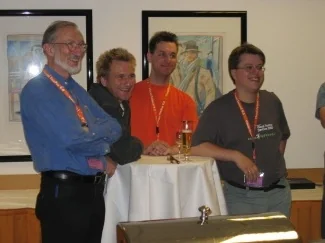
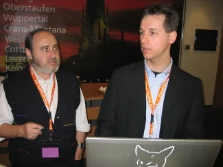
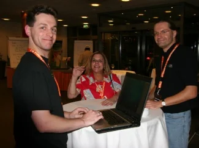
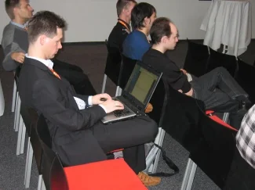
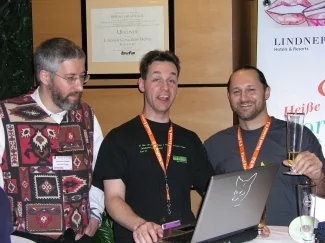
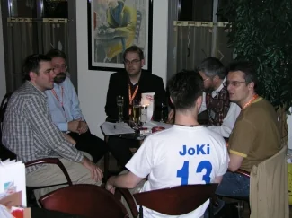

The following is an excerpt from the UniversalThread conference coverage of the [German Visual FoxPro Developer Conference 2005](https://www.universalthread.com/ViewPageConference.aspx?ID=27 "German Visual FoxPro Developer Conference 2005") written by Armin Neudert and Jan Vit. Unfortunately, my sessions were not covered at all but I was there as a speaker after all:

> [...]
>
> We are happy to welcome back several speakers that have already been giving sessions in previous DevCons, but hadn’t been here for one or more years. In detail: Steven Black is back after several years. Marcia Akins and her husband Andy Kramek couldn’t come in 2004 and are back again now. Regarding German speakers, Andreas Flohr and Torsten Weggen are also here again, after not doing sessions for two, respectively four years at this conference.
>
> At this point we would like to send some regards to the speakers that couldn’t come to Frankfurt this year, since they are very busy at the moment or are doing sessions anywhere else in the world right now.
>
> We are also proud to announce several speakers that are here for the very first time. Welcome to Doug Hennig, Rick Schumer, Craig Berntson, Marcus Luz and Benjamin Anders.
>
> And of course, there all the well known speakers which did great sessions over the last years: Sebastian Flucke, Uwe Habermann, Peter Herzog, Venelina Jordanova, Dan Jurden, Jochen Kirstätter, Nathalie Mengel, Lisa Slater Nichols, Michael Niethammer, Rick Strahl, Markus Winhard, Eugen Wirsing, Christof Wollenhaupt and myself - Armin Neudert :-)
>
> [...]
>
::: gallery

:::