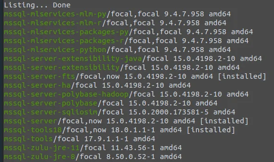
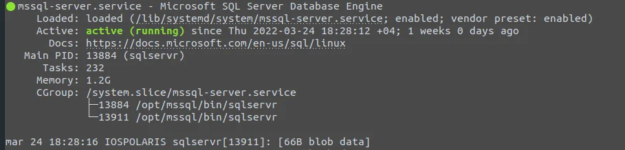
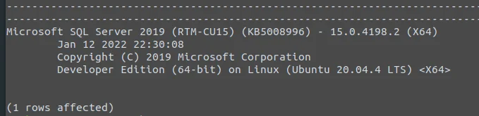
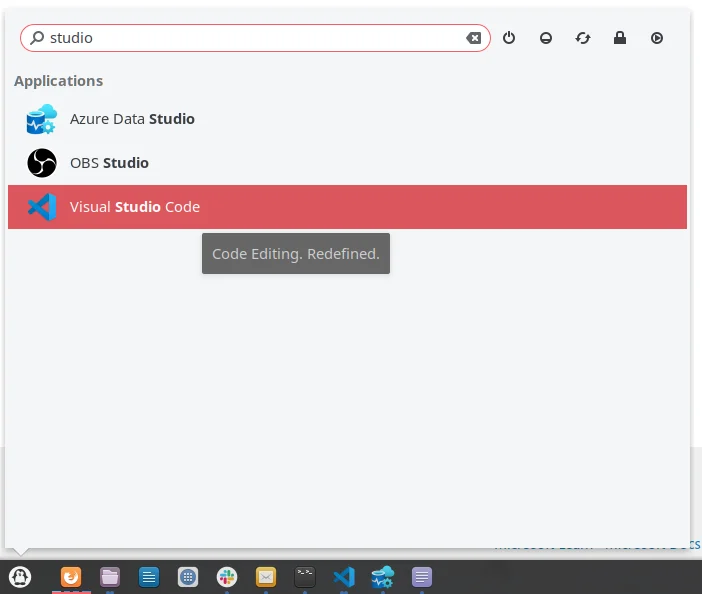
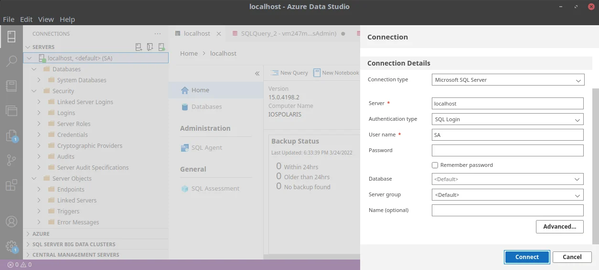
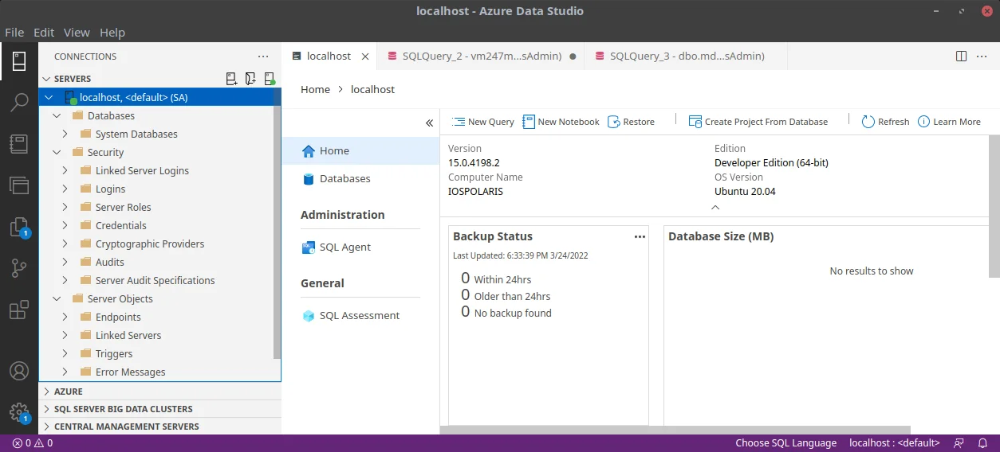
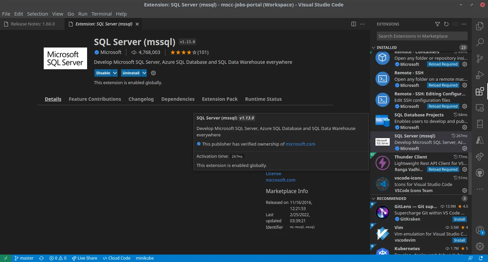

Why writing a blog article about the installation of Microsoft SQL Server 2019, related command-line tools, and UI-based management solution despite the official documentation by Microsoft?

There are two main reasons:

- For own purpose and reference with some additional hints
- The official documentation seems to be "out-of-sync"

Perhaps reading the official articles [Quickstart: Install SQL Server and create a database on Ubuntu](https://docs.microsoft.com/en-us/sql/linux/quickstart-install-connect-ubuntu) and [Install the SQL Server command-line tools sqlcmd and bcp on Linux](https://docs.microsoft.com/en-us/sql/linux/sql-server-linux-setup-tools) in the Microsoft documentation might be a pre-requisite to the following content.

And the article [Installation guidance for SQL Server on Linux](https://docs.microsoft.com/en-us/sql/linux/sql-server-linux-setup) provides guidance for installing, updating, and uninstalling SQL Server 2019 on Linux.

However, as mentioned, some information feels out of picture or eventually outdated given existence of newer versions of the referenced applications.

## Prepare your system

Before we shall start with the installation of SQL Server 2019, command-line tools and related management software let's be sure that our local system is up-to-date and has the needed packages already installed.

Open a terminal to run the following commands. First one is going to update your local package cache. The second one installs the *curl* package which we are going to need for future commands.

```
sudo apt-get update
sudo apt install curl libxss1 libgconf-2-4 libunwind8
```

Next, import the public repository GPG keys.

```
curl https://packages.microsoft.com/keys/microsoft.asc | sudo apt-key add -
```

Don't ignore the trailing dash (-) in the command above. It is essential and therefore necessary. Alternatively this could have been done using *wget* like so.

```
wget -qO- https://packages.microsoft.com/keys/microsoft.asc | sudo apt-key add -
```

Same handling for the trailing dash (-) applies.

## Get the packages

Now that the local system has been prepared it is time to get the actual software packages for SQL Server 2019 and command-line tools.

To be able to install SQL Server 2019 use one of the following commands in order to add the package repository.

```
sudo add-apt-repository "$(wget -qO- https://packages.microsoft.com/config/ubuntu/20.04/mssql-server-2019.list)"
```

```
curl https://packages.microsoft.com/config/ubuntu/20.04/mssql-server-2019.list | sudo tee /etc/apt/sources.list.d/mssql-server-2019.list
```

Then add the package repository for the command-line tools provided by Microsoft accordingly.

```
curl https://packages.microsoft.com/config/ubuntu/20.04/prod.list | sudo tee /etc/apt/sources.list.d/msprod.list
```

Alternatively the information of each package repository could be used directly. Here are the corresponding entries for the sources and some more.

```
# SQL Server 2019
deb [arch=amd64,armhf,arm64] https://packages.microsoft.com/ubuntu/20.04/mssql-server-2019 focal main
# SQL command-line tools as part of the "productivity collection"
deb [arch=amd64,armhf,arm64] https://packages.microsoft.com/ubuntu/20.04/prod focal main

# A few additional Microsoft repos for reference...
# Edge
deb [arch=amd64] http://packages.microsoft.com/repos/edge/ stable main
# Azure CLI
deb [arch=amd64] https://packages.microsoft.com/repos/azure-cli/ focal main
# Visual Studio Code
deb [arch=amd64,arm64,armhf] http://packages.microsoft.com/repos/code stable main

```

Maybe you prefer to store all Microsoft package sources in one single **microsoft.list** file rather than having multiple ones.

I highly recommend to read [Configure repositories for installing and upgrading SQL Server on Linux](https://docs.microsoft.com/en-us/sql/linux/sql-server-linux-change-repo?view=sql-server-linux-ver15&pivots=ld2-ubuntu) for more details on available product options and upgrade channels of SQL Server.

With the newly added repositories for apt it is time again to update the local package cache and to fill it with details about the new packages available.

```
sudo apt update
```

After successful update of the package cache you are able to search it for SQL Server related packages, like so.

```
apt search mssql
```

Or if you prefer less details, like this.

```
apt list mssql*
```



The output of the command above is going to give a list of available packages for SQL Server 2019. Your choice might be different but I'm going to install the actual database engine, with full-text search, the latest command-line tools, and additionally ODBC driver support for Unix/Linux systems.

```
sudo apt install -y mssql-server mssql-server-fts mssql-tools18 unixodbc-dev
```

All necessary dependencies will be resolved and installed by apt.

## Recommended configuration

After the installation SQL Server 2019 is not yet running on your system. Run **mssql-conf setup** command and follow the prompts to choose your edition and set the password of the super-administrator (sa) account.

```
sudo /opt/mssql/bin/mssql-conf setup accept-eula
```

After completing the setup, verify that the service is running as expected.

```
systemctl status mssql-server --no-pager
```



Finally, add the SQL Server tools to the path by default.

```
echo 'export PATH="$PATH:/opt/mssql-tools18/bin"' >> ~/.bash_profile
echo 'export PATH="$PATH:/opt/mssql-tools18/bin"' >> ~/.bashrc
source ~/.bashrc
```

## Is it running?

Good question. Let's try and find out. The command-line tools of SQL Server 2019 comes with **sqlcmd**. The SQL Server command line tool which allows you to connect to local and remote instances of SQL Server including Azure SQL. Run the following to query the product version and edition of your installation.

```
sqlcmd -S localhost -C -U SA -Q "SELECT @@VERSION"
```

You will be prompted to enter the password of SA. If you are not familiar with the various command line switches, run **sqlcmd -?** to get a quick overview.

The resulting output should look similar to this.



Congratulations!

All those steps could be merged into one script to simplify and eventually automate the installation of SQL Server 2019 and its command-line tools. Interestingly the Microsoft documentation has an article on that matter.

[Unattended install for SQL Server on Ubuntu - SQL ServerLearn to use a sample Bash script to install SQL Server 2017 on Ubuntu 16.04 without interactive input.VanMSFTMicrosoft Docs](https://docs.microsoft.com/en-us/sql/linux/sample-unattended-install-ubuntu)

However the presented bash script needs some serious TLC and updates. I suggest that you have look and take it as a starting point only, if needed.

## Missing SQL Server Management Studio?

While working with SQL Server on a Windows system the common choice would be SQL Server Management Studio (SSMS) in order to connect to the database server / instance and the database itself. Unfortunately, SQL Server Management Studio is not available on Linux. And probably won't be in the near (and far) future.

There are at least two possibilities to replace SQL Server Management Studio which offer sufficient and similar comfort on Linux.

- Visual Studio Code with SQL Server (*mssql*) extension
- Azure Data Studio



Both applications have their pros and cons. If you are already developing and writing code in Visual Studio Code you might probably prefer to use the extension and to stay within the same window. In case that you are more into SQL Server handling and Azure you might opt-in for Data Studio.

Download and install Azure Data Studio following this article.

[Download and install Azure Data Studio - Azure Data StudioDownload and install Azure Data Studio for Windows, macOS, or Linux. This article provides release dates, version numbers, system requirements, and download links.tdoshinMicrosoft Docs](https://docs.microsoft.com/en-us/sql/azure-data-studio/download-azure-data-studio)

Then launch the application via Application menu or run **azuredatastudio** in a terminal.



Install Visual Studio Code using *apt*.

```
sudo apt install -y code
```

Then launch the application via menu or run **code** in a terminal.



More details on SQL Server tools can be found here.

[SQL tools overview - SQL ServerSQL query and management tools for SQL Server, Azure SQL (Azure SQL database, Azure SQL managed instance, SQL virtual machines), and Azure Synapse Analytics.markingmynameMicrosoft Docs](https://docs.microsoft.com/en-us/sql/tools/overview-sql-tools)

<small>Image credit: Leif Christoph Gottwald</small>
