When talking about Cloud SQL instances on the Google Cloud Platform usually it relates to flexible and convenient handling of MySQL. Eventually and probably less common someone might speak about PostgreSQL. However in recent times Google added a third option to the Cloud SQL service: [Microsoft SQL Server](https://aka.ms/sql).

[Cloud SQL](https://cloud.google.com/sql/) is a fully managed relational database service for MySQL, PostgreSQL, and SQL Server on the Google Cloud Platform (GCP).

> Cloud SQL is fully compatible with applications using MySQL, PostgreSQL, and SQL Server. You can connect with nearly any application, anywhere in the world. Cloud SQL automates backups, replication, and fail over to ensure your database is reliable, highly available, and flexible to your performance needs.

The described feature-set of SQL Server on GCP lists everything needed for secure, high-available, high performance, and scalable solutions. Cloud SQL instances can be easily reached from other GCP services, including App Engine, Compute Engine, Kubernetes Engine, as well as your workstation. BigQuery is capable to query directly an existing Cloud SQL database.

There is an interesting read on the Google Cloud blog: [Leave no database behind with Cloud SQL for SQL Server](https://cloud.google.com/blog/products/databases/leave-no-database-behind-with-cloud-sql-for-sql-server) that gives a bit more insight information of the new service and what features are coming soon.

## Create a Cloud SQL instance of SQL Server

Log into the Cloud Console and choose the menu entry `SQL` in the navigation bar on the side. In case your selected project does not have any instances you click on `Create Instance` to continue.

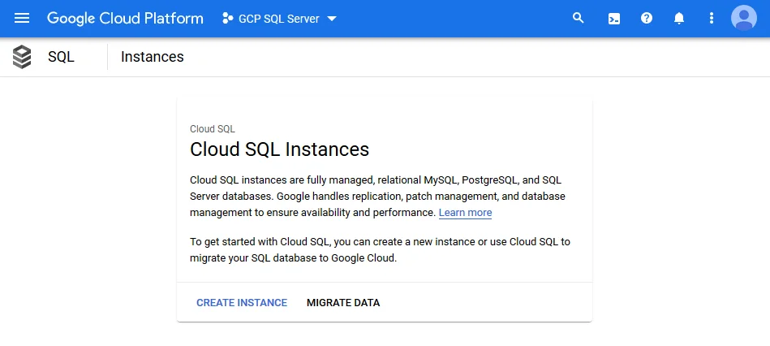

Next, select the `SQL Server` option on the right-hand side to begin the configuration of SQL Server.


There are just a few parameters to enter and you are literally good to go, read: Click on the Create button at the bottom of the page. Most probably it is interesting to review each single configuration setting to gain more familiarity with Cloud SQL in the first place.

Give your instance a unique identifier, either set or generate a password for your administrative user.

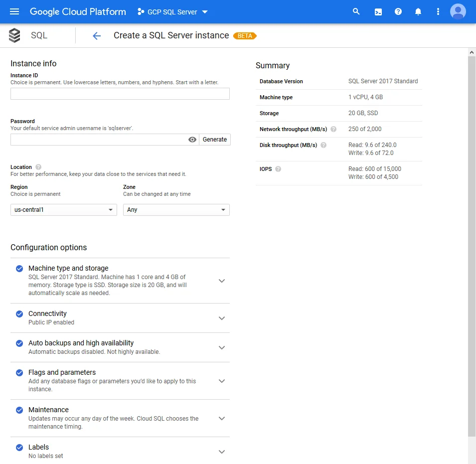

**Note:** Your default service admin username is `sqlserver`. Instead of the common `sa` username. A generated password would look something like this: `d3Ptgz30EAiygtMn`

Then choose from the available editions of SQL Server 2017. If you are familiar with SQL Server and its licensing you know that the various editions have different features, limitations and cost factors. The cost calculation of SQL Server is neatly described here: [Cloud SQL Pricing](https://cloud.google.com/sql/pricing#sql-server).

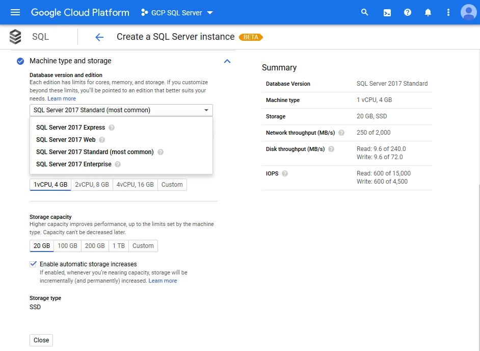

You can activate automatic backups and high availability of your Cloud SQL instance, if needed. However this might incur additional cost.

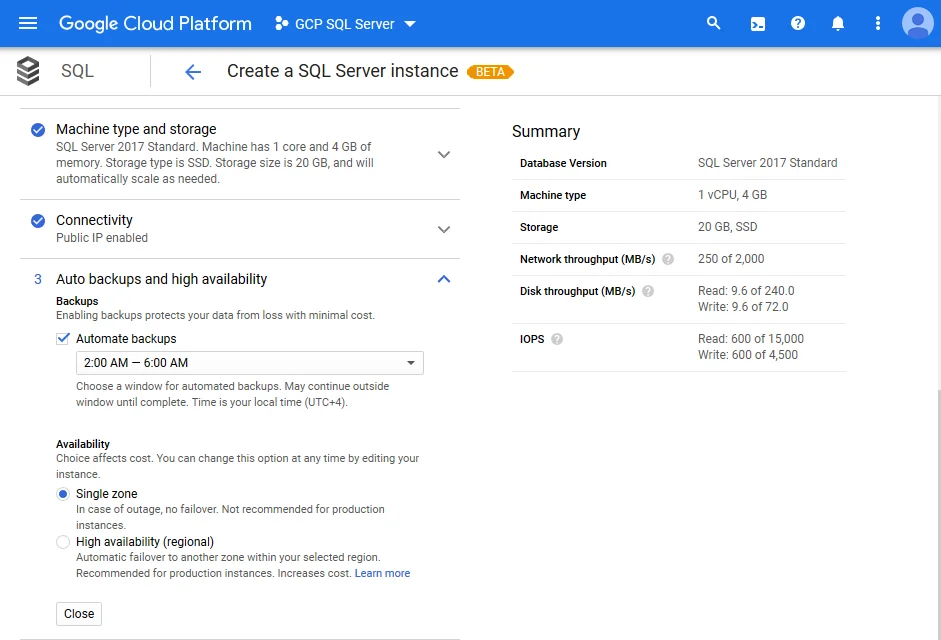

The configuration of Cloud SQL for SQL Server offers a section called `Flags and parameters` that allows you to go deep down into the nuts and bolts of SQL Server configuration as it might be needed for a production system.

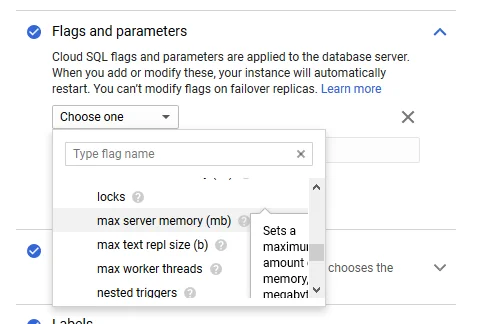

This list of flags is exhaustive and advanced settings shall be known to an experienced database administrator. For testing or development purpose you might skip this area.

Similarly the section on `Maintenance` allows you to define your preferred window of downtime.

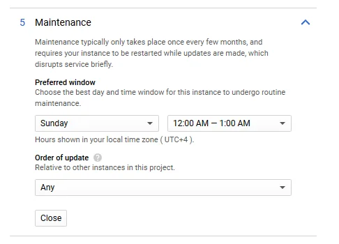

Lastly, hit the `Create` button at the bottom of the page to create an instance of Cloud SQL for SQL Server. It takes a few minutes to deploy. Perhaps time for a little stretch and a sip of fluids.

After completion you see the instance on the overview page of Cloud SQL.

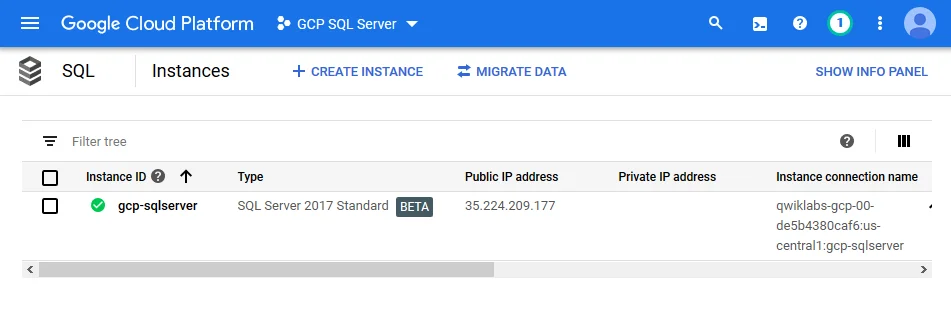

The instance connection information is the essential information you would need to connect your client applications to the instance. Click on the instance identifier to access the overview and dashboard of SQL Server.

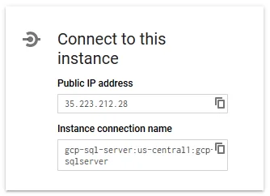

Copy the information and use any client application to connect to your newly created instance of SQL Server.

**Note:** The identifier of an instance is blocked for a certain time. Thus after deleting a Cloud SQL instance you won't be able to use the same identifier instantly.

## Using gcloud to create an instance

Make sure that your `gcloud` SDK environment has the `beta` component installed before trying to create an instance of Cloud SQL for SQL Server. You can verify this with the following command.

```
> gcloud components list

Your current Cloud SDK version is: 276.0.0
The latest available version is: 276.0.0

+------------------------------------------------------------------------------------------------------------+
|                                                 Components                                                 |
+---------------+------------------------------------------------------+--------------------------+----------+
|     Status    |                         Name                         |            ID            |   Size   |
+---------------+------------------------------------------------------+--------------------------+----------+
| Not Installed | App Engine Go Extensions                             | app-engine-go            |  4.8 MiB |

...

| Installed     | Cloud Storage Command Line Tool                      | gsutil                   |  3.6 MiB |
| Installed     | gcloud Beta Commands                                 | beta                     |  < 1 MiB |
+---------------+------------------------------------------------------+--------------------------+----------+
To install or remove components at your current SDK version [276.0.0], run:
  $ gcloud components install COMPONENT_ID
  $ gcloud components remove COMPONENT_ID

To update your SDK installation to the latest version [276.0.0], run:
  $ gcloud components update
```

**Note:** You must use `gcloud` version 243.0.0 or later.

With `beta` component installed you can run this command to create a new instance of Cloud SQL for SQL Server.

```
> gcloud beta sql instances create gcp-sqlserver `
--database-version=SQLSERVER_2017_STANDARD `
--cpu=2 `
--memory=7680MiB `
--root-password=d3Ptgz30EAiygtMn
WARNING: Starting with release 233.0.0, you will need to specify either a region or a zone to create an instance.
Creating Cloud SQL instance...done.
Created [https://www.googleapis.com/sql/v1beta4/projects/gcp-sql-server/instances/gcp-sqlserver].
NAME            DATABASE_VERSION         LOCATION       TIER              PRIMARY_ADDRESS  PRIVATE_ADDRESS  STATUS
gcp-sqlserver   SQLSERVER_2017_STANDARD  us-central1-a  db-custom-2-7680  23.236.52.173    -                RUNNABLE
```

The new instance is created in the active GCP project using its pre-configured region and zone settings. If needed, you could also add the command switches `--project`, `--region`, and `--zone` to assign different values than the default ones.

After successful creation you have to set the password for the user `sqlserver`. That password should be different than the root password previously given to create the Cloud SQL instance itself.

```
> gcloud beta sql users set-password sqlserver `
--instance=gcp-sqlserver `
--password=d3Ptgz30EAiygtMn
Updating Cloud SQL user...done.
```

Using the command above enables you also to re-set the password of the user at a later stage. For example, in case you forgot it.

The documentation about [Creating instances](https://cloud.google.com/sql/docs/sqlserver/create-instance) goes into more details and provides information on all command switches. It describes a few constraints regarding the configuration of the underlying machine types.

## Connect to Cloud SQL instance

You will be able to connect to your newly created instance of SQL Server using the public IP address in familiar fashion as you would connect to an on-premise instance. Provided that you whitelisted your IP address.

Following are a few screenshots of various client applications, like SQL Server Management Studio, Azure Data Studio and Visual Studio 2019. Other client applications should work as expected.

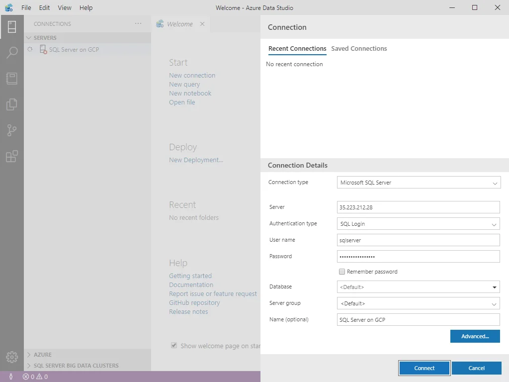

Connecting to the Cloud SQL instance using ODBC driver works perfectly well, too.

## Considerations for public access to Cloud SQL

During the creation steps of a Cloud SQL instance you might have seen the section on `Connectivity`. By default the option of assigning a `Public IP` is checked.

GCP recommends the use of [Cloud SQL Proxy](https://cloud.google.com/sql/docs/sqlserver/sql-proxy) instead of whitelisting IP address ranges to enable external applications to connect to the instance.

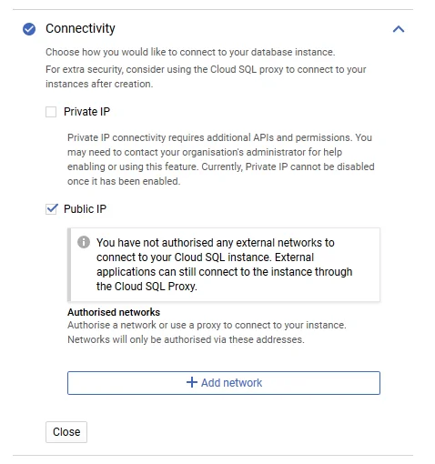

**Note:** Using the Cloud SQL Proxy requires that the [Cloud SQL Admin API is enabled](https://console.cloud.google.com/flows/enableapi?apiid=sqladmin&redirect=https://console.cloud.google.com&_ga=2.205742355.-1649613044.1542902327) in your GCP project.

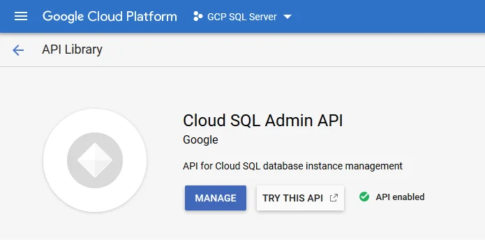

The following diagram shows how the proxy connects to Cloud SQL:

](https://cloud.google.com/sql/images/proxyconnection.svg)

Download the Cloud SQL Proxy to your machine. Open a console or terminal window and navigate to the folder you stored the downloaded file. Eventually rename the binary to `cloud_sql_proxy` (depending on your OS).

The following command establishes the remote connection and listens for incoming connections on localhost.

```
> .\cloud_sql_proxy.exe -instances=gcp-sql-server:us-central1:gcp-sqlserver=tcp:1433
2020/01/18 02:45:30 Listening on 127.0.0.1:1433 for gcp-sql-server:us-central1:gcp-sqlserver
2020/01/18 02:45:30 Ready for new connections
```

As soon as Cloud SQL Proxy is ready for new connections you can configure your client application to use `localhost` or simply `.` to connect to your instance.

Press `Ctrl+C` to stop the execution of Cloud SQL Proxy and close connections to your instance.

On Windows, you should explicitly specify the TCP protocol and port to connect to your Cloud SQL instance. Otherwise you might get an `unsupported network: unix` error.

```
> .\cloud_sql_proxy.exe -instances=gcp-sql-server:us-central1:gcp-sqlserver
2020/01/18 03:33:36 errors parsing config:
        invalid "gcp-sql-server:us-central1:gcp-sqlserver": unsupported network: unix
```

On a machine with active Hyper-V you might observe another problem.

```
> .\cloud_sql_proxy.exe -instances=gcp-sql-server:us-central1:gcp-sqlserver2=tcp:1433
2020/01/18 03:43:54 listen tcp 127.0.0.1:1433: bind: An attempt was made to access a socket in a way forbidden by its access permissions.
```

The reason here is that port 1433 is managed by Hyper-V and not accessible by other applications. You can check the list of reserved TCP ports using the following command.

```
> netsh int ipv4 show excludedportrange protocol=tcp

Protocol tcp Port Exclusion Ranges

Start Port    End Port
----------    --------
      1369        1468
      1858        1957
      1958        2057
      2058        2157
      2880        2979
      5357        5357
      5673        5673
     15007       15106
     15161       15260
     16921       17020
     17021       17120
     17601       17700
     18351       18450
     18564       18663
     19298       19397
     22221       22221
     22223       22223
     49152       49152
     49153       49153
     49154       49154
     50000       50059     *

* - Administered port exclusions.
```

The solution is either to reserve TCP port 1433 while Hyper-V has been temporarily disabled.

```
> # Disable Hyper-V
> dism.exe /Online /Disable-Feature:Microsoft-Hyper-V

> # Reserve the port 1433
> netsh int ipv4 add excludedportrange protocol=tcp startport=1433 numberofports=1

> # Re-enable Hyper-V
> dism.exe /Online /Enable-Feature:Microsoft-Hyper-V /All
```

Or to use a non-reserved TCP port instead.

```
> .\cloud_sql_proxy.exe -instances=gcp-sql-server:us-central1:gcp-sqlserver=tcp:1470
2020/01/18 03:54:00 Listening on 127.0.0.1:1470 for gcp-sql-server:us-central1:gcp-sqlserver
2020/01/18 03:54:00 Ready for new connections
2020/01/18 03:57:30 New connection for "gcp-sql-server:us-central1:gcp-sqlserver"
2020/01/18 03:58:20 Client closed local connection on 127.0.0.1:1470
2020/01/18 03:59:54 New connection for "gcp-sql-server:us-central1:gcp-sqlserver"
2020/01/18 03:59:56 Client closed local connection on 127.0.0.1:1470
```

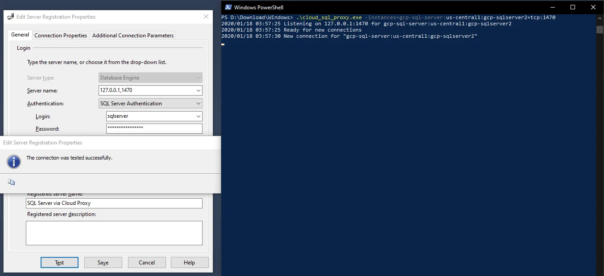

The later approach provides better flexibility without *messing up* the local machine with permanent changes. You might not remember this change in a few weeks time.

However Cloud SQL Proxy requires the installation of an agent on every client that connects to the instance. There are a few steps necessary to enable proper invocation of Cloud SQL Proxy in a production environment. And in some cases this might also not be possible for various reasons.

For more information about Cloud SQL Proxy options and connection strings, see the [Cloud SQL Proxy GitHub page](https://github.com/GoogleCloudPlatform/cloudsql-proxy).

Alternatively authorisation for any external networks is possible. You would specify at least one network in [CIDR notation](https://en.wikipedia.org/wiki/Classless_Inter-Domain_Routing#CIDR_notation) (Classless Inter-Domain Routing) to allow access to your instance.

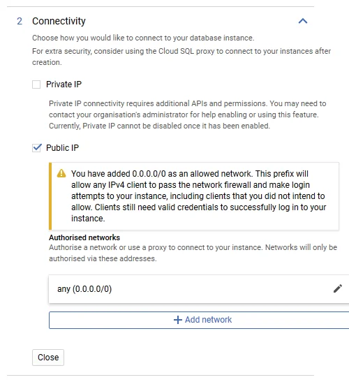

Authorising external hosts or networks is the easier option and my current choice for Cloud SQL instances used for development or staging environments. Nonetheless, Cloud SQL Proxy is more secure and with a little practice shall be your preferred way to connect to an instance.

Your mileage might differ. Maybe you give me your reasoning in the comment section below.

## Thoughts about Cloud SQL for SQL Server

Using the SQL Server option of Cloud SQL instances does come without major surprises and you should be up and running in shortest time.

The managed relational database service offers the full range of features available in SQL Server. By choosing the edition of SQL Server you have full control over functionality and pricing.

Compared to Microsoft's Azure SQL Database it shall be noted that SQL Server on GCP currently runs as virtual machine, read: using predefined images of Compute Engine, under the hood.

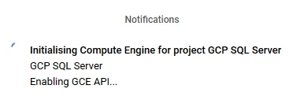

However your Cloud SQL instances are not visible under VM instances of your Compute Engine area.

Your instance of Cloud SQL for SQL Server unsurprisingly runs on a Linux VM, precisely on Ubuntu 16.04 LTS (64-bit; at the time of writing). You can check the environment executing the following query in any SQL client application.

```
Select @@version;
```

The text response should look similar to this.

```
----------------------------------------------------------------------
Microsoft SQL Server 2017 (RTM-CU17) (KB4515579) - 14.0.3238.1 (X64) 
	Sep 13 2019 15:49:57 
	Copyright (C) 2017 Microsoft Corporation
	Standard Edition (64-bit) on Linux (Ubuntu 16.04.6 LTS)
```

Given the underlying Linux operating system there are also a number of [SQL Server features unavailable for Cloud SQL](https://cloud.google.com/sql/docs/sqlserver/features#sqlserver-unavailable). Always consult with the official documentation before migrating your on-premise databases to GCP shall be part of the assessment and evaluation phase.

Although the Cloud SQL for SQL Server instance [is configured with a custom TLS certificate out of the box](https://cloud.google.com/sql/docs/sqlserver/configure-ssl-instance#server-certs) it would [require to register the certificate authority (CA) on the client](https://cloud.google.com/sql/docs/sqlserver/connect-admin-ip#connect-ssl) to enable encrypted connectivity. In case that you set the `Encrypt=yes` ODBC connection string value on your client the connection will not be established and quits with an error message.

Instead, according to documentation, Cloud SQL for SQL Server can be connected using a [Cloud SQL Proxy](https://cloud.google.com/sql/docs/sqlserver/connect-admin-proxy), which will establish secured connection using an ephemeral TLS certificate that’s automatically rotated.

Investigating how both options work is beyond the scope of this article. Maybe I will look into that in the future.

Creating a new instance of Cloud SQL for SQL Server, restoring an existing database backup (not documented above) and connecting any client application to Cloud SQL is done with a few steps and might take you a few minutes only.

My impression of Cloud SQL for SQL Server is quite positive. I like the idea to run SQL Server databases on GCP together with other services like Compute Engine, App Engine, Kubernetes Engine, or even BigQuery to analyse data.

Let's see when this managed service reaches GA. SQL Server 2019 should be an additional choice next to the current SQL Server 2017. And whether there will be a connector for Cloud SQL for SQL Server in [Google Data Studio](https://datastudio.google.com/) in the (near) future.