It's this time of the year, again. Google invited numerous selected people from their various community programs to meet and greet in Kigali, Rwanda. Gratefully, I have been invited as a Google Developer Expert (GDE) and I was really happy to represent Mauritius during the summit.

Speaking of representatives from Mauritius. This year I was actually in company with an alumni of Google Developer Student Clubs (GDSC) University of Mauritius, Ankshita Maunthrooa. I hope she enjoyed the event and that she's going to join either the Google Develop Groups (GDG) Mauritius or the Women TechMaker (WTM) program in the near future.

Since the announcement a few weeks ago I was really eager to see other community members from all across Sub-Saharan Africa (SSA). After the virtual activities during the Road to Google Developer Certification period and my attendance at the amazing Google I/O Connect in Amsterdam I was looking forward for another in-person meeting.

This year the SSA Community Summit reached another level. Representatives of all major programs were there to exchange ideas, to share experiences and to have fun. Namely,

- [Google Developer Experts](https://developers.google.com/community/experts) (GDE)
- [Google Developer Groups](https://developers.google.com/community/gdg) (GDG) organisers
- [Google Developer Student Clubs](https://developers.google.com/community/gdsc) (GDSC) organisers
- [Women TechMaker](https://www.womentechmakers.com/) (WTM) ambassadors

Approximately 120+ people were following the call to come to Kigali. And I was excited to meet folks from the GDGs I interacted with earlier this year. Plus, old friends of course.

## Preparations

Given previous experience I didn't really have to look into that. Only difference was that I asked for a different type of VISA this time. Yeah, you read that correctly VISA. Even though I'm a Mauritian resident since over a decade I'm however travelling with a European passport. And therefore I need a VISA to enter Rwanda. Luckily, I could apply for same on arrival. However thanks to a suggestion from a fellow GDE, Sylvia Dieckmann, I applied for the East Africa Tourist Visa (EATV) instead of a plain tourist or conference visa. The advantage is that that the EATV grants multi-entry permission not only to Rwanda but also Uganda and Kenya, and is valid for 90 days. However it's twice the price for the application fees. In hindsight of my upcoming DevFest participation in Jinja, Uganda it was a good decision. The EATV was handled on arrival and I could pay by card. No surprises at all, and very smooth processing.

### Technical and non-technical equipment

Compared to last time, I decided to make a few minor changes here and there regarding which equipment to bring along.

- Lenovo Chromebook (USB-C charging)
- Tuxedo Computers Polaris 15 (USB-C charging)
- Google Pixel 6a (USB-C charging)
- Google Buds Pro (ANC and USB-C charging)
- Valco VMK20 (ANC and USB-C charging)
- 10,000 mAh battery power pack (USB-C charging)
- Hama 60W multi-plug USB-C charger (4 outlets)

Again, the focus was clearly on everything using a single connector, USB-C. As the keyboard on the Chromebook is again working perfectly there was no need to bring along the Logitech peripherals. And to charge my gear at the same time I brought along my Hama USB-C charger which has sufficient power output. Nice accessory I purchased during the trip to Europe earlier this year.

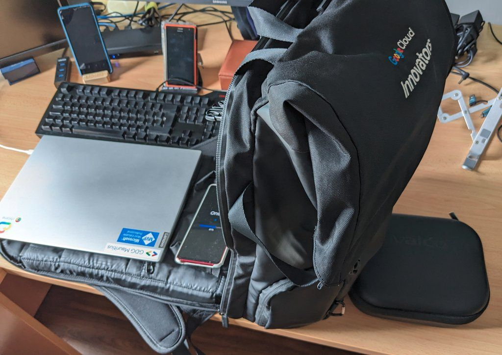

Now onto some essential utilities I always bring along while travelling.

- High-performance outdoor towel (easy to clean; fast drying)
- Mosquito repellent
- Sun cream (UVP 50+)
- Vitamin C (powder or dragees)
- Health pass (you need vaccine for Yellow Fever)

And that's about it. Again, travelling light is key on such kind of short trips.

## Travelling from Mauritius

The lovely team at Google contracted the same travel agency like last year, and with more regular flight activities happening to and from Mauritius the choice of dates for flights has been better compared to last year. Although I love travelling with Emirates I was actually happy that this time all flights were booked on Kenya Airways. With a single stopover in Nairobi the total travel time was enjoyably shorter than last year.

- Mauritius - Nairobi - Kigali

Same route back.

Interestingly, my return flights were booked for Monday morning. I would have expected Sunday already but hey I'm surely not complaining about spending another day for leisure and exploration in the "cleanest city of Africa".

### Pride of Africa lounge

Did I mention the stop-over in Nairobi? Yeah, guess so. The scheduled period was almost seven hours, and having been to the business lounge at Nairobi airport on previous trips it was a no-brainer to go straight there. The hospitality and comfort there is great and time passed by very quickly. Plus, after checking the billboards for our connection flight and not finding it... Well, it was even better to stay at the lounge. Turned out that the departure to Kigali had been delayed by an additional 45 minutes.

### Meeting other Google community members

Already on our flight to Kigali I managed to spot other Google community members, right the seat in front of me. I introduced Ankshita and the trip was really too short even at that early time of the day.

Arriving at the airport more and more peeps from the various Google community programs could be spotted, and while queuing for passport check I thought that half of arriving people were coming for the summit. Great vibes and big smiles everywhere.

And obviously many more folks then at the airport exit. Our organising team had a coach bus reserved and it was mentioned that we had to wait a bit more as there were more attendees expected to arrive.

Alright, I seized the opportunity to check out the MTN booth just opposite the arrival exit and purchase a local SIM card. I would preferred to get an eSIM however that options wasn't available, sadly.

While walking back to the coach bus I collected another three "stranded and seemingly lost" community members and we managed to squeeze everyone into the bus. Another trip through the night to reach the hotel - same as last year BTW, sweet.

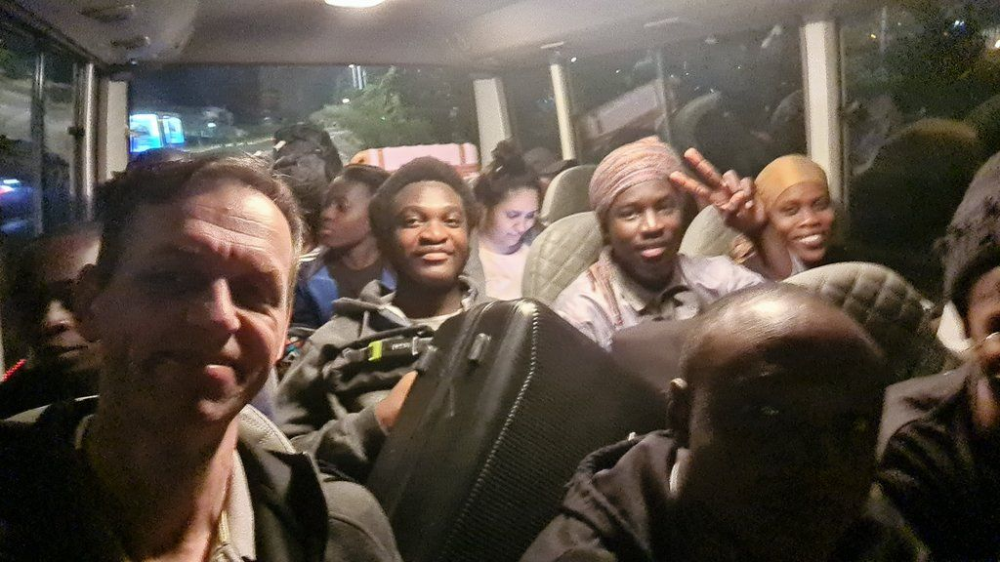

Around 3:00am I finally managed to settle down and sleep.

## SSA Community Summit - Day 1

Surprisingly, I woke up around 7:30 hrs already. Most have been the excitement of meeting friends and getting to know new ones. Or perhaps the fact that my talk had been scheduled first.

### Breakfast for champions

Arriving in the breakfast felt a little bit like coming home. Everywhere smiling faces and excitement building up. Lots of heart-warming greetings, hugs and handshakes. I was glad to see so many community folks from last year and the casual conversations we had. It was buzzing with good vibes. Forgotten the short night.

### Registration / Check in

Time for our Summit badges! I went as early as possible to snatch my lanyard and then off into the conference hall.

### Keynote: Thoughts on Africa's Developers Communities

Our Master of Ceremony, [Ada Oyom](https://www.linkedin.com/in/ada-nduka-oyom/), started day 1 of the SSA Community Summit with a couple of notes, house rules and last information for participants before handling the microphone over to [John Kimani](https://www.linkedin.com/in/johnkimani/).

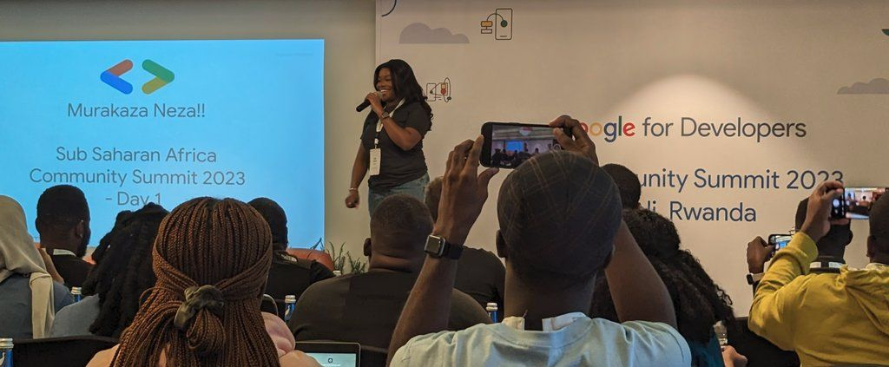

John gave a great overview of the current state of the four Google Developer programs, the overall situation across the African population as being the youngest continent, and Google's commitment for the expected 1.4 billion people by the year 2030. Very reassuring for the current and next generation of IT and technology folks in Africa.

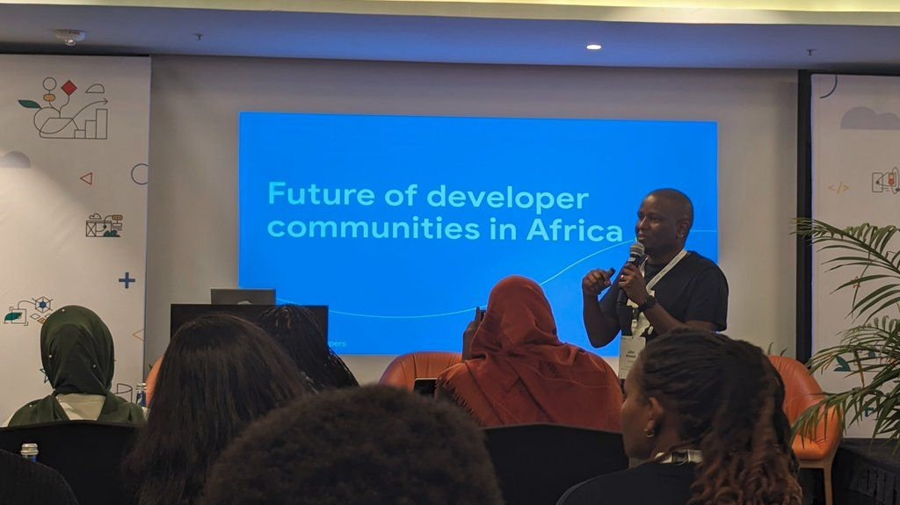

### Lightning talk: Stop begging! Create value and opportunity!

Running events, no matter the size, is usually bound to financial expenses. During our monthly Office Hours this has been a topic almost every time. During my talk I shared the approach, the pitfalls and the experience that our team - Mary Jane, Shelly, and I - gained over time working with local and international partners and sponsors.

Here are the key aspects:

- What can you as a community offer to a partner?
- Plan ahead, plan early! The whole year round.
- Don't let a "No" discourage you, try it again.
- Be prepared with a written proposal (and agreement)

As an example I had excerpts from the sponsorship proposal for Developers Conference 2024. And prior to this I already shared our [DevFest 2023 Partnership Propoal](https://drive.google.com/file/d/1f9xgEIVyzAZjLk1n0uMIC8YATvWeBatd/view) with other GDG leads.

### Running a thriving community alongside a successful full time career

Everyone has a few hats to wear during the day, and [Buchi Michelle Okonicha](https://www.linkedin.com/in/buchi-michelle-okonicha-0a3b2b194/) gave valuable insights into her time and task management. The main takeaways were:

- Get your priorities straight and organised
- Keep an eye on your time
- Delegate task and trust the process
- Ask for help instead of struggling

### Failing Forward: The right way to fail

Quickly summarized, fail forward, fail early, fail often and get back on your feet to continue. Embrace failure as part of the whole and use it to your advantage instead of falling into inertia.

Thanks [Mileke Kolawale](https://twitter.com/milekeKolawole) for sharing your advice. The full article has been posted [Failing forward: The right way to fail](https://mileke.medium.com/failing-forward-the-right-way-to-fail-c3a604d5dfde)

### Fireside Chat: Hacks to grow impact & metrics for small communities

Lead by [Khadija Juma](https://www.linkedin.com/in/khadija-%F0%9F%87%B0%F0%9F%87%AA-abdul-juma-26720143/) we listened to the feedback and stories of

- [Abdulaziz Akanbi](https://twitter.com/al_knbi299)
- [Ida Delphine](https://twitter.com/idadelveloper)
- [Ugo Mmirikwe](https://twitter.com/ugommirikwe)

to provide a safe environment to nurture and grow a tech community. And the positive effects those can have on the daily life of participants.

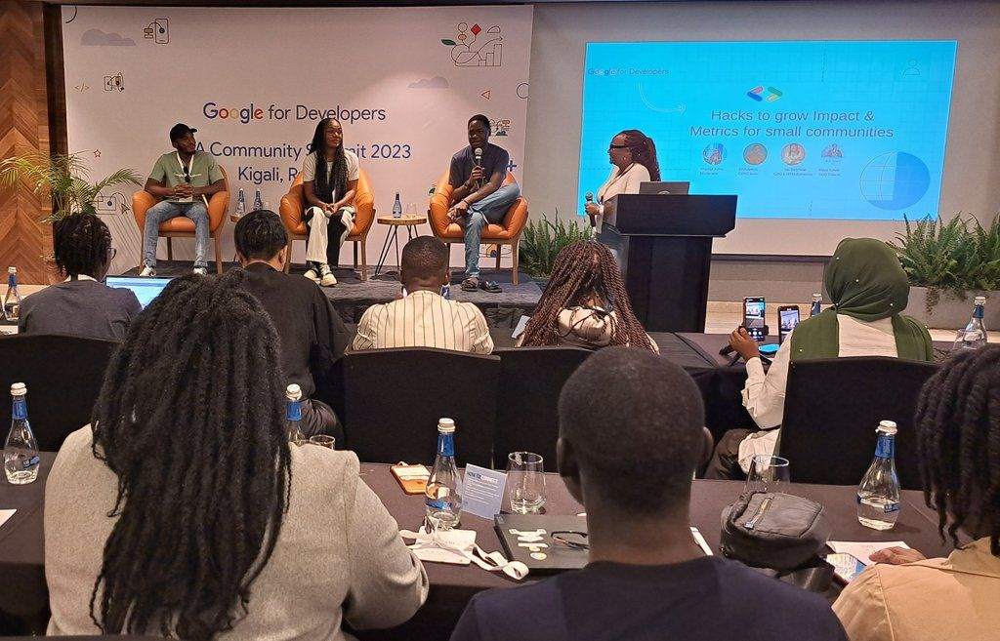

### Fireside Chat: Building new gen communities in Africa

After the lunch break, [Ada Nduka Oyom](https://www.linkedin.com/in/ada-nduka-oyom/) assembled and questioned the panelists about building their communities. The answers provided by

- [Maneo Mapharisa](https://twitter.com/ManeoMapharisa)
- [Wayne Gakuo](https://twitter.com/wayne_gakuo)
- [Frank Ananti](https://twitter.com/ananti)

were spot on and all of them gave great insights into their own local activities and how they managed to overcome obstacles in order to build and grow their regions.

### Keeping your organizers motivated for a better community

Hands down simplicity: Your community is acting a bit like a family!

Running the first GDG chapter in Africa, [GDG Buea](https://gdgbuea.net/), successfully since over a decade now, [Fongoh Martin](https://twitter.com/FongohMartin) brought it down to the important aspects:

- Celebrate together and meet regularly over food
- Engage young members early and have a "community career path" to grow
- Hold workshops on community leadership and responsibilities
- Encourage and provide constructive feedback

And overall keep it human. Remember, it's a community not a business!

### GDE Fireside Chat: Community to Expert

Our last panel was spearheaded by [Eunice Allela](https://www.linkedin.com/in/eunice-allela-230531110/) and it covered a potential path of personal growth from GDSC over GDG or WTM to GDE.

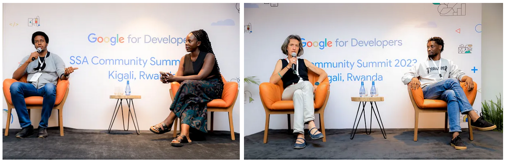

What better crowd than having three GDEs?

- [Amani Bisimwa](https://twitter.com/AmaniBisimwa4)
- [Femi Taiwo](https://twitter.com/dftaiwo)
- [Sylvia Dieckmann](https://twitter.com/sylviedie)

More information about the [Google Developer Experts](https://developers.google.com/community/experts) (GDE) is available online.

### Exploring Kigali

After such a long and information-loaded day it was time to wind down a bit. What better than to take a stroll from the hotel to the "market" as it was called, and see what we would explore. We went in a small group and a few had clear ideas about what to look for. Things like local tea and honey, mosquito repellent as well as a local SIM card were in demand, if I remember correctly.

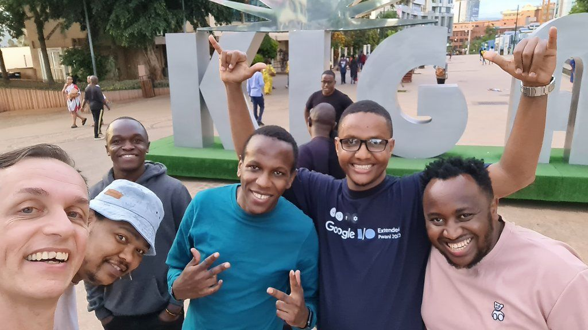

Later on, we met for dinner time - gents and ladies separated as there had been the exclusive WTM Dinner with another panel just for the women. Well, during dinner I managed to exchange quite a bit with John Kimani, [Robert John](https://x.com/robert_thas) and [Francis Akol](https://www.linkedin.com/in/francis-akol/) on various topics regarding our Google developer communities, the recently launched DevFest events, and some general aspects on African countries. It was really helpful for me to get a better idea regarding my scheduled DevFest activities in Tanzania and Uganda.

## SSA Community Summit - Day 2

Finally I managed to catch some well-deserved Zzz's and I slept a few hours more than the previous night.

### Summit starts at breakfast

Nothing better to head into the breakfast zone of the hotel and hug, fist-bump, handshake and greet other summit participants.

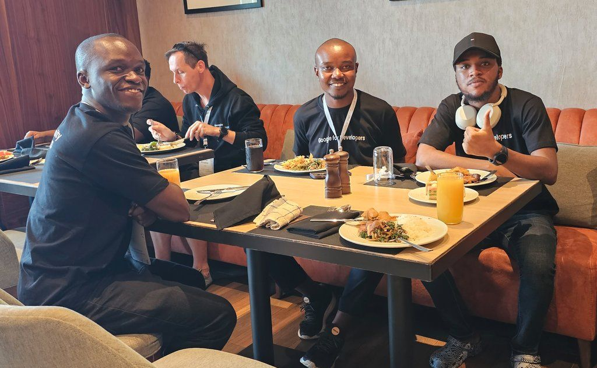

It's an amazing way to start the day, even before the first sip or bite.

### Keynote: Community Commitment Curve

Jumping right into the action, [Alfredo Moressi](https://www.linkedin.com/in/alfredomorresi/) provided us valuable statistics on the curve of commitment among community members and how you could shift things into your favour as a GDG organiser.

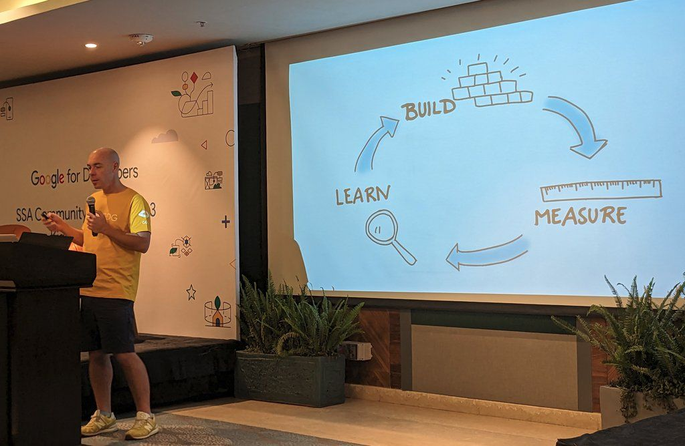

The typical phases are

- Discovering
- Onboarding
- Engagement, and
- Leadership

and their corresponding activities to increase the commitment of participants.

### Workshop: Lazy community management hacks

Out of the two options offered I chose to stay in the room and to attend the workshop lead by [Sodiq Akinjobi](https://www.linkedin.com/in/geektutor/). Mainly to see what are the improvements we could use for our existing process to process registrations and check-ins at the annual [Developers Conference](https://conference.mscc.mu/) in Mauritius.

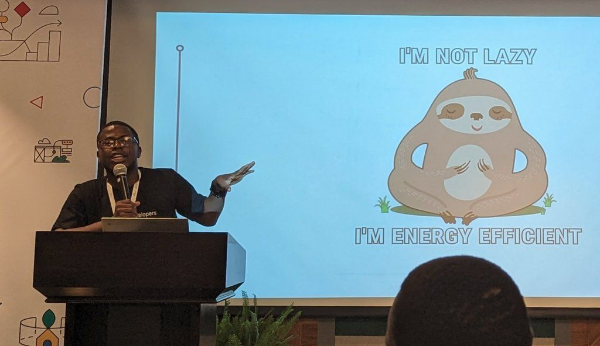

Turned out that Sodiq had his own plans and recruited me ad hoc as an assistant by aid others keeping the pace and to resolve any issues one might get stuck. It was good fun and fullfilment on my side to help in that workshop. Which is actually based on the following to two Apps Scripts samples:

- [Create a mail merge with Gmail & Google Sheets](https://developers.google.com/apps-script/samples/automations/mail-merge)
- [Send personalized appreciation certificates to employees](https://developers.google.com/apps-script/samples/automations/employee-certificate)

Check them out and be lazy (read: smart) for your next community event.

### Workshop: IoT for Beginners

I didn't attend but looking at the pictures from the Photos album it must have been fantastic. Kudos to [Eunice Allela](https://www.linkedin.com/in/eunice-allela-230531110/) and Robert John for that one.

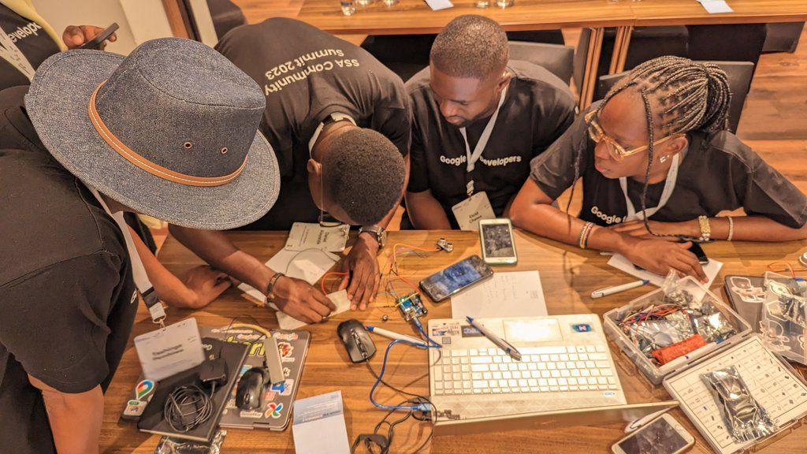

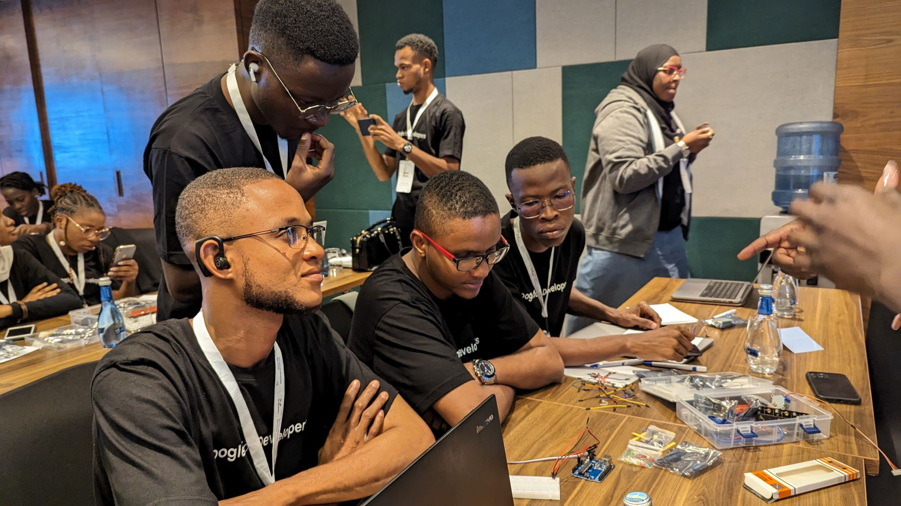

### Program Specific Breakout Session: GDE Q&A

This slot was used to split the participants of the community programs. Us GDEs went off to a smaller conference room and we sat down to ask a few questions about the status and progress of the GDE program, we got clarification on how to better report our activities, and the travel policies for this year's DevFest season had been elaborated on.

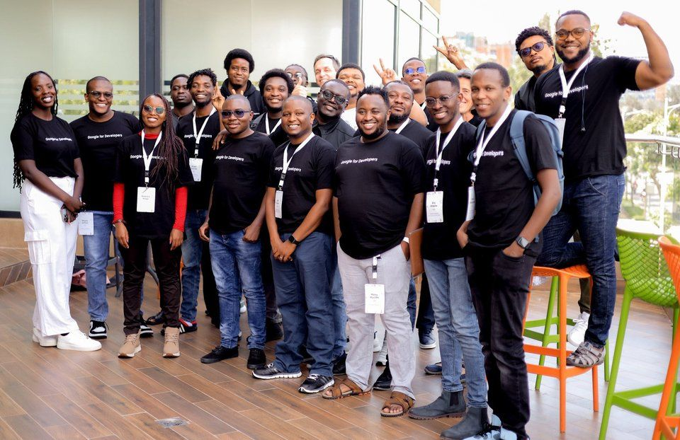

Concluding our session we gathered on the side terrace for traditional GDE group photo. As might notice in the shot, there are women missing. As a mentor of the recently completed Women Developers Academy (WDA) SSA I'm looking forward for more female experts joining soon. Wishing my mentees Gbemisola and Velda best of luck!

### Keynote: Representative from the Govt of Rwanda/Ministry of ICT, Rwanda

In a completely informal way Mrs. [Esther Kunda](https://www.linkedin.com/in/esther-kunda-b1425253/) gave us insights into the benefits that tech communities have provided to Rwanda. It was inspiring to listen to her various rich examples of improvement and success across the country and it how those projects have helped Rwanda to grow in the IT sector of Africa.

### Wrap Up aka "Community Awards"

In case that you had a look at the official agenda of the SSA Community Summit you would actually discover no details for that time slot. Even more surprising was the announcement that there would be an award ceremony for various categories and to celebrate the work and achievements of a few among us. Here's the list of categories:

- Rising Star Award - [Abdulaziz Akanbi](https://www.linkedin.com/in/abdulaziz-akanbi/)
- GDSC High Impact Award - [Rebecca Mirembe](https://www.linkedin.com/in/rebecca-mirembe-561703189/)
- GDE High Impact Award - [Amani Bisimwa](https://www.linkedin.com/in/amani-bisimwa-392ab6186/)
- WTM High Impact Award - [Buchi Michelle Okonicha](https://www.linkedin.com/in/buchi-michelle-okonicha-0a3b2b194/)
- GDG High Impact Award - [Marvin Ngesa](https://www.linkedin.com/in/engngesamarvin/)
- Community Mentor Award -[Jochen Kirstätter](https://www.linkedin.com/in/jochenkirstaetter/)

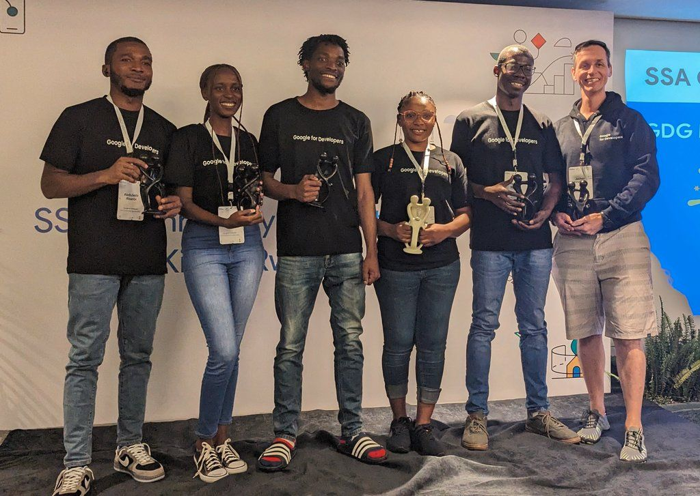

Let me say this, we are all winners! Attending this exquisite SSA Community Summit proved it.

### Sports Themed Dinner

With the "official" part of the summit done it was time to go out and celebrate. The Google team explicitly requested us to bring a national sports jersey representing each country for this evening.

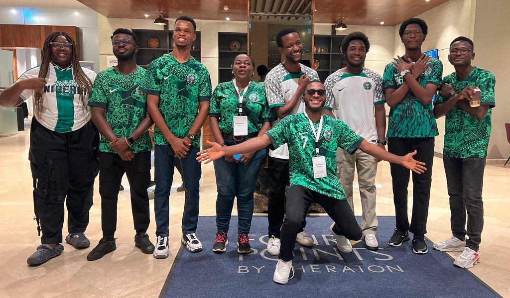

And we did celebrate! ;-)

## "Day 3" - DevFest Kigali

Again, GDG Kigali organised their DevFest at the same time as the SSA Community Summit. In comparison to last year I reached out to the organising team early and sent them a talk proposal. You can read more about this adventure here: [DevFest Kigali 2023](https://jochen.kirstaetter.name/devfest-kigali-2023/).

## "Thank You, Googlers!"

Shout out to our various Google community leads. Once again they did an amazing job bringing together the top 100 community leads & contributors from SSA for knowledge sharing, networking and learning. **Thank You!**

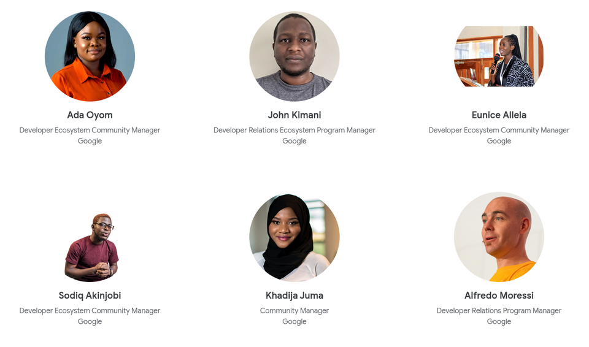

## My takeaway

Those two Summit days had been packed with greatness. The combination of different talk formats and activities kept my attention in high gears, and I learned quite a bunch from other amazing community leads in Africa. Having a mixture of participants from all Google community programs has been the right choice.

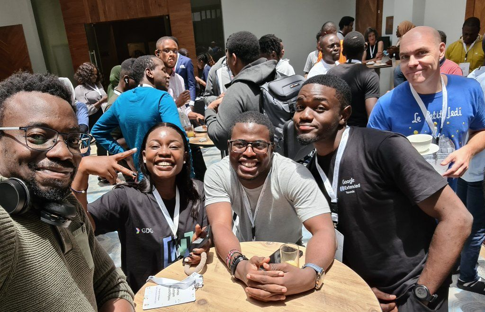

I can't recall the number of chats I had with young fellows from GDSC and WTM factions asking about progressing into a GDG chapter or how to choose the path to become a GDE. The level of sharing, the celebrated achievements and the inspirational networking over those past two days filled my mind with lots of ideas and future projects to consider.

The full summit agenda has been published here: [SSA Community Summit 2023](https://rsvp.withgoogle.com/events/ssa-community-summit-2023).

To sum it (pun intended) up: **Any time again in this format!**

## More from other attendees

Lastly, please check out the summit experience of others.

- [Google SSA Community Summit 2023: A Kigali Expedition](https://youtu.be/AQ6zk-SPr7Q?si=QgoYGocb4kWEwNu2) by [Aji Fama Jobe](https://www.linkedin.com/in/ajifamajobe/)
- [SSA Community Summit 2023 | Kigali, Rwanda](https://medium.com/@louisjaphethkouassi/ssa-community-summit-2023-kigali-rwanda-9c802d4c7b8f) by [Louis Japheth Kouassi](https://www.linkedin.com/in/louis-japheth-kouassi/)

*Photo credits*: Shared Photos album by SSA Community Leads, [Emanuel Feruzi](http://feruzi@k15.photos) and [Julius TM](http://julius@k15.photos)
