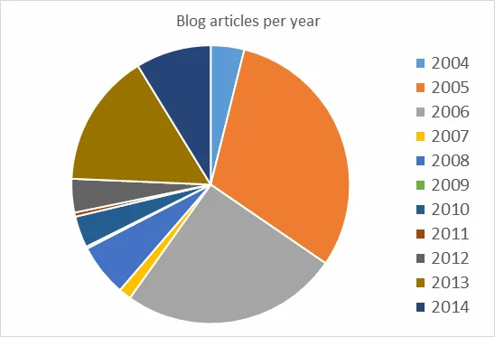

There are 86400 seconds every day, and literally every single one matters...

## Delayed entry - delayed jubilee

Unfortunately, it usually doesn't work this way. Mea culpa, this article should have been written already back in July this year when this blog had it's actual 10 year jubilee - to be precise: 12.07.2004. My first blog article is ["Verspäteter Einstieg in die Welt der Blogs"](xref:verspteter-einstieg-in-die-welt-der-blogs) meaning "Delayed entry into the blogosphere". Yes, you read it correctly... at that time blogging was already very hip and honestly I was somehow reluctant to start blogging. Of course, I already knew what "web logging" was all about at that time but I didn't have the drive to actually start something of this kind.

Well, now we are at the end of 2014 and my stats don't look that bad actually. Sure, there are others with more regular publications and more interesting content but whatever you might say, it's my personal online log book and it will stay like this.

## Let's get bored with some stats

So far, I managed to kick myself more than 400 times to sit down and type some content. That's roughly one article every nine days on average. Well, almost what I had on my mind... one article per week. So you see that there is still lots of room for improvement after all. Furthermore, I'd like to mention that the experience I had with this blog was quite a roller coaster ride - currently, this is the third iteration of blog software in the background. Originally, I started to write using a software system called "dasBlog", then [after a severe server crash-down](xref:blog---reloaded) I migrated almost all content to a system called "blogEngine.NET", and [after another data / server problem](xref:blog-reloaded-again) I finally settled on Joomla! CMS with a blog layout style.

But there had been other forces during those 10 years which had a mayor impact on the consistency of my writing. First of all, I immigrated to Mauritius back in 2007 and was completely occupied with building up a new company for my former employer, then there were huge changes in my personal life with at least three big events to report, and due to some financial issues I kept myself extremely busy with [founding and running a start-up back in 2009](https://www.ios.mu/ "IOS Indian Ocean Software Ltd.") in order to keep the food on the table. Most interestingly, you will see that impact on the number of articles written here on the blog.

  
*Stats: Blog articles per year*

Let me give you a brief summary on each year...

### 2004

As mentioned earlier I started to publish only at the begin of the second half of the year, and I was quite reluctant whether I would be able to keep the work up over a longer period of time or not. Well, it was mainly to get familiar with the medium and to see whether it could be interesting to continue or not. Also, in 2004 I was invited to join the [Microsoft CLIP (Community Leader/Insider Program)](xref:microsoft-commities-ganz-schn-schlau) initiative. Thanks to that I lots of activities to write about.

### 2005

Thanks to the [German Developers Conference](xref:speaker-at-the-german-visual-foxpro-developer-conference-2004) back in November of the previous I got a better understanding of the benefits and advantages of entertaining an online log book. Most of the international speakers at the conference were already blogging months or not even since years. Seeing their content and the way of writing as well as the pros of expressing oneself on the internet kept me going. And CLIP events kept on coming, and I published my experience as well as my adventures regularly on my blog, too.

### 2006

Seeing the feedback from others and let's call it personal success of writing more than 2 articles per week on average, I continued to write regularly on my blog. Mainly it was about technical things related to my main programming language - Microsoft Visual FoxPro - at that time, but still a lot of [things related to my user group and community activities](xref:community-community-community). Again thanks to the [German Developers Conference](xref:speaker-at-the-german-visual-foxpro-developer-conference-2005) I got positive feedback from other international speakers that they actually enjoyed reading my blog - even though I wrote in German language only.

### 2007

Well, well... [Time to immigrate to Mauritius](xref:my-first-cyclone) and occupying myself with other tasks. My former employer asked me to come here and to start a newly founded company with an initial team of 15 employees. We hired 10 freshmen directly out of university, 2 more experienced developers as team lead, a secretary for the daily paper work, a Mauritian director for all kind of labour, business and accounting related information and last but not least myself as project coordinator and supervisor - the communication channel back to Germany.

### 2008

Remorse... this could be the right word for 2008. Due to the abundance in the previous year, I thought that it would be [time to pick up the blog again](xref:es-lebt-wieder) and try to publish a little bit more than the time before. Well, it didn't turn out too busy but after all I managed to write at least one article bi-weekly. Not too technical for a start but [some content after all](xref:plans-for-mauritius-software-developer-user-group-msdug) the obstacles I had to experience in that particular year.

### 2009

After almost 10 years my employment relationship came to an end due to the (in)abilities of my former employer. Long story short: I had to find a new source of income [which took my full attention](xref:community-day-at-sos-kinderdorf-bambous). Absolutely no time after all to entertain and maintain this blog. On private side there were some changes at the end of 2008, too. Taking this into consideration, there was surely other things way more important than publishing technical articles. I hope you didn't miss my ramblings too much...

### 2010

Despite heavy workload and long hours of programming in order to deliver results and to exceed my clients' expectations I somehow was able to write once or twice a month. Honestly, I didn't have the drive to write but still I [managed to publish bits and pieces](xref:skydiving-in-mauritius).

### 2011

BAM! Mental shutdown and focus on way more important things... My family expanded, we had to look into other business models as the software development company had a mayor setback to deal with. Absolutely no chances to settle and [write anything during this time](xref:orange-mauritius-smtp-auth). Instead of, I started to be more active on Facebook for my wife's business. So much work,so little time...

### 2012

Slowly but surely getting back into the blogosphere. Things have changed on the business side as well as in my private life - finally more relaxed and more positive than the months before. Honestly, I would say that 2011/2012 was one of my darkest chapters in life so far, and as things settled to look a bit more rosy I found some more time to write again. Still [more on the technical side](xref:learning-content-for-mcsds-web-applications-and-windows-store-apps-using-html5) but other things as well. Life kicked back in and I had pleasure to tinker with this blog once more.

### 2013

I don't know when but finally I made up my mind that I should be focusing on publishing at least one article per week on average. And by the end of 2013 I can proudly say that I was able to achieve this goal - even with a little bonus on top. This is surely also based on the initiation of the [Mauritius Software Craftsmanship Community (MSCC)](xref:mscc) back in May, and therefore our regular meetups and get-togethers. There is always so much information to write about. Sometimes, it is a real challenge to get my [thoughts in proper order and to find the right words](xref:community-exchange-and-discussion) to put my experience of the day into one blog article. But surely I can say, it's with great pleasure to report an increased number of articles.

### 2014

As the end of the year is closing in I have to admit that there is a low number of entries missing in order to achieve my average of one article per week. But let's see what can be done. I still have some unfinished content in the pipe, and frankly I'm looking forward to complete them during the remaining three weeks of the year. Thanks to a stable business environment and the gratitude of [running the MSCC successfully](xref:mscc-global-windows-azure-bootcamp) it's also easier to sit down several times a month to write something.

## Plans for the future

Hahaha... Staying healthy, having good and prosperous business relationships, and enjoying family life.

Surely, I'm going to work on my ratio of one blog entry per week but you never know... There are so many opportunities coming along, and it will be a challenge to keep up writing about them. But, there will be content - rest assured about that. Not sure what exactly but definitely something. and hopefully something interesting and entertaining for my readers.

## Thank you, dear reader

I would also like to thank my readership in this article. There had been great feedback on a good number of articles and it actually encourages me to keep on blogging. So, please feel free to drop me a note in the comment section below, and I'll look into it... Thanks and hopefully 10 more years of excitement and interesting information. ;-)