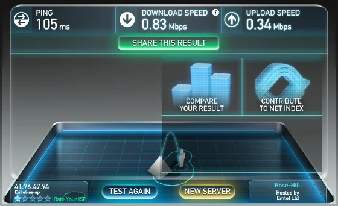
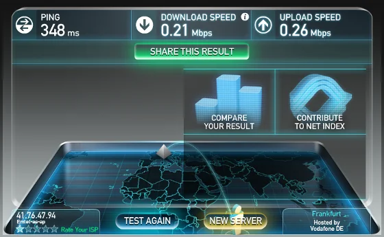
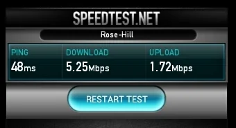
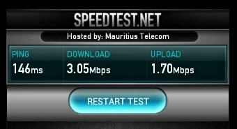
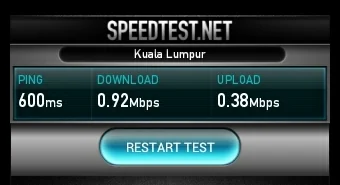

After yesterday's [report on Emtel Fixed Broadband](xref:test-your-internet-connection "report on Emtel Fixed Broadband") (I'm still wondering where the 'fixed' part is), I did the same tests on [Emtel Mobile Internet](https://www.emtel.com/home-web-package-plans/ "Emtel Mobile Internet"). For this I'm using the Huawei E169G HSDPA USB stick, connected to the same machine. Actually, this is my fail-safe internet connection and the system automatically switches between them if a problem, let's say timeout, etc. has been detected on the main line.

For better comparison I used exactly the same servers on [Speedtest.net](https://www.speedtest.net/ "https://www.speedtest.net/").

## [The results]()

Following are the results of Rose Hill (hosted by Emtel) and respectively Frankfurt, Germany (hosted by Vodafone DE):

  
*Speedtest.net result of 31.05.2013 between Flic en Flac and Rose Hill, Mauritius (Emtel - Mobile Internet)  
*

  
*Speedtest.net result of 31.05.2013 between Flic en Flac and Frankfurt, Germany (Emtel - Mobile Internet)*

As you might easily see, there is a big difference in speed between national and international connections. More interestingly are the results related to the download and upload ratio. I'm not sure whether connections over Emtel Mobile Internet are asymmetric or symmetric like the Fixed Broadband. Might be interesting to find out. The first test result actually might give us a clue that the connection could be asymmetric with a ratio of 3:1 but again I'm not sure. I'll find out and post an update on this.

## It depends on network coverage

Later today I was on tour with my tablet, a Samsung Galaxy Tab 10.1 (model GT-P7500) running on Android 4.0.4 (Ice Cream Sandwich), and did some more tests using the Speedtest.net app. The results are actually as expected and in areas with better network coverage you will get better results after all. At least, as long as you stay inside the national networks. For anything abroad, it doesn't really matter. But see for yourselves:

::: grid

:::  
*Speedtest.net result of 31.05.2013 between Cascavelle and servers in Rose Hill, Mauritius (Emtel - Mobile Internet), Port Louis, Mauritius and Kuala Lumpur, Malaysia*

It's rather shocking and frustrating to see how the speed on international destinations goes down. And the full capability of the tablet's integrated modem (HSDPA: 21 Mbps; HSUPA: 5.76 Mbps) isn't used, too. I guess, this demands more tests in other areas of the island, like Ebene, Pailles or Port Louis. I'll keep you updated...

## The question remains: Alternatives?

After the publication of the test results on Fixed Broadband I had some exchange with others on Facebook. Sadly, it seems that there are really no alternatives to what Emtel is offering at the moment. There are the various internet packages by Mauritius Telecom feat. Orange, like ADSL, MyT and Mobile Internet, and there is Bharat Telecom with their Bees offer which is currently limited to Ebene and parts of Quatre Bornes.