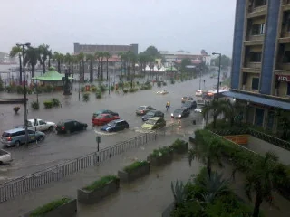
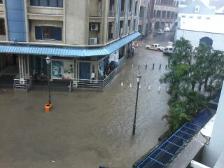
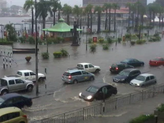
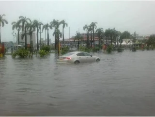
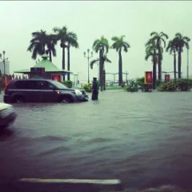
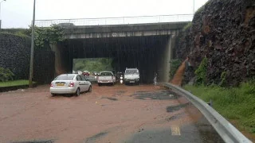
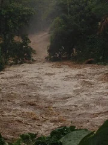

Getting rain during the dry summer months is always a welcoming change for a while. Some tourists may moan that they can't enjoy the sunny beaches for a couple of days, but locals are simply glad that it cools down a little bit and that there are chances that the water reservoirs get filled to a more comfortable level. Just to get rid of those unpleasant water cuts.

## Torrential rain - it can happen...

Mauritius is classified as a tropical or sub-tropical island approximately 800 kilometers east of the African east coast. The average air temperature is around 26-28 degress Celsius all year and the humidity level continously above 85%. There is not explicit period of rain falls like you might experience it in India, Thailand or other Asian countries in the Indian Ocean but still we have cyclones between October and April, as well as heavy rain falls once or twice a year.

## Chaos in the streets

Due to low occurrence of such torrential rain falls the general population isn't really well-experienced with the impacts. Honestly, this is quite surprising because each and everyone, from the small children to elderly people, know how to act during cyclones. It's just about the masses of water that seem to cause major problems.

Following some recent impressions posted by various accounts on Twitter:

::: gallery

:::

*Images are courtesy of various Twitter accounts.*

## Communication networks down?  
Since these morning hours there are connection issues on the major communication networks by Orange and Emtel, as reported by several tweets. At least, the internet connectivity seems to be fine for each and everyone as the number of tweets on torrential rain is increasing.

## Schools and offices are closed

Interestingly, there is the general advice that schools are closed for their pupils and the public offices will be closed at 13:00hrs. Hm, there are already traffic issues, and now closing businesses and offices - how is this going to improve the situation on the road? As mentioned above, the heavy rain is only affecting a couple of (well-known) spots... setting the whole country on 'red alert' like during cyclone warning class level IV is honestly a little bit strange - at least for ex-pats I guess.

## Official advice - Mauritius Meteorological Services

Please, for your own safety read and inform yourself here: [Torrential Rain warning bulletin](https://metservice.intnet.mu/?cat=34 "Torrential Rain warning bulletin").

Anyways, looking forward to the TV news later. Stay sound and safe, and mind flooded roads you might get stuck otherwise...