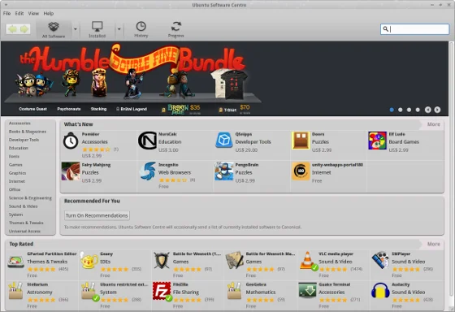
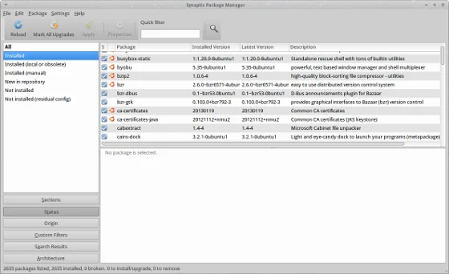
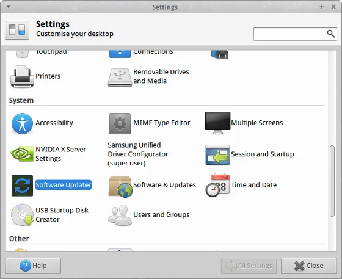
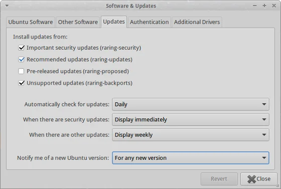
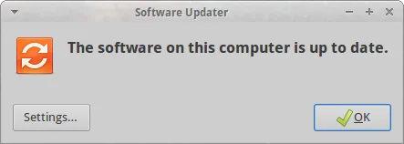

Over the last couple of years, I had various levels of upgrade experience with Ubuntu, or more precise [Xubuntu](https://xubuntu.org/ "Xubuntu") in my case. Those ones range from complete disaster (due to hardware issues) over good fun with some minor tweaks up to seamless. Following describes the steps and aftermath I did to upgrade my main working machine from Xubuntu 12.10 Quantal Quetzal to version 13.04 aka Raring Ringtail.

## []()Preparations

In general, it is highly recommended that you read the [official upgrade documentation of Ubuntu](https://wiki.ubuntu.com/RaringRingtail/ReleaseNotes#Upgrading_from_Ubuntu_12.10 "official upgrade documentation of Ubuntu"). Next, get your recent system up-to-date before you consider to upgrade. Also, take care that there are no pending partial upgrades or packages on hold. This might have a negative impact on the installation process of the newer packages. There are two possibilities to take of that: UI or terminal.

As for the UI, launch either the Ubuntu Software Centre or Synaptic Package Manager and check the status of your system.

  
*Check your system's status in Ubuntu Software Centre*

  
*The Synaptic Package Manager is a good alternative to check your system*

and for those ones who prefer to work on the console, you might already know the procedure

> $ sudo apt-get install -f  
$ sudo apt-get update && sudo apt-get upgrade

And in worst case you might even consider to clean up a little bit before continuing with the release upgrade

> $ sudo apt-get autoremove  
$ sudo apt-get clean && sudo apt-get autoclean

That should do the work to put your machine in a clean state. One last step: Terminate any kind of screen saver or screen locker applications. The upgrade process will update libc6 and therefore is going to remind you that you might take the risk to get locked out of you system. Now, we are set for the next steps.

## []()Initiate the upgrade

Start the process graphically via Applications menu &gt; Settings Manager &gt; Scroll down to section 'System' &gt; Software Updater

  
*Accessing the Software Updater in the Settings Manager*

or run the following command to launch the visual Software Updater

> $ sudo update-manager

Eventually, you have to adjust your settings for the available Ubuntu versions. Simply open the settings dialog and check that 'For any new version' is the selected value.

  
*Check your notification setting on new Ubuntu versions*

Afterwards, the updater should offer you Ubuntu version 13.04 as upgrade path.

In the console you have to modify your repository paths first. Open your favourite console text editor and change all occurences of 'quantal' into 'raring'

> $ sudo nano /etc/apt/sources.list

Your file should look similar to this one:

```
# See https://help.ubuntu.com/community/UpgradeNotes for how to upgrade to  
# newer versions of the distribution.  
deb https://mu.archive.ubuntu.com/ubuntu/ raring main restricted  
deb-src https://mu.archive.ubuntu.com/ubuntu/ raring main restricted  
  
## Major bug fix updates produced after the final release of the  
## distribution.  
deb https://mu.archive.ubuntu.com/ubuntu/ raring-updates main restricted  
deb-src https://mu.archive.ubuntu.com/ubuntu/ raring-updates main restricted  
  
## N.B. software from this repository is ENTIRELY UNSUPPORTED by the Ubuntu  
## team. Also, please note that software in universe WILL NOT receive any  
## review or updates from the Ubuntu security team.  
deb https://mu.archive.ubuntu.com/ubuntu/ raring universe  
deb-src https://mu.archive.ubuntu.com/ubuntu/ raring universe  
deb https://mu.archive.ubuntu.com/ubuntu/ raring-updates universe  
deb-src https://mu.archive.ubuntu.com/ubuntu/ raring-updates universe  
  
## N.B. software from this repository is ENTIRELY UNSUPPORTED by the Ubuntu  
## team, and may not be under a free licence. Please satisfy yourself as to  
## your rights to use the software. Also, please note that software in  
## multiverse WILL NOT receive any review or updates from the Ubuntu  
## security team.  
deb https://mu.archive.ubuntu.com/ubuntu/ raring multiverse  
deb-src https://mu.archive.ubuntu.com/ubuntu/ raring multiverse  
deb https://mu.archive.ubuntu.com/ubuntu/ raring-updates multiverse  
deb-src https://mu.archive.ubuntu.com/ubuntu/ raring-updates multiverse  
  
## N.B. software from this repository may not have been tested as  
## extensively as that contained in the main release, although it includes
```

```

```

And temporarily comment all the additional third-party repositories for the upgrade. We are going to enable them after the core update. Afterwards, simply type this

> $ sudo apt-get update  
$ sudo apt-get dist-upgrade

Now, it's time to lean back, wait for the packages to be downloaded and confirm a couple of questions from time to time. Depending on your amount of installed packages and your bandwidth it will take some while to get everything. As a reference, I had to upgrade 1720 packages with a total download size of approximately 1.1 GB. Due to my restricted bandwidth I left my machine alone overnight and do all the fun stuff. Next morning, some minor checks and rebooting the machine. The first fresh boot took a little longer than usual but the graphical login screen appeared as expected and after successful login my system was up to date.

  
*When all is said and done, work can be fun!*

In case that you like to be on the safe side, you might consider to download the packages completely first and then do the upgrade itself afterwards:

> $ sudo ap-get dist-upgrade -d

## []()Doing the aftermath

This mainly depends on your package selection. In my case, I only had to take care of two specific applications: Skype and VMware Player. Well, as for VMware Player I had to re-install the application. You should use at least version 5.0.2 which is known to work out of the box on Ubuntu 13.04. Just in case that you don't have the latest version, get it from VMware and run the following in the directory with the bundle file:

> $ sudo vmware-installer -u vmware-player  
$ sudo chmod +x VMware-Player-5.0.2-1031769.x86_64.bundle  
$ sudo ./VMware-Player-5.0.2-1031769.x86_64.bundle

This will do the trick and VMware Player runs again.

Skype actually took me a little bit more research (read: run some Google search queries) due to an error:

> $ /usr/bin/skype  
(Segmentation fault)

But the solution is also very simple. Skype requires to pre-load the libGL library in order to run properly

> $ LD_PRELOAD=/usr/lib/i386-linux-gnu/mesa/libGL.so.1.2.0 skype

And to simplify your life, create launcher script as a 'transparent proxy' for Skype:

> $ sudo cd /usr/bin  
$ sudo mv skype skype-bin  
$ sudo nano skype

Your shell script should look like so:

```
#!/bin/sh  
export LD_PRELOAD=/usr/lib/i386-linux-gnu/mesa/libGL.so.1.2.0  
exec skype-bin "$@"
```

Save your file and enable the execute bit on the script:

> $ sudo chmod +x skype

That's it! Skype starts again as expected...

## Optional: Decluttering

Xubuntu 13.04 comes with a couple of re-introduced software packages that you might like to get rid of. Check out the installed applications in your Ubuntu Software Centre or Synaptic Package Manager and remove them as needed.