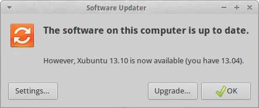
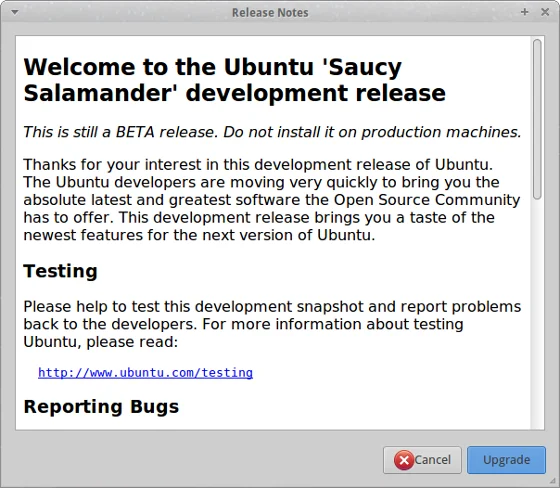
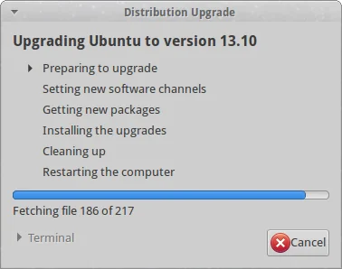
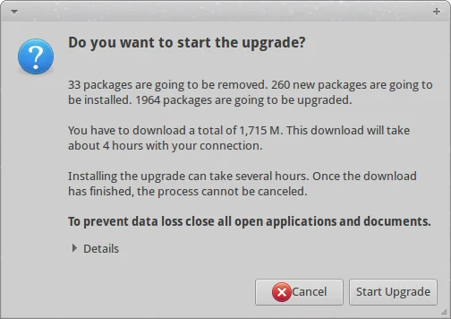
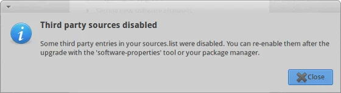
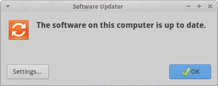

As a common 'fashion' it is possible to upgrade an existing installation of [Ubuntu](https://www.ubuntu.org "Ubuntu") or one of its derivates every six months. Of course, you might opt-in for the adventure and directly keep your system always on the latest version (including alphas and betas), or you might like to play safe and stay on the long-term support (LTS) versions which are updated every two years only. As for me, I'd like to jump from release to release on my main desktop machine. And since 17th October Saucy Salamander or also known as Ubuntu 13.10 has been released for general use.

The following paragraphs document the steps I went in order to upgrade my system to the recent version. Don't worry about the fact that I'm actually using Xubuntu. It's mainly a flavoured version of Ubuntu running Xfce 4.10 as default X Window manager. Well, I have Gnome and LXDE on the same system... just out of couriosity.

## Preparing the system

Before you think about upgrading you have to ensure that your current system is running on the latest packages. This can be done easily via a terminal like so:

`$ sudo apt-get update && sudo apt-get -y dist-upgrade --fix-missing`

Next, we are going to initiate the upgrade itself:

`$ sudo update-manager`

As a result the graphical Software Updater should inform you that a newer version of Ubuntu is available for installation.

  
*Ubuntu's Software Updater informs you whether an upgrade is available*

## Running the upgrade

After clicking 'Upgrade...' you will be presented with information about the new version.

  
*Details about Ubuntu 13.10 (Saucy Salamander)*

Simply continue with the procedure and your system will be analysed for the next steps.

  
*Analysing the existing system and preparing the actual upgrade to 13.10*

Next, we are at the point of no return. Last confirmation dialog before having a coffee break while your machine is occupied to download the necessary packages. Not the best bandwidth at hand after all... yours might be faster.

  
*Are you really sure that you want to start the upgrade? Let's go and have fun!*

Anyway, bye bye Raring Ringtail and Welcome Saucy Salamander!

In case that you added any additional repositories like Medibuntu or PPAs you will be informed that they are going to be disabled during the upgrade and they might require some manual intervention after completion.

  
*Ubuntu is playing safe and third party repositories are disabled during the upgrade*

Well, depending on your internet bandwidth this might take something between a couple of minutes and some hours to download all the packages and then trigger the actual installation process. In my case I left my PC unattended during the night.

## Time to reboot

Finally, it's time to restart your system and see what's going to happen... In my case absolutely nothing unexpected. The system booted the new kernel 3.11.0 as usual and I was greeted by a new login screen.

Honestly, 'same' system as before - which is good and I love that fact of consistency - and I can continue to work productively. And also Software Updater confirms that we just had a painless upgrade:

  
*System is running Ubuntu 13.10 - Saucy Salamander - and up to date*

See you in six months again... ;-)

## Post-scriptum

In case that you would to upgrade to the latest development version of Ubuntu, run the following command in a console:

`$ sudo update-manager -d`

And repeat all steps as described above.