Running an operating system like Ubuntu or any of its derivates, like ie. Xubuntu, comes with some nice treats (and threats?). One of the nice things is that you'll get a scheduled upgrade approximately every six months. Usually, around April and October of each year. Meaning there are two releases per year resulting in those version numbers [Year].04 and [Year].10. Also, ever two years the April edition of Ubuntu is classified as a Long-Term Support (LTS) version which keeps an extended period of time. A nice touch and surely interesting for professional installations of Ubuntu but eventually not too practical for the daily use at home or when you're interested in latest versions.

## Preparing the system

These steps are the same every time you decide to upgrade to the latest release. Eventually, you might be interested to update older installation and have a read here:

- [Upgrade to Xubuntu 13.04 - Raring Ringtail](xref:upgrade-to-xubuntu-1304-raring-ringtail)
- [Upgrade to Xubuntu 13.10 - Saucy Salamander](xref:upgrade-to-xubuntu-1310-saucy-salamander)

In general, you should have a look at the official upgrade documentation of Ubuntu. Next, get your recent system up-to-date before you consider to upgrade. Also, take care that there are no pending partial upgrades or packages on hold. This might have a negative impact on the installation process of the newer packages. So, before you think about upgrading you have to ensure that your current system is running on the latest packages. This can be done easily via a terminal like so:

`$ sudo apt-get update && sudo apt-get -y dist-upgrade --fix-missing`

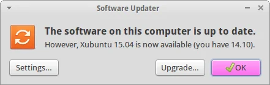

Next, we are going to initiate the upgrade itself:

`$ sudo update-manager`

As a result the graphical Software Updater should inform you that a newer version of Ubuntu is available for installation.

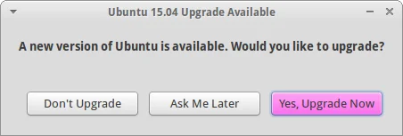

Ubuntu's Software Updater informs you whether an upgrade is available

## Running the upgrade

After clicking 'Upgrade...' or 'Yes, Upgrade Now' you will be presented with information about the new version.

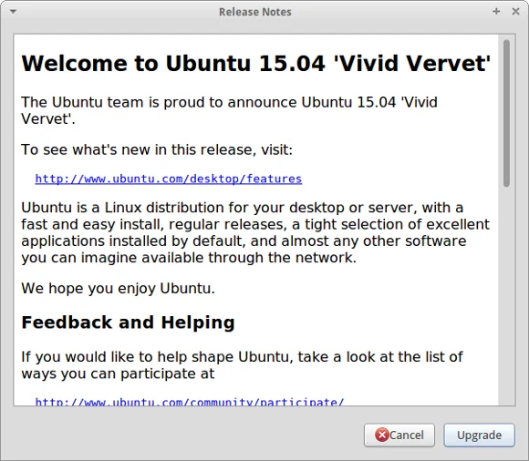

Details about Ubuntu 15.04 (Vivid Vervet)

Simply continue with the procedure and your system will be analysed for the next steps.

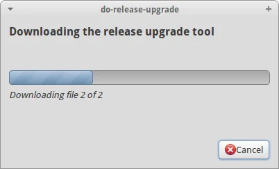

Analysing the existing system and preparing the actual upgrade to 15.04

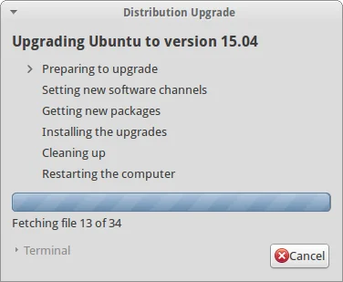

Next, we are at the point of no return. Last confirmation dialog before having a coffee break while your machine is occupied to download the necessary packages. Not the best bandwidth at hand after all... yours might be faster.

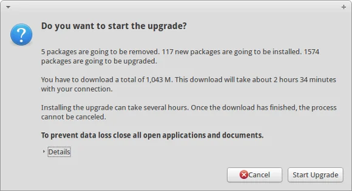

Are you really sure that you want to start the upgrade? Let's go and have fun!

Anyway, bye bye Unique Unicorn and Welcome Vivid Vervet!

In case that you added any additional repositories like Medibuntu or PPAs you will be informed that they are going to be disabled during the upgrade and they might require some manual intervention after completion.

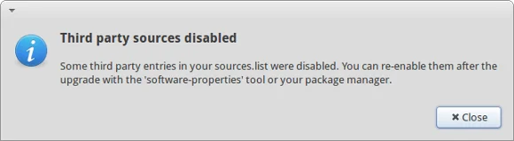

Ubuntu is playing safe and third party repositories are disabled during the upgrade

Well, depending on your internet bandwidth this might take something between a couple of minutes and some hours to download all the packages and then trigger the actual installation process. In my case I left my PC unattended during the night.

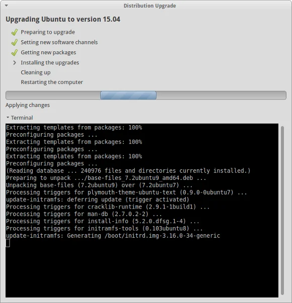

At the end Xubuntu will ask you whether you would like to remove old and obsolete packages of the previous version.

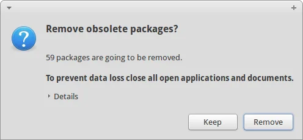

## Time to reboot

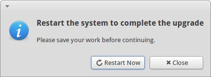

Finally, it's time to restart your system and see what's going to happen... In my case absolutely nothing unexpected. The system booted the new kernel 3.19.0 as usual and I was greeted by a new login screen.

Honestly, 'same' system as before - which is good and I love that fact of consistency - and I can continue to work productively. And also Software Updater confirms that we just had a painless upgrade:

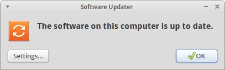

System is running Ubuntu 15.04 - Vivid Vervet - and up to date

See you in six months again... ;-)

## Post-scriptum

In case that you would to upgrade to the latest development version of Ubuntu, run the following command in a console:

`$ sudo update-manager -d`

And repeat all steps as described above.
