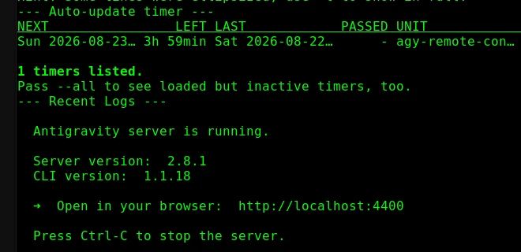
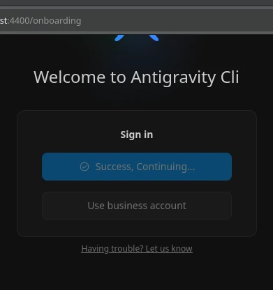
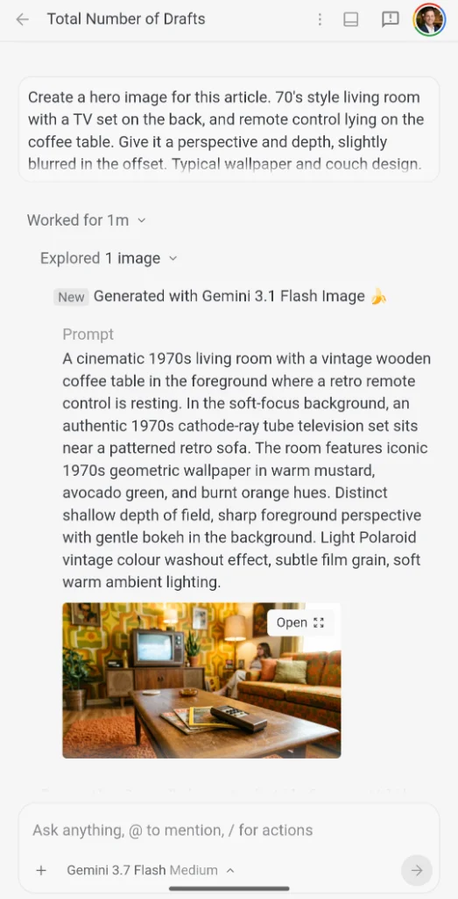

What if managing, auditing, editing, and publishing your blog workspace was as convenient as sending a text message from your mobile phone - without touching a physical keyboard or opening a terminal?

That is precisely what I explored today using **Antigravity Remote Control**. Sitting comfortably with my phone in hand, I connected to my development workstation and orchestrated an end-to-end editorial workflow on my blog workspace. The folder is organised and maintained like a git repository. There are organisational files and blog posts below the `posts` folder; including `pages` and `draft` content.

Here is a look behind the scenes at how conversational agentic assistance transforms blog authoring and editorial workflows on mobile devices.

---

## The excitement to remote control

While setting up and experimenting with the new release of Antigravity 2.0 and its Remote Control capability, I shared my real-time impressions and takeaways on X ([@JKirstaetter](https://x.com/JKirstaetter)):

> That's actually pretty awesome. Now, I'm able to work on my drafts remotely. Files are under git control anyways, so that shall be safe.
> 
> And new topics, additional thoughts, etc. can directly go into my notes. Anytime.
> 
> -- Jochen Kirstätter (JoKi) (@JKirstaetter) [August 22, 2026](https://x.com/JKirstaetter/status/2090944967615082889)

The initial reaction of discovering untethered remote access was pure excitement. For me, the traditional barrier to mobile development was never screen real estate; it was the friction of typing terminal commands and editing complex Markdown on a virtual glass keyboard.

Putting it through its paces in practice also revealed a few real-world nuances. While the Antigravity 2.0 desktop application connected smoothly, the CLI-based remote setup behaves differently from the desktop application and I couldn't manage to get it to work.

Following the instructions for Remote Control with Antigravity CLI I managed to complete the initial authentication but the finalising steps got stuck.

No chance to get past this step. Feedback has been sent to the team. Let's see when this gets resolved.

---

## How Remote Control Works

According to the official [Google Antigravity Documentation](https://antigravity.google/docs) and the announcement post [Remote Control for Antigravity](https://antigravity.google/blog/remote-control-for-antigravity), **Remote Control** is designed to decouple developer presence from a single physical desk without sacrificing local development context.

Rather than running an isolated agent on the phone or having to replicate full tool chains and credentials on mobile, Remote Control provides a secure, web-based control plane to your desktop sessions.

> [!NOTE]
> At the time of writing, configuring and hosting Remote Control sessions is available in **Antigravity 2.0** (the standalone desktop application) and via the **Antigravity CLI** (`agy`). There is currently no obvious way or settings toggle to configure and enable this feature from within **Antigravity IDE**, which remains focused on the local in-editor experience.

### 1. Enabling Remote Control in Antigravity 2.0
In your desktop Antigravity 2.0 application:
1. Navigate to **Settings** &rarr; **App** &rarr; **Remote Control** (or under your **Account** settings).
2. Toggle **Enable Remote Control**.
3. Verify that you are signed in with your authorised Google Account.

### 2. Accessing from Any Mobile Browser
On your mobile phone, tablet, or secondary laptop:
1. Open any modern mobile web browser and navigate to the Remote Control dashboard at [antigravity.google.com](https://antigravity.google.com).
2. Sign in with the same Google Account.
3. Select your active workstation from the instances list.

### 3. Multi-Instance & Environment Preservation
- **Preserved Context**: Your workstation retains all local file systems, active Git branches, terminal environments, environment variables, and authentication tokens.
- **Multi-Machine Management**: You can manage multiple instances simultaneously (such as a local workstation, a build box, or a cloud VM running the Antigravity headless daemon) and switch between them from a single dashboard.
- **Proactive Push Notifications**: The web interface supports push notifications, alerting you immediately when an agent completes a long-running turn or requires your approval, eliminating the need to poll or stay glued to the screen.

---

## Hands-On Session: Triage, Auditing, and Editing from Mobile

Once connected, I conducted a complete maintenance and drafting cycle entirely from my mobile phone.

### Phase 1: Triage and Auditing at a Glance

Over years of blogging and speaking at tech conferences, unpublished drafts naturally accumulate in the workspace. The first question I sent from my phone was simple:

> *"How many drafts are there?"*

Instantly, Antigravity scanned the `posts/draft/` directory and confirmed 55 draft files. But knowing the sheer file count is only half the story. I needed to separate genuine works in progress from empty placeholder stubs:

> *"Give me a list of drafts with content."*

In seconds, the assistant parsed the frontmatter and body of every single markdown file, categorising them into:
- **29 drafts with substantive body content** (sorted by word count, from comprehensive ~1,000-word conference write-ups to quick tips).
- **26 empty placeholder stubs** that were just ideas with metadata headers.

This immediate triage gave a clear roadmap of where to focus editorial attention - all presented neatly on my mobile screen.

---

### Phase 2: Deep-Dive Editorial Review on Mobile

Next, I picked one of the longest drafts in the queue - a recap of my talk on *"State of GCP: .NET Edition"* at **GDG Cloud Munich** - to see what was holding it back from publication.

> *"What's missing in GDG Cloud Munich?"*

Antigravity analysed the markdown file, validated referenced image assets on disk, and returned a structured review highlighting:
1. **Structural issues**: A continuous 1,000-word narrative that lacked intermediate section headings.
2. **Accessibility gaps**: Embedded screenshots missing descriptive `alt` text.
3. **Copy-editing needs**: Minor typos (*cramped* instead of *crammed*, *misconcpetions*, *where like*).
4. **Metadata requirements**: Placeholder hero images and draft status flags.

Rather than typing out detailed markdown edits on a touchscreen keyboard, a single command took care of the heavy lifting:

> *"Fix 2, 3 and 4"*

Antigravity applied targeted replacements across the file: structuring the article into clear sections (`## Connecting with GDG Cloud Munich`, `## Why C# and Google Cloud?`, `## Serverless with Google Cloud Functions`), inserting meaningful alt texts for each IDE screenshot, and correcting typos.

I was then able to read the entire revised article in the chat UI on my phone, verifying the flow and tone effortlessly.

---

### Phase 3: Workspace-Wide Orthography Alignment

A common challenge when maintaining content across years is consistency in language conventions. While most articles were authored in British English, slight variations often creep in.

From my phone, I asked:

> *"Review all drafts regarding British English orthography."*

Antigravity built and executed an automated scanning script across all 55 draft markdown files, looking for American vs British English spelling variations (`-ize` vs `-ise`, `color` vs `colour`, consonant doubling, and the distinction between software *program* and event/curriculum *programme*).

The scan highlighted exact occurrences across the workspace:
- Anglicising *Optimization*, *Analyzing*, and *Generalization* in syllabus notes.
- Updating *program* &rarr; *programme* in scholarship initiative descriptions.
- Fixing minor typos in security articles.
- Ensuring verbs like *signalled* adhered to British English doubling rules.

With a simple confirmation (*"Yes, of course"*), all affected files were updated, frontmatter was aligned, and static build generation scripts were triggered.

---

### Phase 4: On-the-Fly Asset Generation & Attribution

Authoring a complete article from a smartphone also requires imagery. Rather than searching for stock photos or waiting until returning to a desktop, I directed Antigravity directly from the chat interface:

> *"Create a hero image for this article. 70's style living room with a TV set on the back, and remote control lying on the coffee table. Give it a perspective and depth, slightly blurred in the offset. Typical wallpaper and couch design. Light Polaroid colour washout effect."*

Behind the scenes, Antigravity dispatched the prompt to **Gemini 3.1 Flash Image**, synthesised the retro visual with authentic depth of field, and returned an instant preview inside the mobile conversation stream.

From there, the agent took care of the full media pipeline:
1. Converting and saving the master image into the workspace below  `content/images`.
2. Generating responsive image variants across multiple resolution buckets.
3. Updating the article frontmatter (`image` attribute) while adhering to DRY principles.
4. Adding proper image metadata, alt text, and generation credits.

Overall a lean way to manage content from a remote client.

---

## Missing Functionality & Areas for Improvement

Whilst the mobile Remote Control experience is remarkably fluid for high-level direction and workspace auditing, using it extensively in this session surfaced a few UX friction points and missing features:

- **No Voice Prompting on Mobile**: There is currently no native voice input or speech-to-text prompt button in the Antigravity 2.0 Remote Control mobile web interface. Dictating complex instructions while on the move is considerably faster than touchscreen typing. Implementing this could be straightforward: on mobile, modern Chromium-based browsers support the standard **SpeechRecognition API** for client-side transcription; on the desktop side, Antigravity 2.0 itself runs in **Electron**, which similarly possesses native access to Chromium speech and media capabilities.
- **Unclear Purpose of the Browser Option**: The mobile UI exposes a Browser option/tool whose exact utility from a smartphone view remains somewhat ambiguous. This warrants further experimentation; for instance, instructing the agent to build the draft site, start a local preview server, navigate to the rendered article, and capture an automated screenshot for visual verification.
- **Multi-line Input Friction**: Formatting multi-line prompts or pasting structured outlines is awkward on mobile touchscreen keyboards, where line breaks can be tricky to manage without accidentally submitting the prompt.
- **No Session Rewind or Turn Deletion**: If a typo occurs or an instruction leads down an unproductive path, there is currently no option in the mobile interface to delete a prompt or revert the session to a previous checkpoint.

---

## Key Takeaways and Resources

AI-assisted authoring with an autonomous agent from a mobile device represents a tangible shift in how bloggers and developers manage their content workflows on the go:

1. **High-Level Intent with Low-Level Precision**: You direct the narrative vision and editorial style in natural language, while the agent executes precise file edits, validates markdown syntax, and respects workspace guidelines.
2. **Context-Aware Editorial Assistance**: The assistant understands the blog's architecture (DocFX configuration, Python pre/post-build scripts, metadata schemas) without requiring manual reminders.
3. **Frictionless Mobile Interaction**: You can review drafts, audit queues, run orthography checks, and compose new articles while away from your desk.

### Useful Links
- [Google Antigravity Official Site](https://antigravity.google)
- [Google Antigravity Documentation](https://antigravity.google/docs)
- [Remote Control for Antigravity Blog Post](https://antigravity.google/blog/remote-control-for-antigravity)
- [Antigravity 2.0 Release Notes & Updates](https://antigravity.google/changelog)

In fact, the article you are reading right now was outlined, authored, and verified through this very session using Antigravity Remote Control on a mobile phone!

---

## Join the Conversation

Have you experimented with AI-assisted blog authoring or managing your content repositories remotely from a mobile device? What workflows or guardrails do you find essential when directing an autonomous assistant on the go?

Feel free to connect and share your thoughts with me on X ([@JKirstaetter](https://x.com/jkirstaetter)), BlueSky ([@jochen.kirstaetter.name](https://bsky.app/profile/jochen.kirstaetter.name)), or Mastodon ([@JKirstaetter](https://mastodon.social/@jkirstaetter)). You can also subscribe to [my blog's RSS feed](https://jochen.kirstaetter.name/rss/) for upcoming articles and technical write-ups.

<small>Picture credits: Hero image generated with Gemini 3.1 Flash Image via Antigravity; Mobile screenshots by Jochen Kirstätter.</small>
