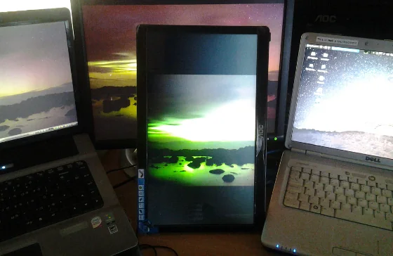
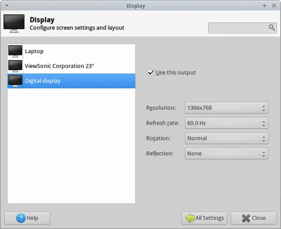
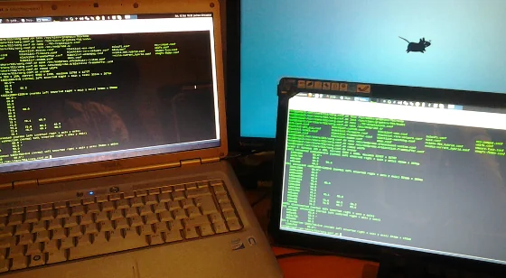
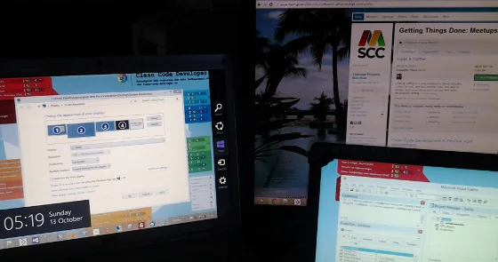

Having access to a little bit of IT hardware extravaganza isn't that easy here in Mauritius for exactly two reasons - either it is simply not available or it is expensive like nowhere. Well, by chance I came across an advert by a local hardware supplier and their offer of the week caught my attention - [a portable USB monitor](https://www.amazon.com/gp/product/B005SEZR0G/ref=as_li_ss_tl?ie=UTF8&camp=1789&creative=390957&creativeASIN=B005SEZR0G&linkCode=as2&tag=geblbyjo-20). Sounds cool, and [the specs are okay](https://us.aoc.com/monitor_displays/e1649fwu) as well. It's completely driven via USB 2.0, has a light weight, the dimensions would fit into my laptop bag and the resolution of 1366 x 768 pixels is okay for a second screen. Long story, short ending: I called them and only got to understand that they are out of stock - how convenient! Well, as usual I left some contact details and got the regular 'We call you back' answer. Surprisingly, I didn't receive a phone call as promised and after starting to complain via social media networks they finally came back to me with new units available - and \*drum-roll\* still the same price tag as promoted (and free delivery on top as one of their employees lives in Flic en Flac). Guess, it was a no-brainer to get at least one unit to fool around with. In worst case it might end up as image frame on the shelf or so...

## The usual suspects... Ubuntu first!

Of course, the packing mentions only Windows or Mac OS as supported operating systems and without hesitation at all, I hooked up the device on my main machine running on Ubuntu 13.04. Result: Blackout...

Hm, actually not the situation I was looking for but okay can't be too difficult to get this piece of hardware up and running. Following the output of syslogd (or dmesg if you prefer) the device has been recognised successfully but we got stuck in the initialisation phase.

`Oct 12 08:17:23 iospc2 kernel: [69818.689137] usb 2-4: new high-speed USB device number 5 using ehci-pci`  
`Oct 12 08:17:23 iospc2 kernel: [69818.800306] usb 2-4: device descriptor read/64, error -32`  
`Oct 12 08:17:24 iospc2 kernel: [69819.043620] usb 2-4: New USB device found, idVendor=17e9, idProduct=4107`  
`Oct 12 08:17:24 iospc2 kernel: [69819.043630] usb 2-4: New USB device strings: Mfr=1, Product=2, SerialNumber=3`  
`Oct 12 08:17:24 iospc2 kernel: [69819.043636] usb 2-4: Product: e1649Fwu`  
`Oct 12 08:17:24 iospc2 kernel: [69819.043642] usb 2-4: Manufacturer: DisplayLink`  
`Oct 12 08:17:24 iospc2 kernel: [69819.043647] usb 2-4: SerialNumber: FJBD7HA000778`  
`Oct 12 08:17:24 iospc2 kernel: [69819.046073] hid-generic 0003:17E9:4107.0008: hiddev0,hidraw5: USB HID v1.10 Device [DisplayLink e1649Fwu] on usb-0000:00:1d.7-4/input1`  
`Oct 12 08:17:24 iospc2 mtp-probe: checking bus 2, device 5: "/sys/devices/pci0000:00/0000:00:1d.7/usb2/2-4"`  
`Oct 12 08:17:24 iospc2 mtp-probe: bus: 2, device: 5 was not an MTP device`  
`Oct 12 08:17:30 iospc2 kernel: [69825.411220] [drm] vendor descriptor length:17 data:17 5f 01 00 15 05 00 01 03 00 04`  
`Oct 12 08:17:30 iospc2 kernel: [69825.498778] udl 2-4:1.0: fb1: udldrmfb frame buffer device`  
`Oct 12 08:17:30 iospc2 kernel: [69825.498786] [drm] Initialized udl 0.0.1 20120220 on minor 1`  
`Oct 12 08:17:30 iospc2 kernel: [69825.498909] usbcore: registered new interface driver udl`

The device has been recognised as USB device without any question and it is listed properly:

`# lsusb`  
`...`  
` Bus 002 Device 005: ID 17e9:4107 DisplayLink  `  
`...`

A quick and dirty research on the net gave me some hints towards the udlfb framebuffer device for USB DisplayLink devices. By default this kernel module is blacklisted

`$ grep udl /etc/modprobe.d/blacklist-framebuffer.conf`  
`#blacklist udl`  
`blacklist udlfb`

and it is recommended to load it manually. So, unloading the whole udl stack and giving udlfb a shot:

`Oct 12 08:22:31 iospc2 kernel: [70126.642809] usbcore: registered new interface driver udlfb`

But still no reaction on the external display which supposedly should have been on and green.

## Display okay? Test run on Windows

Just to be on the safe side and to exclude any hardware related defects or whatsoever - you never know what happened during delivery. I moved the display to a new position on the opposite side of my laptop, installed the display drivers first in Windows Vista (I know, I know...) as recommended in the manual, and then finally hooked it up on that machine. Tada! Display has been recognised correctly and I have a proper choice between cloning and extending my desktop.

  
*Testing whether the display is working properly - using Windows Vista*

Okay, good to know that there is nothing wrong on the hardware side just software...

## Back to Ubuntu - Kernel too old

Some more research on Google and various hits recommend that the original displaylink driver has been merged into the recent kernel development and one should manually upgrade the kernel image (and both header) packages for Ubuntu. At least kernel 3.9 or higher would be necessary, and so I went out to this URL:

[https://kernel.ubuntu.com/~kernel-ppa/mainline/](https://kernel.ubuntu.com/~kernel-ppa/mainline/)

and I downloaded all the good stuff from the v3.9-raring directory. The installation itself is easy going via dpkg:

`$ sudo dpkg -i linux-*-3.9.0-030900-*.deb`  
``

As with any kernel upgrades it is necessary to restart the system in order to use the new one. Said and done:

`$ uname -r`  
`3.9.0-030900-generic`

And now connecting the external display gives me the following output in /var/log/syslog:

`Oct 12 17:51:36 iospc2 kernel: [ 2314.984293] usb 2-4: new high-speed USB device number 6 using ehci-pci`  
`Oct 12 17:51:36 iospc2 kernel: [ 2315.096257] usb 2-4: device descriptor read/64, error -32`  
`Oct 12 17:51:36 iospc2 kernel: [ 2315.337105] usb 2-4: New USB device found, idVendor=17e9, idProduct=4107`  
`Oct 12 17:51:36 iospc2 kernel: [ 2315.337115] usb 2-4: New USB device strings: Mfr=1, Product=2, SerialNumber=3`  
`Oct 12 17:51:36 iospc2 kernel: [ 2315.337122] usb 2-4: Product: e1649Fwu`  
`Oct 12 17:51:36 iospc2 kernel: [ 2315.337127] usb 2-4: Manufacturer: DisplayLink`  
`Oct 12 17:51:36 iospc2 kernel: [ 2315.337132] usb 2-4: SerialNumber: FJBD7HA000778`  
`Oct 12 17:51:36 iospc2 kernel: [ 2315.338292] udlfb: DisplayLink e1649Fwu - serial #FJBD7HA000778`  
`Oct 12 17:51:36 iospc2 kernel: [ 2315.338299] udlfb: vid_17e9&pid_4107&rev_0129 driver's dlfb_data struct at ffff880117e59000`  
`Oct 12 17:51:36 iospc2 kernel: [ 2315.338303] udlfb: console enable=1`  
`Oct 12 17:51:36 iospc2 kernel: [ 2315.338306] udlfb: fb_defio enable=1`  
`Oct 12 17:51:36 iospc2 kernel: [ 2315.338309] udlfb: shadow enable=1`  
`Oct 12 17:51:36 iospc2 kernel: [ 2315.338468] udlfb: vendor descriptor length:17 data:17 5f 01 0015 05 00 01 03 00 04`  
`Oct 12 17:51:36 iospc2 kernel: [ 2315.338473] udlfb: DL chip limited to 1500000 pixel modes`  
`Oct 12 17:51:36 iospc2 kernel: [ 2315.338565] udlfb: allocated 4 65024 byte urbs`  
`Oct 12 17:51:36 iospc2 kernel: [ 2315.343592] hid-generic 0003:17E9:4107.0009: hiddev0,hidraw5: USB HID v1.10 Device [DisplayLink e1649Fwu] on usb-0000:00:1d.7-4/input1`  
`Oct 12 17:51:36 iospc2 mtp-probe: checking bus 2, device 6: "/sys/devices/pci0000:00/0000:00:1d.7/usb2/2-4"`  
`Oct 12 17:51:36 iospc2 mtp-probe: bus: 2, device: 6 was not an MTP device`  
`Oct 12 17:51:36 iospc2 kernel: [ 2315.426583] udlfb: 1366x768 @ 59 Hz valid mode`  
`Oct 12 17:51:36 iospc2 kernel: [ 2315.426589] udlfb: Reallocating framebuffer. Addresses will change!`  
`Oct 12 17:51:36 iospc2 kernel: [ 2315.428338] udlfb: 1366x768 @ 59 Hz valid mode`  
`Oct 12 17:51:36 iospc2 kernel: [ 2315.428343] udlfb: set_par mode 1366x768`  
`Oct 12 17:51:36 iospc2 kernel: [ 2315.430620] udlfb: DisplayLink USB device /dev/fb1 attached. 1366x768 resolution. Using 4104K framebuffer memory`

Okay, that's looks more promising but still only blackout on the external screen... And yes, due to my previous modifications I swapped the blacklisted kernel modules:

`$ grep udl /etc/modprobe.d/blacklist-framebuffer.conf`  
`blacklist udl`  
`#blacklist udlfb`

## Silly me!
Okay, back to the original situation in which **udl is allowed** and **udlfb blacklisted**. Now, the logging looks similar to this and the screen shows those maroon-brown and azure-blue horizontal bars as described on other online resources.

`Oct 15 21:27:23 iospc2 kernel: [80934.308238] usb 2-4: new high-speed USB device number 5 using ehci-pci`  
`Oct 15 21:27:23 iospc2 kernel: [80934.420244] usb 2-4: device descriptor read/64, error -32`  
`Oct 15 21:27:24 iospc2 kernel: [80934.660822] usb 2-4: New USB device found, idVendor=17e9, idProduct=4107`  
`Oct 15 21:27:24 iospc2 kernel: [80934.660832] usb 2-4: New USB device strings: Mfr=1, Product=2, SerialNumber=3`  
`Oct 15 21:27:24 iospc2 kernel: [80934.660838] usb 2-4: Product: e1649Fwu`  
`Oct 15 21:27:24 iospc2 kernel: [80934.660844] usb 2-4: Manufacturer: DisplayLink`  
`Oct 15 21:27:24 iospc2 kernel: [80934.660850] usb 2-4: SerialNumber: FJBD7HA000778`  
`Oct 15 21:27:24 iospc2 kernel: [80934.663391] hid-generic 0003:17E9:4107.0008: hiddev0,hidraw5: USB HID v1.10 Device [DisplayLink e1649Fwu] on usb-0000:00:1d.7-4/input1`  
`Oct 15 21:27:24 iospc2 mtp-probe: checking bus 2, device 5: "/sys/devices/pci0000:00/0000:00:1d.7/usb2/2-4"`  
`Oct 15 21:27:24 iospc2 mtp-probe: bus: 2, device: 5 was not an MTP device`  
`Oct 15 21:27:25 iospc2 kernel: [80935.742407] [drm] vendor descriptor length:17 data:17 5f 01 00 15 05 00 01 03 00 04`  
`Oct 15 21:27:25 iospc2 kernel: [80935.834403] udl 2-4:1.0: fb1: udldrmfb frame buffer device`  
`Oct 15 21:27:25 iospc2 kernel: [80935.834416] [drm] Initialized udl 0.0.1 20120220 on minor 1`  
`Oct 15 21:27:25 iospc2 kernel: [80935.836389] usbcore: registered new interface driver udl`  
`Oct 15 21:27:25 iospc2 kernel: [80936.021458] [drm] write mode info 153`

Next, it's time to enable the display for our needs... This can be done either via UI or console, just as you'd prefer it.

  
*Adding the external USB display under Linux isn't an issue after all... Settings Manager =&gt; Display*

Personally, I like the console. With the help of xrandr we get the screen identifier first

`$ xrandr`  
`Screen 0: minimum 320 x 200, current 3200 x 1080, maximum 32767 x 32767`  
`LVDS1 connected 1280x800+0+0 (normal left inverted right x axis y axis) 331mm x 207mm`  
`...`  
`DVI-0 connected 1366x768+0+0 (normal left inverted right x axis y axis) 344mm x 193mm`  
`   1366x768       60.0*+`

and then give it the usual shot with auto-configuration. Let the system decide what's best for your hardware...

`$ xrandr --output DVI-0 --off`  
`$ xrandr --output DVI-0 --auto`

And there we go... Cloned output of main display:

  
*New kernel, new display... The external USB display works out-of-the-box with a Linux kernel &gt; 3.9.0.*

Despite of a good number of resources it is absolutely **not** necessary to create a Device or Screen section in one of Xorg.conf files. This information belongs to the past and is not valid on kernel 3.9 or higher.

## Same hardware but Windows 8

Of course, I wanted to know how the latest incarnation from Redmond would handle the new hardware... Flawless!

Most interesting aspect here: I did not use the driver installation medium on purpose. And I was right... not too long afterwards a dialog with the EULA of DisplayLink appeared on the main screen. And after confirmation of same it took some more seconds and the external USB monitor was ready to rumble. Well, and not only that one... but see for yourself.

  
*This time Windows 8 was the easiest solution after all.*

## Resume

I can highly recommend this type of hardware to anyone asking me.

Although, it's dimensions are 15.6" it is actually lighter than my Samsung Galaxy Tab 10.1 and it still fits into my laptop bag without any issues. From now on... no more single screen while developing software on the road!

## Update(s)

Meanwhile I [upgraded my system to Saucy Salamander (Ubuntu 13.10)](xref:upgrade-to-xubuntu-1310-saucy-salamander "upgraded my system to Saucy Salamander (Ubuntu 13.10)") and the newer kernel 3.11.0 or better said the udl module doesn't activate the screen anymore. Although the hardware is correctly identified it won't display anything.

After some additional searching I came across a bug report on Launchpad: [Regression: DisplayLink DL-195 fails with EAGAIN after upgrade from 3.11.0-031100 to 3.11.0-11](https://bugs.launchpad.net/ubuntu/+source/linux/+bug/1234818 "Regression: DisplayLink DL-195 fails with EAGAIN after upgrade from 3.11.0-031100 to 3.11.0-11") which shedded some light on my issue, too. As described above, I went from the default kernel (3.8.x) in Ubuntu 13.04 to an upstream kernel 3.9.0. Due to the recent upgrade to Saucy Salamander my system went back to an Ubuntu specific kernel 3.11.0-12-generic and the 'broken' display. Currently, I'm back to a vanilla kernel and thinks are working as expected.

` $ uname -r  `  
`3.11.6-031106-generic`

This kernel has a proper device detection and I can activate / configure the USB monitor with xrandr:

`$ xrandr -q`  
`Screen 0: minimum 320 x 200, current 4566 x 1080, maximum 32767 x 32767`  
`LVDS1 connected 1280x800+0+0 (normal left inverted right x axis y axis) 331mm x 207mm`  
`   1280x800       60.0*+`  
`VGA1 connected 1920x1080+1280+0 (normal left inverted right x axis y axis) 521mm x 293mm`  
`   1920x1080      60.0*+`  
`...`  
`DVI-0 connected 1366x768+3200+0 (normal left inverted right x axis y axis) 344mm x 193mm`  
`   1366x768       60.0*+`

It's the little things that make a difference...