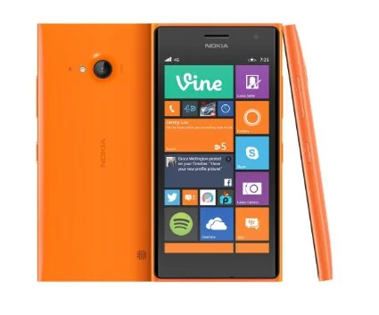
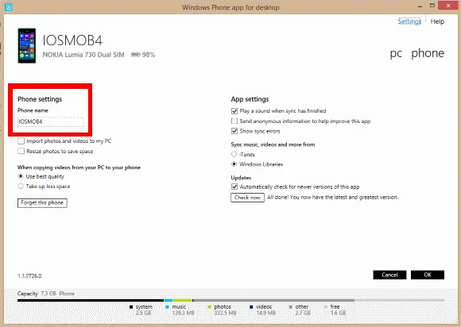
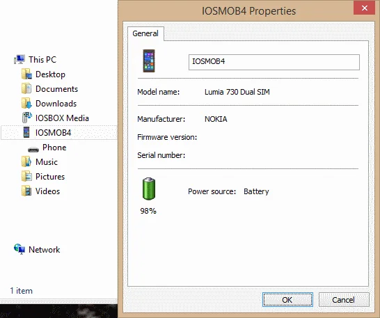

  
*Source: Nokia Lumia 730/735 on Amazon*

It's already one month since I bought a Nokia / Microsoft Lumia 730 during one of my business trips in Europe. And quite frankly I'm going to summarise my impressions, up & downs during this time using the device itself, the Windows Phone 8.1 operating system and the apps during this period.

## Why? Oh why?

Actually, the decision is straight: I wanted to own a Windows Phone 8.1 (WP8) based smartphone for technical reasons. After having several Android - smartphones and tablets - and iOS devices - mainly different generations of iPads - since years it was high-time to purchase a Windows Phone 8.1 system. But the choice of operating system and app environment wasn't the key factor for my decision.

## Dual SIM as replacement of two mobiles

After a bit of research on the interweb and reading a bunch of forum threads I came to the conclusion that neither iOS (well, obviously non-existent) nor any Droids offer some decent handling of two SIM cards at the same time. There are always some kind of trade-offs and short-comings. Given the situation in my case that I have two mobile numbers for private and business purposes I got tired of caring two cellular phones with me. Yes of course, it would have been possible to daisy-chain or route incoming calls from one number to the other one but this wouldn't help in case of calling people. Ergo, a new purchase had to be a smartphone with Dual SIM feature and at the time I made my decision I had the impression that so far only Lumia devices and WP8 were capable of dealing with it properly. Thanks to the promotions of Black Friday and Cyber Monday I was able to snatch a very good deal and I purchased a Lumia 730 for EUR 199,- (or approximately Rs. 7,600.-) on Amazon.

But unfortunately I wasn't smart enough to be able to use my newly acquired toy directly on the spot. Both of existing mobiles had standard-sized SIM cards whereas the Lumia only accepts NanoSIM form factor. Alright, no problem at all. I sent an email to my account manager at Emtel and he replied instantly that a new SIM card would be ready for pickup at the next showroom - Thanks Emtel, excellent service!

**Note:** The Lumia 735 is the Single SIM edition with LTE network connectivity.

## First: Update to Windows Phone 8.1

No matter what kind of device you put in my hand... As soon as it is connected to the internet I have to check for any kind of updates. And of course, there was an update already waiting for the Lumia 730. Upgrading the device to the latest Windows Phone 8.1 Update is a no-brainer and you should do it ASAP, too. Of course, I was curious to have a chat with Cortana, too.

## Transfer my data

Changing mobile devices always relates to migration of information. Both my previous devices were still Symbian S60 based - I know, I know... - and given the experience I made previously with my wife's upgrade onto the Android platform I did some pre-work. But quite frankly it wasn't really necessary at all. The Lumia 730 comes with a pre-installed app called ["Transfer my Data"](https://www.windowsphone.com/en-us/store/app/transfer-my-data/dc08943b-7b3d-4ee5-aa3c-30f1a826af02 "Transfer my Data in Windows Phone App Store").

> *"Transfer my Data is a quick and easy way of copying contacts from almost any phone (Symbian, Android, iOS, BlackBerry, Windows Phone and others) to your new Windows Phone using Bluetooth. Some phones may also be capable of transferring text messages and pictures, including many Lumia phones. Transfer my Data copies all your contacts into the Windows Phone People Hub, from where it's easy to call, mail, chat or follow friends on your favourite social network. On supported phones, contacts and messages can also be transferred to and from an SD card."* -- taken from Windows Phone store

A data exchange via Bluetooth sounds good and indeed the transfer of contacts, text messages and even photos was done very quickly. Even though the app offers transfer of music and video files it suggests to use a PC as proxy device for performance reasons. Anyway, within shortest time I had all my contacts from both Symbians available on the Lumia. A little down-side is the lack of de-duplication but that's honestly a bit too much to ask for. A last full charge of both batteries and then Farewell old fellows, you served me well.

## First challenge: Rename the device

After my initial success of data transfer it turned out to be a real challenge to change the name of the device in the About section. I mean, what's so difficult to provide a textbox instead of a label in order to change a [censored] name? Being used to Android and IOS devices it is one of my first tasks to change a device's name to a pattern that suits my needs instead of having that generic "Windows Phone 8".

Let me solve the puzzle: **No chance at all to change it from the device.**

You have to connect the device to a computer in order to change the device's name / identification. Seriously? It's not only quite weird but kind of painful in case that you're using an operating system like Mac OS X or Linux. As soon as you hook up the device via USB you have 2 options at hand. Either you download and install the Windows Phone app for Desktop:

  
*Change name of Windows Phone 8.1 device in Windows Phone App for Desktop*

or you do it the classic way: Folder properties in Windows Explorer:

  
*Change name of Windows Phone 8.l1 device in Windows Explorer*

## A couple of General Settings

As usual I went through all settings. First, to see what is available and possible to change with built-in features and second, to evaluate how it works compared to iOS and Android. Adding the Lumia to my existing WiFi infrastructure went smooth. Setting the network specific SIM options wasn't a problem at all. In order to access my operator-given voicebox services I had to specify different short-dials. And so on and so on; I'll spare you the remaining myriad of settings and will concentrate a bit on the interesting ones. Next, I had a look at the Keyboard settings.

## Word Flow

Frankly, I'm a little bit spoiled by a third-party application called [SwiftKey on Android](https://play.google.com/store/apps/details?id=com.touchtype.swiftkey) and iOS. After following the keynote presentation on Windows Phone 8.1 some months back, I knew about the built-in Word Flow feature. And due to the lack of SwiftKey on WP8 I installed my usual keyboard languages - English, French and German, and run a couple of tests in various applications. Yes, Word Flow feels very natural and the text recognition of my swipes are very accurate - close to or even matching SwiftKey on the other platforms. Very pleasant after that initial challenge.

## Back navigation

That was a funny pitfall I fell into. The back button on Windows Phone 8.1 works somehow different to the one on Android and I was desperately looking for a solution on how to access some kind of apps overview or task manager. Luckily, that puzzle could be solved very quickly thanks to the tweet of [@LumiaHelp](https://x.com/LumiaHelp "Lumia Help on Twitter"): Long-press the back button.

## Internet Sharing (aka Tethering)

I am happy that Windows Phone 8.1 doesn't use the term "Tethering" or "Wifi Hotspot" - not from a technical point of view but from a consumer's one. Unfortunately, the relative position between switching mobile data package use and enabling internet sharing is a bit far from each other. But once you get used to it, it's not that difficult anymore. Also, given that one might leave the data package setting fixed and only switches tethering on and off from time to time. The connection between the Lumia 730 and my MSI laptop was stable and performant. Nothing to report about...

## Apps and Windows Phone App Store

Attention! My levels of frustration but also excitement went up very quickly in this chapter. But let me start with the dark side of using Windows Phone 8.1: Lack of (my) major apps.

This might sound a bit contradictory to my decision of purchasing a WP8 smartphone. I knew there will be cut-downs on some apps I'm used to but, boy was I wrong!, at least half of my daily apps are not available on Windows Phone! No seriously, I'm trying to get the best out of multiple options but there has to be at least some common ground where I can put my bare minimum of data exchange. Yes, there is no lack of standard applications like Skype, Facebook, Twitter, Mail clients, PDF reader, Amazon Kindle and office apps but what about other productivity tools? At the time writing this blog entry I'm missing the following apps:

- Trello
- Chrome browser
- Pluralsight - there's only Windows Phone 7.x
- Meetup
- Google+
- Google Drive
- OpenVPN mobile client

Just to name a few.

The first couple of days I felt unproductive and really thought that I made the wrong choice. Currently, I'm still trying to figure out whether there are possibilities to "transfer" some purchased apps. I really like to use the Runtastic app. But despite having the Pro edition on Android I have to stick with the Freemium on WP8 right now. But yeah, something I already in advance.

### Adjust your Country/Region setting

Originally I thought that setting the Region to my actual location of stay would be a good option but unfortunately Microsoft seems to have other ideas than their customers. Why would I say that? Well, in order to be able to use the "advanced" features like remote installation of Windows Phone 8 Apps via your browser the setup has to be coherent to each other. Meaning, the preferred language options in your browser - whether it's Internet Explorer, Chrome or Firefox - and the regional settings on your smartphone have to match each other. In my case, it's a bit tough to get an English version of the Windows Phone App Store for Mauritius. Either I get redirected to the British or the US version of the store and some features like the "Install" button are not available.

**Piece of advice:** Set the Country/Region option on your phone to United States and your browser's preferred language to en_US and you're good to go.

Additional to more comfort on the website you'll also get access to more apps in the US store than in other countries. And you can still set the Regional format to a different setting.

### Full throttle on Microsoft apps

After my phone and store adjustments I started to explore the list of featured apps and the ones listed in collections. There are some good applications available but it's interesting to mention that most of them are written by Microsoft or a department within Microsoft. Following a list of apps I like to use regularly:

- Lumia Camera
- Lumia Panorama
- Office Lens
- Office Remote
- Skype
- Gestures Beta
- Authenticator

Cortana seems to be interesting but I haven't had a conversation with my personal assistant. Well, surely something to explore during the upcoming weeks.

## Welcome to the Microsoft universe

Although I experienced the Apple world - both on iOS and Mac OS X - and Android heaven I have the impression that Windows Phone 8.1 is tightly coupled to Windows, maybe Windows 8.1 specifically. It's not really a speed bump in my particular case but I would appreciate that there are more cross-platform apps available.

Staying inside the Microsoft universe gives you a well-shaped package and integration between smartphone and desktop applications. It's actually pretty cool to use your Lumia as a presenter device for your Powerpoint presentation. Or you fire up the Project My Screen App on Windows and you can mirror all activities on your mobile on the big screen. And last but not least it is very convenient to store all your files and data in OneDrive compared to Google Drive or iCloud.

## Resume after one month

Despite the obstacles and the lack of certain apps I have to admit that I am very pleased with the Nokia Lumia 730. And that's mainly thanks to the Dual SIM feature of the device. Hopefully, I'll be able to find a couple more gems in the Windows Phone App Store and write some blog entries regarding my experience and discoveries.

Stay tuned! ;-)