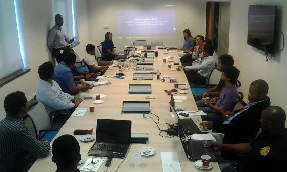
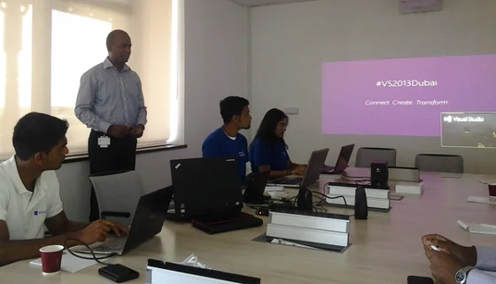
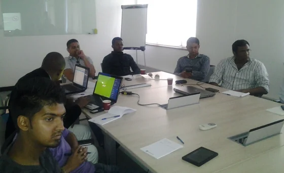
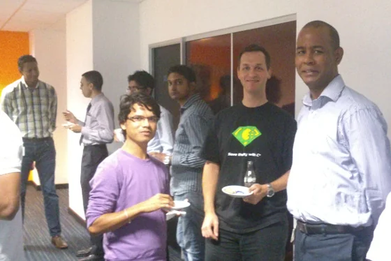

These recent days are packed with a series of great events. Not only that the [Mauritius Software Craftsmanship Community (MSCC)](https://www.meetup.com/MauritiusSoftwareCraftsmanshipCommunity/ "Mauritius Software Craftsmanship Community (MSCC)") gets more momentum, it's also the situation that there are quite a number of product launches and version releases. Already last week, the [official launch of Visual Studio 2013](https://events.visualstudio.com/eng/home/ "official launch of VIsual Studio 2013") happened but quite frankly I couldn't follow the online show as I had a jump start on Microsoft Virtual Academy to attend. And thanks to Technical Evangelist Arnaud Meslier I had an invitation to participate in the virtual launch event at the offices of [Microsoft Indian Ocean Islands and French Pacific](https://www.microsoft.com/africa/fr/press/Pages/Country.aspx?id=2 "Microsoft Indian Ocean Islands and French Pacific"), [Port Louis](https://www.microsoft.com/worldwide/phone/contact.aspx?country=Indian%20Ocean%20Islands "Microsoft Indian Ocean Islands").

Luckily, morning traffic down to Port Louis wasn't that cramped as usual - well, I guess that might be related that more and more companies are moving their offices into other areas of the island and the capital is starting to 'die'. But don't let us complain about those circumstances. Finding the Microsoft office on the 7th floor of the Dias Pier Building was straight forward, even though it seems that they don't want to be found. Of course, the premises are a huge difference compared to the campuses at Microsoft Germany in Munich or Microsoft HQ in Redmond. Actually, it is more likely to one of those regional offices like in Neuss.

## Introducing the MSCC

Some Microsoft Student Partners (MSP) and a few other guests were already present and the team was still busy with some preparations for the virtual event, like setting up audio and projector, etc. Nothing to worry about there was still plenty of time, as the event was scheduled for 9:30 hrs respectively 10:00 hrs. More attendees came and the available seats in our conference room were quickly filled. Unfortunately, when the pre-show of the launch event started, there were still some technical issues... but we knew how to use the time efficiently:

> *"Overcoming some technical issues here and got the opportunity to speak quickly about [#mscc](https://x.com/search?q=%23mscc). Thanks to [@arnaudmeslier](https://x.com/arnaudmeslier/)"*

  
*Introducing the Mauritius Software Craftsmanship Community in front of the attendees of the Virtual Launch event of Visual Studio 2013*

So instead of everyone waiting Arnaud asked me to give a brief introduction about the Mauritius Software Craftsmanship Community. Thanks for that! Talking about the MSCC provided some interesting follow-up conversations during the breaks later that day. As we started to get in touch with some local IT companies already, it was very positive to have this opportunity. And thanks to a number of students from the [Middlesex University, Mauritius](https://www.middlesex.mu/ "Middlesex University, Mauritius") we will also try to arrange an appointment with their Dean during the next couple of weeks.

## Visual Studio One

As modern software development of applications and apps is moving more and more to cloud-based environments it only seems to be a logical consequence to offer an integrated development environment in the browser, too. Once again, I got the impression that Telerik Icenium might have been a good inspiration for Visual Studio One (VSO) but eventually I might be wrong on that one. Who knows... ;-)

  
*Visual Studio 2013 - Connect Create Transform - #VS2013Dubai  
*

Visual Studio One is the successor product to Team Foundation Services, and the online service is (currently) offered for free for teams up to 5 people. This might change in the future but there are no further announcements or any additional information available at the moment. Subscribers of MSDN packages get a surplus on Visual Studio One, and it is also possible to get some benefits as Microsoft Partner.

> *"There will be updates every 3 weeks"* -- Microsoft Visual Studio One

I love this bold statement, and I'm really looking forward to see whether the sprints of the development team(s) behind Visual Studio One are going to able to stick to their word. Actually, it would be pretty impressive to see that finally Microsoft follows some lean practices "Deploy early, deploy often".

## Cross platform mobile development

Oh man, this already gave me a big big smile on the face last week, but once again it was great fun to have this announcement while watching others' faces in the conference room. [Microsoft](https://microsoft.com/ "Microsoft") and [Xamarin](https://xamarin.com/ "Xamarin") collaborate - read: [Microsoft and Xamarin Partner Globally to Help You Build Great Apps](https://blog.xamarin.com/microsoft-and-xamarin-partner-globally/ "Microsoft and Xamarin Partner Globally to Help You Build Great Apps") - on the support of real cross platform software development for mobiles and smartphones. Seeing the fact that I'm using Xamarin already since last year it's just great to be on the right track. Actually, we spoke about that topic during the last Saturday meetup of the MSCC.

  
*Impressions of other attendees at the Virtual Launch of Visual Studio 2013 Dubai - Microsoft Indian Ocean Islands  
*

## Build and Release Process

Now, that everything is concentrating on cloud-based services and processes it just a natural consequence that Microsoft was also introducing the Release Process which enables you to commit your local source code changes to your version control system - either on TFS or Git technology -, to trigger an automated build process and to deploy to your system infrastructure with a single mouse click operation in Visual Studio 2013.

Continuous Integration in a very fine execution. Of course, being a Clean Code Developer there are no real surprises here but it's refreshing to see the high level of integration between the various products in the portfolio of Microsoft. Application Life-cycle got a lot better with VS 2013.

## Code Editor Enhancements

Hot-keys and keyboard navigation are obviously the new fashion trend in Visual Studio 2013. Finally, the IDE got some highly appreciated hot-keys and short-cuts in terms of developer's productivity. Those new improvements are surely interesting for pure VS users but quite frankly I tweeted about that already:

> *"Surprisingly, some of the editor enhancements in Visual Studio 2013 are old fellows when using [@TelerikJust](https://x.com/TelerikJust/ "@TelerikJust") JustCode. [#vs2013dubai](https://x.com/search?q=%23vs2013dubai)"*

Anyway, it's great to see those enhancements as part of the product now, and thanks to partners like Telerik and others there will be more improvements in future versions.

## Resume of the day

Awesome!

  
*Using the time during the breaks for some networking... Community, Community, Community! - Source: [Pawan](https://yodhunjay.wordpress.com/)  
*

Despite the outstanding new products, the high level of integration between Visual Studio, Azure and online automated build systems, the number of long-awaited improvements to the code editor and so on, I really enjoyed the conversations with other attendees during the coffee and lunch breaks. Having a chat with guys from Microsoft, the geeks from the Microsoft Student Partners, some students of the Middlesex University, and other IT people from MCB, Infomil, and more was really awesome. Once again Thank You, Arnaud!
