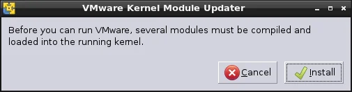
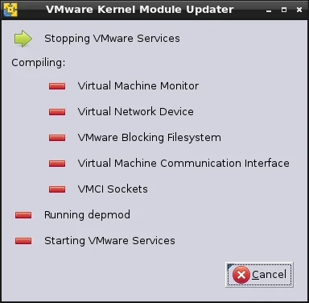

VMware Player has a nice auto-detection of kernel changes, and requests the user to compile the required modules in order to load them. This happens from time to time after a regular update of your system. Usually, the dialog of VMware Kernel Module Updater pops up, asks for root access authentication, and completes the compilation.

  
*VMware Player or Workstation checks if modules for the active kernel are available.*

In theory this is supposed to work flawlessly but in reality there are pitfalls occassionally. With the recent upgrade to Ubuntu 13.04 Raring Ringtail and the latest kernel 3.8.0-21 the actual VMware Kernel Module Updater simply disappeared and the application wouldn't start as expected. When you launch VMware Player as super user (root) the dialog would stall like so:

  
*VMware Kernel Module Updater stalls while stopping the services*

Prior to version 5.x of VMware Player or version 7.x of VMware Workstation you would run a command like:

> $ sudo vmware-config.pl

to resolve the module version conflict but this doesn't work anyway.

## Solution

Instead, you have to execute the following line in a terminal or console window:

> $ sudo vmware-modconfig --console --install-all

Those switches are (as of writing this article) not documented in the output of the --help switch. But VMware already documented this procedure in their knowledge base: [VMware Workstation stops functioning after updating the kernel on a Linux host (1002411)](https://kb.vmware.com/selfservice/microsites/search.do?language=en_US&cmd=displayKC&externalId=1002411 "VMware Workstation stops functioning after updating the kernel on a Linux host (1002411)").

## Update

As of today I had the first kernel upgrade to version 3.8.0-22 in Ubuntu 13.04. Don't even try it without vmware-modconfig...

<small>Image credit: Kaleidico</small>